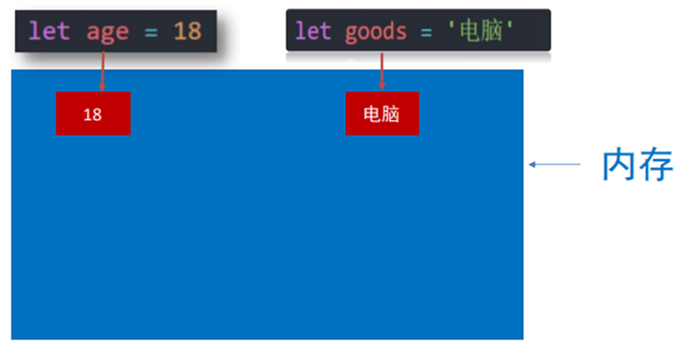
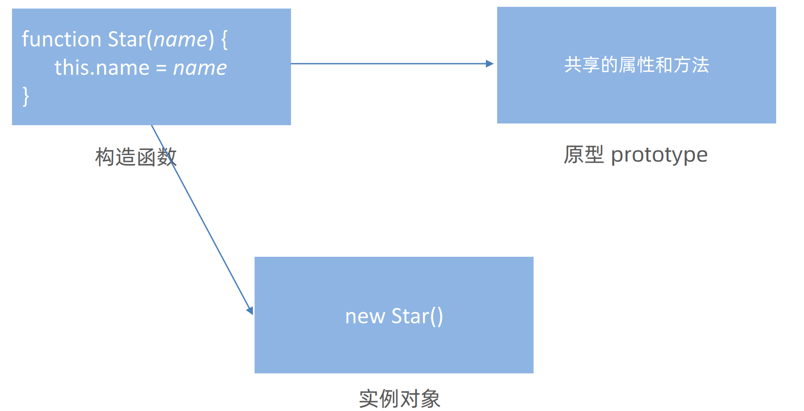

# JavaScript

# JavaScript

# JavaScript 基础第一天

## 1. JavaScript 介绍

### 1.1 JavaScript 是什么

<span data-type="text" style="color: var(--b3-font-color8);">是一种运行在客户端（浏览器）的编程语言</span>，实现人机交互效果。

**作用：**    – 网页特效 (监听用户的一些行为让网页作出对应的反馈)

– 表单验证 (针对表单数据的合法性进行判断)

– 数据交互 (获取后台的数据, 渲染到前端)

– 服务端编程 (node.js)

**组成：**

- <div>
  <span data-type="text" style="color: var(--b3-font-color8);">ECMAScript: </span>
  </div>

  规定了js基础语法核心知识。

  比如：变量、分支语句、循环语句、对象等等。
- <div>
  <span data-type="text" style="color: var(--b3-font-color8);">Web APIs :</span>
  </div>

  DOM：操作文档，比如对页面元素进行移动、大小、添加删除等操作

  BOM：操作浏览器，比如页面弹窗，检测窗口宽度、存储数据到浏览器等等

  

JavaScript权威网站： https://developer.mozilla.org/zh-CN/docs/Web/JavaScript

### 1.2 JavaScript 书写位置

- 内部 JavaScript

  直接写在HTML文件里，script标签写在body标签里的最下方。
- 外联 JavaScript

  代码写在以<span data-type="text" style="color: var(--b3-font-color8);">.js</span>结尾的文件里。

  **语法：**  ​`<script src=" "> </script>`​​（通过script标签，引入到html页面中）

  **注意：**  ​<span data-type="text" style="color: var(--b3-font-color8);">script标签中间无需写代码，否则会被忽略！</span>
- 3. 内联 JavaScript

  代码写在标签内部。

  **语法：**  ​`<button onclick="alert('你好，js')">这是一个按钮</button>`​​（alert是页面弹出警告对话框）

  **注意：**    此处作为了解即可，但是后面vue框架会用这种模式。

### 1.3 注释和结束符

- **单行注释：**   使用 `// `​​ 注释单行代码
- **块注释：**   使用 `/* */`​​ 注释多行代码
- **结束符：**   在 JavaScript 中 `;`​​ 代表一段代码的结束，多数情况下可以省略 `;`​​ 使用回车（enter）替代。实际开发中有许多人主张书写 JavaScript 代码时省略结束符 `;`​​

### 1.4 输入输出语法

输出和输入也可理解为人和计算机的交互，用户通过键盘、鼠标等向计算机输入信息，计算机处理后再展示结果给用户，这便是一次输入和输出的过程。

举例说明：如按键盘上的方向键，向上/下键可以滚动页面，按向上/下键这个动作叫作输入，页面发生了滚动了这便叫输出。

- 输出

  **语法1：**   `document.write('内容')`​​

  作用：向body内输出内容。

  注意：<span data-type="text" style="color: var(--b3-font-color8);">如果输出的内容写的是标签，会被解析成网页元素。</span>比如`` document.write(`<h1>内容</h1>`) ``​，则网页元素就会出现一个h1的标签。<span data-type="text" style="color: var(--b3-font-color8);">   必须被反引号``（ESC下面的键）包裹起来   </span>。

  **语法2：**   `alert('内容')`​​

  作用：页面弹出警告对话框。

  <span data-type="text" style="color: var(--b3-font-color8);">   要想使里面内容换行，需要用反引号``   </span>。

  **语法3：**   `console.log('内容')`​​

  作用：控制台打印输出，给程序员看的。
- 输入

  **语法：**   `prompt('请输入您的名字')`​​

  作用：显示一个对话框，对话框中包含一条文字信息，用来提示用户输入文字。

  

### 1.5 JavaScript 输入输出语法

按HTML文档流顺序<span data-type="text" style="color: var(--b3-font-color8);">从上往下</span>执行JavaScript代码。

​`alert()`​​ 和 `prompt()`​​ 它们会跳过页面渲染先被执行（目前作为了解，后期讲解详细执行过程）

### 1.6 字面量

在计算机科学中，字面量（literal）是在计算机中描述 事/物

比如：

我们工资是：1000 此时 1000 就是 数字字面量

'黑马程序员' 字符串字面量

还有接下来我们学的 [] 数组字面量 {} 对象字面量等等

## 2. 变量

### 2.1 什么是变量

- 目标：理解变量是计算机存储数据的“容器”。
- 白话：变量就是一个装东西的盒子。
- 通俗：变量是计算机中用来<span data-type="text" style="color: var(--b3-font-color8);">存储数据的“容器”</span>，它可以让计算机变得有记忆。
- 注意：<span data-type="text" style="color: var(--b3-font-color8);">变量不是数据本身，它们仅仅是一个用于存储数值的容器。可以理解为是一个个用来装东西的纸箱子。</span>


- 1.变量是怎么理解？

  计算机中用来存储数据的“容器”，简单理解是一个个的盒子。
- 2.变量有什么作用呢？

  用来存放数据的。注意变量指的是容器而不是数据。
- 3.你还能想到那些生活中的变量？

  HTML标签、教室、宿舍……

### 2.2 变量的基本使用

- 目标：能够声明一个变量并完成赋值操作
- 声明变量：

  要想使用变量，首先需要创建变量（也称为声明变量或者定义变量）

  语法：`let age`​​（声明了一个age变量，<span data-type="text" style="color: var(--b3-font-color8);">age即变量名称，也叫标识符</span>）

  声明变量有两部分构成：声明关键字、变量名（标识）

  let即关键字(let：允许、许可、让、要)，所谓关键字是系统提供的专门用来声明（定义）变量的词语
- 变量赋值：

  定义了一个变量后，你就能够<span data-type="text" style="color: var(--b3-font-color8);">初始化</span>它（赋值）。在变量名之后跟上一个“\=”，然后是数值。

```js
//声明一个age变量
let age
//age变量赋值为18，age为变量，18为字面量
age = 18
//输出age变量
alert(age)
//简单点，也可以声明变量的时候直接完成赋值操作,这种操作也称为变量初始化。
let num = 18
```

- 注意：<span data-type="text" style="color: var(--b3-font-color8);">变量值是数值的话不用加括号，字符串的话要加括号。</span>

更新变量只需要重新赋值即可。

声明多个变量，`let age = 18, name = pink, sex = '男'`​​， 变量名用逗号隔开。（<span data-type="text" style="color: var(--b3-font-color8);">不提倡多个变量同时声明，可读性不好</span>）

- 案例1：弹出姓名

  ```js
  let uname =prompt('请输入姓名')
  document.write(uname)
  ```
- 案例2：交换变量的值

  ```js
  let num1 = 10
  let num2 = 20
  let temp
  temp = num1
  num1 = num2
  num2 = temp
  console.log(num1,num2)
  ```

### 2.3 变量的本质

- 目标：能够说出变量的本质是什么。
- **内存：**   计算机中存储数据的地方，相当于一个空间。
- **变量本质：**   是程序在内存中申请的一块用来存放数据的小空间。



### 2.4 变量的命名规则与规范

- 目标：能写出符合规范的变量名。
- **规则：**   必须遵守，不遵守报错（法律层面）

  不能用关键字。（关键字：有特殊含义的字符，JavaScript内置的一些英语词汇。例如：<span data-type="text" style="color: var(--b3-font-color8);">let</span>、<span data-type="text" style="color: var(--b3-font-color8);">var</span>、<span data-type="text" style="color: var(--b3-font-color8);">if</span>、<span data-type="text" style="color: var(--b3-font-color8);">for</span>等 ）

  ‍

  只能用<span data-type="text" style="color: var(--b3-font-color8);">下划线</span>、<span data-type="text" style="color: var(--b3-font-color8);">字母</span>、<span data-type="text" style="color: var(--b3-font-color8);">数字</span>、“<span data-type="text" style="color: var(--b3-font-color8);">$</span>”组成，且数字不能开头。

  字母严格区分大小写，如Age和age是不同的变量。
- **规范：**   建议，不遵守不会报错，但不符合业内通识（道德层面）

  起名要有意义。

  遵守小驼峰命名法：<span data-type="text" style="color: var(--b3-font-color8);">第一个单词首字母小写，后面每个单词首字母大写</span>。例：userName

**例：**


### 2.5 变量拓展

#### 2.5.1 **let和var的区别**

在较旧的JavaScript，使用关键字var来声明变量，而不是let。

var现在开发中一般不再使用它，只是我们可能再老版程序中看到它。

- let为了解决var的一些不合理的地方和缺点：

  1.可以先使用再声明（不合理）

  2.var声明过的变量可以重复声明（不合理）

  3.比如变量提升、全局变量、没有块级作用域等等

<span data-type="text" style="color: var(--b3-font-color8);">var就是bug</span>，别迷恋它了，以后声明变量统一使用let。

#### 2.5.2 **数组**

[点击前往详细的数组学习](#20241113195025-vl1j2h3)

数组（Array）—— 一种将<span data-type="text" style="color: var(--b3-font-color8);">一组数据存储在单个变量名下</span>的优雅方式。

- <span data-type="text" style="color: var(--b3-font-color8);">声明语法：</span>​`let arr = [数据1, 数据2, ……, 数据n ]`​​

数组是按顺序保存，所以每个数据都有自己的编号。

计算机中的编号从0开始，所以数据1的编号为0，数据2编号为1，以此类推。

在数组中，<span data-type="text" style="color: var(--b3-font-color8);">数据的编号也叫索引号或下标</span>。

数组可以存储任意类型的数据。

- <span data-type="text" style="color: var(--b3-font-color8);">取值语法：</span>​`数组名[编号]`​​
- 一些术语：元素：数组中保存的每个数据都叫数组元素。

  下标：数组中数据的编号。

  长度：数组中数据的个数，通过数组length属性获得。

## 3. 常量

- 概念：使用const声明的变量称为“常量”。

常量和变量不同的是常量是固定不变的，<span data-type="text" style="color: var(--b3-font-color8);">常量不允许重新赋值，声明的时候必须赋值（初始化）</span>。

- 命名规范：和变量一致。`const G = 9.8   //声明一个常量`​

## 4. 基本数据类型

计算机世界中的万事万物都是数据。

- <div>
  <span data-type="text" style="color: var(--b3-font-color8);">目标：能说出JS中基本数据类型有哪些</span>
  </div>

  number 数字型

  string 字符串型

  boolean 布尔型

  undefined 未定义型

  null 空类型
- 计算机程序可以处理大量的数据，为什么要给数据分类？

  更加充分和高效的利用内存。

  也更加方便程序员的使用数据。

### 4.1 数字类型（Number）

JavaScript 中的正数、负数、小数等 统一称为 数字类型。

- <div>
  <span data-type="text" style="color: var(--b3-font-color8);">注意事项</span>
  </div>

  JS 是弱数据类型，变量到底属于那种类型，只有赋值之后，我们才能确认。

  Java是强数据类型 例如 int a \= 3 必须是整数。

数字可以有很多操作，比如：乘法 \* 、除法 / 、加法 + 、减法 - 、取模 %、等等。所以经常和<span data-type="text" style="color: var(--b3-font-color8);">算术运算符</span>一起。

取模的使用场景：来判断某个数字是否能被整除。

优先级：<span data-type="text" style="color: var(--b3-font-color8);">括号&gt;取模 = 乘法 = 除法 &gt; 加法 = 减法</span>。

- 计算错误时会得到结果NaN。是not a number的缩写，不是一个数字。

  ​`console.log('小明' - 2) //输出结果是NaN`​

  NaN 是粘性的。任何对 NaN 的操作都会返回 NaN。

  ​`console.log(NaN - 2) //输出结果是NaN`​

### 4.2 字符串类型（string）

通过<span data-type="text" style="color: var(--b3-font-color8);">单引号' '</span>、<span data-type="text" style="color: var(--b3-font-color8);">双引号&quot; &quot;</span>、或 <span data-type="text" style="color: var(--b3-font-color8);"> 反引号`</span>`​<span data-type="text" style="color: var(--b3-font-color8);">（ESC下面的键）</span>包裹的数据都叫字符串，单引号和双引号没有本质上的区别，<span data-type="text" style="color: var(--b3-font-color8);">推荐使用单引号</span>。

- <div>
  <span data-type="text" style="color: var(--b3-font-color8);">注意事项</span>
  </div>

  1.无论单引号或是双引号必须成对使用。

  2.单引号/双引号可以互相嵌套，但是不以自已嵌套自已。

  3.必要时可以使用转义符 \\，输出单引号或双引号。

#### 4.2.1 字符串拼接

1. 普通拼接语法：

   ```js
   console.log('pink' + '老师') //输出结果是pink老师
   let singer = '张杰'
   let song = '逆战'
   console.log(singer + song)  //输出结果是张杰逆战
   ```
2. 模板字符串语法：

   ​`` console.log(`大家好，我叫${name}，今年${age}岁了`) ``​

   必须得用反引号``，内容拼接变量时，用<span data-type="text" style="color: var(--b3-font-color8);">${ }</span>包住。

### 4.3 布尔类型（boolean）

表示肯定或否定时在计算机中对应的是布尔类型数据。

它有两个固定的值<span data-type="text" style="color: var(--b3-font-color8);">true</span>和<span data-type="text" style="color: var(--b3-font-color8);">false</span>，表示肯定的数据用true(真)，表示否定的数据用false(假)。

```js
console.log(3 > 4)    //输出结果为false
let a = false
console.log(a)        //输出结果为false
```

### 4.4 未定义类型（undefined）

未定义是比较特殊的类型，只有一个值undefined。

只声明变量，不赋值的情况下，变量的默认值为undefined，一般很少直接为某个变量赋值为undefined。

```js
let age
document.write(age)
```

- 工作中的使用场景：
  我们开发中经常声明一个变量，等待传送过来的数据。如果我们不知道这个数据是否传递来，此时我们可以通过检测这个变量是不是undefined，就判断用户是否有数据传递过来

‍

### 4.5 null（空类型）

null 仅仅是一个代表“无”、“空”或“值未知”的特殊值

- null 和 undefined 区别：

  undefined表示没有赋值。

  null 表示赋值了，但是内容为空 。

  ```js
  console.log(undefined + 1)        //输出结果为undefined
  console.log(null + 1)             //输出结果为1
  ```
- null 开发中的使用场景：

  官方解释：把 null 作为尚未创建的对象。

  大白话： 将来有个变量里面存放的是一个对象，但是对象还没创建好，可以先给个null。

### 4.6 检测数据类型

通过typeof关键字检测数据类型

- typeof运算符可以返回被检测的数据类型。它支持两种语法形式：

  1.作为运算符：<span data-type="text" style="color: var(--b3-font-color8);">typeof x</span> （常用的写法)

  2.函数形式：typeof(x)
- 语法

  ```js
  let num = 10
  console.log(typeof num)        //输出结果为number
  let str = 'pink'
  console.log(typeof(str))       //输出结果为string
  ```

## 5.类型转换

### 5.1 为什么需要类型转换

使用<span data-type="text" style="color: var(--b3-font-color8);">表单、prompt取过来的数据默认是字符串类型的</span>，此时就不能直接简单的进行加法运算。

<span data-type="text" style="color: var(--b3-font-color8);">字符串相加的结果只是简单的拼接</span>，此时需要转换变量的数据类型。

通俗来说类型转换就是把一种数据类型的变量转换成我们需要的数据类型。

### 5.2 隐式转换

某些运算符被执行时，<span data-type="text" style="color: var(--b3-font-color8);">系统内部自动将数据类型进行转换，这种转换称为隐式转换</span>。

- 规则：

  <span data-type="text" style="color: var(--b3-font-color8);">加号“+”两边只要有一个是字符串，都会把另外一个转成字符串</span>。

  ​`console.log(11 + '11')`​​ 输出结果是1111，字符串型。

  除了”+“以外的算术运算符 比如<span data-type="text" style="color: var(--b3-font-color8);"> -、 *、 /、 等都会把数据转成数字类型</span>。

  ​`console.log(11 - '11')`​​ 输出结果是0，数字型。
- 缺点：

  转换类型不明确，靠经验才能总结
- 小技巧：

  <div>
  <span data-type="text" style="color: var(--b3-font-color8);">加号“+”作为正号解析可以转换成数字型</span>
  </div>

  ```js
  console.log(+'11')    //输出结果是11，数字型。没空格。
  let num = +prompt('输入的数字')
  console.log(num)      //输出结果是数字型。
  ```

  <div>
  <span data-type="text" style="color: var(--b3-font-color8);">任何数据和字符串相加结果都是字符串</span>
  </div>

### 5.3 显示转换

为了避免因隐式转换带来的问题，通常根逻辑需要对数据进行显示转换。

概念：<span data-type="text" style="color: var(--b3-font-color8);">自己写代码告诉系统该转成什么类型</span>

- 转换成数字型

  - ​`number(数据)`​

    <span data-type="text" style="color: var(--b3-font-color8);">如果字符串内容里有非数字，转换失败时结果为NaN</span>（Not a Number）即不是一个数字
  - ​`parseInt(数据)`​

    只保留整数
  - ​`parseFloat(数据)`​

    可以保留小数

  ```js
  console.log(number('11'))               //输出结果是11，数字型。
  console.log(parseInt('11.5'))           //输出结果是11，数字型的整数型。
  console.log(parseFloat('11.5'))         //输出结果是11.5，数字型的浮点型。
  //数字型的整数型和浮点型可以取开头的数字部分
  console.log(parseFloat('11.5px'))       //输出结果是11.5，数字型的浮点型。
  console.log(parseFloat('abc11.5px'))    //输出结果是NaN。
  ```
- <span id="20241111231326-91gn6lt" style="display: none;"></span>转换为字符串型

  - String(数据)
  - 变量.toString(进制)

  ```js
  const num = 10
  console.log(String(num))
  console.log(num.toString())
  ```
- 转换为布尔型

  ```js
  console.log(Boolean(''))	            //false
  console.log(Boolean('0'))	            //true
  console.log(Boolean(0))	                //false
  console.log(Boolean(undefined))	        //false
  console.log(Boolean(null))	            //false
  console.log(Boolean(NaN))	            //false
  ```

  <span data-type="text" style="color: var(--b3-font-color8);">‘’ 、0、undefined、null、false、NaN 转换为布尔值后都是false, 其余则为true</span>。

‍

# JavaScript 基础第二天

## 1. 运算符

### 1.1 赋值运算符

目标： 能够使用赋值运算符简化代码

- 赋值运算符：对变量进行赋值的运算符

  已经学过的赋值运算符：\= 将等号右边的值赋予给左边, 要求左边必须是一个容器

  - 其他赋值运算符：

    +\= `num += 1` 每次自己加1并赋值给自己

    <div>
    <span data-type="text" style="color: var(--b3-font-color8);">-=、*=、/=、%= 这些以此类推</span>
    </div>

使用这些运算符可以在对变量赋值时进行快速操作

### 1.2 一元运算符

目标：能够使用一元运算符做自增运算。

元就是参与运算的元素。

众多的JavaScript的运算符可以根据所需表达式的个数，分为一元运算符、二元运算符、三元运算符。

- 一元运算符

  - 自增

    符号：++

    作用：让变量的值 +1

    前置自增 `++num`​；后置自增 `num++`​

    - 前置自增和后置自增的区别

      前置自增和后置自增单独使用时没有区别

      参与运算时前置自增运算时<span data-type="text" style="color: var(--b3-font-color8);">先加后参与运算</span>，后置自增运算时<span data-type="text" style="color: var(--b3-font-color8);">先参与运算再加</span>。（作为了解即可，一般开发中我们都是独立使用）

      ```js
      let i = 1
      console.log(++i + 1)   //结果是3
      console.log(i++ + 1)   //结果是2
      //面试题：
      let i = 1
      console.log(i++ + ++i + i)   //结果是7
      //分析：
      //第一项是1，i++后来加1变成了2，到了第二项，++i先加1再运算也就是2加1变成了3。
      //第二项是3，然后i的值就不变了。
      //第三项是3。
      //所以结果是1+3+3=7。
      ```

  <span data-type="text" style="color: var(--b3-font-color8);">自减和自增用法一样，一个是加一个是减</span>。

  <span data-type="text" style="color: var(--b3-font-color8);">使用时推荐用i++</span>。

  使用场景：经常用于计数来使用。 比如进行10次操作，用它来计算进行了多少次了。

### 1.3 比较运算符

目标: 能使用常见的比较运算符进行比较运算。

- 比较运算符的介绍

  使用场景：比较两个数据大小、是否相等。

  在实际应用中经常用于筛选商品等

  |运算符|作用|
  | -----------------------------------------| -----------------------------------------------------------------------------------------------------------------------------------|
  |\>|左边是否大于右边|
  |\<|左边是否小于右边|
  |\>\=|左边是否大于或等于右边|
  |\<\=|左边是否小于或等于右边|
  |<span data-type="text" style="color: var(--b3-font-color8);">===</span>|<span data-type="text" style="color: var(--b3-font-color8);">左右两边是否</span>​`类型`​<span data-type="text" style="color: var(--b3-font-color8);">和</span>​`值`​<span data-type="text" style="color: var(--b3-font-color8);">都相等（重点）</span>|
  |<span data-type="text" style="color: var(--b3-font-color8);">==</span>|<span data-type="text" style="color: var(--b3-font-color8);">左右两边</span>​`值`​<span data-type="text" style="color: var(--b3-font-color8);">是否相等</span>|
  |<span data-type="text" style="color: var(--b3-font-color8);">!=</span>|<span data-type="text" style="color: var(--b3-font-color8);">左右值不相等</span>|
  |<span data-type="text" style="color: var(--b3-font-color8);">!==</span>|<span data-type="text" style="color: var(--b3-font-color8);">左右两边是否不全等</span>|

  比较结果为boolean类型，即只会得到 true 或 false。
- 比较运算符的使用

  ```js
  <script>
    console.log(2 == '2')            // true
    console.log(2 === '2')           // false
    console.log(undefined == null)   // true
    console.log(undefined === null)  // false
    console.log(NaN === NaN)         // NaN 不等于任何人，包括他自己
    console.log(2 !== '2')           // true  
    console.log(2 != '2')            // false 
    console.log('a' < 'b')           // true
    console.log('aa' < 'ab')         // true
    console.log('aa' < 'aac')        // true
  </script>
  ```

  判断是否相等，请用“===”。字符串是比较它们的ASCII码。

### 1.4 逻辑运算符

目标：掌握逻辑运算符，为程序“能思考”做准备。

使用场景：逻辑运算符用来解决多重条件判断

|符号|名称|日常读法|特点|口诀|
| :--: | :----: | :------: | :------------------------: | :---------------------------------------: |
|&&|逻辑与|并且|同时为true，结果才是true|<span data-type="text" style="color: var(--b3-font-color8);">一假全假</span>|
|\|\||逻辑或|或者|有一个为true，结果就是true|<span data-type="text" style="color: var(--b3-font-color8);">一真全真</span>|
|!|逻辑非|取反|同时为true，但结果是false|<span data-type="text" style="color: var(--b3-font-color8);">真变假，假变真</span>|

优先级：<span data-type="text" style="color: var(--b3-font-color8);">!</span> > &amp;&amp;</span> > <span data-type="text" style="color: var(--b3-font-color8);">||</span>

​`console.log(!false || true && false)`​ 结果是true，一真全真。

- 逻辑中断

  ```js
  let age = 18
  console.log(false && age++)
  console.log(age)
  //值还是18，因为在逻辑与中一假全假，第一个为假，所以后面就不执行了。
  console.log(age++ && aged--)
  console,log(age)
  //值是17，因为在逻辑与中都是真的时候，执行最后的真。
  let age = 18
  console.log(true || age++)
  console.log(age)
  //值还是18，因为在逻辑或中一真全真，第一个为真，所以后面就不执行了。
  console.log(age++ && aged--)
  console.log(age)
  //值是17，因为在逻辑或中一真全真，第一个为真，所以后面就不执行了。
  ```

## 2. 语句

语句有顺序语句、分支语句、循环语句三种。

### 2.1 表达式和语句

目标：能说出表达式和语句的区别。

- 表达式：

  <span data-type="text" style="color: var(--b3-font-color8);">表达式是可以被求值的代码</span>，JavaScript引擎会将其计算出一个结果。

  比如 `x = 7`​、`3+4`​、`num++`​
- 语句

  语句是一段可以执行的代码。

  比如：prompt()可以弹出一个输入框，还有if语句、for 循环语句等等
- 区别：

  表达式：<span data-type="text" style="color: var(--b3-font-color8);">因为表达式可被求值，所以它可以写在赋值语句的右侧。</span>

  语句：<span data-type="text" style="color: var(--b3-font-color8);">而语句不一定有值，所以比如alert()、for和break等语句就不能被用于赋值。</span>

  我的理解：语句中可以包含表达式。

  某些情况，也可以把表达式理解为表达式语句，因为它是在计算结果，但不是必须的成分（例如continue语句）

### 2.2 分支语句

有选择性地执行。

目标：掌握流程控制，写出能“思考”的程序。

#### 2.2.1 if 分支语句（重点）

if 语句有三种使用：单分支、双分支、多分支。

- 单分支

  ```js
  if(条件表达式) {
     满足条件要执行的语句
  }
  ```

  括号内的条件为true时，进入大括号里执行代码。

  小括号内的结果若<span data-type="text" style="color: var(--b3-font-color8);">不是布尔类型时</span>，<span data-type="text" style="color: var(--b3-font-color8);">会发生隐式转换转为布尔类型</span>。

  如果大括号<span data-type="text" style="color: var(--b3-font-color8);">只有一个语句</span>，<span data-type="text" style="color: var(--b3-font-color8);">大括号可以省略</span>，但是<span data-type="text" style="color: var(--b3-font-color8);">不提倡这么做</span>。
- 双分支

  ```js
  if(条件表达式) {
     满足条件要执行的代码
  } else {
     不满足条件执行的代码
  }
  ```
- 多分支

  ```js
  if (条件1) {
      代码1
  } else if (条件2) {
      代码2
  } else if (条件...) {
      代码...
  } else {
      代码n
  }
  ```

  先判断条件1，若满足条件1就执行代码1，其他不执行；若不满足继续往下判断，依次类推。

‍

#### 2.2.2 三元运算符

目标：能利用三元运算符执行满足条件的语句。

使用场景： 其实是比 <span data-type="text" style="color: var(--b3-font-color8);">if 双分支</span>更简单的写法，可以使用三元表达式。一般用来取值。

符号：<span data-type="text" style="color: var(--b3-font-color8);">?</span> 与 <span data-type="text" style="color: var(--b3-font-color8);">:</span> 配合使用

语法：`条件 ? 满足条件执行的代码 : 满足条件执行的代码`​

#### 2.2.3 switch 语句（了解）

目标：能利用switch执行满足条件的语句，也属于分支语句，大部分情况下和 if多分支语句 功能相同。

- 注意：

  <div>
  <span data-type="text" style="color: var(--b3-font-color8);">switch case语句一般用于等值判断, if适合于区间判断。</span>
  </div>

  <div>
  <span data-type="text" style="color: var(--b3-font-color8);">switch case一般需要配合break关键字使用，没有break会造成case穿透。</span>
  </div>

  if 多分支语句开发要比switch更重要，使用也更多。

```js
let num = +prompt('请输入一个数字')
switch (num) {
    case 1:
       console.log('您输入的是1')
       break    //退出switch。
    case 2:
       console.log('您输入的是2')
       break    //退出switch。
     ...
     default:   //以上都不符合条件，相当于else。
       console.log('没有符合条件的')
}
```

#### 2.2.4 **if 多分支语句和 switch的区别：**

1. 共同点

   - 都能实现多分支选择， 多选1。
   - 大部分情况下可以互换。
2. 区别：

   - switch…case语句通常处理case为比较**确定值**的情况，而if…else…语句更加灵活，通常用于**范围判断**(大于，等于某个范围)。
   - switch 语句进行判断后直接执行到程序的语句，效率更高，而if…else语句有几种判断条件，就得判断多少次
   - switch 一定要注意 必须是 ===  全等，一定注意 数据类型，同时注意break否则会有穿透效果
   - 结论：

     - <span data-type="text" style="color: var(--b3-font-color8);">当分支比较少时</span>，if…else语句执行效率高。
     - <span data-type="text" style="color: var(--b3-font-color8);">当分支比较多时</span>，switch语句执行效率高，而且结构更清晰。

   ‍

### 2.3 循环语句

目标：掌握循环结构，实现一段代码重复执行。

#### 2.3.1 断点调试

- 作用：学习时可以帮助更好的理解代码运行，工作时可以更快找到bug
- 浏览器打开调试界面

  1.按F12打开开发者工具

  2.点到sources一栏

  3.选择代码文件
- 断点：在某句代码上加的标记就叫断点，当程序执行到这句有标记的代码时会暂停下来


#### <span id="20241112191638-gny9q2d" style="display: none;"></span>2.3.2 while循环

还有一个do while循环，在开发中基本用不到。

- while循环基本语法

  ```js
  while (循环条件) {
  	重复执行的代码
  }
  ```

  跟if语句很像，都要满足小括号里的条件为true才会进入<span data-type="text" style="color: var(--b3-font-color8);">循环体</span>执行代码。

  while大括号里代码执行完毕后不会跳出，而是继续回到小括号里判断条件是否满足，若满足又执行大括号里的代码，然后再回到小括号判断条件，直到括号内条件不满足，即跳出循环。
- while循环三要素

  1.变量起始值

  2.终止条件（没有终止条件，循环会一直执行，造成死循环）

  3.变量变化量（用自增i++或者自减i--）

#### <span id="20241112200010-r3uo5cl" style="display: none;"></span>2.3.3 退出循环[2.3.3 退出循环 siyuan://blocks/20241112200010-r3uo5cl](#20241112200010-r3uo5cl)

- 循环结束：

  break：退出循环

  continue：结束本次循环，继续下次循环
- 区别：

  continue 退出本次循环，一般用于<span data-type="text" style="color: var(--b3-font-color8);">排除或者跳过某一个选项的时候</span>。

  break 退出整个循环，一般用于结果已经得到, <span data-type="text" style="color: var(--b3-font-color8);">后续的循环不需要的时候</span>。

‍

# JavaScript 基础第三天

## 1. for 循环

[点击前往相关练习](C:\Users\12625\OneDrive\桌面\前端\js练习\for循环练习.html)

### 1.1 for 循环基本使用

for 是 JavaScript 提供的另一种循环控制的话句，它和 [while](#20241112191638-gny9q2d) 只是语法上存在差异。

- 语法

  ```js
  for(起始值; 终止条件; 变化量) {
    要重复执行的代码
  }
  //例
  for(let i = 1; i <= 6; i++) {
    document.write(`pink`)
  }
  ```

[退出循环也是break和continue](#20241112200010-r3uo5cl)。

- <div>
  <span data-type="text" style="color: var(--b3-font-color8);">结论：</span>
  </div>

  witch 和 for都离不开循环的3个特征，即<span data-type="text" style="color: var(--b3-font-color8);">起始值</span>、<span data-type="text" style="color: var(--b3-font-color8);">变化量</span>、<span data-type="text" style="color: var(--b3-font-color8);">终止条件</span>，3个特征是为了避免死循环。

  当如果<span data-type="text" style="color: var(--b3-font-color8);">明确了循环的次数</span>的时候推荐使用<span data-type="text" style="color: var(--b3-font-color8);">for</span>循环，当<span data-type="text" style="color: var(--b3-font-color8);">不明确循环的次数</span>的时候推荐使用<span data-type="text" style="color: var(--b3-font-color8);">while</span>循环

### 1.2 for 循环嵌套

实际上 JavaScript 中任何一种循环语句都支持循环的嵌套，如下代码所示：

```js
for (外部声明记录循环次数的变量; 循环条件; 变化值) {
  for (内部声明记录循环次数的变量; 循环条件; 变化值) {
    循环体
  } 
}
```

## <span id="20241113195025-vl1j2h3" style="display: none;"></span>2. 数组

[点击前往相关练习](C:\Users\12625\OneDrive\桌面\前端\js练习\数组练习.html)

数组(Array)是一种可以按顺序保存数据的数据类型。

### 2.1 数组的基本使用

- 声明语法

  ​`let 数组名 = [数据1, 数据2, ..., 数据n]`​​​

  ​`let 数组名 = newArray[数据1, 数据2, ..., 数据n]`​​​ 使用newArray构造函数声明（了解）

  数组是按顺序保存，所以每个数据都有自己的编号。

  计算机中的编号从0开始，所以数据1的编号为0，数据2编号为1，以此类推。

  在数组中，<span data-type="text" style="color: var(--b3-font-color8);">数据的编号也叫索引号或下标</span>。

  数组可以存储任意类型的数据。
- <span data-type="text" style="color: var(--b3-font-color8);">取值语法：</span>​`数组名[编号]`​

  一些术语：元素：数组中保存的每个数据都叫数组元素。

  下标：数组中数据的编号。

  长度：数组中数据的个数，通过数组length属性获得。
- 遍历数组（重点）

  用循环把数组中每个元素都访问到,一般会用for循环遍历

### 2.2 操作数组

- 查--查询数组数据

  ​`数组[下标]`​
- 改--重新赋值

  ​`数组[下标] = 新值`​
- 增--数组添加新数据

  ​`arr.push(新增的内容, ...)`​  <span data-type="text" style="color: var(--b3-font-color8);">将新元素添加到数组的末尾，这个函数的返回值是新数组的长度。</span>

  ​`arr.unshift(新增的内容)`​  <span data-type="text" style="color: var(--b3-font-color8);">将新元素添加到数组的开头，这个函数的返回值是新数组的长度。</span>

  ‍
- 删--删除数组中的数据

  ​`arr.pop()`​  <span data-type="text" style="color: var(--b3-font-color8);">删除最后一个元素，这个函数的返回值是删除元素的值。</span>

  ​`arr.shift()`​  <span data-type="text" style="color: var(--b3-font-color8);">删除第一个元素，这个函数的返回值是删除元素的值。</span>

  <div>
  <span id="20241114005852-8ubltmn" style="display: none;"></span>`arr.splice(起始位置, 删除的个数)`​​  <span data-type="text" style="color: var(--b3-font-color8);">如果第二个参数不写，会把从起始位置全部删掉</span>
  </div>

  ‍

[点击前往根据输入数据生成柱形图案例](C:\Users\12625\OneDrive\桌面\前端\js练习\根据数据生成柱形图.html)

### 2.3 冒泡排序

- 思路

  内外循环，外循环是为了遍历数组，内循环是为了两两比较，把最大或最小值排到一边。

  [点击进入冒泡排序动画演示](C:\Users\12625\OneDrive\桌面\前端\js练习\冒泡排序动画演示\index.html)
- 案例

  ```js
      // 数组从小到大排序
      let arr2 = [2, 6, 1, 77, 52, 25, 7]
      let a2 = 0
      for (let i = 0; i < arr2.length; i++) {
        for (let j = i; j >= 0; j--) {
          if (arr2[j] > arr2[j + 1]) {
            a2 = arr2[j]
            arr2[j] = arr2[j + 1]
            arr2[j + 1] = a2
          }
        }
      }
      document.write(`这个数组从小到大的顺序是：${arr2}<br>`)
  ```

<span id="20241114012347-snsady5" style="display: none;"></span>也可以用sort()函数进行排序。

```js
// 1. 降序
arr.sort(function(a,b){
	return b - a
})

// 2. 升序
arr.sort(function(a,b){
	return a - b
})
```

# JavaScript 基础第四天

## 1. 函数

[点击进入函数相关练习](C:\Users\12625\OneDrive\桌面\前端\js练习\函数练习)

### 1.1 为什么需要函数

- 函数：function，<span data-type="text" style="color: var(--b3-font-color8);">是被设计为执行特定任务的</span>​**代码块**。
- 说明： 函数可以<span data-type="text" style="color: var(--b3-font-color8);">把具有相同或相似逻辑的代码“包裹”起来</span>，<span data-type="text" style="color: var(--b3-font-color8);">通过函数调用</span>执行这些被“包裹”的代码逻辑，这么做的<span data-type="text" style="color: var(--b3-font-color8);">优势是有利于精简代码方便复用</span>。

  比如我们前面使用的 alert() 、 prompt() 和 console.log() 都是一些 js 函数，只不过已经封装好了，我们直接使用的。

### 1.2 函数使用

- 声明函数语法

  ```js
  function 函数名(这里可以写参数) {
    函数体
  }
  ```
- 函数命名规范

  和变量命名基本一致

  尽量小驼峰式命名法

  前缀应该为动词

  命名建议：常用动词约定

  |动词|can|has|is|get|set|load|
  | ----| ---| ---| --| ---| ---| ----|
- 调用函数语法

  ​`函数名()`​ 声明（定义）的函数必须调用才会真正被执行，使用 <span data-type="text" style="color: var(--b3-font-color8);">()</span> 调用函数。
- 函数体

  函数体是函数的构成部分，函数的功能代码都要写在函数体当中。
- 例

  ```js
  //声明函数
  function sayHi() {
  	console.log('你好')	//这是函数体
  }
  //调用函数
  sayHi()
  //然后就会在控制台输出“你好”
  ```

### 1.3 函数传参

若函数完成功能需要调用者传入数据，那么就需要用有参数的函数。

这样可以让用户决定如何执行该函数，极大提高函数的灵活性。

- 例

  ```js
  //声明函数
  function getSum(a = 0, b = 0) {
  	let sum = 0
      for (let i = a; i <= b; i++) {
        sum += i
      }
      document.write(sum)
  }
  //调用函数
  getSum(+prompt('请输入起始数'), +prompt('请输入终止数'))
  ```

<span data-type="text" style="color: var(--b3-font-color8);">声明</span>的时候小括号里是<span data-type="text" style="color: var(--b3-font-color8);">形参</span>，<span data-type="text" style="color: var(--b3-font-color8);">调用</span>的时候小括号里是<span data-type="text" style="color: var(--b3-font-color8);">实参</span>。<span data-type="text" style="color: var(--b3-font-color8);">形参值和实参值不能一样</span>。

形参可以理解为变量，实参是给这个变量赋值。

参数中间用“，”隔开。

- <span data-type="text" style="color: var(--b3-font-color8);">可以在声明函数时给形参赋值，赋的值就是默认值</span>，这样程序更严谨。

  给形参默认值也可以这样

  ```js
  //声明函数
  function getSum(a, b) {
  	a = a || 0	//a的默认值
  	b = b || 0	//b的默认值
  	let sum = 0
      for (let i = a; i <= b; i++) {
        sum += i
      }
      document.write(sum)
  }
  //调用函数
  getSum(+prompt('请输入起始数'), +prompt('请输入终止数'))
  ```

### 1.4 函数返回值

- 介绍

  <span data-type="text" style="color: var(--b3-font-color8);">函数内部不需要得出结果，而是返回结果</span>。

  解决：把处理结果返回给调用者，相当于把返回值赋给了 `函数名()`​ 。

  对执行结果的扩展性更高，可以让其他的程序使用这个结果。

  当调用某个函数，这个函数会返回一个结果出来。

  这就是有返回值的函数。

  根据需求来设定需不需要返回值，大多数情况是需要返回值的。
- 例

  ```js
      // 定义求和函数
      function count(a, b) {
        let s = a + b
        // 通过 return 将 s 传递到外部
        return s
      }

      // 调用函数，如果一个函数有返回值，那么可将这个返回值赋值给外部的任意变量
      let total = count(5, 12)
  ```
- 细节：

  在函数体中使用 return 关键字能将内部的<span data-type="text" style="color: var(--b3-font-color8);">执行结果交给函数外部使用</span>。

  r<span data-type="text" style="color: var(--b3-font-color8);">eturn 后面代码不会再被执行</span>，会立即结束当前函数，所以 return 放在函数体的最下方。函数体里只能有一个 return。

  要有多个返回值，把返回值放数组里。如 `return [值, 值, 值, ...]`​

  <div>
  <span data-type="text" style="color: var(--b3-font-color8);">函数可以没有 return，这种情况函数默认返回值为 undefined。</span>
  </div>

### 1.5 函数细节补充

- 两个相同的名字的函数后面的会覆盖前面的函数。
- 在Javascript中，实参的个数和形参的个数可以不一致。

  如果形参过多，没被赋值的形参会自动填上undefined (了解即可)。

  如果实参过多 那么多余的实参会被忽略 。([函数内部有一个arguments,里面装着所有的实参]())
- 函数一旦碰到return就不会在往下执行了，函数的结束用return。

### 1.6 作用域

通常来说，一段程序代码中所用到的名字并不总是有效和可用的，而限定这个名字的可用性的代码范围就是这个名字的<span data-type="text" style="color: var(--b3-font-color8);">作用域</span>。

作用域的使用提高了程序逻辑的局部性，<span data-type="text" style="color: var(--b3-font-color8);">增强了程序的可靠性</span>，<span data-type="text" style="color: var(--b3-font-color8);">减少了名字冲突</span>。

<span data-type="text" style="color: var(--b3-font-color8);">比如循环、函数的大括号里定义的变量，在外部是无法使用的，定义的变量只在它们的大括号里有效，被大括号包裹的地方就是它们的作用域</span>。

在JavaScript中变量可以分为<span data-type="text" style="color: var(--b3-font-color8);">全局变量</span>和<span data-type="text" style="color: var(--b3-font-color8);">局部变量</span>。

- 变量有一个坑， 特殊情况：

  如果函数内部，变量没有声明，直接赋值，也当全局变量看，但是强烈不推荐。

  ```js
  function fn() {
  	num = 10	//未声明
  }
  fn()	//先调用一次
  console.log(num)	//是可以输出的，结果是10
  ```
- 变量的访问原则

  如果函数中还有函数，那么在这个作用域中又诞生一个作用域。<span data-type="text" style="color: var(--b3-font-color8);">在能够访问到的情况下 先局部， 局部没有在找全局</span>。

  采取<span data-type="text" style="color: var(--b3-font-color8);">就近原则</span>的方式来查找变量最终的值。

### 1.7 匿名函数

函数可以分为<span data-type="text" style="color: var(--b3-font-color8);">具名函数</span> `function 函数名(形参) { }`​ 和<span data-type="text" style="color: var(--b3-font-color8);">匿名函数</span> `function (形参) { }`。

匿名函数是无法直接使用的。

- 使用方式

  - 函数表达式

    将匿名函数赋值给一个变量，并且通过变量名称进行调用，我们将这个称为<span data-type="text" style="color: var(--b3-font-color8);">函数表达式</span>。

    ```js
    //函数表达式
    let fn = fuction (形参) {
    	函数体
    }
    //调用函数
    fn(实参)
    ```

    区别：具名函数可以先调用后声明，函数表达式必须先声明后调用。

    因为变量要先声明后使用。
  - 立即执行函数

    避免全局变量之间的污染。

    - 方式一 `(fuction (形参) { })(实参)`​

      先写两对小括号，然后第一对括号里写 `function (形参) { }`​ 。

      可以这样理解，第一个括号是声明的函数，然后后面紧跟一对小括号，相当于调用了。
    - 方式 二 `(fuction (形参) { }(实参))`​

      先写一对括号，里面再写一对括号，在里面括号的左边写 `function (形参) { }`​ 。

      可以这样理解，在外面的括号里调用了，额，自己体会吧，说不上来了。

    多个立即执行函数之间要用分号隔开。

‍

# JavaScript 基础第五天

## 1. 对象

### 1.1 什么是对象

- 对象（object）：JavaScript 里的<span data-type="text" style="color: var(--b3-font-color8);">一种数据类型</span>。
- 可以理解为是一种<span data-type="text" style="color: var(--b3-font-color8);">无序的数据集合</span>，注意<span data-type="text" style="color: var(--b3-font-color8);">数组是有序的数据集合</span>。
- 用来描述某个事物，例如描述一个人：

  人有姓名、年龄、性别等信息、还有吃饭睡觉打代码等功能。

  如果用多个变量保存则比较散，用对象比较统一。

  ```js
  let obj = {
  	uname: 'pink老师',
  	age: 18,
  	gender: '女'
  }
  ```
- 比如描述班主任信息：

  静态特征 (姓名, 年龄, 身高, 性别, 爱好) \=\> 可以使用数字, 字符串, 数组, 布尔类型等表示。

  动态行为 (点名, 唱, 跳, rap) \=\> 使用函数表示

### 1.2 使用对象

#### 1.2.1 声明语法：

`let 对象名 = { }`​    `let 对象名 = new Object()`​

<span data-type="text" style="color: var(--b3-font-color8);">“{ }”是对象字面量</span>。

#### 1.2.2 对象由属性和方法组成：

- 属性：信息或叫特征（名词）。 比如 手机尺寸、颜色、重量等…
- 方法：功能或叫行为（动词）。 比如 手机打电话、发短信、玩游戏…

  对象里面的函数就是对象的方法。

```js
let 对象名 = {
	属性名: 属性值,
	方法名: 函数
}
```

#### 1.2.3 属性

<span data-type="text" style="color: var(--b3-font-color8);">属性就是依附在对象上的变量</span>。（外面是变量，对象内是属性）

数据描述性的信息称为属性，如人的姓名、身高、年龄、性别等，一般是名词性的。

属性都是成对出现的，包括属性名和值，它们之间<span data-type="text" style="color: var(--b3-font-color8);">使用英文 “:” 分隔</span>。

多个属性之间<span data-type="text" style="color: var(--b3-font-color8);">使用英文 “,” 分隔</span>。

属性名可以使用 " " 或 ' '，<span data-type="text" style="color: var(--b3-font-color8);">一般情况下省略</span>，除非名称遇到特殊符号如空格、中横线等。

属性名尽量不要使用”name“。

- 对象本质是无序的数据集合，操作数据无非就是增、删、改、查。

  - 查--查询对象

    - <div>
      <span data-type="text" style="color: var(--b3-font-color8);">点（.）语法</span>
      </div>

      ​`console.log(对象名.属性名)`​​  输出的值就是对应的属性值。
    - <span data-type="text" style="color: var(--b3-font-color8);">中括号（[ ]）语法</span>（通用）

      ```js
      let obj = {
      	//得用单或双引号包裹，要不然会报错
      	'user-name': 'pink老师',
      	age: 18,
      	gender: '女'
      }
      //会自动解析成obj里面的user属性值减去name
      console.log(obj.user-name)	//NaN
      //正确的查询语法
      console.log(obj['user-name'])	//pink老师
      console.log(obj['age'])			//18
      ```

    没有必要的时候直接使用点语法，在需要解析变量的时候使用<span data-type="text" style="color: var(--b3-font-color8);"> [ ] 语法</span>。
  - 改--重新赋值

    ​`对象名.属性名 = 值`​​
  - 增--给对象添加新数据

    ​`对象名.新属性名 = 新值`​

    > [大量增加属性时可以使用 ](#20241128163407-doj0v1c)​[`Object.assign(a, b)`](#20241128163407-doj0v1c)​[ 方法。](#20241128163407-doj0v1c)
    >
    > vue3 项目输入什么指令打包
    >
  - 删--删除对象中属性（了解）

    ​`delete 对象名.属性名`​

#### 1.2.4 方法

数据行为性的信息称为方法，如跑步、唱歌等，一般是动词性的，其本质是函数。

```js
	// 方法是依附在对象上的函数
    let person = {
      name: '小红',
      age: 18,
      // 方法是由方法名和函数两部分构成，它们之间使用 ”:“ 隔开
      singing: function (形参) {
        console.log('两只老虎，两只老虎，跑的快，跑的快...')
      },	//方法与方法之间用 ”,“ 隔开
      run: function (实参) {
        console.log('我跑的非常快...')
      }
    }
	//方法调用
	person.singing(实参)
```

<span data-type="text" style="color: var(--b3-font-color8);">方法是依附在对象中的函数</span>。

方法是由方法名和函数两部分构成，它们之间使用 ”:“ 隔开。

方法与方法之间用 ”,“ 隔开。

方法名可以使用 "" 或 ''，一般情况下省略，除非名称遇到特殊符号如空格、中横线等。

### 1.3 遍历对象

- for 遍历对象的问题

  <span data-type="text" style="color: var(--b3-font-color8);">对象没有</span>像数组一样的 <span data-type="text" style="color: var(--b3-font-color8);">length 属性</span>，所以<span data-type="text" style="color: var(--b3-font-color8);">无法确定长度</span>。

  对象里面是无序的键值对，没有规律.，<span data-type="text" style="color: var(--b3-font-color8);">不像数组里面有规律的下标</span>。
- for in 循环

  - 遍历数组（不推荐）

    ```js
    let arr = ['pink', 'red', 'blue']
    for (let k in arr) {
    	console.log(k)			//打印的是数组的下标，但是字符串型的。
    	console.log(arr[k])		//打印的是数组里面的值。
    }
    ```
  - 主要用于遍历对象

    ```js
    let obj = {
    	uname = 'pink老师',
    	age = 18,
    	gender = '男'
    }
    for (let k in obj) {
    	console.log(k)			//打印的是属性名，是字符串型的
    	//翻译下面的 obj.k 就是obj.'属性名'，而这是不允许的，所以输出undefined
    	console.log(obj.k)		//undefined
    	要想打印属性值，要使用中括号 [] 语法查询
    	console.log(obj[k])		//打印的才是属性值
    }
    ```

‍

‍

### 1.4 遍历数组对象（对象集合）

对象也可以放在数组里，叫对象集合。

```js
// 定义一个存储了若干学生信息的数组
let students = [
	{name: '小明', age: 18, gender: '男', hometown: '河北省'},
	{name: '小红', age: 19, gender: '女', hometown: '河南省'},
	{name: '小刚', age: 17, gender: '男', hometown: '山西省'},
	{name: '小丽', age: 18, gender: '女', hometown: '山东省'}
]
```

[点击进入案例练习](C:\Users\12625\OneDrive\桌面\前端\js练习\遍历数组对象.html)

‍

### 1.5内置对象

#### 1.5.1 内置对象是什么

JavaScript内部提供的对象，包含各种属性和方法给开发者调用。

例如  `document.write()`​、`console.log()`​  就是内置对象。

#### 1.5.2 最常见的内置对象Math

Math 对象是 JavaScript 提供的一个“数学”对象。<span data-type="text" style="color: var(--b3-font-color8);">提供了一系列做数学运算的方法</span>。

- Math对象包含常见的方法有

  - random：`console.log(Math.random())`​  生成0-1之间的随机数（包含0不包括1）
  - round：`console.log(Math.round(1.5))`​  1.5四舍五入，结果是2
  - ceil：`console.log(Math.ceil(1.01))`​  1.01向上取整，结果是2
  - floor：`console.log(Math.floor(1.99))`​  1.99向下取整，结果是1
  - max：`console.log(Math.max(24, 18, 6, 19, 21))`​  找最大数
  - min：`console.log(Math.min(24, 18, 6, 19, 21))`​  找最小数
  - pow：`console.log(Math.pow(4, 2))`​  求4的2次方，结果是16
  - abs：`console.log(Math.abs(-1))`​  -1的绝对值，结果是1
  - sqrt：`console.log(Math.sqrt(4))`​  4的平方根，结果是2
  - [Math对象在线文档](https://developer.mozilla.org/zh-CN/docs/Web/JavaScript/Reference/Global_Objects/Math)

#### 1.5.3. 生成任意范围随机数

- 生成 0 ~ 10 的随机整数

  `Math.floor(Math.random() * 11)`​

  ​`Math.random()`​  是 0 ~ 1 的随机数，且包含 0 不包含 1 ；乘以 11 后就是 0 ~ 11 的随机数，包含 0 不包含 11，使用  `Math.floor()`​  向下取整，就能得到 0 ~ 10 的整数，包含 0 也包含 10 。
- 生成 5 ~ 10 的随机整数

  ​`Math.floor(Math.random() * (6)) + 5`​

  从 5 数到 10 一共有 6 个数，所以乘以 6 ，再加 5 就从 5 开始生成了。

  由此可退出生成 n ~ m 的随机整数。
- 生成 n ~ m 的随机整数

  ​`Math.floor(Math.random() * (m - n + 1)) + n`​
- 案例（点击进入）

  - [随机点名案例](C:\Users\12625\OneDrive\桌面\前端\js练习\随机点名.html)

    请把 [‘赵云’, ‘黄忠’, ‘关羽’, ‘张飞’, ‘马超’, ‘刘备’, ‘曹操’] 随机显示一个名字到页面中。
  - [猜数字游戏案例](C:\Users\12625\OneDrive\桌面\前端\js练习\猜数字.html)

    程序随机生成 1\~10 之间的一个数字，用户输入一个数字。

    如果大于该数字，就提示，数字猜大了，继续猜。

    如果小于该数字，就提示，数字猜小了，继续猜。

    如果猜对了，就提示猜对了，程序结束。
  - [生成随机颜色](C:\Users\12625\OneDrive\桌面\前端\js练习\生成随机颜色.html)

    该函数接收一个布尔类型参数，表示颜色的格式是十六进制还是rgb格式。

    如果参数传递的是true或者无参数，则输出 一个随机十六进制的颜色。

    如果参数传递的是false，则输出 一个随机rgb的颜色。

‍

## 2. [点击进入对象综合案例](C:\Users\12625\OneDrive\桌面\前端\js练习\对象综合案例\index.html)

## 3. 拓展

### 3.1 术语解释


### 3.2 基本数据类型和引用数据类型

<span data-type="text" style="color: var(--b3-font-color8);">简单类型又叫做基本数据类型或者值类型</span>，<span data-type="text" style="color: var(--b3-font-color8);">复杂类型又叫做引用类型</span>。

- 值类型：<span data-type="text" style="color: var(--b3-font-color8);">简单数据类型</span>/<span data-type="text" style="color: var(--b3-font-color8);">基本数据类型</span>，在存储时变量中存储的是值本身，因此叫做值类型string ，number，boolean，undefined，null。
- 引用类型：<span data-type="text" style="color: var(--b3-font-color8);">复杂数据类型</span>，在存储时变量中存储的仅仅是<span data-type="text" style="color: var(--b3-font-color8);">地址（引用）</span>，因此叫做引用数据类型通过 new 关键字创建的对象（系统对象、自定义对象），如 Object、Array、Date等。
- 堆栈空间分配区别

  - 栈（操作系统）

    栈存放值，比如数字，字符串，都是确确切切的值，可以通过变量名找到它的值在栈里所占的空间。

    <span data-type="text" style="color: var(--b3-font-color8);">简单数据类型存放到栈里面</span>。
  - 堆（操作系统）

    如对象，它在栈里存放的是地址，在堆里存放的是属性键值。可以通过对象名找到它的地址在栈里所占的空间，再通过地址找到他的属性键值在堆里所占的空间。

    <span data-type="text" style="color: var(--b3-font-color8);">引用数据类型存放到堆里面</span>。

  

‍

# Web APIs 第一天

## 1. Web APIs 基本认知

### 1.1 变量声明有三个 var、let 和 const。

- 首先var 先排除，老派写法，问题很多，可以淘汰掉…
- const 优先，尽量使用 const

  const 语义化更好。

  很多变量我们声明的时候就知道他不会被更改了，那为什么不用 const呢？

  实际开发中也是，比如 react 框架，基本 const
- 建议先使用 const ，如果后面发现它是要修改的，再改为 let 。

<span data-type="text" style="color: var(--b3-font-color8);">基本数据类型用 const 声明后值不能改变。但是复杂数据类型可以如数组、对象</span>。


- 原因如上图

  复杂数据类型数组经过<span data-type="text" style="color: var(--b3-font-color8);">添加</span>、<span data-type="text" style="color: var(--b3-font-color8);">删除</span>、<span data-type="text" style="color: var(--b3-font-color8);">修改</span>，存放在堆的值改变了，但是存放在栈里的地址是不会变的。

  <span data-type="text" style="color: var(--b3-font-color8);">必须使用添加、删除、修改专有的方法来给数组进行操作</span>，不能直接让数组等于一个新的数组值。

  ```js
  const arr = ['pink', 'blue', 'orange']
  arr = [1, 2, 3]			//这样会报错

  ```

  对于对象来时和数组一样。

### 1. 2 作用和分类

- 作用：

  就是使用 JS 去操作 html 和浏览器。
- 分类：

  DOM (文档对象模型)、BOM。（浏览器对象模型）


### 1.3 什么是 DOM

DOM（Document Object Model——<span data-type="text" style="color: var(--b3-font-color8);">文档对象模型</span>）是用来呈现以及与任意 HTML 或XML文档交互的API。

白话文：DOM是浏览器提供的一套专门用来 <span data-type="text" style="color: var(--b3-font-color8);">操作网页内容</span> 的功能。

作用：<span data-type="text" style="color: var(--b3-font-color8);">开发网页内容特效和实现用户交互</span>。


### 1.4 DOM 树

- DOM树是什么

  将 HTML 文档以树状结构直观的表现出来，我们称之为文档树或 DOM 树。

  描述网页内容关系的名词。

  作用：<span data-type="text" style="color: var(--b3-font-color8);">文档树直观的体现了标签与标签之间的关系</span>。

  

### 1.5 DOM 对象（<span data-type="text" style="color: var(--b3-font-color8);">重要</span>）

- DOM对象

  浏览器根据 html 标签生成的 JS 对象。<span data-type="text" style="color: var(--b3-font-color8);">意思就是在 html 里是标签，通过 js 获取，就是 object 对象</span>，也叫<span data-type="text" style="color: var(--b3-font-color8);">DOM对象</span>。

  ```html
  <body>
  	<div></div>
  	<script>
  		//在js里获取标签
  		const div = document.querySelector('div')
  		console.dir(div)	//类型是 object 类型，这就是dom对象
  	</script>
  </body>
  ```

  所有的标签属性都可以在这个对象上面找到。

  修改这个对象的属性会自动映射到标签身上。
- DOM的核心思想

  <span data-type="text" style="color: var(--b3-font-color8);">把网页内容当做对象来处理</span>。
- document 对象

  是 DOM 里提供的一个<span data-type="text" style="color: var(--b3-font-color8);">对象</span>。

  所以它提供的属性和方法都是<span data-type="text" style="color: var(--b3-font-color8);">用来访问和操作网页内容的</span>。例：`document.write()`​​​

  网页所有内容都在document里面。

### 1.6 总结

- 1. DOM 树是什么？

  将 HTML 文档以树状结构直观的表现出来，我们称之为文档树或DOM树。

  作用：文<span data-type="text" style="color: var(--b3-font-color8);">档树直观的体现了标签与标签之间的关系</span>。
- 2. DOM对象怎么创建的？

  浏览器根据html标签生成的 <span data-type="text" style="color: var(--b3-font-color8);">JS对象</span>。（<span data-type="text" style="color: var(--b3-font-color8);">DOM对象</span>）

  DOM的核心就是把内容当对象来处理。
- 3. document 是什么？

  是 DOM 里提供的一个对象。

  网页所有内容都在document里面。

## 2. 获取DOM对象

<span data-type="text" style="color: var(--b3-font-color8);">查找元素DOM元素，就是利用 JS 选择页面中标签元素</span>。

### 2.1 根据CSS选择器来获取DOM元素(<span data-type="text" style="color: var(--b3-font-color8);">重点</span>)

- 选择匹配的第一个元素

  - 语法

    ```html
    <div class="box">123</div>
    <div class="box">abc</div>
    <script>
    	const box = document.querySelector('.box')	//选择的是第一个div
    </script>
    ```

    query是查询的意思，selector是选择器的意思。
  - 返回值

    <span data-type="text" style="color: var(--b3-font-color8);">返回CSS选择器匹配的第一个元素</span>，一个 HTMLElement<span data-type="text" style="color: var(--b3-font-color8);">对象</span>。

    如果没有匹配到，则返回null。
  - 可以直接操作修改

    获取完直接在下面写如：  `.box.style.color = 'red'`​
  - <span data-type="text" style="color: var(--b3-font-color8);">body是唯一的标签，不用获取，直接可以修改</span>。
- 选择匹配的所有元素

  - 语法

    ```html
    <ul>
    	<li></li>
    	<li></li>
    	<li></li>
    </ul>
    <script>
    	const lis = document.querySelectorAll('ul li')	//选择的是所有li标签
    </script>
    ```

    <span data-type="text" style="color: var(--b3-font-color8);">比上面多了一个All</span>，就变成了选择所有元素。
  - 返回值

    - CSS选择器匹配的 NodeList <span data-type="text" style="color: var(--b3-font-color8);">对象集合</span>（<span data-type="text" style="color: var(--b3-font-color8);">包含多个对象的数组</span>）。

      是一个<span data-type="text" style="color: var(--b3-font-color8);">伪数组</span>，有长度有索引号，但是没有 pop()、push()等数组方法

    如果没有匹配到，则返回null。
  - 不可以直接操作修改

    <span data-type="text" style="color: var(--b3-font-color8);">因为获取过来的是数组，只能通过遍历的方式一次给里面的元素做修改</span>。

    ```js
    for (let i = 0; i < lis,length; i++) {
    	console.log(lis[i])
    }
    ```

### 2.2 其他获取DOM元素方法（了解）

```js
// 根据标签获取一类元素，获取页面所有div
docume.getElementsByTagName('div') 
// 根据类名获取元素，获取页面所有类名为w的元素
docume.getElementsByClassName('W')	//不用加. 
// 根据id获取元素，获取页面所有id为nav的元素
docume.getElementsById('nav')		//不用加#
```

## 3. 操作元素内容

- DOM对象都是根据标签生成，,所以操作标签，本质上就是操作DOM对象。
- 就是操作对象使用的点语法。
- 对象.innerText 属性

  将文本内容添加/更新到任意标签位置。显示纯文本，不解析标签。只能修改文本，不能添加标签。
- 对象.innerHTML 属性

  将文本内容添加/更新到任意标签位置。会解析标签，多标签建议使用模板字符串。能修改文本，也能添加标签。

‍

‍

- 举例说明

  ```html
  <div class="box">我是文字内容</div>
  <script>
  	//获取元素
  	const box = document.querySelector('.box')
  //----------------------------------------------------
  	//获取元素内容方式-innerText
  	console.log(box.innerText)		//我是文字内容 
  	//修改元素内容
  	box.innerText = '我不是文字内容'
  	//不解析标签，此修改无效
  	box.innerText = '<strong>我不是文字内容</strong>'
  //----------------------------------------------------
  	//获取元素内容方式-innerHTML
  	console.log(box.innerHTML)		//我是文字内容 
  	//修改元素内容
  	box.innerHTML = '我不是文字内容'
  	//解析标签
  	box.innerText = '<strong>我不是文字内容</strong>'		//标签生效
  </script>
  ```

  <span data-type="text" style="color: var(--b3-font-color8);">如果还在纠结到底用谁，你可以选择innerHTML</span>。

## 4. 操作元素属性

[点击进入操作元素的相关案例](C:\Users\12625\OneDrive\桌面\前端\js练习\操作元素案例)

### 4.1 操作元素常用属性

- 可以通过 JS 设置/修改标签元素属性，比如通过 src 更换图片。
- 最常见的属性比如： <span data-type="text" style="color: var(--b3-font-color8);">href</span>、<span data-type="text" style="color: var(--b3-font-color8);">title</span>、<span data-type="text" style="color: var(--b3-font-color8);">src</span> 等。
- 举例说明

  ```html
  <div class="box">我是文字内容</div>
  <script>
  	//获取元素
  	const box = document.querySelector('.box')
  //----------------------------------------------------
  	//不解析标签，此修改无效
  	box.color = 'pink'				//文字变成粉色
  	box.font-size = '14px'			//文字大小改为14px
  ```

  相当于在行内式修改样式

### 4.2 操作元素样式属性

#### 4.2.1 通过 style 属性操作CSS

- 举例说明

  ```html
  <div class="box">文本内容</div>
    <script>
  	// 获取元素
      const box = document.querySelector('.box')
  	// 修改样式属性
      box.style.width = '300px'
      // css 属性的 - 连接符与 JavaScript 的减运算符冲突，所以要改成驼峰法
      box.style.backgroundColor = 'pink'
  	box.style.borderTop = '1px solid red'
    </script>
  ```

  相当于在 css 或 <style> 标签修改样式

  - 获取 body 元素

    <span data-type="text" style="color: var(--b3-font-color8);">body是唯一的标签，不用获取，直接可以修改，但是前面要加document</span>。​

    ​`` document.body.style.backgroundImg = `url(images/desktop_${random}.jpg)` ``​
  - 获取 html 元素

    ​`documen.documentElement`​

#### 4.2.2 操作类名 (className) 操作CSS

如果修改的样式比较多，直接通过style属性修改比较繁琐，我们可以通过借助于css类名的形式。

<span data-type="text" style="color: var(--b3-font-color8);">就是在CSS里写好样式，然后通过 JS 给元素添加类名，从而实现改变样式</span>。

- 举例说明

  ```html
  <head>
  	<style>
  		.nav {
  			width: 200px;
  			height: 200px;
  			background: pink;
  		}
  		.box {
  			width: 300px;
  			height: 300px;
  			background: skyblue;
  		}
  	</style>
  <head>
  <body>
  	<div class='nav'></div>
  	<script>
  		const div = document.querySelector('div')
  		// 相当于<div class='nav'>变成了<div class='box'>
  		div.className = 'box'	//不需要加.
  	</script>
  </body>
  ```
- 总结

  可以同时修改多个样式，<span data-type="text" style="color: var(--b3-font-color8);">直接使用 className 赋值会覆盖以前的类名</span>。

  但是<span data-type="text" style="color: var(--b3-font-color8);">一旦更换类名，之前类名的样式，就会全部消失</span>，如果有些样式不需要修改，那就得在新类名的样式里再添加回来，所以很麻烦。

#### 4.2.3 通过 classList 操作类控制CSS

<span data-type="text" style="color: var(--b3-font-color8);">为了解决className 容易覆盖以前的类名，我们可以通过classList方式追加和删除类名</span>。

```html
<head>
	<style>
		.nav {
			width: 200px;
			height: 200px;
			background: pink;
		}
		.box {
			background: skyblue;
		}
	</style>
<head>
<body>
	<div class='nav'></div>
	<script>
		const div = document.querySelector('div')
		// 追加一个类名，相当于<div class='nav'>变成了<div class='nav box'>
		div.classList.add('box')

		// 删除一个类名，相当于<div class='nav box'>变成了<div class='nav'>
		div.classList.remove('box')

		// 切换一个类名，有的话就删除，没有的话就加上，相当于前两个合体了。
		// 相当于<div class='nav'>变成了<div>
		div.classList.toggle('nav')
		// 相当于<div>变成了<div class='nav'>
		div.classList.toggle('box')
	</script>
</body>
```

### 4.3 操作表单元素属性

- 表单很多情况，也需要修改属性，比如点击眼睛，可以看到密码，<span data-type="text" style="color: var(--b3-font-color8);">本质是把表单类型转换为文本框</span>。
- 正常的有属性跟其他的元素属性没有任何区别。<span data-type="text" style="color: var(--b3-font-color8);">但是获取表单的值用的是表单的 value 属性，而不是 innerText 和 innerHTML 属性</span>。

  ```html
  <input type="text" value="请输入">
  <script>
  	const input = document.querySelector('input')
  	console.log(input.value)	//请输入
  </script>
  ```
- 表单属性中添加就有效果，移除就没有效果，一律使用布尔值表示。如果为true 代表添加了该属性，如果是false代表移除了该属性。

  比如： <span data-type="text" style="color: var(--b3-font-color8);">disabled（禁用）、checked、selected，这些属性的值只有布尔值</span>。

  ```html
  <input type="checkbox">		<!-- 复选框 -->
  <script>
  	const input = document.querySelector('input')
  	console.log('input.checked')	//false
  	input.checked = true			//复选框就被选上了
  	input.checked = 'true'			//复选框也会被选上，因为字符串中只有空字符串才是false
  </script>
  ```

### <span id="20241117190638-9r34bir" style="display: none;"></span>4.4 自定义属性

- 标准属性

  标签天生自带的属性，比如class、id、title、disabled、checked、selected等，可以直接使用点语法操作。
- 自定义属性

  在html5中推出来了专门的data-自定义属性。

  <span data-type="text" style="color: var(--b3-font-color8);">在标签上一律以data-开头</span>。

  在DOM对象上一律以 dataset 对象方式获取。

  ```html
  	<!-- 手动添加 -->
  	<div data-id="1"> 自定义属性 </div>
      <script>
          // 1. 获取元素
          let div = document.querySelector('div')
          // 2. 获取自定义属性值,dataset和id之间用点，不用驼峰法。
           console.log(div.dataset.id)  // 1
      </script>
  ```

## 5. 定时器-间歇函数

### 5.1 定时器函数介绍

网页中经常会需要一种功能：每隔一段时间需要自动执行一段代码，不需要我们手动去触发。

例如：网页中的倒计时。原理是<span data-type="text" style="color: var(--b3-font-color8);">每隔一秒获得一次当前时间与目标时间的时间差</span>。

要实现这种需求，需要定时器函数。

定时器函数有两种，先学间歇函数。

### 5.2 定时器函数基本使用

setInterval 是 JavaScript 中内置的函数，它的作用是<span data-type="text" style="color: var(--b3-font-color8);">间隔固定的时间自动重复执行另一个函数</span>，也叫定时器函数。

- 开启定时器

  ​`setInterval(函数名, 间隔时间)`​

  <span data-type="text" style="color: var(--b3-font-color8);">这是设置定时器，默认就是打开的</span>。

  也可以给定时器取名字，`let n = setInterval(函数名, 间隔时间)`​，<span data-type="text" style="color: var(--b3-font-color8);">定义定时器名字时用 let</span> 。

  <span data-type="text" style="color: var(--b3-font-color8);">函数名后面不要加小括号！间隔时间单位是毫秒（ms）</span>（1000ms = 1s）

  <span data-type="text" style="color: var(--b3-font-color8);">定时器有返回值，是一个id数字，每一个定时器的序号都是独一无二的</span>。
- 关闭定时器

  ```js
  let timer = setInterval(function(){
  	console.log('一秒执行一次')
  }, 1000)
  console.log(timer)		//id数字
  clearInterval(timer)	//关闭定时器
  ```

## 6. [综合案例](C:\Users\12625\OneDrive\桌面\前端\js练习\操作元素案例\轮番图plus.html)

- 需求：每隔一秒钟切换一个图片。
- 分析

  - ①：准备一个数组对象，里面包含详细信息（素材包含）
  - ②：获取元素
  - ③：设置定时器函数

    设置一个变量++。

    找到变量对应的对象。

    更改图片、文字信息。

    激活小圆点：移除上一个高亮的类名，当前变量对应的小圆点添加类。
  - ④：处理图片自动复原从头播放（放到变量++后面，紧挨）

    如果图片播放到最后一张， 就是大于等于数组的长度。

    则把变量重置为0。

‍

‍

# Web APIs 第二天

## 1. 事件监听

- 什么是事件？

  事件是在编程时系统内发生的动作或者发生的事情。

  比如用户在网页上<span data-type="text" style="color: var(--b3-font-color8);">单击一个按钮</span>。
- 什么是事件监听？

  <span data-type="text" style="color: var(--b3-font-color8);">就是让程序检测是否有事件产生</span>，<span data-type="text" style="color: var(--b3-font-color8);">一旦有事件触发，就立即调用一个函数做出响应</span>，也称为<span data-type="text" style="color: var(--b3-font-color8);">绑定事件</span>或者<span data-type="text" style="color: var(--b3-font-color8);">注册事件</span>。

  比如<span data-type="text" style="color: var(--b3-font-color8);">鼠标经过</span>可以<span data-type="text" style="color: var(--b3-font-color8);">显示下拉菜单</span>，比如<span data-type="text" style="color: var(--b3-font-color8);">点击</span>可以<span data-type="text" style="color: var(--b3-font-color8);">播放轮播图</span>等等。
- 语法

  ​`元素对象.addEventListener('事件类型', 要执行的函数)`​
- 监听事件三要素

  事件源：那个 dom 元素被事件触发了，要获取dom元素。

  事件类型：用什么方式触发，比如鼠标单击 click、鼠标经过 mouseover 等。

  事件调用的函数： 要做什么事。
- 举例说明

  ```html
  <button id="btn">点击改变文字颜色</button>
    <script>
      // 1. 获取 button 对应的 DOM 对象
      const btn = document.querySelector('#btn')
      // 2. 添加事件监听
      btn.addEventListener('click', function () {
        // 弹出警告框“你好呀”
        alert('你好呀~')
      })
      // 3. 只要用户点击了按钮，事件便触发了！！！
    </script>
  </body>
  ```
- 利用JS自动调用点击事件

  ​`元素对象.事件类型()`​  调用这个事件。
- [随机点名案例](C:\Users\12625\OneDrive\桌面\前端\js练习\随机点名.html)

  1. 点击开始按钮随机抽取数组的一个数据，放到页面中。
  2. 点击结束按钮删除数组当前抽取的一个数据。
  3. 当抽取到最后一个数据的时候，两个按钮同时禁用。（写点开始里面，只剩最后一个数据不用抽了）
  4. 核心：利用定时器快速展示，停止定时器结束展示
- 事件监听版本

  - DOM L0：  `事件源.on事件 = function() { }`​
  - DOM L2：  `事件源.addEventListener(事件, 事件处理函数)`​
  - 区别： on方式会被覆盖，<span data-type="text" style="color: var(--b3-font-color8);">addEventListener方式可绑定多次</span>，拥有事件更多特性，推荐使用

    比如一个按钮，有两个点击事件，输出不同的值。用 DOM L0 版本的话，只会输出第二个事件的值；而用 DOM L2 版本的话，两个事件的值都可输出。

## 2. 事件类型

- 鼠标事件（鼠标触发）

  <span data-type="text" style="color: var(--b3-font-color8);">click</span> 鼠标点击

  <span data-type="text" style="color: var(--b3-font-color8);">mouseenter</span> 鼠标经过

  <span data-type="text" style="color: var(--b3-font-color8);">mouseleave </span>鼠标离开

  [轮播图点击切换案例](C:\Users\12625\OneDrive\桌面\前端\js练习\操作元素案例\轮播图点击切换.html)
- 焦点事件（表单获得光标）

  <span data-type="text" style="color: var(--b3-font-color8);">focus </span>获得焦点

  <span data-type="text" style="color: var(--b3-font-color8);">blur </span>失去焦点

  [搜索框案例](C:\Users\12625\OneDrive\桌面\前端\js练习\搜索框案例.html)
- 键盘事件（键盘触发）

  <span data-type="text" style="color: var(--b3-font-color8);">Keydown</span> 键盘按下触发

  <span data-type="text" style="color: var(--b3-font-color8);">Keyup</span> 键盘抬起触发
- 文本事件（表单输入触发）

  <span data-type="text" style="color: var(--b3-font-color8);">input</span> 用户输入事件

  [评论字数统计案例](C:\Users\12625\OneDrive\桌面\前端\js练习\评论字数统计.html)

## 3. 事件对象

### 3.1 获取事件对象

- 事件对象是什么

  <span data-type="text" style="color: var(--b3-font-color8);">也是个对象，这个对象里有事件触发时的相关信息</span>。

  例如：鼠标点击事件中，事件对象就存了鼠标点在哪个位置等信息。
- 使用场景

  可以判断用户按下哪个键，比如按下回车键可以发布新闻。

  可以判断鼠标点击了哪个元素，从而做相应的操作。
- 语法：

  在事件绑定的回调函数的<span data-type="text" style="color: var(--b3-font-color8);">第一个参数就是事件对象</span>。

  一般命名为<span data-type="text" style="color: var(--b3-font-color8);">event</span>、<span data-type="text" style="color: var(--b3-font-color8);">ev</span>、<span data-type="text" style="color: var(--b3-font-color8);">e</span>

  ​`元素名.addEventListener('事件类型', function(e){ })`​  函数名小括号里的 “e” 就是事件对象。
- [评论回车发布案例](C:\Users\12625\OneDrive\桌面\前端\js练习\评论回车发布.html)

‍

### 3.2 事件对象常用属性

- 部分常用属性

  - type

    获取当前的事件类型。
  - clientX / clientY

    获取光标相对于浏览器可见窗口左上角的位置。
  - offsetX / offsetY

    获取光标相对于当前DOM元素左上角的位置。
  - key

    用户按下的键盘键的值。

    现在不提倡使用 keyCode 。

## 4. 环境对象

- 环境对象：<span data-type="text" style="color: var(--b3-font-color8);">每个函数里面都有 this 环境对象。在事件监听里，this 指代函数调用者；在普通函数里，this 指代 window。</span>它代表着当前函数运行时所处的环境
- 作用：弄清楚this的指向，可以让我们代码更简洁。

  函数的调用方式不同，this 指代的对象也不同。

  <span data-type="text" style="color: var(--b3-font-color8);">【谁调用， this 就是谁】</span> 是判断 this 指向的粗略规则。

  直接调用函数，其实相当于是 window.函数，所以 this 指代 window
- 结论：

  1. <span data-type="text" style="color: var(--b3-font-color8);">this 本质上是一个变量，数据类型为对象</span>。
  2. 函数的调用方式不同 this 变量的值也不同。
  3. 【谁调用 this 就是谁】是判断 this 值的粗略规则
  4. 函数直接调用时实际上 ​window.sayHi() 所以 this 的值为 window

## 5. 回调函数

如果将函数 A 做为参数传递给函数 B 时，我们称函数 A 为回调函数。

简单理解：当一个函数当做参数来传递给另外一个函数的时候，这个函数就是回调函数。

```js
// 定时器
setInterval(fn(), 1000);					// fn() 就是回调函数
//事件监听
元素名.addEventListener('事件类型', fn())		// fn() 就是回调函数
```

- 结论：

  1. 回调函数本质还是函数，只不过把它当成参数使用
  2. 使用匿名函数做为回调函数比较常见

## 6. 综合案例

- [Tab栏切换](C:\Users\12625\OneDrive\桌面\前端\js练习\tab栏切换.html)
- [全选文本框](C:\Users\12625\OneDrive\桌面\前端\js练习\全选反选案例.html)

  新知识：选择器  `:checked`​​  可以选择被勾选的复选框。

# Web APIs 第三天

## 1. 事件流

### 1.1 事件流与两个阶段说明

- 事件流指的是事件完整执行过程中的流动路径

  
- 说明：假设页面里有个div，当触发事件时，会经历两个阶段。

  捕获阶段：Document → html → body → div

  冒泡阶段：div → body → html → Document
- 简单来说：<span data-type="text" style="color: var(--b3-font-color8);">捕获阶段是从大到子</span>；<span data-type="text" style="color: var(--b3-font-color8);">冒泡阶段是从子到父</span>。
- <span data-type="text" style="color: var(--b3-font-color8);">实际工作都是使用事件冒泡为主</span>。

### 1.2 事件捕获

- **事件捕获概念**：从DOM的根元素开始去执行对应的事件（从外到里）。
- addEventListener 第三个参数传入 <span data-type="text" style="color: var(--b3-font-color8);">true 代表是捕获阶段触发</span>（很少使用）；若传入<span data-type="text" style="color: var(--b3-font-color8);">false代表冒泡阶段触发</span>，默认就是false。
- ​`DOM.addEventListener('事件类型', 事件处理函数, 是否使用捕获机制)`​​
- 举例说明

  ```html
  <div class="father">
  	<div class="son">
  	</div>
  </div>
  <script>
  	const father = document.querySelector('.father')
  	const son = document.querySelector('.son')
  	document.addEventListener('click', function() {
  		alert('我是爷爷')
  	}, true)
  	father.addEventListener('click', function) {
  		alert('我是爸爸')
  	}, true)
  	son.addEventListener('click', function) {
  		alert('我是爷爷')
  	}, true)
  </script>
  ```

  true 触发捕获阶段，点击 son 盒子会依次弹出警示框：我是爷爷、我是爸爸、我是儿子。

  <div>
  <span data-type="text" style="color: var(--b3-font-color8);">如果把 document 的点击事件删掉，则会依次弹出警示框：我是爸爸、我是儿子。</span>
  </div>
- 总结：

  <span data-type="text" style="color: var(--b3-font-color8);">事件流只会在父子元素具有相同事件类型时才会产生影响</span>。

  绝大部分场景都采用默认的冒泡模式。（其中一个原因是早期 IE 不支持捕获）

  若是用 L0 事件监听，则只有冒泡阶段，没有捕获。

### 1.3 事件冒泡

- **事件冒泡概念**：当一个元素的事件被触发时，同样的事件将会在该元素的所有祖先元素中依次被触发。这一过程被称为事件冒泡。
- 简单理解：当一个元素触发事件后，会依次向上调用所有父级元素的<span data-type="text" style="color: var(--b3-font-color8);">同类型事件</span>。
- 举例说明

  ```html
  <div class="father">
  	<div class="son">
  	</div>
  </div>
  <script>
  	const father = document.querySelector('.father')
  	const son = document.querySelector('.son')
  	document.addEventListener('click', function() {
  		alert('我是爷爷')
  	})
  	father.addEventListener('click', function) {
  		alert('我是爸爸')
  	})
  	son.addEventListener('click', function) {
  		alert('我是儿子')
  	})
  </script>
  ```

  把 true 去掉后触发冒泡阶段，此时点击 son 盒子依次弹出警示框：我是儿子、我是爸爸、我是爷爷。

  <div>
  <span data-type="text" style="color: var(--b3-font-color8);">如果把 son 的点击事件删掉，则会依次弹出警示框：我是爸爸、我是爷爷。</span>
  </div>
- 事件冒泡是默认存在的。
- L2 事件监听第三个参数是默认是 false 是冒泡。

### 1.4 阻止冒泡

因为默认就有冒泡模式的存在，所以容易导致事件影响到父级元素。

若想把事件就限制在当前元素内，就需要阻止事件冒泡。

阻止事件冒泡需要拿到事件对象。

- 语法：`事件对象.stopPropagation()`​​  propagation是传播的意思。
- **注意**：此方法可以阻断事件流动传播，既能阻止冒泡，也能组织捕获。
- > 我们某些情况下需要阻止默认行为的发生，比如 阻止 链接的跳转，表单域跳转。
  >
  > 语法：`事件对象.preventDefault()`​
  >
  > 也就是阻止元素默认行为
  >

### 1.5 解绑事件

解绑完事件，事件就不发生了。

- L0 解绑事件

  ```js
  // 绑定事件
  btn.onclick = function(){
  	alert('你好！')
  }
  // 解绑事件
  btn.onclick = null		// 也可写在函数里面
  ```
- L2 解绑事件

  ```js
  function fn(){
  	alert('你好！')
  }
  // 绑定事件
  btn.addEventListener('click', fn)
  // 解绑事件
  btn.removeEventListener('click', fn)
  ```

  <span data-type="text" style="color: var(--b3-font-color8);">注意：匿名函数无法解绑</span>。
- > 鼠标经过事件的区别：
  >
  > mouseover 和 mouseout 会有冒泡效果。
  >
  > mouseenter 和 mouseleave 没有冒泡效果 (推荐)
  >

## 2. 事件委托

事件委托是利用事件流的特征解决一些开发需求的知识技巧。

- 优点：减少注册次数，可以提高程序性能。
- 原理：<span data-type="text" style="color: var(--b3-font-color8);">事件委托其实是利用事件冒泡的特点</span>。

  <span data-type="text" style="color: var(--b3-font-color8);">给父元素注册事件，当我们触发子元素的时候，会冒泡到父元素身上，从而触发父元素的事件</span>。
- 举例说明

  ```html
  <!-- 做一个点击第几个 li，第几个 li 就会变红的案例 -->
  <ul>
  	<li>第一个孩子</li>
  	<li>第二个孩子</li>
  	<li>第三个孩子</li>
  	<!-- 如果再加一个<p>，但是要求不让<p>变色 -->
  	<p>第四个孩子</p>
  </ul>
  <script>
  	const ul = document.querySelector('ul')
  	// 利用事件对象就可以获取当前的小 li 了。
  	ul.addEventListener('click',fuction(e) {
  		//e.target 是点击的目标元素；e.tagName 是点击的目标元素的名字(大写)
  		console.log(e.target)	// li
  		console.log(e.target.tagName)	// LI，一定是大写
  		if (e.target.tagName === 'LI') {	// 'LI'，必须是大写且字符串
  			e.target.style.color = 'red'
  		}
  	})
  </script>
  ```
- [tab栏切换改造案例](C:\Users\12625\OneDrive\桌面\前端\js练习\tab栏切换改造.html)

  需求：优化程序，将tab切换案例改为事件委托写法

  涉及到了[自定义属性](#20241117190638-9r34bir)。

## 3. 其他事件

### 3.1 页面加载事件

- 加载外部资源（如图片、外联CSS和JavaScript等）加载完毕时触发的事件。
- 为什么要学？

  有些时候需要等页面资源全部处理完了做一些事情。

  老代码喜欢把 script 写在 head 中，这时候直接找 dom 元素找不到。
- 事件名：load

  - 监听页面所有资源加载完毕

    <div>
    <span data-type="text" style="color: var(--b3-font-color8);">给 window 添加 load 事件</span>
    </div>

    ​`window.addEventListener('load', function(){ })`​
  - 注意：不光可以监听整个页面资源加载完毕，也可以针对某个资源绑定load事件。
- 事件名：DOMContentLoaded

  - 当初始的 HTML 文档被完全加载和解析完成之后，DOMContentLoaded 事件被触发，而<span data-type="text" style="color: var(--b3-font-color8);">无需等待</span>样式表、图像等完全加载。
  - 监听页面DOM加载完毕

    <div>
    <span data-type="text" style="color: var(--b3-font-color8);"> 给 document 添加 DOMContentLoaded 事件</span>
    </div>

    ​`document.addEventListener('DOMContentLoaded', function(){ })`​

### 3.2 元素滚动事件

滚动条在滚动的时候持续触发的事件。

- 为什么要学？

  <span data-type="text" style="color: var(--b3-font-color8);">很多网页需要检测用户把页面滚动到某个区域后做一些处理， 比如固定导航栏，比如返回顶部</span>。
- 事件名：scroll
- 监听整个页面滚动

  ​`window.addEventLisenter('scroll', function(){ })`​

  给 window 或 document 添加 scroll 事件。<span data-type="text" style="color: var(--b3-font-color8);">一般给 window 添加就行了</span>。
- 监听某个元素的内部滚动直接给某个元素加即可。

> 新属性：scrollLeft、scrollTop（用的最多）、scrollTo(x,y)（了解）
>
> <span data-type="text" style="color: var(--b3-font-color8);">前两个获取元素内容往左、往上滚出的距离</span>，<span data-type="text" style="color: var(--b3-font-color8);">scrollTo 有参数</span>。
>
> 这两个值是可读写的。
>
> 距离的单位应该是像素。但是<span data-type="text" style="color: var(--b3-font-color8);">得到的是数字类型，不带单位，赋值的时候不用加引号也不带单位</span>。

### 3.3 页面尺寸事件

- 事件名：resize

  <span data-type="text" style="color: var(--b3-font-color8);">会在窗口尺寸改变的时候触发事件</span>。

## 4. 元素尺寸与位置

- 获取宽高属性

  - ​`clientWidth`​  和  `clientHeight`​

    获取元素的可见部分宽高（不包含边框，margin，滚动条等）
  - ​`offsetWidth`​  和  `offsetHeight`​

    获取元素的宽高，比上面多了一个边框。

  获取的长度单位是px，但<span data-type="text" style="color: var(--b3-font-color8);">输出和赋值的时候是数字类型，不带单位</span>。
- 获取位置属性

  - ​`offsetLeft`​​  和  `offsetTop`​

    获取元素距离自己最近<span data-type="text" style="color: var(--b3-font-color8);">带定位的祖先</span>元素的左、上距离。

    <span data-type="text" style="color: var(--b3-font-color8);">注意是只读属性</span>。
  - `element.getBoundingClientRect()`​

    方法返回的是对象，存着元素的大小及其<span data-type="text" style="color: var(--b3-font-color8);">相对于视口</span>的位置。
- 总结

  |属性|作用|说明|
  | -----------------------------------------| ----------------------------------------| -------------------------------------------------------|
  |scrollLeft、scrollTop|被卷去的头部和左侧|配合页面滚动来用，可读写|
  |clientWidth 和 clientHeight|获得元素宽度和高度|不包含border,margin，滚动条用于js获取元素大小，只读属性|
  |offsetWidth 和 offsetHeight|获得元素宽度和高度|<span data-type="text" style="color: var(--b3-font-color8);">包含border、padding，滚动条等，只读</span>|
  |<span data-type="text" style="color: var(--b3-font-color8);">offsetLeft 和 offsetTop</span>|获取元素距离自己定位父级元素的左、上距离|获取元素位置的时候使用，只读属性|

## 5. 案例

- [实现bilibili 点击小滑块移动效果](C:\Users\12625\OneDrive\桌面\前端\js练习\哔哩哔哩\index.html)

  - 需求：当点击链接，下面红色滑块跟着移动
  - 分析：

    ①：用到事件委托。

    ②：点击链接得到当前元素的 offsetLeft 值。

    ③：修改line 颜色块的 left 值 \= 点击链接的 offsetLeft。

    ④： 添加过渡效果。
- [电梯导航](C:\Users\12625\OneDrive\桌面\前端\js练习\电梯导航素材\电梯导航.html)

  - 需求：点击不同的模块，页面可以自动跳转不同的位置。
  - 模块分析

    ①：页面滚动到对应位置，导航显示，否则隐藏模块。

    ②：点击导航对应小模块，页面 会跳到对应大模块位置。

    ③：页面滚动到对应位置，电梯导航对应模块自动发生变化。

‍

# Web APIs 第四天

## 1. 日期对象

日期对象是用来<span data-type="text" style="color: var(--b3-font-color8);">表示时间的对象</span>，<span data-type="text" style="color: var(--b3-font-color8);">可以得到当前系统时间</span>。

### 1.1 实例化

在代码中发现了 new 关键字时，一般将这个操作称为实例化。

- 创建一个时间对象并获取时间

  获得当前时间：`const date = new Date()`​

  获得指定时间：`const date = new Date('2008-8-8 08:08:08')`​
- 输出的是：

### 1.2 时间对象方法

[点击进入练习](C:\Users\12625\OneDrive\桌面\前端\js练习\date.html)

因为日期对象返回的数据我们不能直接使用，所以需要转换为实际开发中常用的格式。

|方法|作用|说明|
| --------------------| ------------------| ---------------------------------------------------------------|
|getFullYear()|获得年份|格式：<span data-type="text" style="background-color: var(--b3-font-background4);">2008-8-8</span><br />|
|getMonth()|获得月份|<span data-type="text" style="color: var(--b3-font-color8);">取值为 0 ~ 11（月份要 + 1）</span>|
|getDate()|获取月份中的每一天|不同月份取值也不相同|
|getDay()|获取星期|<span data-type="text" style="color: var(--b3-font-color8);">取值为 0 ~ 6（0 是星期日）</span>|
|getHours()|获取小时|取值为<span data-type="text" style="color: var(--b3-font-color8);"> 0 ~ 23</span>|
|getMinutes()|获取分钟|取值为 <span data-type="text" style="color: var(--b3-font-color8);">0 ~ 59</span>|
|getSeconds()|获取秒|取值为<span data-type="text" style="color: var(--b3-font-color8);"> 0 ~ 59</span>|
|toLocaleString()|获取年月日时分秒|格式：<span data-type="text" style="background-color: var(--b3-font-background4);">2008/8/8 08:08:08</span>|
|toLocaleDateString()|获取年月日|格式：<span data-type="text" style="background-color: var(--b3-font-background4);">2008/8/8</span>|
|toLocaleTimeString()|获取时分秒|格式：<span data-type="text" style="background-color: var(--b3-font-background4);">08:08:08</span>|

月、日、时、分、秒是<span data-type="text" style="color: var(--b3-font-color8);">数字类型</span>，小于10时，是一位数，<span data-type="text" style="color: var(--b3-font-color8);">需要补0</span>。

<span data-type="text" style="color: var(--b3-font-color8);">要想输出星期几的话，可以声明一个数组，把星期日放在第一个</span>。

<span data-type="text" style="color: var(--b3-font-color8);">先获取一个时间对象，才能用方法</span>。

### 1.3 时间戳

<span data-type="text" style="color: var(--b3-font-color8);">时间戳是指1970年01月01日00时00分00秒起至现在的毫秒数，它是一种特殊的计量时间的方式</span>。

- 使用场景

  如果计算倒计时效果，前面方法无法直接计算，需要借助于时间戳完成。
- 算法

  <div>
  <span data-type="text" style="background-color: var(--b3-font-background1);">将来的时间戳</span> - <span data-type="text" style="background-color: var(--b3-font-background1);">现在的时间戳</span> \= <span data-type="text" style="background-color: var(--b3-font-background1);">剩余时间毫秒数</span>
  </div>

  <span data-type="text" style="background-color: var(--b3-font-background1);">剩余时间毫秒数</span> 转换为 <span data-type="text" style="background-color: var(--b3-font-background1);">剩余时间的年月日时分秒</span> 就是 <span data-type="text" style="background-color: var(--b3-font-background1);">倒计时时间</span>。

  - 比如

    将来时间戳 2000ms - 现在时间戳 1000ms \= 1000ms

    1000ms 转换为就是 0小时0分1秒
- 获取时间戳的三种方式

  1. 使用 getTime() 方法

     ```js
     const date = new Date()
     console.log(date.getTime())
     ```
  2. **简写**   **​** **​**​ **​`+new Date()`​**​**​**​**​** ​

     ​`console.log(+new Date())`​

     加参数就可以获得指定时间的时间戳，<span data-type="text" style="color: var(--b3-font-color8);">一般使用这个就够了</span>。
  3. 使用 Date.now()

     无需实例化。

     但是<span data-type="text" style="color: var(--b3-font-color8);">只能得到当前的时间戳</span>， 而前面两种可以返回指定时间的时间戳。

     ​`console.log(Date.now())`​
- [倒计时案例](C:\Users\12625\OneDrive\桌面\前端\js练习\倒计时.html)

## 2. 节点操作

### 2.1 DOM 节点

DOM树里每一个内容都称之为节点。

- 节点类型

  1. **元素节点（一般只操作这个）**

     所有的标签 比如 body、 div。

     html 是根节点。

     可以更好的让我们理清标签元素之间的关系。
  2. 属性节点

     所有的属性 比如 href。
  3. 文本节点

     所有的文本。
  4. 其他

### 2.2 查找节点

- 通过关系查找节点

  通过爸爸找儿子，通过儿子找爸爸，通过兄弟找兄弟。
- 父节点查找

  parentNode 属性。

  <span data-type="text" style="color: var(--b3-font-color8);">返回最近一级的父节点，找不到返回为null</span>。

  ​`子元素.parentNode`​
- 子节点查找

  - childNodes 属性

    获得<span data-type="text" style="color: var(--b3-font-color8);">所有子节点</span>、包括文本节点（空格、换行）、注释节点等。
  - **children 属性 （重点）**

    仅获得<span data-type="text" style="color: var(--b3-font-color8);">所有子元素节点</span>。

    <span data-type="text" style="color: var(--b3-font-color8);">返回的还是一个伪数组（数组对象），等价于 querySelectorAll </span>。
- 兄弟关系查找

  - 上一个兄弟节点

    previousElementSibling 属性。
  - 下一个兄弟节点

    nextElementSibling 属性。

### 2.3 增加节点

- 使用场景

  比如，点击发布按钮，可以新增一条信息。
- 一般情况下，我们新增节点，按照如下操作

  1. <span data-type="text" style="color: var(--b3-font-color8);">创建节点</span>（创建一个新的节点）
  2. <span data-type="text" style="color: var(--b3-font-color8);">追加节点</span>（把创建的新的节点放入到指定的元素内部）
- 创建节点

  即创造出一个新的网页元素，再添加到网页内。

  语法：`documednt.createElement('标签名')`​

  ‍
- 追加节点

  要想在界面看到，还得插入到某个父元素中。

  - 插入到父元素的最后一个子元素

    `父元素.appendChild(要插入的元素)`​
  - 插入到父元素中某个子元素的前面

    `父元素.insertBefore(要插入的元素, 在哪个元素前面)`​

    <span data-type="text" style="color: var(--b3-font-color8);">在哪个元素的前面可以用到子节点的查找</span>。
- [学成在线重构案例](C:\Users\12625\OneDrive\桌面\前端\js练习\学成在线重构\index.html)
- 克隆节点

  - 特殊情况下，我们新增节点，按照如下操作：

    复制一个原有的节点。

    把复制的节点放入到指定的元素内部。
  - 语法：`元素.cloneNode(布尔值)`​
  - cloneNode会克隆出一个跟原标签一样的元素，括号内传入布尔值

    若为true，则代表克隆时会<span data-type="text" style="color: var(--b3-font-color8);">包含后代节点</span>一起克隆。

    若为false，则代表克隆时<span data-type="text" style="color: var(--b3-font-color8);">不包含后代节点</span>。

    默认为 false 。

### 2.4 删除节点

在 JavaScript 原生DOM操作中，<span data-type="text" style="color: var(--b3-font-color8);">要删除元素必须通过父元素删除</span>。

- 语法：`父元素.removeChild(要删除的元素)`​
- 注意

  如不存在父子关系则删除不成功。

  删除节点和隐藏节点（display:none） 有区别的： 隐藏节点还是存在的，但是删除，则从html中删除节点。

## 3. M（移动）端事件

移动端也有自己独特的地方。比如 <span data-type="text" style="color: var(--b3-font-color8);">触屏事件 touch</span>（也称触摸事件）

touch 对象代表一个触摸点。触摸点可能是一根手指，也可能是一根触摸笔。触屏事件可响应用户手指（或触控笔）对屏幕或者触控板操作。

- 常见的触屏事件如下：

  |触屏touch事件|说明|
  | -------------| -----------------------------|
  |touchstart|手指触摸一个DOM元素时触发|
  |touchmove|手指在一个DOM元素上滑动时触发|
  |touchend|手指从一个DOM元素抬起时触发|

## 4. JS插件

- 插件: 就是别人写好的一些代码，我们只需要复制对应的代码,就可以直接实现对应的效果。
- 学习插件的基本过程

  熟悉官网,了解这个插件可以完成什么需求 [https://www.swiper.com.cn/](https://www.swiper.com.cn/)

  看在线演示,找到符合自己需求的demo [https://www.swiper.com.cn/demo/index.html](https://www.swiper.com.cn/demo/index.html)

  查看基本使用流程 [https://www.swiper.com.cn/usage/index.html](https://www.swiper.com.cn/usage/index.html)

  查看APi文档，去配置自己的插件 [https://www.swiper.com.cn/api/index.html](https://www.swiper.com.cn/api/index.html)
- 注意: 多个swiper同时使用的时候, 类名需要注意区分。

## 5. 综合案例

- [学生信息表案例](C:\Users\12625\OneDrive\桌面\前端\js练习\学生信息表\学生信息表案例.html)​

  

  - 业务模块

    点击录入按钮可以录入数据

    点击删除可以删除当前的数据
  - 本次案例，我们尽量减少dom操作，采取操作数据的形式。增加和删除都是针对于数组的操作，然后根据数组数据渲染页面。
  - 核心思路

    1. 声明一个空的数组
    2. 点击录入，根据相关数据，生成对象，追加到数组里面

       (1). 首先取消表单默认提交事件

       (2).  创建新的对象，里面存储 表单获取过来的数据，格式如下

       ```js
       const initData = [
       	{
       		studio: 1001
       		uname: '欧阳霸天'
       		age: 19
       		gender: '男'
       		salary: '20000'
       		city: '上海'
       	}
       ]
       ```

       (3).  追加给数组

       (4).  渲染数据。 遍历数组， 动态生成tr， 里面填写对应td数据，并追加给tbody

       (5).  重置表单

       (6).  注意防止多次生成多条数据，先清空 tbody
    3. 根据数组数据渲染页面-表格的行
    4. 点击删除按钮，删除的是对应数组里面的数据

       (1). 采用事件委托形式，给 tbody 注册点击事件

       (2). 点击链接，要删除的是对应数组里面的这个数据，而不是删除dom节点，如何找到这个数据？

       (3). 前面渲染数据的时候，动态给a链接添加 自定义属性 data-id\=“0”,这样点击当前对象就知道索引号了

       (4). 根据索引号，利用 splice 删除这条数据

       (5). 重新渲染
    5. 再次根据数组的数据，渲染页面
  - 新增的知识

    ​`form表单.reset()`​​  重置、清空表单
  - 遗忘的点:

    函数不调用，不执行。

    if 的判断条件里要用三个等于号 “===”

‍

# Web APIs 第五天

## 1. Window对象

### 1.1 BOM(浏览器对象模型)

- <span data-type="text" style="color: var(--b3-font-color8);">BOM(Browser Object Model ) 是浏览器对象模型</span>，就是浏览器整个页面，DOM 是浏览器的可视窗口，<span data-type="text" style="color: var(--b3-font-color8);">BOM 包含 DOM</span>。
- window对象是一个全局对象，也可以说是JavaScript中的顶级对象。

  
- 像document、alert()、console.log()这些都是window的属性，基本BOM的属性和方法都是window的。

  如函数调用也可以这样写：`window.fn()`​，只不过咱们都省掉了。
- 所有通过 var 定义在全局作用域中的变量、函数都会变成 window 对象的属性和方法。

  <span data-type="text" style="color: var(--b3-font-color8);">以前 var 声明的变量也都挂在 window 下面，现在 let、const 不是了</span>。
- window对象下的属性和方法调用的时候可以省略window。

### 1.2 定时器-延时函数

JavaScript 内置的一个用来让代码延迟执行的函数，叫 setTimeout。

语法：`let timer = setTimeout(回调函数，等待的毫秒数)`​

<span data-type="text" style="color: var(--b3-font-color8);">setTimeout 仅仅只执行一次，所以可以理解为就是把一段代码延迟执行</span>。

清除延时函数：`clearTimeout(timer)`​

- 注意点

  <span data-type="text" style="color: var(--b3-font-color8);">延时器需要等待，所以后面的代码先执行</span>。

  每一次调用延时器都会产生一个新的延时器。

### <span id="20241206180400-7qh58x5" style="display: none;"></span><span id="20241206152926-tbarbpy" style="display: none;"></span><span id="20241205172841-bdh7erb" style="display: none;"></span>1.3 JS 执行机制

- 经典面试题

  ```js
  console.log(1)
  setTimeout(function() {
  	console.log(2)
  }, 0)
  console.log(3)
  // 问输出结果是什么
  ```

  ‍

  ‍

  ‍

  ‍

  输出结果是：132

  下面由 JS 执行机制解释一下

JavaScript 语言的一大特点就是<span data-type="text" style="color: var(--b3-font-color8);">单线程</span>，也就是说，<span data-type="text" style="color: var(--b3-font-color8);">同一个时间只能做一件事</span>。

这是因为 Javascript 这门脚本语言诞生的使命所致——JavaScript 是为处理页面中用户的交互，以及操作DOM 而诞生的。比如我们对某个 DOM 元素进行添加和删除操作，不能同时进行。应该先进行添加，之后再删除。

单线程就意味着，所有任务需要排队，前一个任务结束，才会执行后一个任务。这样所导致的问题是：如果 JS 执行的时间过长，这样就会造成页面的渲染不连贯，导致页面渲染加载阻塞的感觉。

- 为了解决单线程这个问题，利用多核 CPU 的计算能力，HTML5 提出 Web Worker 标准，允许 JavaScript 脚本创建多个线程。于是，JS 中出现了同步和异步。

  - 同步

    前一个任务结束后再执行后一个任务，程序的执行顺序与任务的排列顺序是一致的、同步的。比如做饭的同步做法：我们要烧水煮饭，等水开了（10分钟之后），再去切菜，炒菜。
  - 异步

    你在做一件事情时，因为这件事情会花费很长时间，在做这件事的同时，你还可以去处理其他事情。比如做饭的异步做法，我们在烧水的同时，利用这10分钟，去切菜，炒菜。

  他们的本质区别： <span data-type="text" style="color: var(--b3-font-color8);">这条流水线上各个流程的执行顺序不同</span>。
- 同步任务

  同步任务都在主线程上执行，形成一个<span data-type="text" style="color: var(--b3-font-color8);">执行栈</span>。
- 异步任务

  JS 的异步是通过回调函数实现的。

  一般而言，异步任务有以下三种类型:

  1、<span data-type="text" style="color: var(--b3-font-color8);">普通事件</span>，如 click、resize 等。

  2、<span data-type="text" style="color: var(--b3-font-color8);">资源加载</span>，如 load、error 等。

  3、<span data-type="text" style="color: var(--b3-font-color8);">定时器</span>，包括 setInterval、setTimeout 等。

  异步任务相关添加到任务队列中（任务队列也称为消息队列）。
- 执行机制

  1. 先执行执行栈中的同步任务。
  2. 异步任务放入任务队列中。
  3. 一旦执行栈中的<span data-type="text" style="color: var(--b3-font-color8);">所有同步任务执行完毕，系统就会按次序读取任务队列中的异步任务</span>，于是被读取的异步任务结束等待状态，进入执行栈，开始执行。

  

  由于主线程不断的重复获得任务、执行任务、再获取任务、再执行，所以这种机制被称为<span data-type="text" style="color: var(--b3-font-color8);">事件循环（event loop）</span> 。
- 对上面面试题的解释

  一句话：定时器属于异步任务，得等同步任务执行完才能执行。

‍

### 1.4 location对象

location 的数据类型是对象，它拆分并保存了 URL 地址的各个组成部分。

- 常用属性和方法：

  - href 属性获取完整的 URL 地址，对其赋值时<span data-type="text" style="color: var(--b3-font-color8);">经常用于跳转页面</span>。

    ```js
    // 获得当前文件URL地址
    console.log('location.herf')
    // 通过 JS 方式跳转页面，不需要点击。
    location.herf = 'http://www.baidu.com'
    ```

    [5 秒之后跳转页面案例](C:\Users\12625\OneDrive\桌面\前端\js练习\5秒后自动跳转页面.html)
  - search 属性获取地址中携带的参数，符号 ？后面部分（包括问号）。

    比如说提交完表单跳转到这个地址​serch 获取的就是：<span data-type="text" style="background-color: var(--b3-font-background4);">?username=123&amp;pwd=123</span>
  - hash 属性获取地址中的啥希值，符号 ## 后面部分。（包括井号）
  - reload() 方法用来刷新当前页面，如果传入参数 true 时表示强制刷新。

    ‍

    - 不传入参数时，普通刷新

      允许浏览器使用本地缓存，Last-Modified能起作用，但Expires无效。
    - 传入参数 true 时，强制刷新

      完全忽略缓存机制，直接向服务器请求最新资源。

### 1.5 navigator对象

navigator的数据类型是对象，该对象下记录了<span data-type="text" style="color: var(--b3-font-color8);">浏览器自身的相关信息</span>。

- 常用的属性

  - 通过 userAgent 检测浏览器的版本及平台。

    有需求，不用背，复制粘贴就行。

    ```js
    // 检测 userAgent（浏览器信息）
    !(function () {
    	const userAgent = navigator.userAgent
    	// 验证是否为Android或iPhone
    	const android = userAgent.match(/(Android);?[\s\/]+([\d.]+)?/)
    	const iphone = userAgent.match(/(iPhone\sOS)\s([\d_]+)/)
    	// 如果是Android或iPhone，则跳转至移动站点
    	if (android || iphone) {
    		location.href = 'http://m.itcast.cn' 
    	}
    })()
    ```

### 1.6 histroy对象

history 的数据类型是对象，主要管理历史记录， 该对象与浏览器地址栏的操作相对应，如前进、后退、历史记录等

- 使用场景

  history对象一般在实际开发中比较少用，但是会在一些OA 办公系统中见到。
- 常用方法

  |history对象方法|作用|
  | ---------------| -------------------------------------------------------------|
  |back()|后退功能，返回上一页|
  |forward()|前进功能，返回下一页|
  |go()|前进后退功能。参数是n，就前进n个页面；参数是-n，就后退n个页面|

## 2. <span data-type="text" style="color: var(--b3-font-color8);">本地存储（今日重点）</span>

### 2.1 本地存储介绍

以前我们页面写的数据一刷新页面就没有了，是不是？

- 随着互联网的快速发展，基于网页的应用越来越普遍，同时也变的越来越复杂，为了满足各种各样的需求，会经常性<span data-type="text" style="color: var(--b3-font-color8);">在本地存储大量的数据</span>，HTML5规范提出了相关解决方案。

  1. 数据存储在用户浏览器中。
  2. 设置、读取方便、甚至页面刷新不丢失数据
  3. 容量较大，sessionStorage和localStorage约 5M 左右。
- 常见的使用场景：<span data-type="text" style="color: var(--b3-font-color8);">页面刷新数据不丢失</span>。

### 2.2 本地存储分类

#### 2.2.3 <span data-type="text" style="color: var(--b3-font-color8);">本地存储分类- localStorage（重点）</span>

- 作用

  可以将数据永久存储在本地(用户的电脑)，除非手动删除，否则关闭页面也会存在。
- 特性

  可以多窗口（页面）共享（同一浏览器可以共享）。

  <span data-type="text" style="color: var(--b3-font-color8);">以键值对的形式存储使用</span>。
- 语法

  - 存储、修改数据

    ​`localStorage.setItem('键', '值') `​
  - 获取数据

    ​`localStorage.getItem('键')`​
  - 删除数据

    ​`localStorage.removeItem('键')`​

  ```js
  // 1. 存储
  localStorage.setItem('age', 18)
  // 2. 获取
  console.log(localStorage.getItem('age')		//18
  // 3. 删除
  localStorage.removeItem('age')
  ```

本地存储 localstorage <span data-type="text" style="color: var(--b3-font-color8);">只能存储字符串</span>，值不管是什么都会转换成字符串。

在浏览器 <span data-type="text" style="background-color: var(--b3-font-background1);">检查-application(应用)-Storage(存储)-Local Storage(本地存储)</span> 里可以查看

#### 2.2.3<span data-type="text" style="color: var(--b3-font-color4);"> 本地存储分类- seesionStorage（了解）</span>

- 特性

  生命周期为关闭浏览器窗口。

  在同一个窗口(页面)下数据可以共享。

  以键值对的形式存储使用。

  用法跟localStorage 基本相同

### 2.3 存储复杂数据类型

- 本地只能存储字符串，无法存储复杂数据类型。

  - 解决：需要将复杂数据类型转换成 <span data-type="text" style="color: var(--b3-font-color8);">JSON 字符串</span>，在存储到本地。
  - 语法：`JSON.stringify(复杂数据类型)`​

    ```js
    const obj = {
    	uname: 'pink老师'
    	age: 18
    }
    // 转换成JSON字符串
    localStorage.setItem('obj', JSON.stringify(obj))
    // 输出
    console.log(localStorage.getItem('obj'))
    // {"unmae":"pink老师","age":"18"}	还是字符串
    ```

    JSON 字符串打印出来的属性和值都带双引号。
- 本地存储里面取出来的还是字符串，不是对象，无法直接使用。

  - 解决：利用 JSON 的方法把取出来的 JSON 字符串转化为对象。
  - 语法：`JSON.parse(JSON字符串)`​

    ```js
    // 衔接上面的代码
    // 输出
    console.log(JSON.parse(localStorage.getItem('obj')))
    //输出的数据类型就是对象了
    ```

## 3. 新增数组中 map() 和 join() 方法

### <span id="20241122225622-v9g9sv2" style="display: none;"></span>3.1 map() 方法

map() 可以遍历数组处理数据，并且<span data-type="text" style="color: var(--b3-font-color8);">返回新的数组</span>。

```js
const arr = ['pink', 'red', 'blue']
const newArr = arr.map(function(item, index){
	console.log(item)		// item 是数组元素
	console.log(index)		// index 是索引号
	return item + '颜色'
})
console.log(newArr)			// ['pink颜色', 'red颜色', 'blue颜色']
```

<span data-type="text" style="color: var(--b3-font-color8);">map 也称为映射</span>。映射是个术语，指两个元素的集之间元素相互“对应”的关系。

‍

### <span id="20241123113146-2caxpml" style="display: none;"></span>3.2 join() 方法

join() 方法用于把数组中的所有元素<span data-type="text" style="color: var(--b3-font-color8);">转换一个字符串</span>。

```js
const arr = ['pink颜色', 'red颜色', 'blue颜色']
console.log(arr.join())		// pink颜色,red颜色,blue颜色
console.log(arr.join(''))	// pink颜色red颜色blue颜色
console.log(arr.join(';'))	// pink颜色;red颜色;blue颜色
```

<span data-type="text" style="color: var(--b3-font-color8);">括号里的参数是分隔符，默认是英文逗号</span>。

### 3.3 map() 和 join() 方法渲染页面思路


## 4. 综合案例

- [学生就业信息表](C:\Users\12625\OneDrive\桌面\前端\js练习\学生信息表\学生信息表存储版PLUS.html)

  - confirm 是确认框
  - obj 是个对象，item 也是个对象

    ​`obj[item.name] = item.value`​

    这句代码的意思是：在 obj 里添加 item 的键 name，值等于 item 里的 value。

‍

# Web APIs 第六天

## 1. 正则表达式

### 1.1 介绍

- 正则表达式（Regular Expression）是<span data-type="text" style="color: var(--b3-font-color8);">用于匹配字符串中字符组合的模式</span>。在 JavaScript中，正则表达式<span data-type="text" style="color: var(--b3-font-color8);">也是对象</span>。
- 通常用来查找、替换那些符合正则表达式的文本，许多语言都支持正则表达式。
- 请在下图中找出【戴帽子和眼镜的男人】

  

  戴帽子、戴眼镜、男人都是描述信息，通过这些信息能够在人群中查找到确定的某个人，那么这些用于查找的描述信息编写一个模式，对应到计算机中就是所谓的正则表达式。
- 正则表达式在 JavaScript中的使用场景

  - 例如验证表单：用户名表单只能输入英文字母、数字或者下划线， 昵称输入框中可以输入中文（<span data-type="text" style="color: var(--b3-font-color8);">匹配</span>）

    
  - 过滤掉页面内容中的一些敏感词（<span data-type="text" style="color: var(--b3-font-color8);">替换</span>）

    
  - 或从字符串中获取我们想要的特定部分（<span data-type="text" style="color: var(--b3-font-color8);">提取</span>）等。

### 1.2 语法

- 分为两步：1. 定义规则；2. 查找。

  1. 定义规则

     定义正则表达式语法：`const 变量名 = /表达式/`​​

     其中 <span data-type="text" style="color: var(--b3-font-color8);">/ / 是正则表达式字面量</span>。
  2. 查找

     - 判断是否有符合规则的字符串

       test() 方法，`正则表达式.test(被检测的字符串)`​​

       用来<span data-type="text" style="color: var(--b3-font-color8);">查看正则表达式与指定的字符串是否匹配</span>，匹配的话返回 true，不匹配的话返回 false。
     - 检索（查找）符合规则的字符串

       exec() 方法，`正则表达式.exec(被检测的字符串)`​

       在一个指定变量中执行一个搜索匹配，如果查找成功返回一个数组，否则返回null。
- 举例说明

  比如查找下面文本是否包含字符串“前端”

  ```js
  let str = '这里有前端两个字吗？'
  // 1.定义正则表达式
  const reg = /前端/
  // 2.判断是否有符合规则的字符串
  console.log(reg.test(str))		// true
  // 3.检索（查找）符合规则的字符串
  console.log(reg.exec(str))		// ['前端', index: 3, input: '这里有前端两个字吗？', groups: undefined]
  document.write(reg.exec(str))	// 前端
  ```

### 1.3 元字符

- 普通字符

  大多数的字符仅能够描述它们本身，这些字符称作普通字符，例如所有的字母和数字。也就是说<span data-type="text" style="color: var(--b3-font-color8);">普通字符只能够匹配字符串中与它们相同的字符</span>。

  比如上面的例子：查找文本是否包含字符串“前端”
- 元字符（特殊字符）

  是一些具有特殊含义的字符，可以<span data-type="text" style="color: var(--b3-font-color8);">极大提高了灵活性和强大的匹配功能</span>。

  比如，规定用户只能输入英文26个英文字母，普通字符的话 abcdefghijklm….. ，但是换成元字符写法：[a-z]。
- 参考文档

  MDN：[https://developer.mozilla.org/zh-CN/docs/Web/JavaScript/Guide/Regular_Expressions](https://developer.mozilla.org/zh-CN/docs/Web/JavaScript/Guide/Regular_Expressions)

  正则测试工具：[http://tool.oschina.net/regex](http://tool.oschina.net/regex)
- 为了方便记忆和学习，我们对众多的元字符进行了分类

  边界符（表示位置，开头和结尾，必须用什么开头，用什么结尾）

  量词 （表示重复次数）

  字符类 （比如 \\d 表示 0\~9）

#### 1.3.1 边界符

正则表达式中的边界符（位置符）用来提示字符所处的位置，主要有两个字符。

|边界符|说明|
| ------| ------------------------------|
|^|表示匹配行首的文本（以谁开始）|
|$|表示匹配行尾的文本（以谁结束）|

如果 \^ 和 \$ 在一起，表示必须是精确匹配。

- 举例说明

  ```js
  console.log(/^哈/.test('二哈'))		// false
  console.log(/$哈/.test('二哈'))		// true
  // 当 ^ 和 $ 一起使用时
  console.log(/^哈$/.test('哈'))		// true
  console.log(/^哈$/.test('哈哈'))		// false
  console.log(/^二哈$/.test('二哈'))	// true
  ```

  当 ^ 和 $ 一起使用时，<span data-type="text" style="color: var(--b3-font-color8);">只有正则表达式里面的字和字符串里面的字完全一样才是true</span>。

#### 1.3.2 量词

量词用来<span data-type="text" style="color: var(--b3-font-color8);">设定某个模式出现的次数</span>。

|量词|说明|
| -----| ------------------------|
|*|重复零次或更多次|
|+|重复一次或更多次|
|?|重复零次或一次|
|{n}|重复n次|
|{n,}|重复n次或更多次|
|{n,m}|重复n到m次，一般控制位数|

注意： <span data-type="text" style="color: var(--b3-font-color8);">逗号左右两侧千万不要出现空格</span>。

```js
// 1. * 重复的次数 >= 0
console.log(/^哈*%/.test(''))			// true
console.log(/^哈*%/.test('哈')			// true
console.log(/^哈*%/.test('哈哈'))		// true
console.log(/^哈*%/.test('哈很哈'))		// false，只允许出现 “哈”

// 2. + 重复的次数 >= 1
console.log(/^哈+%/.test(''))			// false，只有这一个不和 * 一样

// 3. ? 重复的次数 = 0 或 1
console.log(/^哈?%/.test(''))			// true
console.log(/^哈?%/.test('哈')			// true
console.log(/^哈?%/.test('哈哈'))		// false

// 4. {n} 重复的次数 = n
console.log(/^哈{4}%/.test('哈哈哈哈'))	// true，只有重复指定的次数才 true

// 5. {n,} 重复的次数 >= n
console.log(/^哈{3,}%/.test('哈哈'))		// false，只有重复大于 3 次才 true
console.log(/^哈{3,}%/.test('哈哈哈'))	// true
console.log(/^哈{3,}%/.test('哈哈哈哈'))	// true

// 6. {n,m} n <= 重复的次数 <= m，逗号两边千万不能有空格
console.log(/^哈{2,3}%/.test('哈'))		// false，只有重复2到3次才 true
console.log(/^哈{2,3}%/.test('哈哈'))	// true
console.log(/^哈{2,3}%/.test('哈哈哈'))	// true
console.log(/^哈{2,3}%/.test('哈哈哈哈'))	// false
```

#### 1.3.3 字符类

1. [ ] 匹配字符集合

   字符串只要包括中括号里面的<span data-type="text" style="color: var(--b3-font-color8);">任意一个字符</span>，都返回 true。

   ```js
   console.log(/[abc]/.test('a'))		// true
   console.log(/[abc]/.test('ab'))		// true
   console.log(/[abc]/.test('abc'))	// true
   console.log(/[abc]/.test('ad'))		// true
   console.log(/[abc]/.test('def'))	// false
   // 当加了精确匹配后
   console.log(/^[abc]$/.test('ab'))		// false，因为只能出现1个abc的字符
   console.log(/^[abc]{2}$/.test('ab'))	// true，加了量词后就允许出现2个abc的字符
   ```

   - 使用连字符 - 表示一个范围。

     [a-z] 表示 a - z 26个英文字母都可以。

     [a-zA-Z] 表示大小写都可以。

     [0-9] 表示 0\~9 的数字都可以。

     ```js
     console.log(/^[a-zA-Z0-9]$/.test('1'))		// true
     console.log(/^[a-zA-Z0-9]$/.test('a'))		// true
     console.log(/^[a-zA-Z0-9]$/.test('A'))		// true
     console.log(/^[a-zA-Z0-9]$/.test('Aa'))		// false，只能出现1个
     ```

     - 腾讯QQ号：`^[1-9][0-9]{4,}$    //从10000开始`​

       [1-9] 表示第一位数只能是 1 到 9。

       [0-9]{4,} 看成一个整体表示后面的数至少4位，可以取 0 到 9 所有数字。

   - [ ]里面加上 <span data-type="text" style="color: var(--b3-font-color8);">^ 取反符号</span>，意思就是：除了

     [\^a-z] 匹配除了小写字母以外的字符

     <span data-type="text" style="color: var(--b3-font-color8);">注意是中括号里面</span>。

2. . 匹配除换行符之外的任何单个字符
3. 预定义类

   指的是某些常见模式的简写方式。

   |预定义类|等价于|
   | --------| ------------|
   |\d|[0-9]|
   |\D|[^0-9]|
   |\w|[A-Za-z0-9_]|

   |预定义类|等价于|
   | --------| -------------|
   |\\W|[\^A-Za-z0-9\_]|
   |\\s|[\\t\\r\\n\\v\\f]|
   |\\S|[\^\\t\\r\\n\\v\\f]|

   \\t 表示水平制表符（table），通常用于在文中插入一个制表位，是文本对齐。

   \\r 表示回车符，将光标移动到当前行的开头，而不换行。

   \\n 表示换行符，将光标移动到下一行的开头

   \\v 表示垂直制表符，在某些系统中，它与换页符相似，但在现代应用中很少使用。

   \\f 表示换页符，将光标移动到下一页的开头。同样，现代应用中很少使用。

   日期格式（年-月-日）：<span data-type="text" style="background-color: var(--b3-font-background4);">^\d{4}-\d{1,2}-\d{1,2}</span>

#### 1.3.4 [用户名验证案例]()

需求：用户名要求用户英文字母、数字、下划线或者短横线组成，并且用户名长度为 6\~16位。

- 分析

  ①首先准备好这种正则表达式模式 /\^[a-zA-Z0-9-\_]{6,16}\$/。

  ②当表单失去焦点就开始验证。

  ③如果符合正则规范，则让后面的span标签添加 right 类。

  ④如果不符合正则规范, 则让后面的span标签添加 wrong 类。

### 1.4 修饰符

修饰符约束正则执行的某些细节行为，如是否区分大小写、是否支持多行匹配等。

语法：`/表达式/修饰符`​

- <div>
  <span data-type="text" style="color: var(--b3-font-color8);">i</span> 是单词 ignore 的缩写，正则匹配时<span data-type="text" style="color: var(--b3-font-color8);">字母不区分大小写</span>
  </div>

  ```js
  console.log(/^js$/i.test('JS'))		//true
  console.log(/^js$/i.test('Js'))		//true
  ```
- g 是单词 global 的缩写，匹配所有满足正则表达式的结果。

  使用场景：全局替换

  举例在下面的 replace() 的例子里。
- replace 替换

  语法：`字符串.replace(/正则表达式/，'替换的文本')`​

  ```js
  const str = 'java是一门编程语言，学完java工资很高'
  // 不区分大小写，但只能替换第一个
  const re1 = str.replace(/java/i, '前端')
  console.log(re1)		//前端是一门编程语言，学完java工资很高
  // 既不区分大小写，还能替换所有
  const re2 = str.replace(/java/ig, '前端')
  console.log(re2)		//前端是一门编程语言，学完前端工资很高
  ```

  <span data-type="text" style="color: var(--b3-font-color8);">替换完变量里的字符不变，但是replace()有返回值是替换后的结果</span>。

‍

## 2. 综合案例

[小兔鲜注册页面](C:\Users\12625\OneDrive\桌面\前端\js练习\小兔鲜表单验证\register.html)

[小兔鲜注登陆页面](C:\Users\12625\OneDrive\桌面\前端\js练习\小兔鲜表单验证\login.html)

[小兔鲜首页](C:\Users\12625\OneDrive\桌面\前端\js练习\小兔鲜表单验证\index.html)

> 新增知识
>
> 1. change 事件，用于表单，当表单的内容发生改变并且光标移出输入框时，执行的事件。
> 2. if 条件中加一个 ! ，可以取反。
> 3. 事件不触发，也不报错，先查看事件类型有没有错误。
> 4. classList.contains() 看看有没有包含某个类，如果有则返回true，么有则返回false。

# Web APIs 第七天

[实战案例-放大镜效果](C:\Users\12625\OneDrive\桌面\前端\js练习\放大镜效果\product-dev.html)

# JavaScript 进阶第一天

## 1. 作用域

作用域（scope）规定了变量能够被访问的“范围”，离开了这个“范围”变量便不能被访问。

作用域分为：局部作用域、全局作用域

### 1.1 局部作用域

局部作用域分为函数作用域和块作用域。

1. 函数作用域

   在函数内部声明的变量只能在函数内部被访问，外部无法直接访问。

   <span data-type="text" style="color: var(--b3-font-color8);">函数执行完毕后，函数内部的变量实际被清空了</span>。
2. 块作用域

   在 JavaScript 中被 { } 包裹的代码称为代码块，代码块内部声明的变量外部将【有可能】无法被访问。

   <span data-type="text" style="color: var(--b3-font-color8);">被访问的情况是在 { } 里用 var 声明的变量，外部能访问</span>。

   推荐使用 let 或 const。

### 1.2 全局作用域

&lt;script&gt; 标签</span> 和 <span data-type="text" style="color: var(--b3-font-color8);">.js 文件</span> 的【最外层】就是所谓的全局作用域，在此声明的变量在函数内部也可以被访问。全局作用域中声明的变量，任何其它作用域都可以被访问。

- 注意：

  为 window 对象动态添加的属性默认也是全局的，不推荐！

  函数中未使用任何关键字声明的变量为全局变量，不推荐！！！

  尽可能少的声明全局变量，防止全局变量被污染。

### 1.3 作用域链

- 作用域链本质上是底层的<span data-type="text" style="color: var(--b3-font-color8);">变量查找机制</span>。

  在函数被执行时，会<span data-type="text" style="color: var(--b3-font-color8);">优先查找当前函数作用域</span>中查找变量。

  如果当前作用域查找不到则会依次<span data-type="text" style="color: var(--b3-font-color8);">逐级查找父级作用域</span>直到全局作用域。
- 总结

  <span data-type="text" style="color: var(--b3-font-color8);">嵌套关系的作用域串联起来形成了作用域链</span>。

  相同作用域链中按着从子到父的规则查找变量。

  <span data-type="text" style="color: var(--b3-font-color8);">子作用域能够访问父作用域，父级作用域无法访问子级作用域</span>。

### 1.4 JS垃圾回收机制

- 什么是垃圾回收机制

  <span data-type="text" style="color: var(--b3-font-color8);">垃圾回收机制(Garbage Collection) 简称 GC</span>。

  JS中内存的分配和回收都是<span data-type="text" style="color: var(--b3-font-color8);">自动完成</span>的，内存在不使用的时候会被<span data-type="text" style="color: var(--b3-font-color8);">垃圾回收器</span>自动回收。

  正因为垃圾回收器的存在，许多人认为JS不用太关心内存管理的问题。

  但如果不了解 JS 的内存管理机制，我们同样非常容易成内存泄漏（内存无法被回收）的情况。

  不再用到的内存，没有及时释放或无法释放，就叫做<span data-type="text" style="color: var(--b3-font-color8);">内存泄漏</span>。
- 内存的生命周期

  1. <span data-type="text" style="color: var(--b3-font-color8);">内存分配</span>：当我们声明变量、函数、对象的时候，系统会自动为他们分配内存。
  2. <span data-type="text" style="color: var(--b3-font-color8);">内存使用</span>：即读写内存，也就是使用变量、函数等。
  3. <span data-type="text" style="color: var(--b3-font-color8);">内存回收</span>：使用完毕，由垃圾回收自动回收不再使用的内存。

  - 说明

    <span data-type="text" style="color: var(--b3-font-color8);">全局变量一般不会回收</span>（关闭页面回收）。

    一般情况下<span data-type="text" style="color: var(--b3-font-color8);">局部变量的值，不用了，会被自动回收掉</span>。
- 垃圾回收的算法说明

  - 堆栈空间分配区别

    栈（操作系统）：由<span data-type="text" style="color: var(--b3-font-color8);">操作系统自动分配释放</span>函数的参数值、局部变量等。<span data-type="text" style="color: var(--b3-font-color8);">基本数据类型放到栈里面</span>。

    堆（操作系统）：一般由程序员分配释放，若程序员不释放，由垃圾回收机制回收。<span data-type="text" style="color: var(--b3-font-color8);">复杂数据类型放到堆里面</span>。
  - 下面介绍两种常见的浏览器垃圾回收算法：引用计数法 和 标记清除法

    - 引用计数法

      IE采用的引用计数算法, 定义“内存不再使用”，就是看一个对象是否有指向它的引用，没有引用了就回收对象。

      - 算法：

        1. 跟踪记录被引用的次数。
        2. 如果被引用了一次，那么就记录次数1，多次引用会累加 ++。
        3. 如果减少一个引用就减1 --。
        4. 如果引用次数是0 ，则释放内存。
      - 比如

        ```js
        const arr = [1, 2, 3, 4]
        arr = null
        ```

        

        arr 通过存放在栈里的地址找到存放在堆里的数据，就引用了 1 次，让 arr = null 后，数据的地址就变成了 null，不再指向数据了，引用次数就变成了 0，就释放了。

      由上面可以看出，引用计数算法是个简单有效的算法。

      - 但它却存在一个致命的问题：<span data-type="text" style="color: var(--b3-font-color8);">嵌套引用（循环引用）</span>

        <span data-type="text" style="color: var(--b3-font-color8);">如果两个对象相互引用，尽管他们已不再使用，垃圾回收器不会进行回收，导致内存泄露</span>。

        ```js
        function fn() {
        	let o1 = {}
        	let o2 = {}
        	o1.a = o2
        	o2.a = o1
        	return '引用计数无法回收'
        }
        ```

        

        因为他们的引用次数永远不会是0。这样的相互引用如果说很大量的存在就会导致大量的内存泄露。
    - 标记清除法

      现代的浏览器已经不再使用引用计数算法了。

      现代浏览器<span data-type="text" style="color: var(--b3-font-color8);">通用的大多是基于标记清除算法的某些改进算法</span>，总体思想都是一致的。

      - 核心：

        1. 标记清除算法将“不再使用的对象”定义为“<span data-type="text" style="color: var(--b3-font-color8);">无法达到的对象</span>”。
        2. 就是从<span data-type="text" style="color: var(--b3-font-color8);">根部</span>（在JS中就是全局对象）出发定时扫描内存中的对象。 凡是能<span data-type="text" style="color: var(--b3-font-color8);">从根部到达</span>的对象，都是<span data-type="text" style="color: var(--b3-font-color8);">还需要使用的</span>。
        3. <span data-type="text" style="color: var(--b3-font-color8);">那些无法由根部出发触及到的对象被标记为不再使用，稍后进行回收</span>。
      - 就比如上面引用计数法中互相引用的例子，根部访问不到 o1、o2，就自动清除了。

### 1.5 闭包

概念：一个函数对周围状态的引用捆绑在一起，内层函数中访问到其外层函数的作用域。

简单理解：<span data-type="text" style="color: var(--b3-font-color8);">闭包 =  内层函数 + 外层函数的变量</span>

<span data-type="text" style="color: var(--b3-font-color8);">内层函数用到了外层函数的变量，就产生了闭包</span>。

闭包作用：<span data-type="text" style="color: var(--b3-font-color8);">封闭数据，提供操作，外部也可以访问函数内部的变量</span>。

闭包应用：实现数据的私有。

- 举例

  比如，做个统计函数调用次数

  ```js
  // 普通形式
  let i = 0
  function fn() {
  	i++
  	conlose.log(i)
  }
  fn()
  ```

  ```js
  // 闭包形式
  function fn() {
  	let i = 0
  	function fun() {
  		i++
  		console.log(i)
  	}
  	return fun
  }
  // 函数名后面加两个括号是调用内层函数
  fn()()
  ```

  普通形式声明的是全局变量，很容易被修改。

  闭包形式实现了数据私有，无法直接修改count。但不会被回收，容易引起内存泄漏问题。

### 1.6 变量提升

变量提升是 JavaScript 中比较“奇怪”的现象，<span data-type="text" style="color: var(--b3-font-color8);">它允许在变量声明之前即被访问</span>（<span data-type="text" style="color: var(--b3-font-color8);">仅存在于var声明变量</span>）

```js
console.log('num')	// undefined
var num = 10
```

```js
var num
console.log('num')	// undefined
num = 10
```

右边的代码等同于左边的代码。

变量在var声明之前即被访问，不会报错，变量的值为 undefined。

实际开发中推荐先声明再访问变量，不建议使用 var 声明变量。

- 说明

  JS初学者经常花很多时间才能习惯变量提升，还经常出现一些意想不到的bug，正因为如此，ES6 引入了块级作用域，用let 或者 const声明变量，让代码写法更加规范和人性化。
- 变量提升是什么流程？

  先把 var 变量提升到当前作用域于最前面。

  <span data-type="text" style="color: var(--b3-font-color8);">只提升变量声明， 不提升变量赋值</span>。

  然后依次执行代码。

## 2. 函数进阶

### 2.1 函数提升

函数提升与变量提升比较类似，是指函数在声明之前即可被调用。

```js
  // 调用函数
  foo()
  // 声明函数
  function foo() {
    console.log('函数提升')
  }
```

```js
  // 不存在提升现象
  bar()  // undefined
  var bar = function () {
    console.log('函数没提升')
  }
```

- 总结

  函数提升能够使函数的声明调用更灵活。

  <span data-type="text" style="color: var(--b3-font-color8);">用 var 声明的函数（函数表达式）不存在提升现象</span>。

### 2.2 函数参数

- 动态参数

  ​`arguments`​ 是函数内部内置的伪数组变量，它包含了调用函数时传入的所有实参。

  比如写一个求和函数，不管用户传进来几个实参，都要把和求出来

  ```js
    // 求和函数，计算所有参数的和
    function sum() {
      // console.log(arguments)
      let s = 0
      for(let i = 0; i < arguments.length; i++) {
        s += arguments[i]
      }
      console.log(s)
    }
    // 调用求和函数
    sum(5, 10)// 两个参数
    sum(1, 2, 4) // 两个参数
  ```

  1. <span data-type="text" style="color: var(--b3-font-color8);">arguments 是一个伪数组，只存在于函数中</span>。
  2. arguments 的作用是动态获取函数的实参。
  3. <span data-type="text" style="color: var(--b3-font-color8);">可以通过for循环依次得到传递过来的实参</span>。
- 剩余参数

  剩余参数允许我们<span data-type="text" style="color: var(--b3-font-color8);">将一个不定数量的参数表示为一个数组</span>。

  ```js
  function fn(...other) {
    console.log(other)  // [2,3]
  }
  // 调用函数
  fn(2, 3);
  ```

  ```js
  function config(front, ...other) {
    console.log(front)  // 1
    console.log(other)  // [2, 3]
  }
  // 调用函数
  config(1, 2, 3);
  ```

  ​`...`​ 是语法符号，置于最末函数形参之前，用于获取多余的实参。

  借助 `...` 获取的剩余实参，是个<span data-type="text" style="color: var(--b3-font-color8);">真数组</span>。

  > 展开运算符 `...`​
  >
  > - 展开运算符 `...`​ ，将一个数组进行展开。
  >
  >   ```js
  >   const arr = [1, 2, 3]
  >   console.log(...arr)		// 1 2 3 等价于 1, 2, 3
  >   ```
  >
  >   输出时不带逗号，其实是用逗号隔开了。不会修改原数组。
  > - 典型运用场景
  >
  >   求数组最大值(最小值)、合并数组等
  >
  >   ```js
  >   // 求最大值
  >   const arr1 = [1, 2, 3]
  >   console.log(Math.max(...arr1))
  >   // 合并数组
  >   const arr2 = [4, 5, 6]
  >   const arr3 = [...arr1, ...arr2]
  >   console.log(arr3)
  >   ```
  > - 展开运算符 `...`​ ，也可以展开对象（只能用于对象拷贝）。
  >

<div>
<span data-type="text" style="color: var(--b3-font-color8);">开发中，提倡多使用 剩余参数。</span>
</div>

### 2.3 箭头函数

目的：引入箭头函数的目的是更简短的函数写法，并且不绑定this，箭头函数的语法比函数表达式更简洁。

使用场景：<span data-type="text" style="color: var(--b3-font-color8);">箭头函数更适用于那些本来需要匿名函数的地方</span>。

- 基本语法

  1. 语法1，基本写法

     ```js
     // 1. 箭头函数 基本语法
     const fn = (x) => {
     console.log(x)
     }
     fn(1)		// 1
     ```
  2. 语法2，只有一个参数可以省略小括号

     ```js
     // 2. 只有一个形参的时候，可以省略小括号
     const fn = x => {
     	console.log(x)
     }
     fn(1)		// 1
     ```
  3. 语法3，只有一行代码，可以写到一行上，省略大括号。

     ```js
     // 3. 只有一行代码的时候，我们可以省略大括号
     const fn = x => console.log(x)
     fn(1)		// 1
     ```
  4. 语法4，只有一行代码的时候，可以省略 return

     ```js
     // 4. 只有一行代码的时候，可以省略return
     const fn = x => x + x
     console.log(fn(1))		// 2
     ```
  5. 语法5，加括号的函数体返回对象字面量表达式

     ```js
     // 5. 箭头函数可以直接返回一个对象
     const fn = (uname) => ({ uname: uname })
     console.log(fn('刘德华'))		// 返回的是对象，{uname: '刘德华'}
     ```
- 箭头函数参数

  1. 普通函数有 `arguments`​ 动态参数。
  2. 箭头函数没有 `arguments`​ 动态参数，但是有 剩余参数 `...`​
- 箭头函数 this

  在箭头函数出现之前，每一个新函数根据它是被如何调用的来定义这个函数的 this值，非常令人讨厌。

  <span data-type="text" style="color: var(--b3-font-color8);">箭头函数不会创建自己的 this</span>，<span data-type="text" style="color: var(--b3-font-color8);">它只会沿用上一层的 this</span> 。

  ```js
  // 例1
  const obj = {
    uname: 'pink老师',
    sayHi: function () {
      console.log(this)  // obj
      const count = () => {
        console.log(this)  // 沿用上一级的 ”this“：obj 
      }
      count()
    }
  }
  obj.sayHi()
  // 例2
  btn.addEventListener('click', () => {
  	console.log(this)	// 沿用上一级的 ”this“：window
  })
  ```

  在开发中【使用箭头函数前需要考虑函数中 this 的值】，事件回调函数使用箭头函数时，this 为全局的window，因此D<span data-type="text" style="color: var(--b3-font-color8);">OM事件回调函数为了简便，还是不太推荐使用箭头函数</span>。

## 3. 解构赋值

### 3.1 数组解构

数组解构是将数组的单元值快速批量赋值给一系列变量的简洁语法。

- 基本语法

  赋值运算符 \= 左侧的 [] 用于批量声明变量，右侧数组的单元值将被赋值给左侧的变量。

  ```js
  // const arr = [100, 60, 80]
  // const [max, min, avg] = arr
  const [max, min, avg] = [100, 60, 80]
  console.log(max)		// 100
  console.log(min)		// 60
  console.log(avg)		// 80
  ```

  变量的顺序对应数组单元值的位置依次进行赋值操作。

  典型应用交换2个变量

  ```js
  let a = 1
  let b = 2;		// 这里必须加分号
  [a, b] = [b, a]
  console.log(a, b)	// 2 1
  ```

> 两种加分号的特殊情况
>
> ```js
> // 1. 立即执行函数间要用分号隔开
> (function() { })();
> (function() { })()
> // 2. 前面有代码，用数组开头的时候要加
> [1, 2, 3].map(function(item) {
> 	console.log(item)
> })
> ```

- 特殊情况情况

  ```js
  // 1. 变量多，单元值少
  const [a,b,c] = ['华为', '小米']
  console.log(a)		// 华为
  console.log(b)		// 小米
  console.log(c)		// undefined
  // 2. 变量少，单元值多
  const [a,b,c] = ['华为', '小米', 'vivo', 'oppo']
  console.log(a)		// 华为
  console.log(b)		// 小米
  console.log(c)		// vivo
  // 3. 利用剩余参数解决变量少 单元值多的情况
  const [a,b,...c] = ['华为', '小米', 'vivo', 'oppo']
  console.log(a)		// 华为
  console.log(b)		// 小米
  console.log(...c)		// ['vivo', 'oppo']
  // 4. 防止有undefined传递单元值的情况，可以设置默认值
  const [a = 0, b = 0] = ['华为', '小米']
  console.log(a)		// 华为
  console.log(b)		// 小米
  // 5. 按需导入，忽略某些值
  const [a, , c] = ['华为', '小米', 'vivo']
  console.log(a)		// 华为
  console.log(c)		// vivo
  // 6. 支持多维数组的结构
  const [a, b, c] = ['华为', '小米', ['vivo', 'oppo']]
  console.log(a)		// 华为
  console.log(b)		// 小米
  console.log(c)		// ['vivo', 'oppo']
  // 还可以这样写
  const [a, b, [c, d]] = ['华为', '小米', ['vivo', 'oppo']]
  console.log(a)		// 华为
  console.log(b)		// 小米
  console.log(c)		// vivo
  console.log(d)		// oppo
  ```

### 3.2 对象解构

对象解构是将对象属性和方法快速批量赋值给一系列变量的简洁语法。

- 基本语法

  赋值运算符 \= 左侧的 {} 用于批量声明变量，右侧对象的属性值将被赋值给左侧的变量。

  ```js
    // 普通对象
    const user = {
      name: '小明',
      age: 18
    };
    // 批量声明变量 name age
    // 同时将数组单元值 小明  18 依次赋值给变量 name  age
    const {name, age} = {name: '小明', age: 18}
    console.log(name)		// 小明
    console.log(age)		// 18
  ```

  <span data-type="text" style="color: var(--b3-font-color8);">对象属性的值将被赋值给与属性名相同的变量</span>。

  对象中找不到与变量名一致的属性时变量值为 undefined。

  注意解构的变量名不要和外面的变量名冲突否则报错。

  - 如果遇到和外面变量名冲突的情况，可以改名

    ```js
    const {name: uname, age: uage} = {name: '小明', age: 18}
    console.log(uname)		// 小明
    console.log(uage)		// 18

    ```
- 数组对象解构

  ```js
  const [{name, age}] = [{name: '小明', age: 18}]
  console.log(name)		// 小明
  console.log(age)		// 18
  ```
- 多级对象解构

  ```js
  const pig = {
  	name: '佩奇',
  	family: {
  		mother: '猪妈妈',
  		father: '猪爸爸',
  		sister: '乔治'
  	},
  	age: 6
  }
  const {name, family: {mother, father, sister}, age} = pig
  ```

  [多级对象解构案例](C:\Users\12625\OneDrive\桌面\前端\js练习\多级对象解构案例.html)

## <span id="20241127235637-mn4d97n" style="display: none;"></span>4. <span data-type="text" style="color: var(--b3-font-color8);">遍历数组 forEach 方法（重点）</span>

forEach() 方法用于调用数组的每个元素，并将元素传递给回调函数。（加强版 for 循环）

主要使用场景： 遍历数组的每个元素。

和 map() 的不同是它不返回数组。

```js
// forEach 就是遍历  加强版的for循环  适合于遍历数组对象
const arr = ['red', 'green', 'pink']
const result = arr.forEach(function (item, index) {
  console.log(item)  // 数组元素 red  green pink
  console.log(index) // 索引号
})
```

注意：

1. forEach 主要是遍历数组
2. 参数当前数组元素是必须要写的， 索引号可选。

## 5. 案例

- [渲染商品列表案例](C:\Users\12625\OneDrive\桌面\前端\js练习\渲染商品案例.html)

  - 核心思路：有多少条数据，就渲染多少模块，然后 生成对应的 html结构标签，赋值给list标签即可。

    ①：利用forEach 遍历数据里面的数据。

    ②：拿到数据，利用字符串拼接生成结构添加到页面中。

    ③：注意：传递参数的时候，可以使用对象解构。
- [综合案例-商品列表价格筛选](C:\Users\12625\OneDrive\桌面\前端\js练习\价格筛选.html)

  - 需求

    ①：渲染数据列表。

    ②：根据选择不同条件显示不同商品。

  > ### filter() 筛选数组
  >
  > filter() 方法创建一个新的数组，新数组中的元素是通过检查指定数组中符合条件的所有元素。
  >
  > 主要使用场景： <span data-type="text" style="color: var(--b3-font-color8);">筛选数组符合条件的元素，并返回筛选之后元素的新数组</span>。
  >
  > <span data-type="text" style="color: var(--b3-font-color8);">map() 的 return 里不能用比较运算符；filter() 的 return 里不能用计算运算符</span>。
  >
  > ```html
  > <body>
  >   <script>
  >     const arr = [10, 20, 30]
  >     // const newArr = arr.filter(function (item, index) {
  >     //   // console.log(item)
  >     //   // console.log(index)
  >     //   return item >= 20
  >     // })
  >     // 返回的符合条件的新数组
  >
  >     const newArr = arr.filter(item => item >= 20)
  >     console.log(newArr)
  >   </script>
  > </body>
  > ```
  >
  > ‍
  >

‍

# JavaScript 进阶第二天

## 1. 深入对象

### 1.1 创建对象三种方式

1. 利用对象字面量创建对象

   ​`const o = {name: '佩奇'}`​
2. 利用 new Object 创建对象

   ​`const o = new Object({name: '佩奇'})`​
3. 利用构造函数创建对象

   自己写一个创建对象的函数。

### 1.2 构造函数

<span data-type="text" style="color: var(--b3-font-color8);">构造函数是专门用于创建对象的函数</span>，如果一个函数使用 `new` 关键字调用，那么这个函数就是构造函数。

- 使用场景

  常规的 {...} 语法允许创建一个对象。比如我们创建了佩奇的对象，继续创建乔治的对象还需要重新写一 遍，此时可以通过<span data-type="text" style="color: var(--b3-font-color8);">构造函数来快速创建多个类似的对象</span>。
- 两个约定

  它们的命名以大写字母开头。

  它们只能由 "new" 操作符来执行。
- ```js
  function Pig(uname, age) {
  	this.uname = uname
  	this.age = age
  }
  const Peppa = new Pig('佩奇', '6')		// 创建佩奇对象
  const George = new Pig('乔治', '3')		// 创建乔治对象
  ```
- 实例化执行过程

  1. <div>
     <span data-type="text" style="color: var(--b3-font-color8);">一旦用 new 调用，就自动创建一个新的空对象</span>
     </div>
  2. 构造函数 this 指向新对象
  3. 执行构造函数代码，向 this 对象添加新的属性
  4. 返回新对象
- 总结

  使用 new 关键字调用函数的行为被称为<span data-type="text" style="color: var(--b3-font-color8);">实例化</span>。

  实例化构造函数时没有参数时可以省略 ()，但是不建议省。

  <span data-type="text" style="color: var(--b3-font-color8);">构造函数内部无需写return，返回值即为新创建的对象</span>。

  构造函数内部的 return 返回的值无效，所以不要写return。

  ​`new Object()`​、`new Date()`​  也是实例化构造函数。

### 1.3 实例成员&静态成员

#### 1.3.1 实例成员

通过构造函数创建的对象称为实例对象，<span data-type="text" style="color: var(--b3-font-color8);">实例对象中的属性和方法称为实例成员</span>。

为构造函数传入参数，动态创建<span data-type="text" style="color: var(--b3-font-color8);">结构相同但值不同的对象</span>。

<span data-type="text" style="color: var(--b3-font-color8);">构造函数创建的实例对象彼此独立互不影响</span>。

```js
  // 构造函数
  function Person() {
    // 构造函数内部的 this 就是实例对象
    // 实例对象中动态添加属性
    this.name = '小明'
    // 实例对象动态添加方法
    this.sayHi = function () {
      console.log('大家好~')
    }
  }
  // 实例化，p1 是实例对象
  // p1 实际就是 构造函数内部的 this
  const p1 = new Person()
  console.log(p1)
  console.log(p1.name) // 访问实例属性
  p1.sayHi() // 调用实例方法
```

#### 1.3.2 静态成员

在 JavaScript 中底层函数本质上也是对象类型，因此允许直接为函数动态添加属性或方法，<span data-type="text" style="color: var(--b3-font-color8);">构造函数的属性和方法被称为静态成员</span>。

<span data-type="text" style="color: var(--b3-font-color8);">一般公共特征的 属性 或 方法 设置为静态成员</span>。

```js
  // 构造函数
  function Person() {
    // 省略实例成员
  }
  // 添加静态属性
  Person.eyes = 2
  Person.arms = 2
  // 添加静态方法
  Person.walk = function () {
    console.log('^_^人都会走路...')
    // this 指向 Person
    console.log(this.eyes)
  }
```

## 2. 内置构造函数

- 在 JavaScript 中最主要的数据类型有 6 种

  基本数据类型：<span data-type="text" style="color: var(--b3-font-color8);">字符串</span>、<span data-type="text" style="color: var(--b3-font-color8);">数值</span>、<span data-type="text" style="color: var(--b3-font-color8);">布尔</span>、<span data-type="text" style="color: var(--b3-font-color8);">undefined</span>、<span data-type="text" style="color: var(--b3-font-color8);">null</span>

  引用类型：<span data-type="text" style="color: var(--b3-font-color8);">对象</span>

  - <span id="20241128162517-52c6tmi" style="display: none;"></span>但是，我们会发现有些特殊情况

    <span id="20241128160123-fhgbnu4" style="display: none;"></span>```js
    const str = 'pink'	// const str = new String('pink')
    const num = 3.1415	// const num = new number(3.1415)
    // js 底层完成，把简单数据类型包装为了引用数据类型
    console.log(str.length)			// 4（字符长度）
    console.log(num.toFixed(2))		// 3.14（保留两位小数）

    ```

    ```

  其实字符串、数值、布尔、等基本类型也都有专门的构造函数，这些我们称为包装类型。

  JS 中几乎所有的数据都可以基于构成函数创建。
- 引用类型：Object，Array，RegExp，Date 等
- 包装类型：String，Number，Boolean 等

### 2.1 Object

Object 是内置的构造函数，用于创建普通对象。

​`const user = new Object({name: '小明', age: 15})`​

推荐使用字面量方式声明对象，而不是 Object 构造函数。

- 学习三个常用静态方法（静态方法就是只有构造函数Object可以调用的）

  1. ​`Object.keys()`​ 静态方法获取对象中所有属性（键）
  2. ​`Object.values()`​ 静态方法获取对象中所有属性值
  3. <span id="20241128163407-doj0v1c" style="display: none;"></span>​`Object.assign(a, b)`​ 静态方法常用于对象拷贝

     把 b 拷贝给 a。

     经常使用的场景给对象批量添加属性。

  ```js
  const pig = {name: '佩奇', age: 6}
  // 获取对象中所有属性，并返回一个数组
  const arr1 = Object.keys(pig)
  console.log(arr)	// ['name', 'age']
  // 获取对象中所有属性值，并返回一个数组
  const arr2 = Object.value(pig)
  console.log(arr)	// ['pink', '18']
  // 把 {gender: '女'} 拷贝给pig，增加属性。
  Object.assign(obj, {gender: '女'})
  ```

### 2.2 Array

Array 是内置的构造函数，用于创建数组。

​`const arr = new Array(3, 5)`​

创建数组建议使用字面量创建，不用 Array构造函数创建。

#### 2.2.1 数组常见实例方法-核心方法

1. ​[`forEach()`](#20241127235637-mn4d97n)​[ 遍历数组，不返回，用于不改变值，经常用于查找打印输出值。](#20241127235637-mn4d97n)
2. ​[`filter()`](#20241128004101-za8y3f9)​[  过滤数组，筛选数组元素，并生成新数组。](#20241128004101-za8y3f9)
3. ​[`map()`](#20241122225622-v9g9sv2)​[ 迭代数组，返回新数组，新数组里面的元素是处理之后的值，经常用于处理数据。](#20241122225622-v9g9sv2)
4. ​`reduce()`​ 累计器，返回函数累加处理的结果，经常用于求和等。

   - 基本语法

     ​`arr.reduce(function(上一次的值, 当前的值) {}, 起始值)`​

     如果没有起始值，可以省略，第一次循环中 <span data-type="text" style="color: var(--b3-font-color8);">上一次值就是数组的第一个值</span>；

     如果有起始值，就作为第一次循环中 上一次的值。

     ```js
     const arr = [1, 2, 3]
     /* const sum = arr.reduce(function(prev, current) {
     	return prev + current
     }) */
     // 用箭头函数写
     const sum = arr.reduce((prev, current) => prev + current)
     // 第一次循环：没有起始值，上一次的值是第一个值 1，当前值是 2；1 + 2 = 3
     // 第二次循环：上一次的值是 3，当前值是 3；3 + 3 = 6
     console.log(sum)	// 6
     ```
   - 员工涨薪计算成本案例

     ①：给员工每人涨薪 30%

     ②：然后计算需要支出的费用

     ```js
     const arr = [{
       name: '张三',
       salary: 10000
     }, {
       name: '李四',
       salary: 10000
     }, {
       name: '王五',
       salary: 10000
     }]
     const sum = arr.reduce((prev, current) => prev + current.salary * 1.3, 0)
     console.log(sum);
     ```

     <div>
     <span data-type="text" style="color: var(--b3-font-color8);">注意：</span>
     </div>

     这里要用起始值 0，因为如果没有起始值，那么第一次循环中 上一次的值就是数组的第一个值，是对象。对象不能计算。

     如果把 `prev + current.salary`​ 改成 `prev.salary + current.salary`​ 的话，第一次能计算了，但是第一次循环之后返回的是一个数值，在第二次循环中 prev 作为上一次的值，是一个数值，是没有 salary 属性的。会计算不出来，结果就是 NaN。

#### 2.2.2 数组常见方法-其他方法

5. ​[`join()`](#20241123113146-2caxpml)​[ 数组元素拼接为字符串，返回字符串(](#20241123113146-2caxpml)**[重点](#20241123113146-2caxpml)**​[)](#20241123113146-2caxpml)
6. ​`find()`​  查找元素， 只返回数组中<span data-type="text" style="color: var(--b3-font-color8);">第一个</span>满足条件的<span data-type="text" style="color: var(--b3-font-color8);">元素</span>，如果没有符合条件的则返回 undefined(**重点**)

   ```js
   const arr = [
     {
       name: '小米',
       price: 1999
     },
     {
       name: '华为',
       price: 3999
     },
   ]
   // 找小米 这个对象，并且返回这个对象
   const mi = arr.find(item => item.name === '小米')
   console.log(mi)		// 对象
   ```

   要想查找所有满足条件的元素，则应使用 [filter() 筛选元素，返回的是包含满足条件的元素的数组。](#20250219224014-xjhu5ag)
7. ​`every()`​ 检测数组所有元素是否都符合指定条件，如果<span data-type="text" style="color: var(--b3-font-color8);">所有元素都满足条件</span>返回 true，否则返回 false(**重点**)

   ```js
   const arr = [10, 20, 30]
   // 检测数组中每一个值是否都大于等于 20
   const flag1 = arr.every(item => item >= 20)
   console.log(flag)		// false
   // 检测数组中每一个值是否都大于等于 10
   const flag2 = arr.every(item => item >= 10)
   console.log(flag2)		// true
   ```
8. ​`some()`​ 检测数组中的元素是否满足指定条件   如果数组中有<span data-type="text" style="color: var(--b3-font-color8);">任意元素满足条件</span>返回 true，否则返回 false

   与 `every()`​ 不同的是，只要有一个数组元素满足条件就返回 true。
9. ​`concat()`​​  合并两个数组，返回生成新数组
10. ​[`sort()`](#20241114012347-snsady5)​[ 对原数组单元值排序](#20241114012347-snsady5)
11. ​[`splice()`](#20241114005852-8ubltmn)​[ 删除或替换原数组单元](#20241114005852-8ubltmn)
12. ​`reverse()`​​ 反转数组

    ​`[1, 2, 3]`​  变成 `[3, 2, 1]`​
13. ​`findIndex()`​​  查找元素的索引值
14. ​`Array.from()`​  伪数组转换成真数组

    <span data-type="text" style="color: var(--b3-font-color8);">伪数组没有数组常用的一些方法</span>。

    ```html
    <ul>
      <li>1</li>
      <li>2</li>
      <li>3</li>
    </ul>
    <script>
      //  获取了一个伪数组
      const lis = document.querySelectorAll('ul li')
      // 伪数组没有数组常见的一些方法，比如删除数组最后一个元素的方法 pop()
      // lis.pop() 报错
      // 把伪数组 lis 转换成 liss 真数组，就可以用这些常见的方法了
      const liss = Array.from(lis)
      liss.pop()
      console.log(liss)		[li, li]
    </script>
    ```

‍

### 2.3 String

在 JavaScript 中的字符串、数值、布尔具有对象的使用特征，如具有属性和方法。

1. [实例属性 ](#20241128162517-52c6tmi)​[`length`](#20241128162517-52c6tmi)​[ 用来获取字符串的度长(](#20241128162517-52c6tmi)**[重点](#20241128162517-52c6tmi)**​[)](#20241128162517-52c6tmi)
2. 实例方法 `split('分隔符')`​ 用来将字符串转换成数组(**重点**)

   与 `join()`​ 相反
3. 实例方法 `substring(截取的第一个字符的索引号, 结束的索引号)`​ 字符串截取(**重点**)

   <span data-type="text" style="color: var(--b3-font-color8);">包含截取的第一个字符，但不包含结束的索引号的字符</span>。

   <span data-type="text" style="color: var(--b3-font-color8);">结束的索引号可省略，默认取到最后</span>。
4. 实例方法 `startsWith(字符串, 索引号)`​ 检测是否在 <span data-type="text" style="color: var(--b3-font-color8);">指定的索引号的位置 以 指定的字符 开头</span>(**重点**)

   返回值为 true 或 false，如果索引号省略，就从第一个位置开始检测。
5. ```js
    const str = 'pink老师上课中'
    console.log(str.startsWith('pink'))		// true
    console.log(str.startsWith('老师'))		// false
   ```
6. 实例方法 `includes(字符串, 索引号)`​ 检测 一个字符串中 从 <span data-type="text" style="color: var(--b3-font-color8);">指定索引号的位置</span> 开始是否包含 <span data-type="text" style="color: var(--b3-font-color8);">指定的字符串</span>(**重点**)

   返回值为 true 或 false，如果索引号省略，就从第一个位置开始检测。

   ```js
   const str = 'pink老师上课中'
   console.log(str.includes('pink'))		// true
   console.log(str.includes('blue'))		// false
   ```
7. 实例方法 `toUpperCase` 用于将字母转换成大写
8. 实例方法 `toLowerCase`​ 用于将就转换成小写
9. 实例方法 `indexOf`​  检测是否包含某字符
10. 实例方法 `endsWith`​ 检测是否以某字符结尾
11. 实例方法 `replace`​ 用于替换字符串，支持正则匹配
12. 实例方法 `match`​ 用于查找字符串，支持正则匹配

注：[String 也可以当做普通函数使用，这时它的作用是强制转换成字符串数据类型。](#20241111231326-91gn6lt)

### 2.4 Number

Number 是内置的构造函数，用于创建数值。

常见方法：[`toFixed()`](#20241128160123-fhgbnu4)​[ 按照四舍五入的规则设置保留小数位的长度](#20241128160123-fhgbnu4)

## 3. 综合案例

渲染购物车页面


- 要求

  ①：渲染图片、标题、颜色、价格、赠品等数据

  ②：单价和小计模块

  ③：总价模块
- 分析

  1. 把整体的结构直接生成然后渲染到大盒子.list 里面。

     先利用map来遍历，有多少条数据，渲染多少相同商品。
  2. 哪个方法可以遍历的同时还有返回值？ <span data-type="text" style="color: var(--b3-font-color8);">map 方法</span>

     更换各种数据，注意使用对象解构赋值。
  3. 最后计算总价模块，哪个方法可以求和？  <span data-type="text" style="color: var(--b3-font-color8);">reduce 方法</span>

     利用reduce计算总价。
- 新增知识

  > - 计算时为了提高精度一般先把小数变成整数，然后再变成小数。
  >
  >   比如在 JS 里 0.1 + 0.2 = 0.30000000000000004
  >
  >   我们可以这样做：(0.1 * 100 + 0.2 * 100) / 100 = 0.3
  >

  ‍

‍

# JavaScript 进阶第三天

## 1. 编程思想

- 面向过程编程

  面向过程就是分析出解决问题所需要的步骤，然后用函数把这些步骤一步一步实现，使用的时候再一个一个的依次 调用就可以了。

  <span data-type="text" style="color: var(--b3-font-color8);">面向过程，就是按照我们分析好了的步骤，按照步骤解决问题</span>。
- 面向对象编程（oop）

  面向对象是把事务分解成为一个个对象，然后由对象之间分工与合作。

  <span data-type="text" style="color: var(--b3-font-color8);">面向对象是以对象功能来划分问题，而不是步骤</span>。

  - 在面向对象程序开发思想中，每一个对象都是功能中心，具有明确分工。
  - 面向对象编程具有灵活、代码可复用、容易维护和开发的优点，更适合多人合作的大型软件项目。
  - 面向对象的特性：封装性、继承性、多态性。
- 面向过程和面向对象的对比

  - 面向过程编程

    优点：性能比面向对象高，适合跟硬件联系很紧密 的东西，例如单片机就采用的面向过程编程。

    缺点：没有面向对象易维护、易复用、易扩展。

    1
  - 面向对象编程

    优点：易维护、易复用、易扩展，由于面向对象有封装 、继承、多态性的特性，可以设计出低耦合的系统，使 系统 更加灵活、更加易于维护。

    缺点：性能比面向过程低。

  ‍

  <span data-type="text" style="color: var(--b3-font-color8);">前端不同于其他语言，面向过程更多</span>。

## 2. 构造函数

封装是面向对象思想中比较重要的一部分，JS 面向对象可以通过构造函数实现的封装。

同样的将变量和函数组合到了一起并能通过 this 实现数据的共享，所不同的是借助构造函数创建出来的实例对象之 间是彼此不影响的。

- 总结

  <span data-type="text" style="color: var(--b3-font-color8);">构造函数体现了面向对象的封装特性</span>。

  <span data-type="text" style="color: var(--b3-font-color8);">构造函数实例创建的对象彼此独立、互不影响</span>。
- 前面我们学过的构造函数方法很好用，但是<span data-type="text" style="color: var(--b3-font-color8);">存在浪费内存的问题</span>。

  ```js
  function Star(umane) {
  	this.uname = uname
  	this.sing = function() {
  		console.log('我会唱歌')
  	}
  }
  // 实例对象
  const ldh = new Star('刘德华')
  const zj = new Star('张杰')
  console.log(ldh.sing === zj.sing)	// false
  ```

  <span data-type="text" style="color: var(--b3-font-color8);">两个对象的函数都是一样的，但却不等同于，这就是浪费内存</span>。

  原因是两个对象在栈里有不同的地址，不同的地址指向堆里不同的空间。

我们希望所有的对象使用同一个函数，这样就比较节省内存，解决方法在下一节：原型

## 3. 原型

### 3.1 构造函数的原型

构造函数<span data-type="text" style="color: var(--b3-font-color8);">通过原型分配</span>的函数是所有对象所<span data-type="text" style="color: var(--b3-font-color8);">共享的</span>。

JavaScript 规定，<span data-type="text" style="color: var(--b3-font-color8);">每一个构造函数都有一个 prototype 属性</span>，打印出来是一个对象，所以我们也称为<span data-type="text" style="color: var(--b3-font-color8);">原型对象</span>。

这个对象可以挂载函数，对象实例化不会多次创建原型上函数，节约内存。

<span data-type="text" style="color: var(--b3-font-color8);">我们可以把那些不变的方法（函数），直接定义在 prototype 对象上，这样所有对象的实例就可以共享这些方法</span>。

- 举例说明

  ```js
  function Star(uname) {
    this.uname = uname
  }
  console.log(Star.prototype)		// 对象数据类型
  // 把公共方法放到原型对象里，一定要写到外面
  Star.prototype.sing = function () {
    console.log('我会唱歌')
  }
  // 实例对象
  const zj = new Star('张杰')
  zj.sing() // '我会唱歌'，证明了原型对象中方法的this指向实例化对象
  ```

  <span data-type="text" style="color: var(--b3-font-color8);">注意</span>：

  把方法放到原型对象的时候，<span data-type="text" style="color: var(--b3-font-color8);">一定要写在外面</span>，不能在里面写 `this.prototype`​，会报错，我也不知道为啥🤣。

<span data-type="text" style="color: var(--b3-font-color8);">构造函数 和 原型对象中方法的 this 都指向 实例化的对象</span>。

- 给数组扩展方法案例

  ```js
  const arr = [1, 2, 3]	// 等同于实例化JS内置的构造函数 new Array()
  // 给Array添加自定义的公共方法
  Array.prototype.max = function () {
    // this 指实例化对象，实例化对象是数组，利用展开运算符变成展开就可以使用Math的max方法了
    return Math.max(...this)
  }
  console.log(arr.max())		   // 就可以求出最大值了。
  console.log([1, 2, 3].max())   // 也能求出最大值，证明了[]等同于 new Array()
  ```

### 3.2 constructor(构造函数) 属性

<span data-type="text" style="color: var(--b3-font-color8);">每个原型对象里面都有个 constructor 属性</span>。constructor翻译是构造函数

- 该属性指向该原型对象的构造函数。

  原型对象里面有个属性叫 <span data-type="text" style="color: var(--b3-font-color8);">constructor </span>，这个属性指向原型对象的构造函数。

  ```js
  function Star() { }
  const a = new Star()
  // 证明了原型对象的 constructor 属性指向原型对象的构造函数
  console.log(Star.prototype.constructor === Star);	// true
  // 证明了实例对象可以调用原型对象里的 constructor 属性
  console.log(a.constructor === Star);  				// true
  ```
- 使用场景

  当我们要给一个构造函数的原型对象追加多个方法的时候，一个一个写很麻烦，我们让 prototype 等于一个新对象，然后把多个方法全写进去，但是会少一个 constructor 属性，这样 prototype 就找不到它的构造函数了，解决方法是手动加回去。

  ```js
  function Star() { }
  // 让 prototype 等于一个新对象，然后把多个方法全写进去
  Star.prototype = {
    // 手动添加 constructor 属性
    constructor: Star,
    sing: function () { console.log('唱歌') },
    dance: function () { console.log('跳舞') }
  }
  const a = new Star()
  a.sing()
  a.dance()
  ```

‍

### 3.3 思考

构造函数可以创建实例对象，构造函数还有一个原型对象，一些公共的属性或方法放到这个原型对象身上，但是为啥实例对象可以访问原型对象里面的属性和方法呢？



答案在下一节：对象原型

### 3.4 实例对象的原型

<span data-type="text" style="color: var(--b3-font-color8);">实例对象都会有一个属性：**proto**</span>，<span data-type="text" style="color: var(--b3-font-color8);">指向构造函数的 prototype 原型对象</span>，之所以实例对象可以使用构造函数  原型对象 的属性和方法，就是因为实例对象有 \_\_proto\_\_  对象原型的存在。


```js
function Star(){ }
const zj = new Star()
console.log(zj)					// 打印出来是 [[proto]]
console.log(zj.__proto__ === Star.prototype)	// true
```

- 注意

  1. \_\_proto\_\_ 是JS非标准属性。
  2. [[prototype]]和  \_\_proto\_\_ 意义相同。
  3. 用来表明当前实例对象指向哪个原型对象 prototype。
  4. **proto** 对象原型里面也有一个 constructor 属性，指向创建该实例对象的构造函数</span>。
- 

  - 对上图的解释
  - 1. 构造函数可以被实例化，构造函数有 prototype 原型对象。
    2. 原型对象里有 constructor 属性可以指向 原型对象 的构造函数。
    3. 实例对象有 **poto**（对象原型） 属性，指向构造函数的原型对象，所以对象可以访问原型对象里面的属性和方法。

       **proto**（对象原型）里也有 constructor 属性可以指向 实例对象 的构造函数。

### 3.5 原型继承

继承是面向对象编程的另一个特征，通过继承进一步提升代码封装的程度，JavaScript 中大多是借助原型对象实现继承 的特性。

龙生龙、凤生凤、老鼠的儿子会打洞描述的正是继承的含义。

- 举例说明

  构造两个函数，一个女人，一个男人，特征都有2个眼睛、1个头。

  ```js
  function Woman() {
    this.eye = 2
    this.head = 1
  }
  function Man() {
    this.eye = 2
    this.head = 1
  }

  let pink = new Woman()
  let blue = new Man()

  console.log(pink);
  console.log(blue);
  ```

  输出：

  

  ‍

  为了节省内存，我们声明一个公共的特征，赋给原型对象

  ```js
  const person = {
    eye: 2,
    head: 1
  }

  function Woman() { }
  Woman.prototype = person

  function Man() { }
  Man.prototype = person

  let pink = new Woman()
  let blue = new Man()
  console.log(pink);
  console.log(blue);
  ```

  输出：

  

  <span id="20241201144227-irf202u" style="display: none;"></span>现在要给女人增加一个能力：生孩子

  ```js
  const person = {
    eye: 2,
    head: 1
  }

  function Woman() { }
  Woman.prototype = person
  // 给女人增加生孩子的能力
  Woman.prototype.baby = function () {
  	console.log('宝宝') 
  }

  function Man() { }
  Man.prototype = person

  let pink = new Woman()
  let blue = new Man()
  console.log(pink);
  console.log(blue);
  ```

  输出：

  

  上面输出的时候，给男人也增加了生孩子的能力。这是因为 person 是对象，复杂数据类型，所以给原型对象赋值的时候，赋的值是保存在栈里的地址，男人女人的构造函数的原型对象都等于了 person 的地址，所以现在 person 的地址 person 和两个原型对象都在用，也就是说它们三个是绑在一块的，其中一个变了，另外两个都会变。

  所以上面给女人增加了生孩子的能力，男人同时也增加了。

  解决方法：让 person 变成一个构造函数，让两个原型对象等于peroson实例的对象，这样就不会出现它们三个绑在一起的情况了，然后再给女人追加生孩子的能力。

  ```js
  function Person() {
    this.eye = 2
    this.head = 1
  }

  function Woman() { }
  Woman.prototype = new Person()
  Woman.prototype.baby = function () {
  console.log('宝宝')
  }

  function Man() { }
  Man.prototype = new Person()

  let pink = new Woman()
  let blue = new Man()
  console.log(pink);
  console.log(blue);
  ```

  输出：

  

  这是 pink老师 的方法，但有一个缺点，就是用这个方法后就没，没办法给原型对象里一下子写多个方法进去。只能一个一个地追加。

  本人想到了用 对象拷贝 `Object.assign()`​ 方法，完美地解决了以上的问题

  ```js
  const person = {
    eye: 2,
    head: 1
  }

  function Woman() { }
  Woman.prototype = {
    baby: function () {
       onsole.log('宝宝')
    },
  }
  Object.assign(Woman.prototype, person)

  function Man() { }
  Man.prototype = {}
  Object.assign(Man.prototype, person)

  let pink = new Woman()
  let blue = new Man()
  console.log(pink);
  console.log(blue);
  ```

  输出：

  

  这样即解决了共用地址的问题，往原型对象里添加方法也方便。

以上例子在 pink老师的方法中，`function Person() { }`​ 是 <span data-type="text" style="color: var(--b3-font-color8);">父构造函数</span>，男人女人的构造函数是 <span data-type="text" style="color: var(--b3-font-color8);">子构造函数</span>。

核心：<span data-type="text" style="color: var(--b3-font-color8);">子构造函数的原型 = new 父构造函数</span>

### 3.6 原型链

基于原型对象的继承使得不同构造函数的原型对象关联在一起，并且这种关联的关系是一种链状的结构，我们将原型对象的链状结构关系称为 <span data-type="text" style="color: var(--b3-font-color8);">原型链</span>。


- 对上图的理解

  <span data-type="text" style="color: var(--b3-font-color8);">只要是对象都有 </span>​`__proto__`​<span data-type="text" style="color: var(--b3-font-color8);">（[[prototype]]）属性</span>。

  <span data-type="text" style="color: var(--b3-font-color8);">只要是原型对象都有 </span>​`constructor`​<span data-type="text" style="color: var(--b3-font-color8);"> 属性</span>。

  ```js
  function Star() { }
  console.log(Star.prototype.__proto__ === Object.prototype)	// true
  console.log(Object.prototype.__proto__)			 	// null
  console.log(Star.prototype.__proto__.__proto__)		// null
  ```
- 原型链就是一种查找规则

  ① 当访问一个对象的属性或方法时，首先查找这个对象自身有没有该属性。

  ② 如果没有就查找它的原型（<span data-type="text" style="color: var(--b3-font-color8);">也就是 __proto__指向的 prototype 原型对象</span>）。

  ③ 如果还没有就查找原型对象的原型，依此类推 `对象.__proto__.__proto__.···`​，直到找到为止。<span data-type="text" style="color: var(--b3-font-color8);">只要能找到就能拿过来使用</span>。

  \_\_proto\_\_对象原型的意义就在于<span data-type="text" style="color: var(--b3-font-color8);">为对象成员查找机制提供一个方向，或者说一条路线</span>。
- instanceof 运算符

  用来检测 <span data-type="text" style="color: var(--b3-font-color8);">构造函数的原型对象</span> 是否在 <span data-type="text" style="color: var(--b3-font-color8);">实例对象的原型链</span> 上。

  ```js
  function Star() { }
  const zj = new Star()
  console.log(zj instanceof Star)			// true
  console.log(zj instanceof Object)		// true
  console.log(zj instanceof Array)		// false
  // 其实数组也是一种特殊形式的对象
  console.log(Array instanceof Object)	// true
  ```

## 4. 综合案例

[模态框封装](C:\Users\12625\OneDrive\桌面\前端\js练习\模态框封装.html)


用面向对象的思想来考虑

分析需求

1. 定义模态框 Modal 构造函数，用来创建对象。
2. 模态框具备 打开功能 open 方法。 （按钮点击可以打开模态框）
3. 模态框 具备关闭功能 close 方法。

- 问： open 和 close 方法 写到哪里？

构造函数的原型对象上，共享方法。

所以可以分为三个模块， 构造函数， open方法， close方法

# JavaScript 进阶第四天

## 1. 深浅拷贝

开发中我们经常需要复制一个对象。如果直接用赋值会有[这种问题](#20241201144227-irf202u)

深浅拷贝可以解决这问题，<span data-type="text" style="color: var(--b3-font-color8);">浅拷贝和深拷贝只针对引用类型</span>。

### 1.1 浅拷贝

- 常见方法：

  拷贝对象：`Object.assgin() `​​ / 展开运算符 `{...obj}`​​ 拷贝对象

  拷贝数组：`Array.prototype.concat()`​​ 或者 `[...arr]`​​
- 有个bug

  ```js
  // 如果原对象里面还有对象
  const person = {
    head: 1
    family: {
    	baby: 'pink'
    }
  }
  // 用展开运算符把 person 的内容拷贝给 obj
  const obj = {...person}
  // 把 obj对象 里的 family对象 的 baby 属性值改为 red 
  obj.family.baby = 'red'
  // 把 obj对象 里的 head 属性值改为 2 
  obj.family.baby = 'red'

  console.log(obj)		// {head: 2, family: {baby: 'red'}}
  // person 对象里最外层的属性不改变，但是 里层的对象会变，所以叫浅拷贝。
  console.log(person)		// {head: 1, family: {baby: 'red'}}
  ```
- 直接赋值和浅拷贝有什么区别？

  直接赋值的方法，只要是对象，都会相互影响，因为是直接拷贝对象栈里面的地址。

  <span data-type="text" style="color: var(--b3-font-color8);">浅拷贝如果是一层对象，不相互影响，如果出现多层对象拷贝还会 相互影响</span>。
- 浅拷贝怎么理解？

  拷贝对象之后，里面的简单数据类型拷贝的是值，引用数据类型则拷贝的是地址。

### 1.2 深拷贝

- 常见方法：

  通过递归函数实现深拷贝

  js库[lodash](lodashjs.com)里面cloneDeep内部实现了深拷贝

  通过JSON.stringify()实现
- 递归函数

  <span data-type="text" style="color: var(--b3-font-color8);">如果一个函数在内部可以调用其本身，那么这个函数就是递归函数</span>。

  递归函数的作用和循环效果类似。

  由于递归很容易发生“栈溢出”错误（stack overflow），所以必须要加退出条件 return。

  - 利用递归函数实现 setTimeout 模拟 setInterval效果

    ①：每隔一秒输出当前的时间

    ②：输出当前时间可以使用：new Date().toLocaleString()

    ```js
    function getTime() {
    	console.log(new Date().toLocaleString())
    	setTimeout(getTime, 1000)
    }
    getTime()
    ```
- 通过递归函数实现深拷贝（简版）

  ```js
      const obj = {
        uname: 'pink',
        age: 18,
        hobby: ['乒乓球', '足球'],
        family: {
          baby: '小pink'
        }
      }
      const o = {}
      // 拷贝函数
      function deepCopy(newObj, oldObj) {
        debugger
        for (let k in oldObj) {
          // 处理数组的问题  一定 先写数组 再写对象，不能颠倒
  		// 数组也是一种特殊的对象。如果先处理对象，那数组也会当对象处理。
  		// console.log(Array instanceof Object)	// true
          if (oldObj[k] instanceof Array) {
            newObj[k] = []
            deepCopy(newObj[k], oldObj[k])
          } else if (oldObj[k] instanceof Object) {	// 处理对象的问题
            newObj[k] = {}
            deepCopy(newObj[k], oldObj[k])
          } else {
  		  // 把旧对象属性的属性值赋给新对象的属性
            // newObj[k] 就是 newObj的k属性，但不能写newObj.k，因为k是变量。
            newObj[k] = oldObj[k]
          }
        }
      }
      deepCopy(o, obj) // 函数调用  两个参数 o 新对象  obj 旧对象
  ```
- js 库 [lodash](lodashjs.com) 里面 cloneDeep 内部实现了深拷贝

  先引入 [js 插件](C:\Users\12625\OneDrive\桌面\前端\js练习\lodash.min.js)，再拷贝 `const newObj = _.cloneDeep(oldObj)`​
- 通过 JSON.stringify() 方法实现

  ​`const newObj = JSON.parse(JSON.stringify(oldObj))`​

## 2. 异常处理

了解 JavaScript 中程序异常处理的方法，提升代码运行的健壮性。

### 2.1 throw 抛异常

异常处理是指预估代码执行过程中可能发生的错误，然后最大程度的避免错误的发生导致整个程序无法继续运行。

```js
    function fn(x, y) {
      // 如果x，y没有值
      if (!x || !y) {
		// throw '没有参数传递进来'
		// throw 常与 Error 构造函数配合使用
        throw new Error（'没有参数传递进来'）
      }
      return x + y
    }
    console.log(fn())
```

输出：


抛出异常后，函数就结束了。

### 2.2 try /catch 捕获异常

我们可以通过 try / catch 捕获错误信息（浏览器提供的错误信息）。

try 试试，catch 拦住，finally 最后。

```html
  <p>123</p>
  <script>
    function fn() {
      try {
        // 可能发生错误的代码 要写到 try
        const p = document.querySelector('.p')
        p.style.color = 'red'
      } catch (err) {
        // 拦截错误，提示浏览器提供的错误信息，但不中断程序
        console.log(err.message)	// 错误的详细信息
		// 中断程序
        throw new Error('你看看，选择器错误了吧')
      } finally {	// 不管程序对不对，一定会执行的代码
        alert('弹出对话框')
      }
      console.log(11)
    }
    fn()
  </script>
```

### 2.3 debugger

代码那里出错误或者有 bug 了，就在那写一个 debugger，相当于一个标记，打开浏览器

的检查-源代码/来源，就自动跳转到 debugger 的地方。

## 3. 处理this

this 是 JavaScript 最具“魅惑”的知识点，不同的应用场合 this 的取值可能会有意想不到的结果，在此我们对以往学习过的关于【 this 默认的取值】情况进行归纳和总结。

目标： 了解函数中 this 在不同场景下的默认值，知道动态指定函数 this 值的方法

### 3.1 this指向

- 普通函数this指向

  普通函数的调用方式决定了 this 的值，即<span data-type="text" style="color: var(--b3-font-color8);">谁调用 this 的值指向谁</span>。

  严格模式下指向 undefined。
- 箭头函数this指向

  箭头函数中的 this 与普通函数完全不同，也<span data-type="text" style="color: var(--b3-font-color8);">不受调用方式的影响</span>，<span data-type="text" style="color: var(--b3-font-color8);">事实上箭头函数中并不存在 this </span>！

  箭头函数中的 this 引用的就是<span data-type="text" style="color: var(--b3-font-color8);">最近作用域中的 this</span>。

  - 总结：

    函数内不存在this，沿用上一级的。

    不适用：构造函数、原型函数、dom事件函数等等。

    适用：需要使用上层 this 的地方。

    使用正确的话，它会在很多地方带来方便，后面我们会大量使用慢慢体会。

### 3.2 改变this

JavaScript 中还允许指定函数中 this 的指向，有 3 个方法可以动态指定普通函数中 this 的指向。

- call()，既调用函数，又改变函数内部的 this 指向

  调用函数时：`函数名.call(this指向谁, 形参1, 形参2, ...)`​

  第一个参数 this 指向谁就写谁，没有就写 null，后面的参数就是函数的形参。

  返回值就是函数的返回值，因为它就是调用函数。

  ```js
  const num = 1
  function fn() { console.log(this) }
  fn.call(num)	// 1
  ```
- apply()，既调用函数，又改变函数内部的 this 指向

  调用函数时：`函数名.apply(this指向谁, [形参1, 形参2, ...])`​

  第一个参数 this 指向谁就写谁，没有就写 null，<span data-type="text" style="color: var(--b3-font-color8);">第二个参数必须用数组的形式来传递参数</span>。也是与 call() 的区别。

  因此 apply 主要跟数组有关系，比如使用 Math.max() 求数组的最大值。

  ```js
  const arr = [1, 2, 3]
  // 调用 Math.max 的方法
  console.log(Math.max.apply(null, arr))		// 3
  ```
- bind()（<span data-type="text" style="color: var(--b3-font-color8);">最重要的</span>），不调用函数，但改变函数内部的 this 指向。

  语法和 call() 相似：`函数名.call(this指向谁, 形参1, 形参2, ...)`​

  返回值是个函数，但里面的 this 是已经更改过的。

  因此当我们只是想改变 this 指向，并且不想调用这个函数的时候，可以使用 bind，比如改变定时器内部的 this指向。

  ```html
    <!-- 有一个按钮，点击后禁用，2秒后开启 -->
    <button>发送短信</button>
    <script>
      document.querySelector('button').addEventListener('click', function () {
        // 禁用按钮
        this.disabled = true
        window.setTimeout(function () {
          // 在这个普通函数里面，我们要 this 由原来的 window 改为 btn
          this.disabled = false
        }.bind(this), 2000)   // 这里的 this 和 btn 一样
      })
    </script>
  ```
- 总结

  - 相同点

    都可以改变函数内部的 this 指向。
  - 区别点

    call 和 apply 既调用函数，又改变函数内部的 this 指向。apply 不调用函数。

    call 和 apply 传递的参数不一样，call 一个一个用逗号隔开传递参数 ，apply 必须用数组形式来传递参数。
  - 主要应用场景

    apply 经常跟数组有关系，比如借助于数学对象实现数组最大值最小值。

    bind 不调用函数，但是还想改变this指向，比如改变定时器内部的this指向。

## 4. 性能优化

### 4.1 防抖

单位时间内，频发触发事件，<span data-type="text" style="color: var(--b3-font-color8);">只执行最后一次</span>。

所谓防抖，就是指触发事件执行需要 n 秒，如果在 n 秒内又触发了事件，则会重新开始执行。

- 使用场景

  输入框。只需用户最后一次输入完，再发送请求或检测。
- [防抖小案例](C:\Users\12625\OneDrive\桌面\前端\js练习\防抖小案例.html)

  鼠标在盒子上移动，当鼠标停止移动 200ms 后里面的数字+1。

  - [lodash](lodashjs.com) 提供的防抖函数来处理

    先引入 [js 插件](C:\Users\12625\OneDrive\桌面\前端\js练习\lodash.min.js)，`_.debounce(函数, 时间)`​

    等事件最后一次触发时，等待一定的时间后执行函数。

    ```js
        const box = document.querySelector('.box')
        let i = 1  // 让这个变量++
        // 鼠标移动函数
        function mouseMove() {
          box.innerHTML = ++i
        }
        // lodash 提供的防抖函数来处理
        // box.addEventListener('mousemove', mouseMove)
        box.addEventListener('mousemove', _.debounce(mouseMove, 200))
    ```
  - 手写一个防抖函数来处理

    - 核心思路

      利用定时器（setTimeout）来实现。

      1. 声明一个定时器<span data-type="text" style="color: var(--b3-font-color8);">变量</span>。
      2. 当鼠标每次滑动都先判断是<span data-type="text" style="color: var(--b3-font-color8);">否有定时器</span>了，如果有定时器先<span data-type="text" style="color: var(--b3-font-color8);">清除以前</span>的定时器。
      3. 如果没有定时器则开启定时器，记得存到<span data-type="text" style="color: var(--b3-font-color8);">变量</span>里面
      4. 在<span data-type="text" style="color: var(--b3-font-color8);">定时器里面调用</span>要执行的函数
    - 就是封装一个防抖函数，清除原有的定时器，然后重新开启，就做到触发这个事件时都在刷新这个定时器。

    ```js
        const box = document.querySelector('.box')
        let i = 1  // 让这个变量++
        // 鼠标移动函数
        function mouseMove() {
          box.innerHTML = ++i
        }
        // 防抖函数
        function debounce(fn, t) {
          let timeId
          return function () {
            // 如果有定时器就清除
            if (timeId) clearTimeout(timeId)
            // 开启定时器
            timeId = setTimeout(function () {
              fn()
            }, t)
          }
        }
    	box.addEventListener('mousemove', debounce(mouseMove, 200))
    ```

### 4.2节流

所谓节流，就是指连续触发事件但是在 n 秒中只执行一次函数。

- 开发使用场景

  小米轮播图点击效果 、 鼠标移动、页面尺寸缩放resize、滚动条滚动 就可以加节流。

  假如一张轮播图完成切换需要300ms， 不加节流效果，快速点击，则嗖嗖嗖的切换。

  加上节流效果， 不管快速点击多少次， 300ms时间内，只能切换一张图片
- [节流小案例]()

  鼠标在盒子上移动，当鼠标移动时 200ms 内只执行依次 i++。

  - [lodash](lodashjs.com) 提供的节流函数来处理

    先引入 [js 插件](C:\Users\12625\OneDrive\桌面\前端\js练习\lodash.min.js)，`_.throttle(函数, 时间)`​

    在指定时间内最多执行一次这个函数。

    ```js
        const box = document.querySelector('.box')
        let i = 1  // 让这个变量++
        // 鼠标移动函数
        function mouseMove() {
          box.innerHTML = ++i
        }
        // lodash 提供的节流函数来处理
        box.addEventListener('mousemove', _.throttle(mouseMove, 200))
    ```
  - 手写一个节流函数来处理

    - 核心思路

      利用定时器（setTimeout）来实现。

      1. 声明一个定时器<span data-type="text" style="color: var(--b3-font-color8);">变量</span>。
      2. 当鼠标每次滑动都先判断是<span data-type="text" style="color: var(--b3-font-color8);">否有定时器</span>了，如果有定时器先<span data-type="text" style="color: var(--b3-font-color8);">清除以前</span>的定时器。
      3. 如果没有定时器则开启定时器，记得存到<span data-type="text" style="color: var(--b3-font-color8);">变量</span>里面
      4. 在<span data-type="text" style="color: var(--b3-font-color8);">定时器里面调用</span>要执行的函数
    - 就是封装一个节流函数，如果有定时器的话，就什么都不执行；没定时器的话就开启一个定时器，200ms 后执行函数。

    ```js
        const box = document.querySelector('.box')
        let i = 1  // 让这个变量++
        // 鼠标移动函数
        function mouseMove() {
          box.innerHTML = ++i
        }
        // 节流函数
        function throttle(fn, t) {
          let timeId
          return function () {
            // 如果没有定时器
            if (!timeId) {
            	// 开启定时器
            	timeId = setTimeout(function () {
              		fn()
    				// 清空定时器
    				// 不能使用clearTimeout(timeId)，因为在定时器里无法清除定时器
    				timeId = null
            	}, t)
          	 }
          }  
        }
    	box.addEventListener('mousemove', throttle(mouseMove, 200))
    ```

    > 在定时器里面无法清除定时器，因为在定时器运作时，清除定时器是不科学的。
    >

### 4.3 性能优化 防抖和节流总结

- 节流和防抖的区别是？

  1. 节流

     页面渲染时，先执行一次防抖函数，然后在n秒后才能执行下一次
  2. 防抖

     如果在 n 秒内又触发了事件，则会重新计算函数执行时间。
- 节流和防抖的使用场景是：只要某个函数会使得页面回流或重绘，则需要使用

  1. 节流

     鼠标移动，页面尺寸发生变化，滚动条滚动等开销比较大的情况下。
  2. 防抖

     搜索框输入，设定每次输入完毕n秒后发送请求，如果期间还有输入，则从新计算时间。

     图片懒加载

## 5. 综合案例

- 需求

  页面打开，可以记录上一次的视频播放位置。
- 分析

  两个事件:

  ①：ontimeupdate 事件在视频/音频（audio/video）当前的播放位置发送改变时触发。

  ②：onloadeddata 事件在当前帧的数据加载完成且还没有足够的数据播放视频/音频（audio/video）的 下一帧时触发。

  谁需要节流？ ontimeupdate ， 触发频次太高了，我们可以设定 1秒钟触发一次
- 思路

  1. 在ontimeupdate事件触发的时候，每隔1秒钟，就记录当前时间到本地存储。
  2. 下次打开页面， onloadeddata 事件触发，就可以从本地存储取出时间，让视频从取出的时间播放，如 果没有就默认为0s。
  3. 获得当前时间 video.currentTime。
- > video.currentTime 当前视频的时间。
  >

‍
