# Veu2+Vue3

# day01-快速上手+插值表达式+指令上

## 一、Vue 快速上手

### 1. Vue 概念

Vue 是一个用于<span data-type="text" style="color: var(--b3-font-color8);">①构建用户界面 </span>的 <span data-type="text" style="color: var(--b3-font-color8);">②渐进式</span> <span data-type="text" style="color: var(--b3-font-color8);">③框架 </span>

优点：大大提升开发效率 (70%↑)

缺点：需要理解记忆<span data-type="text" style="color: var(--b3-font-color8);">规则</span> → 官网（[https://v2.cn.vuejs.org/](https://v2.cn.vuejs.org/)）

#### ① 什么是构建用户界面

<div>
<span data-type="text" style="color: var(--b3-font-color8);">基于数据渲染</span>出用户可以看到的<span data-type="text" style="color: var(--b3-font-color8);">界面</span>
</div>


#### ② 什么是渐进式

所谓渐进式就是循序渐进，不一定非得把Vue中的所有API都学完才能开发Vue，可以学一点开发一点。

- Vue的两种开发方式

  1. Vue核心包开发

     场景：<span data-type="text" style="color: var(--b3-font-color8);">局部</span>模块改造
  2. Vue核心包&Vue插件&工程化

     场景：<span data-type="text" style="color: var(--b3-font-color8);">整站</span>开发

#### ③ 什么是框架

一套完整的解决方案

### 2.创建实例

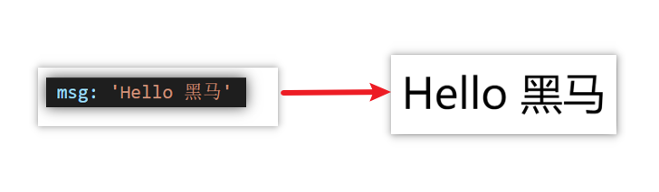

比如就上面这个数据，基于提供好的 msg 怎么渲染后右侧可展示的数据呢？

核心步骤（4步）：

```html
<!-- 1. 准备容器 -->
<div id="app">
  {{msg}}
</div>
<!-- 2. 引包（官网）- 开发版本/生产版本 -->
<script src="https://cdn.jsdelivr.net/npm/vue@2.7.14/dist/vue.js"></script>
<script>
  // 3. 创建 Vue 实例 new Vue()
  const app = new Vue({
    // 4. 指定配置项 → 渲染数据
    el: '#app',  	    // el 指定挂载点，选择器
    data: {			    // data 提供数据   
      msg: 'Hello 黑马'
    }    	
  })
</script>
```

### 3. 插值表达式

插值表达式是一种 Vue 的模板语法

作用：利用表达式进行插值，渲染到页面中

表达式：是可以被求值的代码，JS引擎会讲其计算出一个结果

- 插值表达式语法：<span data-type="text" style="background-color: var(--b3-font-background3);">{{ 表达式 }}</span>

  ```html

  <h3>{{ title }}<h3>						<!-- 普通变量 -->
  <p>{{ nickName.toUpperCase() }}</p>		<!-- 转大写 -->
  <p>{{ age >= 18 ? '成年':'未成年' }}</p>	<!-- 三元运算符 -->
  <p>{{ obj.name }}</p>					<!-- 对象的属性值 -->
  <p>{{ fn() }}</p>						<!-- 函数 -->
  ```
- 注意点

  ```html
  1.在插值表达式中使用的数据 必须在data中进行了提供
  <p>{{ hobby }}</p>  //如果在data中不存在 则会报错

  2.支持的是表达式，而非语句，比如：if   for ...
  <p>{{ if }}</p>

  3.不能在标签属性中使用 {{  }} 插值 (插值表达式只能标签中间使用)
  <p title="{{ username }}">我是P标签</p>
  ```

### 4. 响应式特性

数据的响应式处理 Vue 核心特性：响应式

<div>
<span data-type="text" style="color: var(--b3-font-color8);">数据的响应式处理</span> → 响应式：<span data-type="text" style="color: var(--b3-font-color8);">数据变化，视图自动更新</span>
</div>

- <span data-type="text" style="color: var(--b3-font-color8);">访问或修改</span> data 中的数据

  1. 访问数据 `实例.属性名`​

     例在控制台输入：`app.msg` 按回车，就会输出：`Hello 黑马`​
  2. 修改数据 `实例.属性名 = 新值`​

     例在控制台输入：`app.msg = 'Hello Vue'`​ 按回车，页面文字变为：Hello Vue

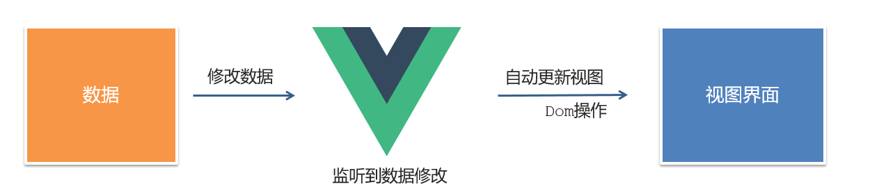

<div>
<span data-type="text" style="color: var(--b3-font-color8);">聚焦于数据 → 数据驱动视图</span>
</div>

使用 Vue 开发，关注<span data-type="text" style="color: var(--b3-font-color8);">业务的核心逻辑</span>，根据业务<span data-type="text" style="color: var(--b3-font-color8);">修改数据</span>即可

### 5. 开发者工具

1. 通过谷歌应用商店安装（国外网站）
2. 极简插件下载（推荐） [https://chrome.zzzmh.cn/index](https://chrome.zzzmh.cn/index)

安装步骤：


安装之后可以F12后看到多一个Vue的调试面板


## 二、Vue 指令

Vue 会根据不同的【指令】，针对标签实现不同的【功能】

**概念：**   ​****指令（Directives）是 Vue 提供的带有****  **v- 前缀**  ****的****  **特殊  标签属性**。

- 内容渲染指令（v-html、v-text）
- 条件渲染指令（v-show、v-if、v-else、v-else-if）
- 事件绑定指令（v-on）
- 属性绑定指令 （v-bind）
- 双向绑定指令（v-model）
- 列表渲染指令（v-for）
- v-html、v-text（内容渲染指令）

  1. v-html 作用：设置元素的 [innerHTML](JavaScript.md#20250217194350-vwmm7dy)，可以解析标签。
  2. v-text 作用：设置元素的 [textHTML](JavaScript.md#20241116233159-teav9t2)，不解析标签，只是文本。

  ```html
  <div id="app">
    <h2>个人信息</h2>
  	// 既然指令是vue提供的特殊的html属性，所以咱们写的时候就当成属性来用即可
     <p v-text="uname">姓名：</p> 
     <p v-html="intro">简介：</p>
  </div> 

  <script>
          const app = new Vue({
              el:'#app',
              data:{
                  uname:'张三',
                  intro:'<h2>这是一个<strong>非常优秀</strong>的boy<h2>'
              }
          })
  </script>
  ```
- v-show、v-if、v-else、v-else-if（条件渲染指令）

  3. v-show 作用：控制元素<span data-type="text" style="color: var(--b3-font-color8);">显示与隐藏</span>。表达式值为 true 显示， false 隐藏。

     原理：切换 CSS 的 display: none; 来控制显示与隐藏。

     场景：频繁切换显示隐藏的场景。
  4. v-if 作用：控制元素<span data-type="text" style="color: var(--b3-font-color8);">是否存在</span>。表达式值为 true 存在， false 不存在。

     原理：基于条件判断，是否创建 或 移除元素节点。

     场景： 要么显示，要么隐藏，不频繁切换的场景。

  ```html
    <div id="app">
      <div class="box">我是v-show控制的盒子</div>
      <div class="box">我是v-if控制的盒子</div>
    </div>

    <script src="https://cdn.jsdelivr.net/npm/vue@2/dist/vue.js"></script>
    <script>
      const app = new Vue({
        el: '#app',
        data: {
          flag: false
        }
      })
    </script>
  ```

  作用： 辅助 v-if 进行判断渲染。

  5. v-else  作用： 辅助 v-if 进行判断渲染。
  6. v-else-if  作用： 辅助 v-if 进行判断渲染。

  在两种条件下，第一个用 v-if，第二个用 v-else。

  在多种条件下，第一个用 v-if，中间用v-else-if，最后一个用 v-else。

  注意： 需要紧挨着 v-if 一起使用。

  ```html
    <div id="app">
      <p v-if="gender === 1">性别：♂ 男</p>
      <p v-else>性别：♀ 女</p>
      <hr>
      <p v-if="score >= 90">成绩评定A：奖励电脑一台</p>
      <p v-else-if="score >= 70">成绩评定B：奖励周末郊游</p>
      <p v-else-if="score >= 60">成绩评定C：奖励零食礼包</p>
      <p v-else">成绩评定D：惩罚一周不能玩手机</p>
    </div>

    <script src="https://cdn.jsdelivr.net/npm/vue@2/dist/vue.js"></script>
    <script>

      const app = new Vue({
        el: '#app',
        data: {
          gender: 2,
          score: 95
        }
      })
    </script>
  ```
- v-on（事件绑定指令）

  7. v-on作用：使用Vue时，如需为DOM注册事件，及其的简单，语法如下：

  - ​`v-on:`​ 可以简写为<span data-type="text" style="color: var(--b3-font-color8);"> </span> **​** **​** **​**​ **​`@`​**​**​**​**​**​**​** ​
  - ​`<button v-on:事件名="内联语句">按钮</button>`​

    ```js
    <div id="app">
        <button @click="count--">-</button>
        <span>{{ count }}</span>
        <button v-on:click="count++">+</button>
      </div>
      <script src="https://cdn.jsdelivr.net/npm/vue@2/dist/vue.js"></script>
      <script>
        const app = new Vue({
          el: '#app',
          data: {
            count: 100
          }
        })
      </script>
    ```
  - ​`<button v-on:事件名="处理函数">按钮</button>`​

    事件处理函数应该写到一个跟data同级的配置项（methods）中

    <div>
    <span data-type="text" style="color: var(--b3-font-color8);">methods中的函数内部的this都指向Vue实例</span>
    </div>

    ```js
      <div id="app">
        <button @click="fn">切换显示隐藏</button>
        <h1 v-show="isShow">黑马程序员</h1>
      </div>
      <script src="https://cdn.jsdelivr.net/npm/vue@2/dist/vue.js"></script>
      <script>
        const app = new Vue({
          el: '#app',
          data: {
            isShow: true
          },
    	  methods:{
    	  	fn() {
    		  this.isShow = !this.isShow	// 如果没有this，就指的是全局变量。
    		}
    	  }
        })
      </script>
    ```
  - ​`<button v-on:事件名="处理函数(实参)">按钮</button>`​

    如果不传递任何参数，则方法无需加小括号；methods方法中可以直接使用 e 当做事件对象

    如果传递了参数，则实参 `$event` 表示事件对象，固定用法。

    ```js
    <div id="app">
        <div class="box">
          <h3>小黑自动售货机</h3>
          <button @click="buy(5)">可乐5元</button>
          <button @click="buy(10)">咖啡10元</button>
        </div>
        <p>银行卡余额：{{ money }}元</p>
      </div>

      <script src="https://cdn.jsdelivr.net/npm/vue@2/dist/vue.js"></script>
      <script>
        const app = new Vue({
          el: '#app',
          data: {
            money: 100
          },
          methods: {
            buy(price) {
              this.money -= price
            }
          }
        })
      </script>
    ```
- v-blind（属性绑定指令）

  8. v-blind作用 **：** 动态设置html的标签属性 比如：src、url、title

  **语法**： `v-bind:属性名=“表达式”`​

  ​**​`v-bind:`​**  <span data-type="text" style="color: var(--b3-font-color8);">可以简写成 </span> **​`:`​** ​

  比如，有一个图片，它的 `src`​ 属性值，是一个图片地址。这个地址在数据 data 中存储。

  则可以这样设置属性值：

  - ​``​
  - ​``​   （v-bind可以省略）

  ```js
    <div id="app">
      
      
    </div>
    <script src="https://cdn.jsdelivr.net/npm/vue@2/dist/vue.js"></script>
    <script>
      const app = new Vue({
        el: '#app',
        data: {
          imgUrl: './imgs/10-02.png',
          msg: 'hello 波仔'
        }
      })
    </script>
  ```
- v-for（列表渲染指令）

  9. v-for作用：<span data-type="text" style="color: var(--b3-font-color8);">基于数据循环</span>， <span data-type="text" style="color: var(--b3-font-color8);">多次渲染</span>整个元素 → 数组、对象、数字...

  Vue 提供了 v-for 列表渲染指令，用来辅助开发者基于一个数组来循环渲染一个列表结构。

  - v-for 指令需要使用 `v-for="(item, index) in 数组"`​ 形式的特殊语法，其中：

    item 是数组中的每一项

    index 是每一项的索引，不需要可以省略

  此语法也可以遍历**对象和数字**

  ```js
  // 遍历对象
  <div v-for="(value, index) in object">{{value}}</div>
  // value：对象中的值
  // key：对象中的键
  // index：遍历索引从0开始

  // 遍历数字
  <p v-for="item in 10">{{item}}</p>
  // item从 1 开始
  ```

  - v-for中的key

    **语法：** key="唯一值"

    **作用：**​****​****​********​********​****​****​****​****​****​****​********​********​****​****​********给列表项添加的********​****​****​********​********​****​****​****​****​****​****​********​********​****​****​**唯一标识**。便于Vue进行列表项的**正确排序复用**。

    **为什么加key：** Vue 的默认行为会尝试原地修改元素（**就地复用**）

    实例代码：

    ```js
    <ul>
      <li v-for="(item, index) in booksList" :key="item.id">
        <span>{{ item.name }}</span>
        <span>{{ item.author }}</span>
        <button @click="del(item.id)">删除</button>
      </li>
    </ul>
    ```

    - 注意：

      key 的值只能是字符串 或 数字类型

      key 的值必须具有唯一性

      推荐使用  id 作为 key（唯一），不推荐使用 index 作为 key（会变化，不对应）
- v-model（双向绑定指令）

  10. v-model 作用    **：**     给 **表单元素**（input、radio、select）使用，双向绑定数据，可以快速 **获取** 或 **设置** 表单元素内容

  所谓双向绑定就是：数据改变后，呈现的页面结果会更新，页面结果更新后，数据也会随之而变。

  **语法：**   ​`v-model="变量"`​

  **需求：**    使用双向绑定实现以下需求

  1. 点击登录按钮获取表单中的内容
  2. 点击重置按钮清空表单中的内容

  

  ```js
  <div id="app">
      账户：<input type="text" v-model="username"> <br><br>
      密码：<input type="password" v-model="password"> <br><br>
      <button>登录</button>
      <button>重置</button>
    </div>
    <script src="https://cdn.jsdelivr.net/npm/vue@2/dist/vue.js"></script>
    <script>
      const app = new Vue({
        el: '#app',
        data: {
          username: '',
          password: ''
        },
  	  methods
      })
    </script>
  ```

‍

## [三、综合案例 - 小黑记事本](C:\Users\12625\Desktop\前端\3.Vue开发\2、最新Vue2+3%20入门到实战课程\01-随堂代码&amp;素材\day01\准备代码\16-综合案例-小黑记事本\00-小黑记事本模板.html)

列表渲染

删除功能

添加功能

底部统计

清空

‍

# day02-指令下+计算属性+侦听器

## 一、指令补充

### 1. 指令修饰符

所谓指令修饰符就是通过“`.`​”指明一些指令**后缀** 不同的**后缀**封装了不同的处理操作  —> 简化代码

- 按键修饰符

​`@keyup.enter`​​  —>当点击 enter 键的时候才触发

- v-model 修饰符

  `v-model.trim`​​  —>去除首位空格​

  `v-model.number`​ —>转数字
- 事件修饰符

  ​`@事件名.stop`​ —> [阻止冒泡](JavaScript.md#20241119174042-34j6s72)

  ​`@事件名.prevent`  —> [阻止默认行为](JavaScript.md#20241119195112-oqi41km)

  ​`@事件名.stop.prevent`​ —>可以连用 即阻止事件冒泡也阻止默认行为

### 2. v-bind 对于样式控制的增强

为了方便开发者进行样式控制， Vue 扩展了 v-bind 的语法，可以针对 **class 类名** 和 **style 行内样式** 进行控制 。

- #### v-bind 操作 class

  语法：`<div> :class = "对象/数组">这是一个div</div>`​

  - 对象语法

    当class动态绑定的是**对象**时，**键就是类名，值就是布尔值**，如果值是**true**，就有这个类，否则没有这个类

    ​`<div class="box" :class="{ 类名1: 布尔值, 类名2: 布尔值 }"></div>`​

    适用场景：一个类名，来回切换
  - 数组语法

    当class动态绑定的是**数组**时 → 数组中所有的类，都会添加到盒子上，本质就是一个 class 列表

    ​`<div class="box" :class="[ 类名1, 类名2, 类名3 ]"></div>`​

    使用场景:批量添加或删除类

  ```html
   <style>
      .box {
        width: 200px;
        height: 200px;
        border: 3px solid #000;
        font-size: 30px;
        margin-top: 10px;
      }
      .pink {
        background-color: pink;
      }
      .big {
        width: 300px;
        height: 300px;
      }
    </style>


  <div id="app">
      <!--绑定对象-->
      <div class="box" :class="{pink: true, big: false}">黑马程序员</div>
      <!--绑定数组-->
      <div class="box" :class="['pink', 'big']">黑马程序员</div>
    </div>
    <script src="https://cdn.jsdelivr.net/npm/vue@2/dist/vue.js"></script>
    <script>
      const app = new Vue({
        el: '#app'
      })
    </script>
  ```

  [京东秒杀-tab栏切换导航高亮 案例](C:\Users\12625\OneDrive\桌面\前端\3.Vue开发\2、最新Vue2+3%20入门到实战课程\Vue2+3入门到实战-配套资料\01-随堂代码&素材\day02\day02\准备代码\04-案例-tab栏的active效果-静态结构.html)
- #### v-bind 操作 style

  语法：​`<div :style="{ CSS属性名1: 'CSS属性值', CSS属性名2: 'CSS属性值' }"></div>`​

  注意：对象里面不支持横杠写法，如 `background-color`​，可以用驼峰法写 `backgroundColor`​，或者加引号 `'background-color'`​。

  [进度条案例](C:\Users\12625\OneDrive\桌面\前端\3.Vue开发\2、最新Vue2+3%20入门到实战课程\Vue2+3入门到实战-配套资料\01-随堂代码&素材\day02\day02\准备代码\06-案例-进度条效果-静态样式.html)

### 3.v-model 应用于其他表单元素

常见的表单元素都可以用 v-model 绑定关联  →  快速 **获取** 或 **设置** 表单元素的值

它会根据 <span data-type="text" style="color: var(--b3-font-color8);"> </span>​**控件类型** 自动选取  **正确的方法** 来更新元素

[小黑学习网案例](C:\Users\12625\OneDrive\桌面\前端\3.Vue开发\2、最新Vue2+3%20入门到实战课程\Vue2+3入门到实战-配套资料\01-随堂代码&素材\day02\day02\准备代码\07-v-model应用于其他表单元素.html)

## 二、computed 计算属性

概念：基于**现有的数据**，计算出来的**新属性**。 **依赖**的数据变化，**自动**重新计算。

### 1. 基础语法

声明在 与 <span data-type="text" style="color: var(--b3-font-color8);">data 并列的 </span>​**computed 配置项**中，一个计算属性对应一个函数。

使用起来和普通属性一样使用  `{{ 计算属性名}}`​，计算属性名就是函数名，写在两对大括号里不能带 ” () “

- 注意

  1. computed 配置项和data配置项是**同级**的
  2. computed 中的计算属性**虽然是函数的写法**，但他**依然是个属性**
  3. computed 中的计算属性**不能**和data中的属性**同名**
  4. 使用 computed 中的计算属性和使用data中的属性是一样的用法
  5. computed 中计算属性内部的**this**依然**指向的是Vue实例**

```html
<div id="app">
    <h3>小黑的礼物清单</h3>
    <table>
      <tr>
        <th>名字</th>
        <th>数量</th>
      </tr>
      <tr v-for="(item, index) in list" :key="item.id">
        <td>{{ item.name }}</td>
        <td>{{ item.num }}个</td>
      </tr>
    </table>

    <!-- 目标：统计求和，求得礼物总数 -->
    <p>礼物总数：{{ sum }} 个</p>
  </div>
  <script src="https://cdn.jsdelivr.net/npm/vue@2/dist/vue.js"></script>
  <script>
    const app = new Vue({
      el: '#app',
      data: {
        // 现有的数据
        list: [
          { id: 1, name: '篮球', num: 1 },
          { id: 2, name: '玩具', num: 2 },
          { id: 3, name: '铅笔', num: 5 },
        ]
      },
	  computed: {
	  	sum() {
			let total = this.list.reduce((sum, item) => sum + item.num, 0)
			return total
		}
	  }
    })
  </script>
```

### 2. 计算属性 vs 方法

- computed计算属性

  作用：<span data-type="text" style="color: var(--b3-font-color8);">封装了一段对于</span>​**数据**​<span data-type="text" style="color: var(--b3-font-color8);">的处理，求得一个</span>​**结果**

  语法：

  1. 写在computed配置项中
  2. **作为属性**，直接使用

     - js中使用计算属性： `this.计算属性`​
     - 模板中使用计算属性：`{{计算属性}}`​
- methods计算属性

  作用：<span data-type="text" style="color: var(--b3-font-color8);">给Vue实例提供一个</span>​**方法**​<span data-type="text" style="color: var(--b3-font-color8);">，调用以</span>​**处理业务逻辑**​<span data-type="text" style="color: var(--b3-font-color8);">。</span>

  语法：

  1. 写在methods配置项中
  2. **作为方法**调用

     - js中调用：`this.方法名()`​
     - 模板中调用 `{{方法名()}}`​ 或者 `@事件名=“方法名”`​
- 计算属性的优势

  1. <div>
     <span data-type="text" style="color: var(--b3-font-color8);">缓存特性（提升性能）</span>
     </div>

     计算属性会对计算出来的结果缓存，再次使用直接读取缓存，

     依赖项变化了，会自动重新计算 → 并再次缓存
  2. methods没有缓存特性
  3. 通过代码比较
- 总结

  1. <span data-type="text" style="color: var(--b3-font-color8);">computed</span>​**有缓存特性**​<span data-type="text" style="color: var(--b3-font-color8);">，methods</span>​**没有缓存**
  2. 当一个结果依赖其他多个值时，推荐使用计算属性
  3. 当处理业务逻辑时，推荐使用 methods 方法，比如事件的处理函数

### 3. 完整写法

1. 计算属性默认的简写，只能读取访问，不能 "修改"
2. 如果要 "修改" → 需要写计算属性的完整写法


完整写法代码演示

```html
<div id="app">
    姓：<input type="text" v-model="firstName"><br>
    名：<input type="text" v-model="lastName"><br>
	<!-- 写属性名 -->
    <p>姓名：{{ fullName }}</p>
    <button @click="changeName">修改姓名</button>
  </div>
  <script src="./vue.js"></script>
  <script>
    const app = new Vue({
      el: '#app',
      data: {
        firstName: '布布',
        lastName: '一二'
      },
	  methods: {
        changeName() {
          this.fullName = '黄小忠'	// 这就和计算属性建立了联系，修改计算属性的值
        }
      }，
      computed: {
        fullName: {		// 完整写法：是一个对象，里面有一个访问函数get和一个修改函数set
          get() {
            return this.firstName + this.lastName
          },		// 其实简写就是把这一部分简写了，没有包括下面的修改函数
          set(value) {	//这里的 value 就是接收的下面方法里的修改的新的计算属性的值
            this.firstName = value.slice(0, 1)
            this.lastName = value.slice(1)
          }
        }
      }
    })
```

### 4. [成绩案例](C:\Users\12625\OneDrive\桌面\前端\3.Vue开发\2、最新Vue2+3%20入门到实战课程\Vue2+3入门到实战-配套资料\01-随堂代码&素材\day02\day02\准备代码\11-综合案例-成绩案例\00-成绩案例静态模板.html)


思路分析：

1.渲染功能  v-for  :key  v-bind:动态绑定class的样式

2.删除功能 v-on绑定事件， 阻止a标签的默认行为

3.v-model的修饰符 .trim、 .number、  判断数据是否为空后 再添加、添加后清空文本框的数据

4.使用计算属性computed 计算总分和平均分的值

‍

## 三、watch 侦听器

**监视数据变化**，执行一些业务逻辑或异步操作。

watch 同样声明在跟data同级的配置项中

- 语法：

  1. 简单写法： 简单类型数据直接监视

     ```js
     data: { 
       words: '苹果',
       obj: {
         words: '苹果'
       }
     },
     watch: {
       // 该方法会在数据变化时，触发执行
       words(newValue, oldValue) {	// 旧值不用可以省略
         //一些业务逻辑 或 异步操作。 
       },
       // js 里的方法名不允许出现 '.' 字符，如果有要加上单引号
       'obj.words'(newValue, oldValue) {
         //一些业务逻辑 或 异步操作。 
       }
     }
     ```
  2. 完整写法：添加额外配置项

     deep:true 对复杂类型进行深度监听（<span data-type="text" style="color: var(--b3-font-color8);">对象里的所有属性都可以监视</span>）

     immdiate:true 初始化 立刻执行一次

     ```js
     data: {
       obj: {
         words: '苹果',
         lang: 'italy'
       },
     },

     watch: {
       obj: {
         deep: true,  		// 深度监视(监视整个对象)
         immdiate:true,		// 立即执行handler函数(刚进页面就执行)
         handler (newValue) {
           console.log(newValue)
         }
       }
     }

     ```

  - [翻译案例](C:\Users\12625\OneDrive\桌面\前端\3.Vue开发\2、最新Vue2+3%20入门到实战课程\Vue2+3入门到实战-配套资料\01-随堂代码&素材\day02\day02\准备代码\12-watch侦听器-简单写法.html)

    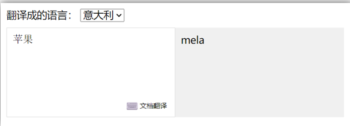

    <span data-type="text" style="color: var(--b3-font-color8);">简单写法一般只监视1个数据</span>，内容的改变或者语言的改变，若强行同时监视多个数据变化，就很麻烦。

    <span data-type="text" style="color: var(--b3-font-color8);">完整写法则可以同时监视多个数据</span>。

## 四、[综合案例：水果购物车](C:\Users\12625\OneDrive\桌面\前端\3.Vue开发\2、最新Vue2+3%20入门到实战课程\Vue2+3入门到实战-配套资料\01-随堂代码&素材\day02\day02\准备代码\13-综合案例-购物车\00-静态代码.html)


实现思路：

1. 基本渲染：  v-for遍历、:class动态绑定样式
2. 删除功能 ： v-on 绑定事件，获取当前行的id，用到了 [filter() 方法](JavaScript.md#20250219231149-oqcgwkr)
3. 修改个数 ： v-on绑定事件，获取当前行的id，进行筛选出对应的项然后增加或减少

   加号没有啥要求，减号减到0的时候要弹出确认框确认是否删除商品框里，用到了  [find() 方法](JavaScript.md#20241128184159-vsote7w)
4. 全选反选（在 Vue 中全选框通常可以用计算属性来做，这里要双向绑定，即访问又修改了，因此要用完整写法）

   必须所有的小选框都选中，全选按钮才选中 → [every() 方法](JavaScript.md#20241128184159-57vbuxs)

   如果全选按钮选中，则所有小选框都选中；如果全选取消，则所有小选框都取消选中 → [forEach() 方法](JavaScript.md#20250219231445-2fqdaqi)

   声明计算属性，判断数组中的每一个 checked 属性的值，看是否需要全部选
5. 统计 选中的 总价 和 总数量 ：通过计算属性来计算**选中的**总价和总数量，用到了 [reduce() 方法](JavaScript.md#20241128171331-aado0gv)
6. 持久化到本地： 在数据变化时都要更新下本地存储 watch

   复杂数据类型存入本地需要转换成 [JSON 字符串](JavaScript.md#20250219231854-q5klv4e)，取出的时候也要再转回来。

‍

# day03-生命周期+工程化开发(组件入门)

## 一、生命周期

思考：什么时候可以发送初始化渲染请求？（越早越好）什么时候可以开始操作dom？（至少dom得渲染出来）

Vue生命周期：就是一个Vue实例从创建 到 销毁 的整个过程。

### 1. 生命周期四个阶段

1. 创建阶段（执行一次）：创建响应式数据
2. 挂载阶段（执行一次）：渲染模板
3. 更新阶段（执行多次）：修改数据，更新视图
4. 销毁阶段（执行一次）：销毁Vue实例

创建阶段后才能发送请求；挂载阶段后才能操作dom。

‍

### 2. 生命周期钩子（钩子函数）

Vue生命周期过程中，会**自动运行一些函数**，被称为<span data-type="text" style="color: var(--b3-font-color8);">【</span>​**生命周期钩子**​<span data-type="text" style="color: var(--b3-font-color8);">】</span>→  让开发者可以在<span data-type="text" style="color: var(--b3-font-color8);">【</span>​**特定阶段**​<span data-type="text" style="color: var(--b3-font-color8);">】</span>运行**自己的代码**


现在重点是 created 和 mounted 这俩钩子函数。

```html
  <div id="app">
    <h3>{{ title }}</h3>
    <div>
      <button @click="count--">-</button>
      <span>{{ count }}</span>
      <button @click="count++">+</button>
    </div>
  </div>
  <script src="./vue.js"></script>
  <script>
    const app = new Vue({
      el: '#app',
      data: {
        count: 100,
        title: '计数器'
      },
      // 1. 创建阶段（准备数据）
      beforeCreate() {
		// 此时 this.count 打印出来是 undefined
        console.log('beforeCreate 响应式数据准备好之前', this.count)
      },
      created() {
		// 此时 this.count 打印出来就是 100 了
        console.log('created 响应式数据准备好之后', this.count)
        // this.数据名 = 请求回来的数据
        // 可以开始发送初始化渲染的请求了
      },

      // 2. 挂载阶段（渲染模板）
      beforeMount() {
		// 此时获取的<h3>标签的内容还是 ‘{{ title }}’
        console.log('beforeMount 模板渲染之前', document.querySelector('h3').innerHTML)
      },
      mounted() {
		// 此时获取的<h3>标签的内容就是 ‘计数器’ 了
        console.log('mounted 模板渲染之后', document.querySelector('h3').innerHTML)
        // 可以开始操作dom了
      },

      // 3. 更新阶段(修改数据 → 更新视图)
      beforeUpdate() {
		// 此时打印<span>标签的内容是更新前的数据
        console.log('beforeUpdate 数据修改了，视图还没更新', document.querySelector('span').innerHTML)
      },
      updated() {
		// 此时打印<span>标签的内容是更新后的数据
        console.log('updated 数据修改了，视图已经更新', document.querySelector('span').innerHTML)
      },

      // 4. 卸载阶段，要是关闭网页就看不到打印的内容了，可以在控制台输入app.$destroy,就可以卸载当前 vue 实例了
      beforeDestroy() {
        console.log('beforeDestroy, 卸载前')
        console.log('清除掉一些Vue以外的资源占用，定时器，延时器...')
      },
      destroyed() {
        console.log('destroyed，卸载后')
      }
    })
  </script>
```

### 3. 生命周期案例

- created 钩子函数演示，创建阶段后请求数据并获得回应的数据

  ```js
  const app = new Vue({
    el: '#app',   
    data: {
      list: []
    },
    async created() {
      const res = await axios.get('http://hmajax.itheima.net/api/news')
      this.list = res.data.data
    }
  })
  ```
- mounted 钩子函数演示， 自动获取焦点

  ```js
  const app = new Vue({
    el: '#app',
    data: {
      words: ''
    },
    mounted() {
      document.querySelector('#inp').focus()
    }
  })
  ```

## 二、[综合案例：小黑记账清单](C:\Users\12625\OneDrive\桌面\前端\3.Vue开发\2、最新Vue2+3%20入门到实战课程\Vue2+3入门到实战-配套资料\01-随堂代码&素材\day03\day03\准备代码\04-小黑记账清单\00-小黑记账清单-静态结构.html)

1. 基本渲染

   - 立刻发送请求获取数据 created
   - 拿到数据，存到data的响应式数据中
   - 结合数据，进行渲染 v-for
   - 消费统计  —> 计算属性
2. 添加功能

   - 收集表单数据 v-model，使用指令修饰符处理数据
   - 给添加按钮注册点击事件，对输入的内容做非空判断，发送请求
   - 请求成功后，对文本框内容进行清空
   - 重新渲染列表
3. 删除功能

   - 注册点击事件，获取当前行的id
   - 根据id发送删除请求
   - 需要重新渲染
4. 饼图渲染

   饼图渲染（这个之前没学过，研究一下，[echarts官网](https://echarts.apache.org/zh/index.html)）

   - 初始化一个饼图 echarts.init(dom)    mounted钩子中渲染
   - 根据数据试试更新饼图 echarts.setOptions({...})

## 三、工程化开发入门

### 1. 工程化开发和脚手架、

- #### 开发Vue的两种方式

  1. 核心包传统开发模式：基于html / css / js 文件，直接引入核心包，开发 Vue。
  2. **工程化开发模式：基于构建工具（例如：webpack）的环境中开发Vue。**

  

  - 工程化开发模式优点：

    提高编码效率，比如使用JS新语法、Less/Sass、Typescript等通过webpack都可以编译成浏览器识别的ES3/ES5/CSS等
  - 工程化开发模式问题：

    webpack配置**不简单**

    **雷同**的基础配置

    缺乏**统一的标准**

  为了解决以上问题，所以我们需要一个工具，生成标准化的配置
- #### 脚手架Vue CLI

  Vue CLI 是Vue官方提供的一个**全局命令工具**

  可以帮助我们**快速创建**一个开发Vue项目的**标准化基础架子**。【集成了webpack配置】

  - 好处：

    开箱即用，零配置

    内置babel等工具

    标准化的webpack配置
  - 使用步骤：

    1. 全局安装（只需安装一次即可，终端管理员）

       **yarn global add @vue/cli** 或者 **npm i @vue/cli -g**

       （如果不行就先输个：**set-ExecutionPolicy RemoteSigned**）
    2. 查看vue/cli版本（终端）： **vue --version**
    3. 创建项目架子（项目所在的文件夹的终端）：**vue create project-name**(项目名不能使用中文)
    4. 启动项目（项目目录的终端）：**yarn serve** 或者 **npm run serve**(命令不固定，找package.json)

       是否是写 serve，取决于它（工作时又可能会被改）

       

### 2. 项目目录介绍和运行流程

- #### 项目目录介绍

  

  虽然脚手架中的文件有很多，目前咱们只需人事三个文件即可

  1. main.js  入口文件
  2. App.vue  App根组件
  3. index.html 模板文件
- #### 运行流程

  ​

### 3. 组件化

组件化：一个页面可以拆分成一个个组件，每个组件有着自己<span data-type="text" style="color: var(--b3-font-color8);">独立的结构、样式、行为</span>。

好处：便于<span data-type="text" style="color: var(--b3-font-color8);">维护</span>，利于<span data-type="text" style="color: var(--b3-font-color8);">复用</span> → 提升<span data-type="text" style="color: var(--b3-font-color8);">开发效率</span>。

组件分类：普通组件、根组件。

比如：下面这个页面，可以把所有的代码都写在一个页面中，但是这样显得代码比较混乱，难易维护。咱们可以按模块进行组件划分


- #### 根组件 App.vue

  整个应用最上层的组件，包裹所有普通小组件

  

  App.vue 根组件是由三部分构成

  - 语法高亮插件

  ​

  - 三部分构成

    - template：结构 （有且只能一个根元素）
    - script:   js逻辑
    - style： 样式 (可支持less，需要装包)
  - 让组件支持less

    （1） style标签，lang="less" 开启less功能

    （2） 装包: **yarn add less less-loader** -D 或者 **npm i less less-loader -D**
- ‍

### 4. 组件注册

- #### 局部注册

  特点：<span data-type="text" style="color: var(--b3-font-color8);">只能在注册的组件内使用</span>

  - 步骤：

    1. 在src文件夹新建components文件夹，再创建.vue文件（三个组成部分）
    2. 在使用的组件内先导入再注册，最后使用

  使用方式：当成html标签使用即可  `<组件名></组件名>`​

  注意：组件名规范 —> 驼峰命名法， 如 HmHeader

  - 语法：

    

    ```js
    // 导入需要注册的组件
    // import 组件对象 from '.vue文件路径'
    import HmHeader from './components/HmHeader'

    export default {  // 局部注册
      components: {
        // '组件名': 组件对象,
        HmHeader:HmHeaer,
        HmHeader
      }
    }
    ```
  - [练习](C:\Users\12625\OneDrive\桌面\vue-demo\vue-demo1)

    在App组件中，完成以下练习。在App.vue中使用组件的方式完成下面布局

    

  ‍
- #### 全局注册

  特点：全局注册的组件，在项目的**任何组件**中都能使用

  - 步骤

    1. 在src文件夹新建components文件夹，再创建.vue组件（三个组成部分）
    2. 在 **main.js** 中进行全局注册

  使用方式：当成HTML标签直接使用 `<组件名></组件名>`​，在所有组件范围内能直接使用

  注意：组件名规范 —> 大驼峰命名法， 如 HmHeader

  - 语法

    Vue.component('组件名', 组件对象)

    ```js
    // 导入需要全局注册的组件
    import HmButton from './components/HmButton'
    Vue.component('HmButton', HmButton)		// 一次只能注册一个，注册多个需要写多行
    ```
  - [练习](C:\Users\12625\OneDrive\桌面\vue-demo\vue-demo1)

    在以下3个局部组件中是展示一个通用按钮

    

## 四、[综合案例：小兔鲜首页](C:\Users\12625\OneDrive\桌面\vue-demo\vue-demo1)


- 开发思路

  1. 分析页面，按模块拆分组件，搭架子  (局部或全局注册)
  2. 根据设计图，编写组件 html 结构 css 样式 (已准备好)
  3. 拆分封装通用小组件  (局部或全局注册)

     将来 → 通过 js 动态渲染，实现功能

‍

# day04-组件通信&进阶用法

## 一、组件的三大组成部分（结构/样式/逻辑）


### 1. scoped解决样式冲突

- 默认情况

  写在组件中的样式会 **全局生效** →  因此很容易造成多个组件之间的样式冲突问题。

  1. **全局样式**: 默认组件中的样式会作用到全局，任何一个组件中都会受到此样式的影响
  2. **局部样式**: 可以<span data-type="text" style="color: var(--b3-font-color8);">给组件</span>`<style>`​​<span data-type="text" style="color: var(--b3-font-color8);"> 标签加上</span>**scoped**<span data-type="text" style="color: var(--b3-font-color8);"> 属性,可以</span>**让样式只作用于当前组件**
- 代码演示

  ```html
  <template>
    <div class="base-one">
      BaseOne
    </div>
  </template>

  <script>
  export default {

  }
  </script>

  <style scoped>	<!-- 给<style>标签加上 scoped 属性,可以让样式只作用于当前组件 -->
    div{
  	width: 100px;
  	height: 100px;
    }
  </style>
  ```
- scoped原理

  1. 当前组件内标签都被添加**data-v-hash值** 的属性
  2. css选择器都被添加 <span data-type="text" style="color: var(--b3-font-color8);">[</span>​**data-v-hash值**​<span data-type="text" style="color: var(--b3-font-color8);">]</span> 的属性选择器

  最终效果：**必须是当前组件的元素**, 才会有这个自定义属性, 才会被这个样式作用到

  

### 2. data是一个函数

<span data-type="text" style="color: var(--b3-font-color8);">一个组件的 </span>**data**<span data-type="text" style="color: var(--b3-font-color8);"> 选项必须</span>**是一个函数**。目的是为了：保证每个组件实例，维护**独立**的一份**数据**对象。

每次创建新的组件实例，都会新**执行一次data 函数**，得到一个新对象。

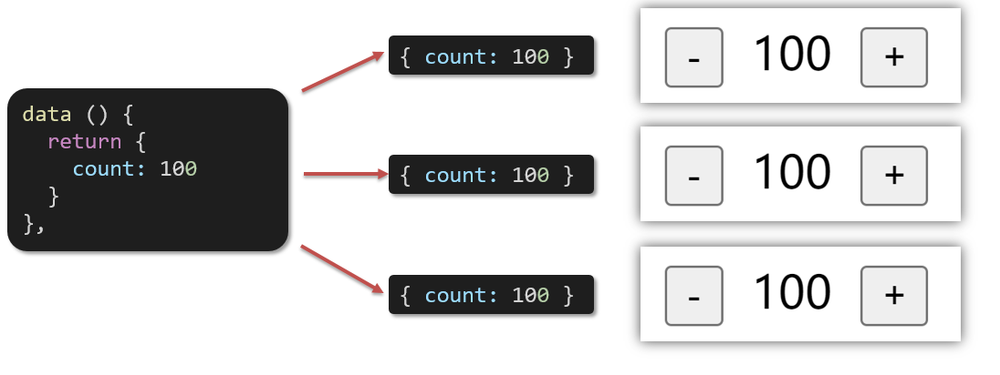

‍

## 二、组件通信

### 1. 组件通信语法

- 什么是组件通信？

  组件通信，就是指**组件与组件**之间的**数据传递**

  - 组件的数据是独立的，无法直接访问其他组件的数据。
  - 想使用其他组件的数据，就需要组件通信
- 组件之间如何通信


- 组件关系分类

  1. 父子关系
  2. 非父子关系

  
- 通信解决方案

  
- 父子通信流程

  1. 父组件通过 **props** 将数据传递给子组件
  2. 子组件利用     **$emit** 通知父组件修改更新


### 2. 父传子示例

父组件通过**props**将数据传递给子组件

- 父向子传值步骤

  1. 给子组件以添加属性的方式传值
  2. 子组件内部通过props接收
  3. 模板中直接使用 props接收的值


‍

### 3. 子传父示例

子组件利用     **$emit** 通知父组件，进行修改更新

- 子向父传值步骤

  1. $emit触发事件，给父组件发送消息通知
  2. 父组件监听$emit触发的事件
  3. 提供处理函数，在函数的性参中获取传过来的参数

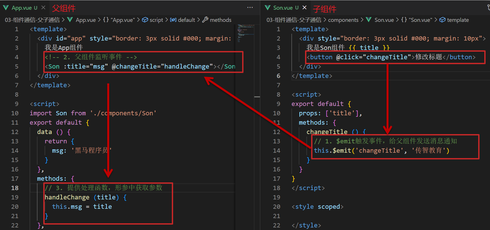

### 4. 非父子通信（扩展）

- #### event bus 事件总线

  作用：非父子组件之间，进行简易消息传递。(复杂场景→ Vuex)

  - 步骤

    1. 创建一个都能访问的事件总线(空的 Vue 实例)

       在src文件夹下再建一个utils文件夹，建文件EventBus.js

       ```js
       import Vue from 'vue'
       const Bus  =  new Vue()
       export default Bus
       ```
    2. A组件（接收方），监听Bus的 $on事件

       ```js
       <template>
         <div class="base-a">
           我是A组件（接收方）
           <p>{{msg}}</p>  
         </div>
       </template>

       <script>
       import Bus from '../utils/EventBus'
       export default {
         data() {
           return {
             msg: '',
           }
         },
         created() {
       	// 2. 在 A 组件(接收方)，进行监听Bus的事件(订阅消息)
       	Bus.$on('sendMsg', (msg) => {
       	  this.msg = msg
       	})
         }
       }
       </script>

       <style scoped>
       .base-a {
         width: 200px;
         height: 200px;
         border: 3px solid #000;
         border-radius: 3px;
         margin: 10px;
       }
       </style>
       ```
    3. B组件（发送方），触发Bus的$emit事件

       ```html
       <template>
         <div class="base-b">
           <div>我是B组件（发送方）</div>
           <button @click="clickSend">发送消息</button>
         </div>
       </template>

       <script>
       import Bus from '../utils/EventBus'
       export default {
         methods: {
           clickSend() {
       	  // 3. B组件(发送方)触发事件的方式传递参数
       	  Bus.$emit('sendMsg', '今日晴天，适合郊游~')
       	}
         }
       }
       </script>

       <style scoped>
       .base-b {
         width: 200px;
         height: 200px;
         border: 3px solid #000;
         border-radius: 3px;
         margin: 10px;
       }
       </style>
       ```

       
  - 总结

    1. 非父子组件传值借助什么？
    2. 什么是事件总线
    3. 发送方应该调用事件总线的哪个方法
    4. 接收方应该调用事件总线的哪个方法
    5. 一个组件发送数据，可不可以被多个组件接收
- #### provide&inject

  作用：跨层级共享数据

  - 场景

    
  - 语法

    1. 父组件 **provide提供数据**

       ```js
       import Bus from './components/son.vue'
       export default {
         provide () {
           return {
              color: this.color, 			// 普通类型【非响应式】
              userInfo: this.userInfo, 	// 复杂类型【响应式】 --推荐
           }
         }
       }
       ```
    2. 子/孙组件 **inject获取数据**

       ```js
       export default {
         inject: ['color','userInfo'],
         created () {
           console.log(this.color, this.userInfo)
         }
       }
       ```
  - 注意

    <span data-type="text" style="color: var(--b3-font-color8);">provide提供的简单类型的数据不是响应式的</span>，<span data-type="text" style="color: var(--b3-font-color8);">复杂类型数据是响应式</span>。（推荐提供复杂类型数据）

    子/孙组件通过inject获取的数据，不能在自身组件内修改

### 5. 什么是props

定义：<span data-type="text" style="color: var(--b3-font-color8);">组件上 注册的一些  自定义属性</span>

作用：向子组件传递数据

特点：可以 传递 **任意数量** 的prop；可以 传递 **任意类型** 的prop


- #### props校验

  思考：组件的props可以乱传吗?

  作用：为组件的 prop 指定**验证要求**，不符合要求，控制台就会有**错误提示**  → 帮助开发者，快速发现错误

  1. **类型校验语法**

     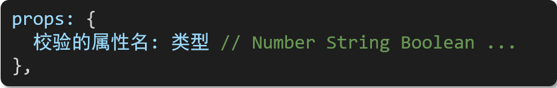
  2. 校验完整语法（类型    **、**    非空、默认值、自定义校验）

     ```js
     props: {
       校验的属性名: {
         type: 类型,  // Number String Boolean ...
         required: true, // 是否必填
         default: 默认值, // 默认值
         validator (value) {
     	  if(自定义校验逻辑) {
     		return true
     	  } else {
     		console.error('自定义错误信息')
     		return false
     	  }
         }
       }
     },
     ```

     <span data-type="text" style="color: var(--b3-font-color8);">default 和 required一般不同时写</span>（因为当时必填项时，肯定是有值的）

     default后面如果是简单类型的值，可以直接写默认。如果是复杂类型的值，则需要以函数的形式return一个默认值

### 6. props&data、单向数据流

- 共同点

  都可以给组件提供数据
- 区别

  1. data 的数据是**自己**的  →   随便改
  2. props 的数据是**外部**的  →   不能直接改，要遵循 **单向数据流**

单向数据流：父级props 的数据更新，会向下流动，影响子组件。这个数据流动是单向的

- 例子

  如果要在子组件修改父组件传进来的数据的话，就要用子传父的方法让父组件去修改数据，而不能在子组件里直接修改

  如图，这是个子组件，但中间的数据是从父组件传过来的，想要完成加减这个操作，就不能直接 count++、count--，就要用到子传父的方法。

  

  父组件 App.vue

  ```html
  <template>
    <div class="app">
      <BaseCount :count="count" @changeCount="change"></BaseCount>
    </div>
  </template>

  <script>
  import BaseCount from './components/BaseCount.vue'
  export default {
    components:{
      BaseCount
    },
    data(){
  	return{
  	  count: 670
  	} 
    },
    methosd: {
  	change(newCount) {
  	  this.count = newCount
  	}
    }
  }
  </script>

  <style>

  </style>
  ```

  子组件 BaseCount.vue

  ```html
  <template>
    <div class="base-count">
      <button @click="sub">-</button>
      <span>{{ count }}</span>
      <button @click="add">+</button>
    </div>
  </template>

  <script>
  export default {
    props: {
      count: Number
    },
    methods: {
  	sub() {
  	  this.$emit('changeCount', this.count - 1)
  	}
  	add() {
  	  this.$emit('changeCount', this.count + 1)
  	}
    }
  }
  </script>

  <style>
  .base-count {
    margin: 20px;
  }
  </style>
  ```


口诀：**谁的数据谁负责**

### 7‍. 总结

1. 父传子

    父组件向子组件标签的自定义属性传递参数，在子组件里用 props 接收参数
2. 子传父

    子组件通过触发事件 this.$emit 并携带 事件名 和 参数，可以触发父组件的子组件标签上的@同名事件，并且参数是子组件发送过来的参数
3. 父传子/孙

    父组件 provide() { return {} } 提供参数，子/孙组件  inject: [ ] 接收参数
4. 同级互传

    创建 event bus 事件总线， 发送方触发 bus.$emit 携带参数，接收方监听 bus.on 接收参数

## 三、[综合案例：小黑记事本（组件版](C:\Users\12625\OneDrive\桌面\vue-demo\vue-demo2)）

- 列表渲染

  1. 提供数据：提供在公共的父组件 App.vue
  2. 通过父传子，将数据传递给TodoMain
  3. 利用v-for进行渲染
- 添加功能

  1. 收集表单数据  v-model
  2. 监听时间 （回车+点击 都要进行添加）
  3. 子传父，将任务名称传递给父组件App.vue
  4. 父组件接受到数据后 进行添加 **unshift**(自己的数据自己负责)
- 删除功能

  1. 监听时间（监听删除的点击）携带id
  2. 子传父，将删除的id传递给父组件App.vue
  3. 进行删除 **filter**  (自己的数据自己负责)
- 底部功能及持久化存储

  1. 底部合计：父组件传递list到底部组件  —>展示合计
  2. 清空功能：监听事件 —> **子组件**通知父组件 —>父组件清空
  3. 持久化存储：watch监听数据变化，持久化到本地

## 四、进阶语法

### 1. v-model原理

v-model 不能用于从父或子传过来的数据绑定。

- 原理

  v-model本质上是一个**语法糖**。例如应用在输入框上，就是 **value属性** 和 **input事件** 的合写

  ```html
  <template>
    <div id="app" >
      <input v-model="msg" type="text">
  	<!-- 上面等价于下面 -->
      <input :value="msg" @input="msg = $event.target.value" type="text">
    </div>
  </template>

  ```
- 作用

  提供数据的双向绑定

  - <span data-type="text" style="color: var(--b3-font-color8);">数据变，视图跟着变 :value</span>
  - <span data-type="text" style="color: var(--b3-font-color8);">视图变，数据跟着变 @input</span>
- 注意

   **$event**<span data-type="text" style="color: var(--b3-font-color8);"> 用于在模板中，获取事件的形参</span>
- v-model使用在其他表单元素上的原理

  不同的表单元素， v-model在底层的处理机制是不一样的。比如给checkbox使用v-model，底层处理的是 checked属性和change事件。

**不过咱们只需要掌握应用在文本框上的原理即可**

### 2. v-model应用于组件

- 请看视频

  [https://www.bilibili.com/video/BV1HV4y1a7n4/?buvid=XU438614F5BE12B4A3085523DEA8CD0D12058](https://www.bilibili.com/video/BV1HV4y1a7n4/?buvid=XU438614F5BE12B4A3085523DEA8CD0D12058&from_spmid=main.my-history.0.0&is_story_h5=false&mid=wouveTrjg5FpaMQQTq6DLA==&p=57&plat_id=122&share_from=ugc&share_medium=android&share_plat=android&share_session_id=e9b21e72-9902-4163-903d-5279fffa8619&share_source=WEIXIN&share_tag=s_i&spmid=united.player-video-detail.0.0&timestamp=1740398071&unique_k=NvYJkbS&up_id=37974444)​[&amp;from_spmid=main.my-history.0.0](https://www.bilibili.com/video/BV1HV4y1a7n4/?buvid=XU438614F5BE12B4A3085523DEA8CD0D12058&from_spmid=main.my-history.0.0&is_story_h5=false&mid=wouveTrjg5FpaMQQTq6DLA==&p=57&plat_id=122&share_from=ugc&share_medium=android&share_plat=android&share_session_id=e9b21e72-9902-4163-903d-5279fffa8619&share_source=WEIXIN&share_tag=s_i&spmid=united.player-video-detail.0.0&timestamp=1740398071&unique_k=NvYJkbS&up_id=37974444)​[&amp;is_story_h5=false](https://www.bilibili.com/video/BV1HV4y1a7n4/?buvid=XU438614F5BE12B4A3085523DEA8CD0D12058&from_spmid=main.my-history.0.0&is_story_h5=false&mid=wouveTrjg5FpaMQQTq6DLA==&p=57&plat_id=122&share_from=ugc&share_medium=android&share_plat=android&share_session_id=e9b21e72-9902-4163-903d-5279fffa8619&share_source=WEIXIN&share_tag=s_i&spmid=united.player-video-detail.0.0&timestamp=1740398071&unique_k=NvYJkbS&up_id=37974444)​[&amp;mid=wouveTrjg5FpaMQQTq6DLA%3D%3D](https://www.bilibili.com/video/BV1HV4y1a7n4/?buvid=XU438614F5BE12B4A3085523DEA8CD0D12058&from_spmid=main.my-history.0.0&is_story_h5=false&mid=wouveTrjg5FpaMQQTq6DLA==&p=57&plat_id=122&share_from=ugc&share_medium=android&share_plat=android&share_session_id=e9b21e72-9902-4163-903d-5279fffa8619&share_source=WEIXIN&share_tag=s_i&spmid=united.player-video-detail.0.0&timestamp=1740398071&unique_k=NvYJkbS&up_id=37974444)​[&amp;p=57](https://www.bilibili.com/video/BV1HV4y1a7n4/?buvid=XU438614F5BE12B4A3085523DEA8CD0D12058&from_spmid=main.my-history.0.0&is_story_h5=false&mid=wouveTrjg5FpaMQQTq6DLA==&p=57&plat_id=122&share_from=ugc&share_medium=android&share_plat=android&share_session_id=e9b21e72-9902-4163-903d-5279fffa8619&share_source=WEIXIN&share_tag=s_i&spmid=united.player-video-detail.0.0&timestamp=1740398071&unique_k=NvYJkbS&up_id=37974444)​[&amp;plat_id=122](https://www.bilibili.com/video/BV1HV4y1a7n4/?buvid=XU438614F5BE12B4A3085523DEA8CD0D12058&from_spmid=main.my-history.0.0&is_story_h5=false&mid=wouveTrjg5FpaMQQTq6DLA==&p=57&plat_id=122&share_from=ugc&share_medium=android&share_plat=android&share_session_id=e9b21e72-9902-4163-903d-5279fffa8619&share_source=WEIXIN&share_tag=s_i&spmid=united.player-video-detail.0.0&timestamp=1740398071&unique_k=NvYJkbS&up_id=37974444)​[&amp;share_from=ugc](https://www.bilibili.com/video/BV1HV4y1a7n4/?buvid=XU438614F5BE12B4A3085523DEA8CD0D12058&from_spmid=main.my-history.0.0&is_story_h5=false&mid=wouveTrjg5FpaMQQTq6DLA==&p=57&plat_id=122&share_from=ugc&share_medium=android&share_plat=android&share_session_id=e9b21e72-9902-4163-903d-5279fffa8619&share_source=WEIXIN&share_tag=s_i&spmid=united.player-video-detail.0.0&timestamp=1740398071&unique_k=NvYJkbS&up_id=37974444)​[&amp;share_medium=android](https://www.bilibili.com/video/BV1HV4y1a7n4/?buvid=XU438614F5BE12B4A3085523DEA8CD0D12058&from_spmid=main.my-history.0.0&is_story_h5=false&mid=wouveTrjg5FpaMQQTq6DLA==&p=57&plat_id=122&share_from=ugc&share_medium=android&share_plat=android&share_session_id=e9b21e72-9902-4163-903d-5279fffa8619&share_source=WEIXIN&share_tag=s_i&spmid=united.player-video-detail.0.0&timestamp=1740398071&unique_k=NvYJkbS&up_id=37974444)​[&amp;share_plat=android](https://www.bilibili.com/video/BV1HV4y1a7n4/?buvid=XU438614F5BE12B4A3085523DEA8CD0D12058&from_spmid=main.my-history.0.0&is_story_h5=false&mid=wouveTrjg5FpaMQQTq6DLA==&p=57&plat_id=122&share_from=ugc&share_medium=android&share_plat=android&share_session_id=e9b21e72-9902-4163-903d-5279fffa8619&share_source=WEIXIN&share_tag=s_i&spmid=united.player-video-detail.0.0&timestamp=1740398071&unique_k=NvYJkbS&up_id=37974444)​[&amp;share_session_id=e9b21e72-9902-4163-903d-5279fffa8619](https://www.bilibili.com/video/BV1HV4y1a7n4/?buvid=XU438614F5BE12B4A3085523DEA8CD0D12058&from_spmid=main.my-history.0.0&is_story_h5=false&mid=wouveTrjg5FpaMQQTq6DLA==&p=57&plat_id=122&share_from=ugc&share_medium=android&share_plat=android&share_session_id=e9b21e72-9902-4163-903d-5279fffa8619&share_source=WEIXIN&share_tag=s_i&spmid=united.player-video-detail.0.0&timestamp=1740398071&unique_k=NvYJkbS&up_id=37974444)​[&amp;share_source=WEIXIN](https://www.bilibili.com/video/BV1HV4y1a7n4/?buvid=XU438614F5BE12B4A3085523DEA8CD0D12058&from_spmid=main.my-history.0.0&is_story_h5=false&mid=wouveTrjg5FpaMQQTq6DLA==&p=57&plat_id=122&share_from=ugc&share_medium=android&share_plat=android&share_session_id=e9b21e72-9902-4163-903d-5279fffa8619&share_source=WEIXIN&share_tag=s_i&spmid=united.player-video-detail.0.0&timestamp=1740398071&unique_k=NvYJkbS&up_id=37974444)​[&amp;share_tag=s_i](https://www.bilibili.com/video/BV1HV4y1a7n4/?buvid=XU438614F5BE12B4A3085523DEA8CD0D12058&from_spmid=main.my-history.0.0&is_story_h5=false&mid=wouveTrjg5FpaMQQTq6DLA==&p=57&plat_id=122&share_from=ugc&share_medium=android&share_plat=android&share_session_id=e9b21e72-9902-4163-903d-5279fffa8619&share_source=WEIXIN&share_tag=s_i&spmid=united.player-video-detail.0.0&timestamp=1740398071&unique_k=NvYJkbS&up_id=37974444)​[&amp;spmid=united.player-video-detail.0.0](https://www.bilibili.com/video/BV1HV4y1a7n4/?buvid=XU438614F5BE12B4A3085523DEA8CD0D12058&from_spmid=main.my-history.0.0&is_story_h5=false&mid=wouveTrjg5FpaMQQTq6DLA==&p=57&plat_id=122&share_from=ugc&share_medium=android&share_plat=android&share_session_id=e9b21e72-9902-4163-903d-5279fffa8619&share_source=WEIXIN&share_tag=s_i&spmid=united.player-video-detail.0.0&timestamp=1740398071&unique_k=NvYJkbS&up_id=37974444)​[&amp;timestamp=1740398071](https://www.bilibili.com/video/BV1HV4y1a7n4/?buvid=XU438614F5BE12B4A3085523DEA8CD0D12058&from_spmid=main.my-history.0.0&is_story_h5=false&mid=wouveTrjg5FpaMQQTq6DLA==&p=57&plat_id=122&share_from=ugc&share_medium=android&share_plat=android&share_session_id=e9b21e72-9902-4163-903d-5279fffa8619&share_source=WEIXIN&share_tag=s_i&spmid=united.player-video-detail.0.0&timestamp=1740398071&unique_k=NvYJkbS&up_id=37974444)​[&amp;unique_k=NvYJkbS](https://www.bilibili.com/video/BV1HV4y1a7n4/?buvid=XU438614F5BE12B4A3085523DEA8CD0D12058&from_spmid=main.my-history.0.0&is_story_h5=false&mid=wouveTrjg5FpaMQQTq6DLA==&p=57&plat_id=122&share_from=ugc&share_medium=android&share_plat=android&share_session_id=e9b21e72-9902-4163-903d-5279fffa8619&share_source=WEIXIN&share_tag=s_i&spmid=united.player-video-detail.0.0&timestamp=1740398071&unique_k=NvYJkbS&up_id=37974444)​[&amp;up_id=37974444](https://www.bilibili.com/video/BV1HV4y1a7n4/?buvid=XU438614F5BE12B4A3085523DEA8CD0D12058&from_spmid=main.my-history.0.0&is_story_h5=false&mid=wouveTrjg5FpaMQQTq6DLA==&p=57&plat_id=122&share_from=ugc&share_medium=android&share_plat=android&share_session_id=e9b21e72-9902-4163-903d-5279fffa8619&share_source=WEIXIN&share_tag=s_i&spmid=united.player-video-detail.0.0&timestamp=1740398071&unique_k=NvYJkbS&up_id=37974444)

### 3. sync修饰符（<span data-type="text" style="color: var(--b3-font-color8);">让父传子更简单了</span>）

- 作用

  <span data-type="text" style="color: var(--b3-font-color8);">可以实现 </span>**子组件**<span data-type="text" style="color: var(--b3-font-color8);"> 与 </span>**父组件数据**<span data-type="text" style="color: var(--b3-font-color8);"> 的 </span>**双向绑定**，简化代码

  简单理解：**子组件可以修改父组件传过来的props值**
- 场景

  封装弹框类的基础组件， visible属性 true显示 false隐藏
- 本质

  .sync修饰符 就是     **:属性名** 和     **@update:属性名** 合写
- 语法

  父组件

  ```html
  //.sync写法
  <BaseDialog :visible.sync="isShow" />
  --------------------------------------
  //完整写法
  <BaseDialog 
    :visible="isShow" 
    @update:visible="isShow = $event" 
  />
  ```

  子组件

  ```js
  props: {
    visible: Boolean
  },
  this.$emit('update:visible', false)
  ```
- 总结

  1. 父组件如果想让子组件修改传过去的值 必须加什么修饰符？
  2. 子组件要修改父组件的props值 必须使用什么语法？

### 4. ref和$refs

- 作用

  利用ref 和 $refs 可以用于 获取 dom 元素 或 组件实例
- 特点

  查找范围 →  <span data-type="text" style="color: var(--b3-font-color8);">当前组件内(更精确稳定)</span>
- 语法

  1. 给要获取的盒子添加ref属性

     ```html
     <div ref="chartRef">我是渲染图表的容器</div>
     ```
  2. 获取时通过 $refs获取  this.\$refs.chartRef 获取

     ```js
     mounted () {
       console.log(this.$refs.chartRef)
     }
     ```
- 注意

  之前只用document.querySelect('.box') 获取的是整个页面中的盒子
- 让子传父更简单了

  在父组件上给子组件添加ref属性

  ```html
  <template>
    <div class="app">
      <BaseChart ref="baseForm"></BaseChart>
  	<button @click="get" >按钮</button>
    </div>
  </template>

  <script>
  import BaseChart from './components/BaseChart.vue'

  export default {
    data: {
  	return {}
    },
    components:{
      BaseChart
    },
    methods: {
    	get() {
  	  console.log(this.$refs.baseForm)	// 获得的是子组件的对象，含有子组件的方法等，就可以调用子组件的方法了
  	}
    }
  }
  </script>

  <style>
  </style>
  ```

### 5. Vue异步更新 和 $nextTick

- 先来看一个场景

  编辑标题,  编辑框自动聚焦

  1. 点击编辑，显示编辑框
  2. 让编辑框，立刻获取焦点

  
- 代码实现

  ```html
  <template>
    <div class="app">
      <div v-if="isShowEdit">
        <input type="text" v-model="editValue" ref="inp" />
        <button>确认</button>
      </div>
      <div v-else>
        <span>{{ title }}</span>
        <button @click="editFn">编辑</button>
      </div>
    </div>
  </template>

  <script>
  export default {
    data() {
      return {
        title: '大标题',
        isShowEdit: false,
        editValue: '',
      }
    },
   methods: {
     editFn() {
       // 显示输入框
       this.isShowEdit = true  
       // 获取焦点
       // this.$refs.inp.focus() 
  	 // 正确写法
       this.$nextTick(() => {
    	   this.$refs.inp.focus()
  	})
    },
  }
  </script> 
  ```
- 问题

  "显示之后"，立刻获取焦点是不能成功的！

  原因：Vue 是异步更新DOM  (提升性能)，<span data-type="text" style="color: var(--b3-font-color8);">没更新完DOM的时候获取不了元素</span>
- 解决方案

  <span data-type="text" style="color: var(--b3-font-color8);">$nextTick：</span>**等 DOM更新后，** <span data-type="text" style="color: var(--b3-font-color8);">才会触发执行此方法里的函数体</span>

  **语法:**     `this.$nextTick(函数体)`​

  ```js
  this.$nextTick(() => {
    this.$refs.inp.focus()
  })
  ```

  **注意：**​<span data-type="text" style="color: var(--b3-font-color8);">$nextTick 内的函数体 一定是</span>**箭头函数**<span data-type="text" style="color: var(--b3-font-color8);">，这样才能让函数内部的this指向Vue实例</span>

# day05-自定义指令&插槽&路由入

## 一、自定义指令

- 指令介绍

  1. 内置指令：**v-html、v-if、v-bind、v-on**... 这都是Vue给咱们内置的一些指令，可以直接使用
  2. 自定义指令：同时Vue也支持让开发者，自己注册一些指令。这些指令被称为**自定义指令**

     每个指令都有自己各自独立的功能

自定义指令概念：自己定义的指令，可以**封装一些DOM操作**，扩展额外的功能。

### 1. 基本语法 (全局&局部注册)

- 全局注册

  ```js
  //在main.js中
  Vue.directive('focus', {
    "inserted" (el) {
      // 可以对 el 标签，扩展额外功能
      el.focus()
    }
  })
  ```

  此时在对应的组件的 `<input>`​ 里使用 v-focus 自定义指令，就可以使自动聚焦
- 局部注册

  ```js
  //在Vue组件的配置项中
  directives: {
    focus: {
      inserted () {
        // 可以对 el 标签，扩展额外功能
        el.focus()
      }
    }
  }
  ```

  此时在组件内 `<input>`​ 里使用 v-focus 自定义指令，就可以使自动聚焦
- 使用指令

  在使用指令的时候，一定要**先注册**，**再使用**，否则会报错。

  使用指令语法： v-指令名。如：`<input type="text"  v-focus/>`​

  **注册**指令时**不用**加**v-前缀**，但**使用时**一定要**加v-前缀**
- 指令中的配置项介绍

  <div>
  <span data-type="text" style="color: var(--b3-font-color8);">inserted:被绑定元素插入父节点时调用的钩子函数</span>
  </div>

  el：使用指令的那个DOM元素

### 2. 指令的值

- 场景

  实现一个 color 指令 - 传入不同的颜色, 给标签设置文字颜色
- 语法

  1. 在绑定指令时，可以通过“等号”的形式为指令 绑定 具体的参数值

     ​`<div v-color="color">我是内容</div>`​
  2. 通过 binding.value 可以拿到指令值，**指令值修改会 触发 update 函数**

     ```html
     <template>
       <div v-color="color1">我是内容</div>
       <div v-color="color2">我是内容</div>
     </template>

     <script>
     export default {
       data() {
         return {
     	  color1: 'pink',
     	  color2: 'green'
     	}
       },
       directives: {
         color: {
           inserted (el, binding) {
             el.style.color = binding.value		// binding.value 就是被传的值
           },
     	  // 自定义指令的值被修改后不能更新到视图当中，所以要自己做成响应式的
           update (el, binding) {		// update：指令的值被修改时触发，也是一个钩子函数
             el.style.color = binding.value
           }
         }
       }
     }
     </script>

     <style>

     </style>
     ```

### 3. v-loading 指令封装

- 场景

  实际开发过程中，发送请求需要时间，在请求的数据未回来时，页面会处于**空白状态**  =>  用户体验不好
- 需求

  封装一个 v-loading 指令，实现加载中的效果
- 分析

  1. 本质 loading效果就是一个蒙层，盖在了盒子上
  2. 数据请求中，开启loading状态，添加蒙层
  3. 数据请求完毕，关闭loading状态，移除蒙层
- 实现

  1. 准备一个 loading类，通过伪元素定位，设置宽高，实现蒙层
  2. 开启关闭 loading状态（添加移除蒙层），本质只需要添加移除类即可
  3. 结合自定义指令的语法进行封装复用
- [案例](C:\Users\12625\OneDrive\桌面\前端\3.Vue开发\2、最新Vue2+3%20入门到实战课程\01-随堂代码&素材\day05\准备代码\封装v-loading\1.html)

## 二、插槽

### 1. 默认插槽

- 作用

  让组件内部的一些 **结构** 支持 **自定义**

  
- 需求

  将需要多次显示的对话框，封装成一个组件
- 问题

  组件的内容部分，**不希望写死**，希望能使用的时候**自定义**。怎么办
- 插槽的基本语法

  1. 组件内需要定制的结构部分，改用     **&lt;**​****​****​********​********​****​****​**slot** **&gt;**​ **&lt;**​   **/slot**   **&gt;**      ****  占位
  2. 使用组件时，    **&lt;**​****​****​********​********​****​****​**MyDialog** **&gt;**​ **&lt;**​   **/MyDialog**   **&gt;**     标签内部, 传入结构替换slot
  3. 给插槽传入内容时，可以传入**纯文本、html标签、组件**

  

### 2. 后备内容（插槽的默认值）

- 问题

  通过插槽完成了内容的定制，传什么显示什么, 但是如果不传，则是空白

  

  能否给插槽设置 默认显示内容 呢？
- 插槽的后备内容

  封装组件时，可以为预留的 `<slot>`​ 插槽提供后备内容（默认内容）。
- 语法

  在 <slot> 标签内，放置内容, 作为默认显示内容

  
- 效果

  - 外部使用组件时，不传东西，则slot会显示后备内容

    
  - 外部使用组件时，传东西了，则slot整体会被换掉

    

### 3. 具名插槽

- 需求

  一个组件内有多处结构，需要外部传入标签，进行定制 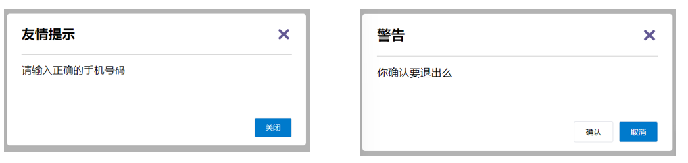

  上面的弹框中有**三处不同**，但是**默认插槽**只能**定制一个位置**，这时候怎么办呢?
- 具名插槽语法

  - 多个slot使用name属性区分名字

    

    - template配合v-slot:名字来分发对应标签

      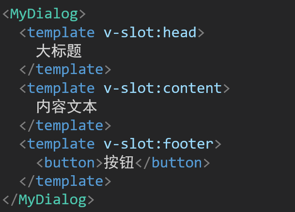
- v-slot的简写

  v-slot写起来太长，vue给我们提供一个简单写法 **​**​**​**​**​**​**​`v-slot:`​**​**​**​**​**​**​** ​     **→**      **​** **​** **​**​ **​`#`​**​**​**​**​**​**​** ​

### 4. 作用域插槽

- 插槽分类

  - 默认插槽
  - 具名插槽

  插槽只有两种，作用域插槽不属于插槽的一种分类
- 作用

  定义slot 插槽的同时, 是可以**传值**的。给 **插槽** 上可以 **绑定数据**，将来 **使用组件时可以用**
- 场景

  封装表格组件

  
- 使用步骤

  1. 给 slot 标签, 以 添加属性的方式 **给父组件传值**

     ```html
     <slot :id="item.id" msg="测试文本"></slot>
     ```
  2. 所有添加的属性, 都会被收集到一个对象中

     ```js
     { id: 3, msg: '测试文本' }
     ```
  3. 在template中, 通过 ` #插槽名= "obj"`​ 接收，默认插槽名为 default

     ```html
     <MyTable :list="list">
       <template #default="obj">
         <button @click="del(obj.id)">删除</button>
       </template>
     </MyTable>
     ```

## 三、[综合案例：商品列表](C:\Users\12625\OneDrive\桌面\vue-demo\vue-demo3)

MyTag 组件封装

MyTable 组件封装

## 四、路由入门

### 1. 单页应用程序

- 概念

  单页应用程序：SPA【Single Page Application】是指<span data-type="text" style="color: var(--b3-font-color8);">所有的功能都在</span>​**一个html页面**​<span data-type="text" style="color: var(--b3-font-color8);">上实现</span>
- 具体示例

  单页应用网站： 网易云音乐  [https://music.163.com/](https://music.163.com/)

  多页应用网站：京东 [ https://jd.com/](https://jd.com/)
- 单页应用 VS 多页面应用

  

  单页应用类网站：系统类网站 / 内部网站 / 文档类网站 / 移动端站点

  多页应用类网站：公司官网 / 电商类网站

### 2. 路由概念

- 思考

  单页面应用程序，之所以开发效率高，性能好，用户体验好

  最大的原因就是：**页面按需更新**

  

  比如当点击【发现音乐】和【关注】时，**只是更新下面部分内容**，对于头部是不更新的

  要按需更新，首先就需要明确：**访问路径**和 **组件**的对应关系！

  访问路径 和 组件的对应关系如何确定呢？ **路由**
- 路由的介绍

  生活中的路由：设备和ip的映射关系

  

  <div>
  <span data-type="text" style="color: var(--b3-font-color8);">Vue中的路由：</span>**路径和组件**<span data-type="text" style="color: var(--b3-font-color8);">的</span>**映射**<span data-type="text" style="color: var(--b3-font-color8);">关系</span>
  </div>

  

### 3. VueRouter 的基本使用

说明：Vue 官方的一个路由插件，是一个第三方包

官网：[https://v3.router.vuejs.org/zh/](https://v3.router.vuejs.org/zh/)

- 作用

  **修改**地址栏路径时，**切换显示**匹配的**组件**
- VueRouter使用步骤（5+2）

  固定5个固定的步骤（不用死背，熟能生巧）

  1. 下载 VueRouter 模块到当前工程，版本3.6.5（Vue2版本）

     **yarn add vue-router@3.6.5** 或 **npm install vue-router@3.6.5**
  2. main.js中引入VueRouter

     ```js
     import VueRouter from 'vue-router'
     ```
  3. 安装注册

     ```js
     Vue.use(VueRouter)
     ```
  4. 创建路由对象

     ```js
     const router = new VueRouter()
     ```
  5. 注入，将路由对象注入到new Vue实例中，建立关联

     ```js
     new Vue({
       render: h => h(App),
       router:router
     }).$mount('#app')

     ```

  当我们配置完以上5步之后 就可以看到浏览器地址栏中的路由 变成了 /#/的形式。表示项目的路由已经被Vue-Router管理了

  
- 代码示例

  main.js

  ```js
  // 2. 引入
  import VueRouter from 'vue-router'
  // 3. 安装注册 Vue.use(Vue插件)
  Vue.use(VueRouter) // VueRouter插件初始化
  // 4. 创建路由对象
  const router = new VueRouter()

  new Vue({
    render: h => h(App),
    // 5. 注入到new Vue中，建立关联
    router
  }).$mount('#app')
  ```
- 两个核心步骤

  > 组件名字得用至少两个单词组合，如果非要一个单词，就要在下面写生那么属性，值得是两个单词组合的。
  >
  > ```js
  > export default {
  >   name: 'TableCase',
  > }
  > ```
  >

  1. 创建需要的组件 (views目录)，配置路由规则

     

  > 路由里面嵌套路由
  >
  > ```js
  > // 通过 children 配置项，可以配置嵌套子路由
  > // 1. 在 children 配置项中配规则
  > // 2. 在一级路由的组件里准备二级路由出口
  > routes: [
  > 	{
  > 		path: '路径',
  > 		component: 组件名，
  > 		children：[
  > 			{
  > 				path: '路径',
  > 				component: 组件名
  > 			}
  > 		]
  > 	}
  > ]
  > ```
  >

  2. 配置导航，配置路由出口(路径匹配的组件显示的位置)

     App.vue

     ```html
     <div class="footer_wrap">
       <a href="#/find">发现音乐</a>
       <a href="#/my">我的音乐</a>
       <a href="#/friend">朋友</a>
     </div>
     <div class="top">
       <!-- 路由出口，匹配的组件所展示的位置 -->
       <router-view></router-view>
     </div>
     ```

### 4. 组件目录存放问题

注意：     **.vue文件** 本质无区别

- 组件分类

  .vue文件分为2类，都是     **.vue文件（本质无区别）**

  - 页面组件 （配置路由规则时使用的组件）
  - 复用组件（多个组件中都使用到的组件）

  
- 存放目录

  分类开来的目的就是为了 **更易维护**

  1. src/views文件夹

     页面组件 - 页面展示 - 配合路由用
  2. src/components文件夹

     复用组件 - 展示数据 - 常用于复用

### 5. 路由的封装抽离

问题：所有的路由配置都在main.js中合适吗？

目标：将路由模块抽离出来。  好处：**拆分模块，利于维护**


- 代码示范

  1. 在src目录建一个router目录，再建一个index.js文件

     ```js
     import Vue from 'vue'
     // 引入组件
     import Find from '@/views/Find'
     // 引入
     import VueRouter from 'vue-router'
     // 安装注册 Vue.use(Vue插件，初始化)
     Vue.use(VueRouter)
     // 创建路由对象
     const router = new VueRouter()
     // 导出
     export default router
     ```
  2. ```js
      // 5. 注入到new Vue中，建立关联
      import Vue from 'vue'
      import App from './App.vue'
      // 引入
      import VueRouter from './router/index,js'

      Vue.config.productionTip = false

      new Vue({
        render: h => h(App),
        router
      }).$mount('#app')
     ```

路径简写：**脚手架环境下**​<span data-type="text" style="color: var(--b3-font-color8);"> @指代src目录</span>，可以用于快速引入组件

# day06-路由进阶

## 一、路由进阶

### 1. 声明式导航

- #### 声明式导航 - 导航链接

  - 需求

    实现导航高亮效果

    

    如果使用a标签进行跳转的话，需要给当前跳转的导航加样式，同时要移除上一个a标签的样式，太麻烦！！！
  - 解决方案

    vue-router 提供了一个全局组件 router-link (取代 a 标签)

    - **能跳转**，配置 to 属性指定路径(**必须**) 。本质还是 a 标签 ，**to 无需 #**
    - **能高亮**，默认就会提供**高亮类名**，可以直接设置高亮样式

    语法： `<router-link to="path">发现音乐</router-link>`​

    ```html
      <div>
        <div class="footer_wrap">
          <router-link to="/find">发现音乐</router-link>
          <router-link to="/my">我的音乐</router-link>
          <router-link to="/friend">朋友</router-link>
        </div>
        <div class="top">
          <!-- 路由出口 → 匹配的组件所展示的位置 -->
          <router-view></router-view>
        </div>
      </div>
    ```
  - 通过router-link自带的两个样式进行高亮

    使用router-link跳转后，我们发现。当前点击的链接默认加了两个class的值

    ​`router-link-exact-active`​ 和 `router-link-active`​

    我们可以给任意一个class属性添加高亮样式即可实现功能，如在css里添加

    `a.router-link-exact-active { background-color: pink; }`​
- #### 声明式导航 - 两个类名

  当我们使用 `<router-link></router-link>`​  跳转时，自动给当前导航加了**两个类名**

  

  1. router-link-active

     **模糊匹配（用的多）**

     ​`to="/my"`​  可以匹配  `/my`​    `/my/a`​    `/my/b`​    ....

     只要是以 `/my`​ 开头的路径 都可以和 `to="/my"`​ 匹配到
  2. router-link-exact-active

     **精确匹配**

     ​`to="/my"`​ 仅可以匹配  `/my`​
  3. 在地址栏中输入二级路由查看类名的添加
- #### 声明式导航-自定义类名（了解）

  - 问题

    router-link的**两个高亮类名 太长了**，我们希望能定制怎么办

    
  - 解决方案

    我们可以在创建路由对象时，额外配置两个配置项即可。 `linkActiveClass`​  和 `linkExactActiveClass`​

    ```js
    const router = new VueRouter({
      routes: [...],
      linkActiveClass: "类名1",
      linkExactActiveClass: "类名2"
    })
    ```

    
  - 代码演示

    ```js
    // 创建了一个路由对象
    const router = new VueRouter({
      routes: [
        ...
      ], 
      linkActiveClass: 'active', // 配置模糊匹配的类名
      linkExactActiveClass: 'exact-active' // 配置精确匹配的类名
    })
    // 然后再css里写 a.active { background-color: pink; } 
    // 或 a.exact-active { background-color: pink; }
    ```

### 2. 声明式导航 - 跳转传参 ( 查询参数传参 & 动态路由传参)

我们可以通过两种方式，在跳转的时候把所需要的参数传到其他页面中

- #### 查询参数传参

  - 目标

    在跳转路由时，进行传参

    

    比如：现在我们在搜索页点击了热门搜索链接，跳转到详情页，**需要把点击的内容带到详情页**，改怎么办呢？

  如何传参？​`<router-link to="/path?参数名=值"></router-link>`​

  如何接受参数？固定用法：`{{ $route.query.参数名 }}`​

  - 使用参数

    在DOM元素里使用参数直接：`{{ $route.query.参数名 }}`​

    充当标签属性值的话应该是不用写this.：`"$route.query.参数名"`​

    在Vue函数里用的话需要写this.：`this.$route.query.参数名`​
- #### 动态路由传参

  - 配置动态路由

    > 动态路由后面的参数可以随便起名，但要有语义
    >

    ```js
    const router = new VueRouter({
      routes: [
        ...,
        { 
          path: '/search/:参数名', 	// 冒号不能丢
          component: Search 
        }
      ]
    })
    ```
  - 配置导航链接

    ​`to="/path/参数值"`​，就不用写 `?参数名=`​  了
  - 对应页面组件**接受参数**

    ​`$route.params.参数名`​

    > params 后面的 `参数名`​ 要和动态路由配置的 `参数名`​ 保持一致
    >
- #### 查询参数传参 VS 动态路由传参

  1. 查询参数传参  (比较适合传**多个参数**)

     跳转：`to="/path?参数名1=值&参数名2=值"`​

     获取：`$route.query.参数名`​
  2. 动态路由传参 (**优雅简洁**，**传单个参数**比较方便)

     配置动态路由：path: "/path/:参数名"

     跳转：to="/path/参数值"

     获取：$route.params.参数名

     注意：动态路由也可以传多个参数，但一般只传一个
- #### 动态路由参数的可选符(了解)

  - 问题

    配了路由 `path:"/search/:words"`​ 为什么按下面步骤操作，会未匹配到组件，显示空白？

    
  - 原因

    ​`/search/:words`​  表示，**必须要传参数**。如果不传参数，也希望匹配，可以加个可选符"？"

    ```js
    const router = new VueRouter({
      routes: [
     	...
        { path: '/search/:words?', component: Search }
      ]
    })
    ```

### 4. 路由重定向

- 问题

  网页打开时， url 默认是 / 路径，未匹配到组件时，会出现空白

  
- 解决方案

  **重定向** → 匹配 / 后, 强制跳转 /home 路径
- 语法

  ```js
  { path: 匹配路径, redirect: 重定向到的路径 },
  比如：
  const router = new VueRouter({
    routes: [
      { path: '/', redirect: '/home'},
   	 ...
    ]
  })

  ```

### 5. 路由404

作用：当路径找不到匹配时，给个提示页面

位置：404的路由，虽然配置在任何一个位置都可以，但一般都**配置在其他路由规则的最后面**

- 语法

  path: "*"   (任意路径) – 前面不匹配就命中最后这个

  ```js
  import NotFind from '@/views/NotFind'

  const router = new VueRouter({
    routes: [
      ...
      { path: '*', component: NotFind } 	//最后一个
    ]
  })
  ```

### 6. 路由模式

- 问题

  路由的路径看起来不自然, 有#，能否切成真正路径形式?

  - hash路由(默认)        例如:  http://localhost:8080/#/home
  - history路由(常用)     例如: http://localhost:8080/home   (以后上线需要服务器端支持，开发环境webpack给规避掉了history模式的问题)
- 语法

  ```js
  const router = new VueRouter({
      mode:'histroy', //默认是hash
      routes:[]
  })
  ```

### 7. 编程式导航-两种路由跳转方式

> - 注册点击事件跳转传参
>
>   1. 查询参数传参
>
>      1. ​`@click="$router.push('路径?参数名=参数值&参数名=参数值')"`​
>      2. 获取就是 `$router.query.参数名`​
>   2. 动态路由传参
>
>      1. 在 index.js 中改路由规则，在路径后面加 `:参数名`​​
>      2. ​`@click="$router.push('路径/(动态的参数名)')"`​​
>      3. 获取就是 `$router.params.参数名`​​
> - 跳转之后返回上一页
>
>   ​`@click="$router.back()"`​
>
>   ​`@click="$router.go(-1)"`​

- 问题

  点击按钮跳转如何实现？

  

方案：编程式导航：用JS代码来进行跳转

- 两种语法：

  - path 路径跳转 （简易方便）
  - name 命名路由跳转 (适合 path 路径长的场景)
- path路径跳转语法

  特点：简易方便

  ```js
  //简单写法
  this.$router.push('路由路径')

  //完整写法
  this.$router.push({
    path: '路由路径'
  })
  ```

5.代码演示 path跳转方式

- name命名路由跳转

  特点：适合 path 路径长的场景

语法：

- 路由规则，必须配置name配置项（在routes: [  ]里）

  ```js
  { name: '路由名', path: '/path/xxx', component: XXX },
  ```
- 通过name来进行跳转

  ```js
  this.$router.push({
    name: '路由名'
  })
  ```

### 8. 编程式导航传参 ( 查询参数传参 & 动态路由传参)

1.path路径跳转

- query传参

  ```js
  this.$router.push('/路径?参数名1=参数值1&参数2=参数值2')
  this.$router.push({
    path: '/路径',
    query: {
      参数名1: '参数值1',
      参数名2: '参数值2'
    }
  })
  ```
- 动态路由传参

  ```js
  this.$router.push('/路径/参数值')
  this.$router.push({
    path: '/路径/参数值'
  })
  ```

2.name命名路由跳转

- query传参

  ```js
  this.$router.push({
    name: '路由名字',
    query: {
      参数名1: '参数值1',
      参数名2: '参数值2'
    }
  })
  ```
- 动态路由传参 (需要配动态路由)

  ```js
  this.$router.push({
    name: '路由名字',
    params: {
      参数名: '参数值',
    }
  })
  ```

## 二、综合案例：面经基础版

一级路由

二级路由

导航高亮

请求渲染

路由传参

- 缓存组件

  - 问题

    从面经列表 点到 详情页，又点返回，数据重新加载了 →  **希望回到原来的位置**

    
  - 原因

    当路由被**跳转**后，原来所看到的组件就**被销毁**了（会执行组件内的beforeDestroy和destroyed生命周期钩子），**重新返回**后组件又被**重新创建**了（会执行组件内的beforeCreate,created,beforeMount,Mounted生命周期钩子），**所以数据被加载了**
  - 解决方案

    利用keep-alive把原来的组件给缓存下来
  - 什么是 keep-alive

    keep-alive 是 Vue 的内置组件，当它包裹动态组件时，**会缓存不活动的组件实例，而不是销毁**它们。

    keep-alive 是一个抽象组件：它自身不会渲染成一个 DOM 元素，也不会出现在父组件中。

    **优点：**

    在组件切换过程中把切换出去的组件保留在内存中，防止重复渲染DOM，

    减少加载时间及性能消耗，提高用户体验性。

    App.vue

    ```vue
    <template>
      <div class="h5-wrapper">
        <keep-alive>
          <router-view></router-view>
        </keep-alive>
      </div>
    </template>
    ```

    但是所有被切换的组件都缓存了
  - keep-alive的三个属性

    1. include  只有匹配的组件**会被缓存**

       include**前面加冒号**的话，值就得是**组件名的数组**

       如果**没有冒号**，值就直接写成**组件名**
    2. exclude  任何匹配的组件都**不会被缓存**

       exclude**前面加冒号**的话，值就得是**组件名的数组**

       如果**没有冒号**，值就直接写成**组件名**
    3. max  最多可以**缓存多少**组件实例

    App.vue

    ```html
    <template>
      <div class="h5-wrapper">
        <keep-alive :include="['LayoutPage']">
          <router-view></router-view>
        </keep-alive>
      </div>
    </template>
    ```
  - 额外的两个生命周期钩子

    组件**缓存后**就**不会执行**组件的**created, mounted, destroyed** 等钩子了

    **keep-alive的使用会触发两个生命周期函数**

    **activated** 当组件被激活（使用）的时候触发 →  进入这个页面的时候触发

    **deactivated** 当组件不被使用的时候触发      →  离开这个页面的时候触发

    所以其提供了**actived 和 deactived** 钩子，帮我们实现业务需求。

## 三、VueCli 自定义创建项目


- 创建项目时选自定义

  ```js
  Vue CLI v5.0.8
  ? Please pick a preset:
    Default ([Vue 3] babel, eslint)
    Default ([Vue 2] babel, eslint)
  > Manually select features     选自定义
  ```
- 手动选择功能

  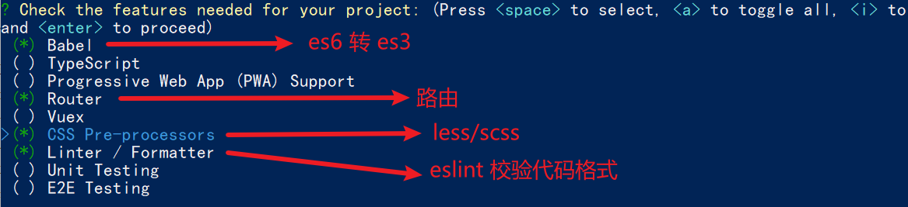
- 选择vue的版本

  ```jsx
    3.x
  > 2.x
  ```
- 是否使用history模式

  
- 选择css预处理

  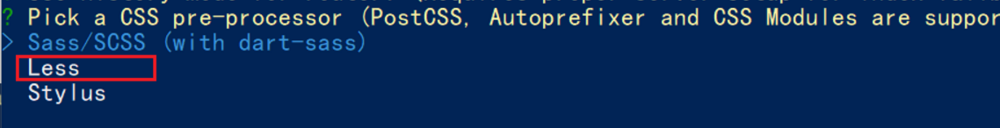
- 选择eslint的风格 （eslint 代码规范的检验工具，检验代码是否符合规范）

  

  - 比如：const age = 18;   =>  报错！多加了分号！后面有工具，一保存，全部格式化成最规范的样子
- 选择校验的时机 （直接回车）

  
- 选择配置文件的生成方式 （直接回车）

  
- 是否保存预设，下次直接使用？  =>   不保存，输入 N

  
- 等待安装，项目初始化完成

  

## 四、ESlint代码规范及手动修复

代码规范：一套写代码的约定规则。例如：赋值符号的左右是否需要空格？一句结束是否是要加;？...

ESLint:是一个代码检查工具，用来检查你的代码是否符合指定的规则(你和你的团队可以自行约定一套规则)。在创建项目时，我们使用的是 [JavaScript Standard Style](https://standardjs.com/readme-zhcn.html) 代码风格的规则。

### 1. JavaScript Standard Style 规范说明

建议把：[https://standardjs.com/rules-zhcn.html](https://standardjs.com/rules-zhcn.html) 看一遍，然后在写的时候,  遇到错误就查询解决。

下面是这份规则中的一小部分：

- *字符串使用单引号* – 需要转义的地方除外
- *无分号* – [这](http://blog.izs.me/post/2353458699/an-open-letter-to-javascript-leaders-regarding)​[没什么不好。](http://inimino.org/~inimino/blog/javascript_semicolons)​[不骗你！](https://www.youtube.com/watch?v=gsfbh17Ax9I)
- *关键字后加空格* `if (condition) { ... }`​
- *函数名后加空格* `function name (arg) { ... }`​
- 坚持使用全等 `===` 摒弃 `==` 一但在需要检查 `null || undefined` 时可以使用 `obj == null`​
- ......

### 2.代码规范错误

如果你的代码不符合standard的要求，eslint会跳出来刀子嘴，豆腐心地提示你。

你将会看在控制台中输出如下错误：


> eslint 是来帮助你的。心态要好，有错，就改。

### 3.手动修正

根据错误提示来一项一项手动修正。

如果你不认识命令行中的语法报错是什么意思，你可以根据错误代码（func-call-spacing, space-in-parens,.....）去 ESLint 规则列表中查找其具体含义。

打开 [ESLint 规则表](https://zh-hans.eslint.org/docs/latest/rules/)，使用页面搜索（Ctrl + F）这个代码，查找对该规则的一个释义。

### 4. 通过eslint插件来实现自动修正

> 1. eslint会自动高亮错误显示
> 2. 通过配置，eslint会自动帮助我们修复错误

- 如何安装

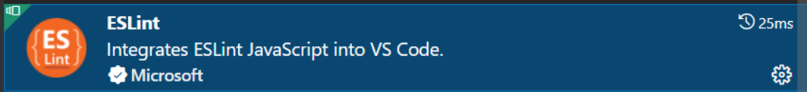

- 如何配置（在VSCode设置右上角第一个按钮“打开设置”）

```js
// 当保存的时候，eslint自动帮我们修复错误
"editor.codeActionsOnSave": {
    "source.fixAll": "explicit"
},
// 保存代码，不自动格式化
"editor.formatOnSave": false
```

- 注意：eslint的配置文件必须在根目录下，这个插件才能才能生效。打开项目必须以根目录打开，一次打开一个项目
- 注意：使用了eslint校验之后，把vscode带的那些格式化工具全禁用了 Beatify

# day07-Vuex的基本使用

## 一、[Vuex](https://vuex.vuejs.org/zh/) 概述

### 1. [Vuex](https://vuex.vuejs.org/zh/) 是什么

Vuex 是一个 Vue 的 状态管理工具，状态就是数据。

大白话：Vuex 是一个插件，可以帮我们管理 Vue 通用的数据 (多组件共享的数据)。例如：购物车数据   个人信息数

### 2. 使用场景

- 某个状态 在 很多个组件 来使用 (个人信息)
- 多个组件 共同维护 一份数据 (购物车)


### 3.优势

- 共同维护一份数据，**数据集中化管理**
- **响应式变化**
- 操作简洁 (vuex提供了一些辅助函数)


### 4.注意：

官方原文：

- 不是所有的场景都适用于vuex，只有在必要的时候才使用vuex
- 使用了vuex之后，会附加更多的框架中的概念进来，增加了项目的复杂度  （数据的操作更便捷，数据的流动更清晰）

Vuex就像《近视眼镜》, 你自然会知道什么时候需要用它~

## 二、多组件共享数据

- 效果是三个组件共享一份数据:

  - 任意一个组件都可以修改数据
  - 三个组件的数据是同步的

### 1. 创建Vuex仓库


1. 安装 vuex

   安装vuex与vue-router类似，vuex是一个独立存在的插件，如果脚手架初始化没有选 vuex，就需要额外安装。

   **yarn add vuex@3** 或者 **npm i vuex@3**
2. 新建 store/index.js 专门存放 vuex

   为了维护项目目录的整洁，在src目录下新建一个store目录其下放置一个index.js文件。 (和 router/index.js 类似)
   
3. 创建仓库 store/index.js

   ```jsx
   // 导入 vue
   import Vue from 'vue'
   // 导入 vuex
   import Vuex from 'vuex'
   // vuex也是vue的插件, 需要use一下, 进行插件的安装初始化
   Vue.use(Vuex)

   // 创建仓库 store
   const store = new Vuex.Store()

   // 导出仓库
   export default store
   ```
4. 在 main.js 中导入挂载到 Vue 实例上

   ```js
   import Vue from 'vue'
   import App from './App.vue'
   import store from './store'

   Vue.config.productionTip = false

   new Vue({
     render: h => h(App),
     store
   }).$mount('#app')
   ```

   此刻起, 就成功创建了一个 **空仓库!!**
5. 测试打印Vuex

   App.vue

   ```js
   created(){
     console.log(this.$store)
   }
   ```

### 2. Vuex 仓库 数据state

- #### 提供数据

  State提供唯一的公共数据源，所有共享的数据都要统一放到Store中的State中存储。

  打开项目中的store.js文件，在state对象中可以添加我们要共享的数据。

  ```jsx
  // 创建仓库 store
  const store = new Vuex.Store({
    // state 状态, 即数据, 类似于vue组件中的data,
    // 区别：
    // 1.data 是组件自己的数据, 
    // 2.state 中的数据整个vue项目的组件都能访问到
    state: {
      count: 101
    }
  })
  ```
- #### 访问 Vuex 中的数据

  1. 通过 store 直接访问

     模板中：`{{ $store.state.xxx }}`​
     组件逻辑中：`this.$store.state.xxx`​
     JS模块中：`store.state.xxx`​
  2. 通过辅助函数 mapState 映射计算属性  —>  {{ count  }}，获取 state中的数据

     每次都像这样一个个的提供计算属性, 太麻烦了,我们有没有简单的语法帮我们获取state中的值呢？

     mapState 是辅助函数，帮助我们把store中的数据映射到 组件的计算属性中, 它属于一种方便的用法

     

     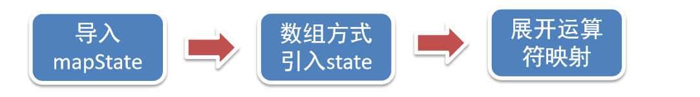

     用法 ：

     1. 第一步：在要访问 Vuex 数据的组件里导入mapState (mapState是vuex中的一个函数)

        ​`import { mapState } from 'vuex'`​
     2. 第二步：采用数组形式引入state属性

        ​`mapState(['count', 'title'])`​

        > 上面代码的最终得到的是 **类似于**
        >
        > ```js
        > count () {
        >     return this.$store.state.count
        > }
        > title () {
        >     return this.$store.state.title
        > }
        > ```
        >
     3. 第三步：利用**展开运算符**将导出的状态映射给计算属性

        ```js
          computed: {
            ...mapState(['count', 'title'])
          }
        ```

        ```html
         <div>state的数据：{{ count }}、{{ title }}</div>
        ```

## 三、修改数据

### 1. Vuex 严格模式

Vuex 同样遵循单向数据流，组件中不能直接修改仓库的数据

- 直接在组件中修改 Vuex 中state的值

  ​`this.$store.state.count++`​ 这样也可以实现，但不能这样写，这样是错误的，没开严格模式是不会报错的。
- 严格模式

  通过 `strict: true`​ 可以开启严格模式,开启严格模式后，直接修改 state 中的值会报错

  > **state数据的修改只能通过mutations，并且mutations必须是同步的**
  >

  

### 2. 核心概念-mutations

- 定义mutations，mutations是一个对象，对象中存放修改state的方法

  ```js
  const store  = new Vuex.Store({
    state: {
      count: 0
    },
    // 定义mutations
    mutations: {
       // 方法里参数 第一个参数是当前store的state属性
       // payload 载荷 运输参数 调用mutaiions的时候 可以传递参数 传递载荷
       addCount (state) {
         state.count += 1
       }
    }
  })
  ```
- 组件中提交 mutations，就可以调用仓库中的 mutation 里的方法，来修改数据

  ​`this.$store.commit('addCount')`​

### 3. 带参数的 mutations


如果按照上面不传参写法，那比如 +1，+5，+10，要在 Vuex 的 mutations 中写3个方法，如果可以传参的话就好了，写1个方法就够用了

- 提交 mutation 是可以传递参数的

  ​`this.$store.commit('方法名', n)`​
- 提供mutation函数（带参数）

  ```js
  mutations: {
    addCount (state, n) {		// 第一个参数永远都是state，第二个参数就是传进来的
      state.count += n
    }
  },
  ```
- 提交的参数只能是一个, 如果有多个参数要传, 可以传递一个对象

  ​`this.$store.commit('方法名', { count: 10 })`​

  ```js
  mutations: {
    addCount (state, obj) {		
      state.count += obj.count
    }
  }
  ```

### 4. Vuex 中的值和组件中的 input 双向绑定

实时输入，实时更新，巩固 mutations 传参语法


- 实现步骤

  
- 代码实现

  App.vue

  ```html
  <input :value="count" @input="handleInput" type="text">

  <script>
  export default {
    methods: {
      handleInput (e) {
        // 1. 实时获取输入框的值
        const num = +e.target.value
        // 2. 提交mutation，调用mutation函数
        this.$store.commit('changeCount', num)
      }
    }
  }
  </script>
  ```

  store/index.js

  ```js
  mutations: { 
     changeCount (state, newCount) {
        state.count = newCount
     }
  },
  ```

### <span data-type="text" style="color: var(--b3-font-color8);">5. 辅助函数 - mapMutations</span>

mapMutations 和 mapState很像，它把位于 mutations 中的方法提取了出来，我们可以将它导入

```js
import  { mapMutations } from 'vuex'
export default {
  methods: {
      ...mapMutations(['addCount'])
  }
}

```

> 上面代码的含义是将 mutations 的方法导入了 methods 中，等价于
>
> ```js
> methods: {
>       // commit(方法名, 载荷参数)
>       addCount () {
>           this.$store.commit('addCount')
>       }
>  }
> ```

此时，就可以直接通过this.addCount调用了

```html
<button @click="addCount">值+1</button>
```

但是请注意： Vuex中mutations中要求不能写异步代码，如果有异步的ajax请求，应该放置在actions中

### 6. 核心概念 - actions

> state是存放数据的，mutations是同步更新数据 (便于监测数据的变化, 更新视图等, 方便于调试工具查看变化)，
>
> actions则负责进行异步操作

**说明：**​****​****​********​********​****​****​****​****​****​****​********​********​****​****​**mutations必须是同步的**

**需求: 一秒钟之后, 要给一个数 去修改state**


- **定义actions**

  ```js
  mutations: {
    changeCount (state, newCount) {
      state.count = newCount
    }
  }


  actions: {
    setAsyncCount (context, num) {
      // 一秒后, 给一个数, 去修改 num
      setTimeout(() => {
        context.commit('changeCount', num)
      }, 1000)
    }
  },
  ```
- **组件中通过dispatch调用**

  ```js
  setAsyncCount () {
    this.$store.dispatch('setAsyncCount', 666)
  }
  ```


### <span data-type="text" style="color: var(--b3-font-color8);">7. 辅助函数 - mapActions</span>

> mapActions 是把位于 actions中的方法提取了出来，映射到组件methods中

```js
import { mapActions } from 'vuex'
export default {
  methods: {
      ...mapActions(['changeCountAction'])
  }
}
```

直接通过 this.方法 就可以调用

```vue
<button @click="changeCountAction(200)">+异步</button>
```

### 8. 核心概念 - getters

> 除了state之外，有时我们还需要从 state 中**筛选出符合条件的一些数据**，这些数据是依赖 state 的，此时会用到 getters

- 例如，state中定义了list，为1-10的数组

  ```js
  state: {
      list: [1, 2, 3, 4, 5, 6, 7, 8, 9, 10]
  }
  ```

  组件中，需要显示所有大于5的数据，正常的方式，是需要list在组件中进行再一步的处理，但是getters可以帮助我们实现它
- 定义getters

  getters函数的第一个参数是 state，必须要有返回值

  ```js
    getters: {
       filterList:  state =>  state.list.filter(item => item > 5)
    }
  ```
- 使用getters

  1. 原始方式 - $store

     ```html
     <div>{{ $store.getters.filterList }}</div>
     ```
  2. 辅助函数 - mapGetters

     ```js
     computed: {
         ...mapGetters(['filterList'])
     }
     ```

     ```html
      <div>{{ filterList }}</div>
     ```

### 9. 使用小结


## 四、Vuex 模块化

### 1. 核心概念 - module

- 问题

  由于使用**单一状态树**，应用的所有状态**会集中到一个比较大的对象**。当应用变得非常复杂时，store 对象就有可能变得相当臃肿。

  这句话的意思是，如果把所有的状态都放在state中，当项目变得越来越大的时候，Vuex会变得越来越难以维护

  由此，又有了Vuex的模块化

  
- 准备 state

  定义两个模块   **user** 和  **setting**

  - user中管理用户的信息状态  userInfo  `modules/user.js`​

    ```jsx
    const state = {
      userInfo: {
        name: 'zs',
        age: 18
      }
    }

    const mutations = {}
    const actions = {}
    const getters = {}

    // 导出
    export default {
      state,
      mutations,
      actions,
      getters
    }

    ```
  - setting中管理项目应用的  主题色 theme，描述 desc， `modules/setting.js`​

    ```jsx
    const state = {
      theme: 'dark'
      desc: '描述真呀真不错'
    }

    const mutations = {}
    const actions = {}
    const getters = {}

    // 导出
    export default {
      state,
      mutations,
      actions,
      getters
    }
    ```
  - 在 `store/index.js`​ 文件中的modules配置项中，注册这两个模块

    ```js
    import user from './modules/user'
    import setting from './modules/setting'

    const store = new Vuex.Store({
        modules:{
            user,
            setting
        }
    })
    ```
  - 使用模块中的数据,  可以直接通过模块名访问 `$store.state.模块名.xxx`​  =>  `$store.state.setting.desc`​

    也可以通过 mapState 映射

‍

### 2. 获取模块内的 state 数据

- 使用模块中的数据

  1. 直接通过模块名访问 `$store.state.模块名.xxx`​
  2. 通过 mapState 映射：

     - 默认根级别的映射：`mapState(['模块名'])`​，到时候访问时要多一层：`模块名.xxx`​
     - 子模块的映射：`mapState('模块名', ['xxx'])`​  -  需要开启命名空间 **​**​**​**​**​**​**​`namespaced:true`​**​**​**​**​**​**​**​

​modules/user.js

```jsx
const state = {
  userInfo: {
    name: 'zs',
    age: 18
  },
  myMsg: '我的数据'
}

const mutations = {
  updateMsg (state, msg) {
    state.myMsg = msg
  }
}

const actions = {}

const getters = {}

export default {
  namespaced: true,		// 开启命名空间
  state,
  mutations,
  actions,
  getters
}
```

- $store直接访问

  ​`$store.state.user.userInfo.name`​
- mapState辅助函数访问

  ```js
  ...mapState(['user']),		// 默认根级别的映射
  ...mapState('setting', ['theme', 'desc']),		// 子模块的映射
  ```

  访问时：`{{ user.name }}`​、`{{ theme }}`​

### 3. 获取模块内的 getters 数据

- 语法

  使用模块中 getters 中的数据：

  1. 直接通过模块名访问 ` $store.getters['模块名/xxx ']`​
  2. 通过 mapGetters 映射

     1. 默认根级别的映射  `mapGetters([ '模块名' ]) `​
     2. 子模块的映射  `mapGetters('模块名', ['xxx'])`​ -  需要开启命名空间
- 代码演示

  ​`modules/user.js`​

  ```js
  const getters = {
    // 分模块后，state指代子模块的state
    UpperCaseName (state) {
      return state.userInfo.name.toUpperCase()
    }
  }
  ```

### 4. 获取模块内的 mutations 方法

- 注意：

  默认模块中的 mutation 和 actions 会被挂载到全局，**需要开启命名空间**，才会挂载到子模块。
- 调用方式：

  1. 直接通过 store 调用   `$store.commit('模块名/xxx ',  额外参数)`​
  2. 通过 mapMutations 映射

     1. 默认根级别的映射  `mapMutations([ '模块名' ])`​
     2. 子模块的映射 `mapMutations('模块名', ['xxx'])`​  -  需要开启命名空间

4. 代码实现

   ​`modules/user.js`​

   ```js
   const mutations = {
     setUser (state, newUserInfo) {
       state.userInfo = newUserInfo
     }
   }
   ```

### 5. 获取模块内的 actions 方法

- 注意：

  默认模块中的 mutation 和 actions 会被挂载到全局，**需要开启命名空间**，才会挂载到子模块。
- 调用语法：

  1. 直接通过 store 调用   `$store.dispatch('模块名/xxx ',  额外参数)`​
  2. 通过 mapActions 映射

     1. 默认根级别的映射  `mapActions([ '模块名' ])`​
     2. 子模块的映射 `mapActions('模块名', ['xxx'])`​  -  需要开启命名空间
- 代码实现

  ​`modules/user.js`​

  ```js
  const mutations = {
    setUser (state, newUserInfo) {
      state.userInfo = newUserInfo
    }
  }

  const actions = {
    setUserSecond (context, newUserInfo) {
      // 将异步在action中进行封装
      setTimeout(() => {
        // 调用上面的mutation，context上下文，默认提交的就是自己模块的 action 和 mutation
        context.commit('setUser', newUserInfo)
      }, 1000)
    }
  }
  ```

### 6. Vuex模块化的使用小结

- 直接使用

  1. state --> $store.state.**模块名**.数据项名
  2. getters --> $store.getters['**模块名**/属性名']
  3. mutations --> $store.commit('**模块名**/方法名', 其他参数)
  4. actions --> $store.dispatch('**模块名**/方法名', 其他参数)
- 借助辅助方法使用

  1. ‍

     import { mapXxxx,  mapXxx } from 'vuex'

     computed、methods: {

     //     **...mapState、...mapGetters放computed中；**

     //      **...mapMutations、...mapActions放methods中；**

     ...mapXxxx(    **'模块名'**    , ['数据项|方法']),

     ...mapXxxx(    **'模块名'**    , { 新的名字: 原来的名字 }),

     }
  2. 组件中直接使用 属性 `{{ age }}` 或 方法 `@click="updateAge(2)"`​

## 五、[综合案例 - 购物车](C:\Users\12625\OneDrive\桌面\vue-demo\vue-demo6)

### 1. 创建项目

1. 脚手架新建项目 (注意：**勾选vuex**)

   版本说明：

   vue2   vue-router3   vuex3

   vue3  vue-router4  vuex4/pinia

```
vue create vue-cart-demo
```

2. 将原本src内容清空，替换成教学资料的《vuex-cart-准备代码》


需求：

1. 发请求动态渲染购物车，数据存vuex （存cart模块， 将来还会有user模块，article模块...）
2. 数字框可以修改数据
3. 动态计算总价和总数量

### 2. 构建vuex-cart模块

1. 新建 `store/modules/cart.js`​
2. 挂载到 vuex 仓库上 `store/cart.js`​

### 3. 准备后端接口服务环境(了解)

1. 安装全局工具 json-server （全局工具仅需要安装一次）

   **yarn global add json-server** 或  **npm i json-server  -g**
2. 代码根目录新建一个 db 目录
3. 将资料 index.json 移入 db 目录
4. 进入 db 目录，执行命令，启动后端接口服务 (使用--watch 参数 可以实时监听 json 文件的修改)

   **json-server  --watch  index.json**

### 4. 请求动态渲染数据

请求获取数据存入 vuex, 映射渲染


1. 安装 axios

   **yarn add axios** 或 **npm i axios**
2. 准备actions 和 mutations
3. ​App.vue 页面中调用 action,  获取数据
4. 动态渲染 cart-item.vue

### 5. 修改数量


1. 注册点击事件
2. 提供action函数
3. 页面中 dispatch action
4. 提供mutation处理函数

### 6. 底部总价展示

1. 提供getters
2. 动态渲染

‍

# day08~10-智慧商城项目

# day11-Vue3入门

## 一、认识Vue3

### 1. Vue2 选项式 API vs Vue3 组合式API

- 特点：

  1. 代码量变少
  2. 分散式维护变成集中式维护

```html
<!-- vue2 -->
<script>
export default {
  data(){
    return {
      count:0
    }
  },
  methods:{
    addCount(){
      this.count++
    }
  }
}
</script>
```

```html
<!-- vue3 -->
<script setup>
import { ref } from 'vue'
const count = ref(0)
const addCount = ()=> count.value++
</script>
```

### 2. Vue3的优势


### 1. Vue2 选项式 API vs Vue3 组合式API

```vue
<script>
export default {
  data(){
    return {
      count:0
    }
  },
  methods:{
    addCount(){
      this.count++
    }
  }
}
</script>
```

```vue
<script setup>
import { ref } from 'vue'
const count = ref(0)
const addCount = ()=> count.value++
</script>
```

特点：

1. 代码量变少
2. 分散式维护变成集中式维护

### 2. Vue3的优势


## 二、使用create-vue搭建Vue3项目

### 1. 认识create-vue

> create-vue是Vue官方新的脚手架工具，底层切换到了 vite （下一代前端工具链），为开发提供极速响应


### 2. 使用create-vue创建项目

> 前置条件 - 已安装16.0或更高版本的Node.js

执行命令 **npm init vue@latest**，这一指令将会安装并执行 create-vue

## 三、熟悉项目和关键文件


## 四、组合式API - setup选项

### 1. setup选项的写法和执行时机

```html
<script>
  export default {
    setup(){
      
    },
    beforeCreate(){
      
    }
  }
</script>
```


执行时机：<span data-type="text" style="color: var(--b3-font-color8);">在 beforeCreate 钩子之前执行</span>

<div>
<span data-type="text" style="color: var(--b3-font-color8);">在 setup 函数中获取不到 this 的</span>
</div>

### 2. setup中写代码的特点

> 在setup函数中写的数据和方法需要<span data-type="text" style="color: var(--b3-font-color8);">在末尾以对象的方式return</span>，才能给模版使用

```html
<script>
  export default {
    setup(){
      const message = 'this is message'
      const logMessage = ()=>{
        console.log(message)
      }
      // 必须return才可以
      return {
        message,
        logMessage
      }
    }
  }
</script>
```

### 3. <script setup>语法糖简化 return

> script标签添加 setup标记，不需要再写导出语句，默认会添加导出语句

```html
<script setup>
  const message = 'this is message'
  const logMessage = ()=>{
    console.log(message)
  }
</script>

<template>
  <div>{{ message }}</div>
  <button @click="logMessage">按钮</button>
</template>
```

## 五、组合式API - reactive 和 ref 函数

### 1. reactive

接受<span data-type="text" style="color: var(--b3-font-color8);">对象类型数据</span>的参数传入并返回一个响应式的对象

```html
<script setup>
 // 导入
 import { reactive } from 'vue'
 // 执行函数 传入参数 变量接收
 const state = reactive({
   msg:'this is msg'
 })
 const setSate = ()=>{
   // 修改数据更新视图
   state.msg = 'this is new msg'
 }
</script>

<template>
  {{ state.msg }}
  <button @click="setState">change msg</button>
</template>
```

### 2. ref（推荐）

接收<span data-type="text" style="color: var(--b3-font-color8);">简单类型</span> 或者 <span data-type="text" style="color: var(--b3-font-color8);">对象类型</span>的数据传入并返回一个响应式的<span data-type="text" style="color: var(--b3-font-color8);">对象</span>

```html
<script setup>
 // 导入
 import { ref } from 'vue'
 // 执行函数 传入参数 变量接收
 const count = ref(0)
 const setCount = ()=>{
   // 在脚本中访问数据，需要通过 .value
   count.value++
 }
</script>

<template>
  <!-- 在 template 中访问数据，不需要通过 .value -->
  <button @click="setCount">{{ count }}</button>	
</template>
```

- <div>
  <span data-type="text" style="color: var(--b3-font-color8);">注意：</span>
  </div>

  1. 在脚本中访问数据，需要通过 .value
  2. 在 template 中访问数据，不需要通过 .value

### 3. reactive 对比 ref

- 都是用来生成响应式数据的对象
- 不同点

  1. reactive不能处理简单类型的数据
  2. ref参数类型支持更好，但是必须通过.value做访问修改
  3. ref函数内部的实现依赖于reactive函数
- 在实际工作中的推荐使用ref函数，减少记忆负担，小兔鲜项目都使用ref

## 五、组合式API - computed

> 计算属性基本思想和Vue2保持一致，组合式API下的计算属性只是修改了API写法

```html
<script setup>
// 导入
import {ref, computed } from 'vue'
// 原始数据
const count = ref(0)
// 创建一个只读的计算属性（推荐）
const doubleCount = computed(() => count.value * 2)
// 创建一个可写的计算属性
const doubleCount = conouted({
	get: () => count.value + 1
	set: () => count.value * 2
})

</script>
```

避免直接修改计算属性的值，计算属性应该是只读的，特殊情况可以配置get、set。

## 六、组合式API - watch

> 侦听一个或者多个数据的变化，数据变化时执行回调函数，俩个额外参数 immediate控制立刻执行，deep开启深度侦听

### 1. 侦听单个数据

```html
<script setup>
  // 1. 导入watch
  import { ref, watch } from 'vue'
  const count = ref(0)
  // 2. 调用watch 侦听变化
  watch(count, (newValue, oldValue) => {
    console.log(`count发生了变化，老值为${oldValue},新值为${newValue}`)
  })
</script>
```

### 2. 侦听多个数据

> 侦听多个数据，第一个参数可以改写成数组的写法

```html
<script setup>
  // 1. 导入watch
  import { ref, watch } from 'vue'
  const count = ref(0)
  const name = ref('cp')
  // 2. 调用watch 侦听变化
  watch([count, name], ([newCount, newName],[oldCount,oldName]) => {
    console.log(`count或者name变化了，[newCount, newName],[oldCount,oldName])
  })
</script>
```

### 3. immediate

> 在侦听器创建时立即出发回调，响应式数据变化之后继续执行回调[4. Layout页](assets/4.%20Layout页-20250423195336-frz6ek7.md)

```html
<script setup>
  // 1. 导入watch
  import { ref, watch } from 'vue'
  const count = ref(0)
  // 2. 调用watch 侦听变化
  watch(count, (newValue, oldValue) => {
    console.log(`count发生了变化，老值为${oldValue},新值为${newValue}`)
  },{
    immediate: true
  })
</script>
```

### 4. 监听复杂类型数据

> 通过watch监听的ref对象默认是浅层侦听的，直接修改嵌套的对象属性不会触发回调执行，需要开启deep

```html
<script setup>
  // 1. 导入watch
  import { ref, watch } from 'vue'
  const state = ref({ count: 0 })
  // 2. 监听对象state 并开启deep
  watch(state, ()=>{
    console.log('数据变化了')
  },{deep:true})
  const changeStateByCount = () => {
    // 此时修改可以触发回调
    state.value.count++
  }
</script>

```

### 5. 监听对象中单个 或 多个属性

```html
<script setup>
  // 导入watch
  import { ref, watch } from 'vue'
  const state = ref({ count: 0，name: '张三'， age: '18' })
  // 监听对象中单个属性
  watch(
	() => state.value.count, 
	(newValue, oldValue) => {console.log(newValue, oldValue)}
  )
  // 监听对象中多个属性
  watch(
	() => [state.value.name,  state.value.age],
	([newName, newAge], [oldName, oldAge]) => {console.log(newName, oldName, newAge, oldAge)}
  )
  
</script>

```

## 七、组合式API - 生命周期函数

### 1. 选项式对比组合式

|选项式API|组合式API|
| :---------------------------------------: | :---------------------------------------: |
|<span data-type="text" style="color: var(--b3-font-color8);">beforeCreated / created</span>|<span data-type="text" style="color: var(--b3-font-color8);">setup</span>|
|beforeMount|onBeforeMount|
|mounted|onMounted|
|beforeUpdate|onBeforeUpdate|
|updated|onUpdated|
|<span data-type="text" style="color: var(--b3-font-color8);">beforeUnmount</span>|<span data-type="text" style="color: var(--b3-font-color8);">onBeforeUnmount</span>|
|<span data-type="text" style="color: var(--b3-font-color8);">unmount</span>|<span data-type="text" style="color: var(--b3-font-color8);">onUnmount</span>|

### 2. 生命周期函数基本使用

> 1. 导入生命周期函数
> 2. 执行生命周期函数，传入回调

```html
<script setup>
import { onMounted } from 'vue'
onMounted(()=>{
  // 自定义逻辑
})
</script>
```

### 3. 执行多次

> 生命周期函数执行多次的时候，会按照顺序依次执行

```html
<script setup>
import { onMounted } from 'vue'
onMounted(()=>{
  // 自定义逻辑
})

onMounted(()=>{
  // 自定义逻辑
})
</script>
```

## 八、组合式API - 父子通信

### 1. 父传子

> 基本思想
>
> 1. 父组件中给子组件绑定属性
> 2. 子组件内部通过props选项接收数据，借助编译器宏 defineProps


### 2. 子传父

> 基本思想
>
> 1. 父组件中给子组件标签通过@绑定事件
> 2. 子组件中借助编译器宏 defineEmits 生成 emit 方法
> 3. 子组件内部通过 emit 方法触发事件


## 九、组合式API - 模版引用

> 概念：<span data-type="text" style="color: var(--b3-font-color8);">通过 ref标识 获取真实的 dom对象或者组件实例对象</span>

### 1. 基本使用

> 实现步骤：
>
> 1. 调用ref函数生成一个ref空对象
> 2. 通过ref标识绑定ref对象到标签
> 3. 通过 ref对象.value 即可访问到绑定的元素(必须渲染完成后才能访问)
>
>    ```js
>    // 生命周期钩子 onMounted
>    onMounted(() => {
>    	console.log(h1Ref.value.innerHTML)	// 就能拿到 h1 这个标签
>    })
>    ```


### 2. defineExpose

> 默认情况下在 <script setup>语法糖下<span data-type="text" style="color: var(--b3-font-color8);">组件内部的属性和方法是不开放给父组件访问的</span>，可以通过 defineExpose 编译宏指定哪些属性和方法容许访问


## 十、组合式API - provide和inject

### 1. 作用和场景

顶层组件向任意的底层组件传递数据和方法，实现跨层组件通信

### 2. 跨层传递数据

实现步骤

1. 顶层组件通过 `provide` 函数提供数据
2. 底层组件通过 `inject` 函数获取数据

```js
// 顶层组件
	// 1. 跨层传递普通数据
	provide('color', 'pink')
	// 2. 跨层传递响应式数据
	const count = ref(500)
	provide('count', count)

//底层组件
	const myColor = inject('color')
	const myCount = inject('count')
	
```

### 3. 跨层传递方法

> 顶层组件可以向底层组件传递方法，底层组件调用方法修改顶层组件的数据

```js
// 顶层组件
	// 跨层传递响应式数据
	const count = ref(500)
	provide('count', count)
	// 跨层传递方法
	provide('changeCount', (newCount) => {
		count.value = newCount
	})

//底层组件
	const myCount = inject('count')
	const changeCount = inject('changeCount')
	changeCount(1000)
```

## 十一、Vue3.3 新特性-defineOptions

背景说明：

有 <script setup> 之前，如果要定义 props, emits 可以轻而易举地添加一个与 setup 平级的属性。

但是用了 <script setup> 后，就没法这么干了 setup 属性已经没有了，自然无法添加与其平级的属性。

---

为了解决这一问题，引入了 defineProps 与 defineEmits 这两个宏。但这只解决了 props 与 emits 这两个属性。

如果我们要定义组件的 name 或其他自定义的属性，还是得回到最原始的用法——再添加一个普通的 <script> 标签。

这样就会存在两个 <script> 标签。让人无法接受。

---

所以在 Vue 3.3 中新引入了 <span data-type="text" style="color: var(--b3-font-color8);">defineOptions 宏</span>。顾名思义，<span data-type="text" style="color: var(--b3-font-color8);">主要是用来定义 Options API 的选项</span>。可以用 defineOptions 定义任意的选项， props, emits, expose, slots 除外（因为这些可以使用 defineXXX 来做到）

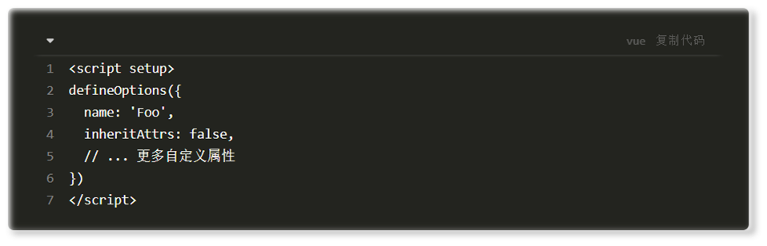

## 十二、Vue3.3新特性-defineModel

在Vue3中，自定义组件上使用v-model, 相当于传递一个modelValue属性，同时触发 update:modelValue 事件


我们需要先定义 props，再定义 emits 。其中有许多重复的代码。如果需要修改此值，还需要手动调用 emit 函数。

于是乎 defineModel(需要导入) 诞生了，不需要 emit，可以直接修改父组件的数据


> 生效需要配置 vite.config.js
>
> ```jsx
> import { fileURLToPath, URL } from 'node:url'
>
> import { defineConfig } from 'vite'
> import vue from '@vitejs/plugin-vue'
>
> // https://vitejs.dev/config/
> export default defineConfig({
>   plugins: [
>     vue({		// 在这里配置
>       script: {
>         defineModel: true
>       }
>     }),
>   ],
>   resolve: {
>     alias: {
>       '@': fileURLToPath(new URL('./src', import.meta.url))
>     }
>   }
> })
> ```

# day12-Vue3状态管理 Pinia

## 1. 什么是Pinia

Pinia 是 Vue 的专属的最新状态管理库，<span data-type="text" style="color: var(--b3-font-color8);">是 Vuex 状态管理工具的替代品</span>


## 2. 手动添加Pinia到Vue项目

后面在实际开发项目的时候，Pinia可以在项目创建时自动添加，现在我们初次学习，从零开始：

[https://pinia.vuejs.org/zh/](https://pinia.vuejs.org/zh/)

1. 安装

   **yarn add pinia** 或者使用 **npm install pinia**
2. 在 main.js 中导入挂载

   ```js
   import { createApp } from 'vue'
   import { createPinia } from 'pinia'
   import App from './App.vue'

   const pinia = createPinia() // 创建Pinata实例
   const app = createApp(App)  // 创建根实例
   app.use(pinia) 				// 视图的挂载
   app.mount('#app')			// mount 设置挂载点 #app（id 为 app 的盒子）
   ```

   <span data-type="text" style="color: var(--b3-font-color8);">注意：设置挂载点一定要放在最后</span>。

## 3. Pinia基础使用

1. 定义store
2. 组件使用store

   命名规范一般以use开头，Store结尾

```js
// 定义 store
// defineStore(仓库的唯一标识，() => {...})
import { defineStore } from 'pinia'
import { ref, computed } from "vue"

export const useCounterStore = defineStore('counter', () => {
  // 声明数据 state
  const count = ref(0)
  const msg = ref('hello pinia')
  // 声明操作数据的方法 actions（普通函数）
  function addCount(){count.value++}
  function subCount(){count.value--}
  // 声明基于数据派生的计算属性 getters（computed函数）
  const double = computed(() => count.value * 2)
  // 导出
  return {
    count,
    msg,
    addCount,
    subCount,
    double
  }
})
```

```html
<!-- App.vue -->
<script setup>// 加上 setup 允许在 script 中直接编写组合式 API
import { useCounterStore } from '@/store/counter'
const counterStore = useCounterStor()
</script>

<template>
  <!-- 不再要求唯一根元素 -->
  <div class="">
    <h3>App.vue根组件
      - {{ counterStore.count }}
      - {{ counterStore.msg }}
      - {{ counterStore.double }}
    </h3>
    <button @click="counterStore.addCount">+</button>
    <button @click="counterStore.subCount">-</button>
  </div>

</template>

<style scoped>
</style>
```

## 4. storeToRefs工具函数

如果对导入的仓库对象直接进行结构的话 `const { count, msg, addCount, subCount, double } = storeToRefs(counterStore)`​，会丢失响应性，方法解构后可以正常使用。

可以使用 storeToRefs函数 可以辅助保持数据的响应式解构 `const { count, msg, addCount, subCount, double } = `​`storeToRefs`​`(counterStore)`​。

## 5. Pinia持久化插件

官方文档：[https://prazdevs.github.io/pinia-plugin-persistedstate/zh/](https://prazdevs.github.io/pinia-plugin-persistedstate/zh/)

1. 安装pinia-plugin-persistedstate插件 ：**npm i pinia-plugin-persistedstate**
2. 使用 main.js

   ```js
   import persist from 'pinia-plugin-persistedstate'
   ...
   app.use(createPinia().use(persist))
   ```
3. 配置 store/counter.js

   ```jsx
   import { defineStore } from 'pinia'
   import { computed, ref } from 'vue'

   export const useCounterStore = defineStore('counter', () => {
     ...
     return {
       count,
       doubleCount,
       increment
     }
   }, {	// 第三个参数
     // 1. persist: true	// 键名就是仓库的唯一标识 counter，对整个 state 都做持久化
     // 2. 也可以自定义配置
     persist: {
   	key: '键名'					// 存到本地时的键名
   	paths: ['数据1', '数据2']	// 需要持久化的数据
     }
   })
   ```
4. 其他配置，看官网文档即可

‍

‍
