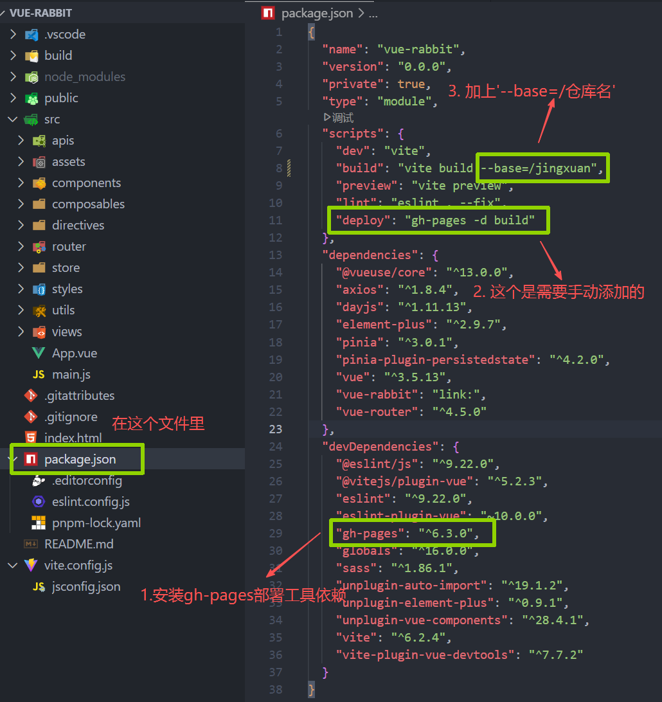
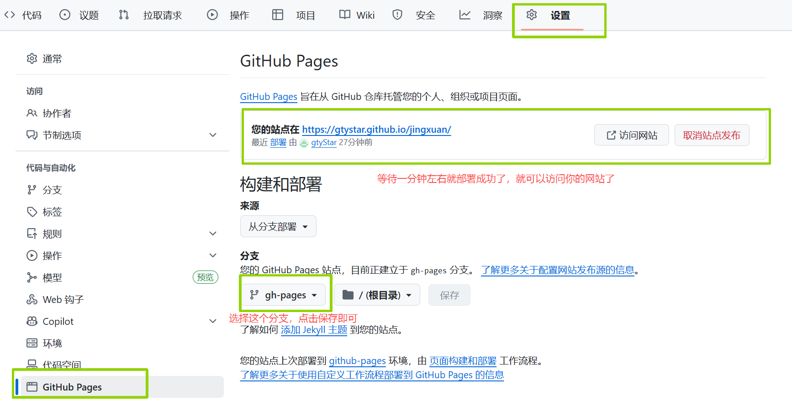

# github部署静态网站

# 1. 准备工作

1. 先安装gh-pages部署工具依赖：**pnpm i gh-pages -D**
2. 安装完后可以在package.json文件里 devDependencies 这一项里看到 gh-pages 依赖的版本，证明安装成功
3. 在package.json文件里 scripts 这一项里 vite build 后面加上 `--base=/仓库名`​​

    这是打包的时候可以给生成的文件里的链接加上你的仓库名前缀，因为github仓库部署的静态网站是在仓库的子路径下
4. 在package.json文件里 scripts 这一项里添加一行 `"deploy" : "gh-pages -d build"`​​

# 2. 打包、上传和部署

1. 打包：**pnpm build**
2. 打包后把生成的 dist 文件夹改名为 build
3. 上传到 github 仓库：**pnpm run deploy**
4. 部署

    

鲸选网址：[https://gtystar.github.io/jingxuan/#/](https://gtystar.github.io/jingxuan/#/)

‍
