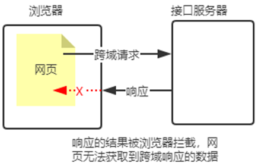
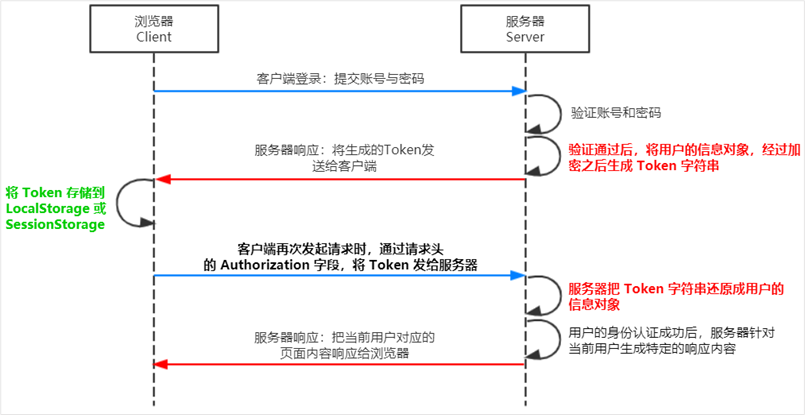

# node.js

# 一、初识 Node.js 与内置模块

## 1. 初识 Node.js

### 1.1 回顾与思考

- 为什么 JavaScript 可以在浏览器中被执行？

  因为浏览器内置有 JS 的解析引擎，其中 Chrom 浏览器的 V8 解析引擎性能最好。
- 为什么 JavaScript 可以操作 DOM 和 BOM？

  每个浏览器都<span data-type="text" style="color: var(--b3-font-color8);">内置了 DOM、BOM 这样的 API 函数</span>，因此，浏览器中的 JavaScript 才可以调 用它们。
- 浏览器中的 JavaScript 运行环境

  运行环境是指代码正常运行所需的必要环境。

  ① V8 引擎负责解析和执行 JavaScript 代码。

  ② 内置 API 是由运行环境提供的特殊接口， 只能在所属的运行环境中被调用。
- JavaScript 能否做后端开发

  <span data-type="text" style="color: var(--b3-font-color8);">JavaScript 可以借助 Node.js 做后端开发。</span>

### 1.2 Node.js 简介

- 什么是 Node.js

  Node.js 是一个基于 Chrome V8 引擎的 JavaScript 运行环境。

  Node.js 的官网地址： [https://nodejs.org/zh-cn/](https://nodejs.org/zh-cn/)
- Node.js 中的 JavaScript 运行环境

  ① <span data-type="text" style="color: var(--b3-font-color8);">浏览器</span>是 JavaScript 的<span data-type="text" style="color: var(--b3-font-color8);">前端运行环境</span>。

  ② <span data-type="text" style="color: var(--b3-font-color8);">Node.js </span>是 JavaScript 的<span data-type="text" style="color: var(--b3-font-color8);">后端运行环境</span>。

  ③ Node.js 中<span data-type="text" style="color: var(--b3-font-color8);">无法调用</span> DOM 和 BOM 等 <span data-type="text" style="color: var(--b3-font-color8);">浏览器内置 API</span>。
- Node.js 可以做什么

  Node.js 作为一个 JavaScript 的运行环境，仅仅提供了基础的功能和 API。然而，基于 Node.js 提供的这些基础能，很多强大 的工具和框架如雨后春笋，层出不穷，所以学会了 Node.js ，可以让前端程序员胜任更多的工作和岗位：

  ① 基于 Express 框架（http://www.expressjs.com.cn/），可以快速构建 Web 应用

  ② 基于 Electron 框架（https://electronjs.org/），可以构建跨平台的桌面应用

  ③ 基于 restify 框架（http://restify.com/），可以快速构建 API 接口项目

  ④ 读写和操作数据库、创建实用的命令行工具辅助前端开发、etc…
- Node.js 的学习路径

  JavaScript 基础语法 + Node.js 内置 API 模块（fs、path、http等） + 第三方 API 模块（express、mysql 等）

### 1.3 Node.js 环境的安装

如果希望通过 Node.js 来运行 Javascript 代码，则必须在计算机上安装 Node.js 环境才行。

安装包可以从 Node.js 的官网首页直接下载，进入到 Node.js 的官网首页（[https://nodejs.org/en/](https://nodejs.org/en/)），点击 绿色的按钮，下载所需的版本后，双击直接安装即可。


1. 区分 LTS 版本和 Current 版本的不同

    ① LTS 为长期稳定版，对于<span data-type="text" style="color: var(--b3-font-color8);">追求稳定性</span>的<span data-type="text" style="color: var(--b3-font-color8);">企业级项目</span>来说，推荐安装 LTS 版本的 Node.js。 

    ② Current 为新特性尝鲜版，对热衷于尝试新特性的用户来说，推荐安装 Current 版本的 Node.js。但是，Current 版本中可 能存在隐藏的 Bug 或安全性漏洞，因此不推荐在企业级项目中使用 Current 版本的 Node.js。

2. 查看已安装的 Node.js 的版本号 

    打开终端，在终端输入命令 node –v 后，按下回车键，即可查看已安装的 Node.js 的版本号。

### 1.4 在 Node.js 环境中执行 JavaScript 代码

- 在终端里输入：<span data-type="text" style="color: var(--b3-font-color8);">node 要执行的js文件的路径</span>

- 在 Windows 的 powershell 或 cmd 终端中，我们可以通过如下快捷键，来提高终端的操作效率：

  ① 使用 ↑ 键，可以快速定位到上一次执行的命令

  ② 使用 tab 键，能够快速补全路径

  ③ 使用 esc 键，能够快速清空当前已输入的命令

  ④ 输入 cls 命令，可以清空终端

## 2. fs 文件系统模块

### 2.1 什么是 fs 文件系统模块

<span data-type="text" style="color: var(--b3-font-color8);">fs 模块</span>是 Node.js 官方提供的、用来操作文件的模块。它提供了一系列的方法和属性，用来满足用户对文件的操作需求。

- 例如： 

  ​`fs.readFile()`​ 方法，用来<span data-type="text" style="color: var(--b3-font-color8);">读取</span>指定文件中的内容

  ​`fs.writeFile()`​ 方法，用来向指定的文件中<span data-type="text" style="color: var(--b3-font-color8);">写入</span>内容

- 如果要在 JavaScript 代码中，使用 fs 模块来操作文件，则需要使用如下的方式先导入它：

  ​`const fs = require('fs')`​

### 2.2 读取指定文件中的内容

1. fs.readFile() 的语法格式

    使用 fs.readFile() 方法，可以读取指定文件中的内容，语法格式：`fs.readFile(path[, option], callback)`​​

    - 参数1：<span data-type="text" style="color: var(--b3-font-color8);">必选</span>参数，字符串，表示读取指定的文件的路径。
    - 参数2：<span data-type="text" style="color: var(--b3-font-color8);">可选</span>参数，表示以什么编码格式来读取文件，默认utf8。
    - 参数3：<span data-type="text" style="color: var(--b3-font-color8);">必选</span>参数，文件读取完成后，通过<span data-type="text" style="color: var(--b3-font-color8);">回调函数</span>拿到读取的结果。

      回调函数里有两个参数：<span data-type="text" style="color: var(--b3-font-color8);">err</span>(失败的结果)、<span data-type="text" style="color: var(--b3-font-color8);">dataStr</span>(成功的结果)

2. fs.readFile() 的示例代码

    ```js
    // 以 utf8 的编码格式，读取指定文件的内容，并打印 err 和 dataStr 的值
    const fs = require('fs')
    fs.readFile('./1.text', 'utf8', function(err, dataStr){
    	console.log(err)	// 如果读取成功，err 的值为 null
    	console.log(dataStar.toString)	// 如果读取失败，dataStar 的值为 undefined
    })
    ```

3. <span id="20250510201824-qnd4rtq" style="display: none;"></span>判断文件是否读取成功

    ```js
    // 可以判断 err 对象是否为 null，从而知晓文件读取的结果
    fs.readFile('./1.text', 'utf8', function(err, dataStr){
    	if(err) {
    		return console.log('文件读取失败' + err.message)
    	}
    	console.log('文件读取成功，内容是：' + dataStar.toString)	// 如果读取失败，dataStar 的值为 undefined
    })
    ```

### 2.3 向指定的文件中写入内容

- 注意：

  <span data-type="text" style="color: var(--b3-font-color8);">写入的内容会替换之前的内容</span>

  <span data-type="text" style="color: var(--b3-font-color8);">可以创建文件，但不能创建文件夹</span>

1. fs.writeFile() 的语法格式

    使用 fs.writeFile() 方法，可以向指定的文件中写入内容

    语法格式：`fs.writeFile(path, data[, option], callback)`​​

    - 参数1：<span data-type="text" style="color: var(--b3-font-color8);">必选</span>参数，需要指定一个文件路径的字符串，表示文件的存放路径。
    - 参数2：<span data-type="text" style="color: var(--b3-font-color8);">必选</span>参数，表示要写入的内容。
    - 参数3：<span data-type="text" style="color: var(--b3-font-color8);">可选</span>参数，表示以什么格式写入文件内容，默认值是 utf8。
    - 参数4：<span data-type="text" style="color: var(--b3-font-color8);">必选</span>参数，文件写入完成后的回调函数。

      回调函数里有一个参数：err

2. fs.writeFile() 的示例代码

    ```js
    const fs = require('fs')
    fs.writeFile('./1.text', 'abcd' function(err, dataStr) {
    	console.log(err)	// 如果写入成功，err 的值为 null
    })
    ```

3. 判断文件是否写入成功

    [同上](#20250510201824-qnd4rtq)

### 2.4 [练习 - 考试成绩整理]()


```js
const fs = require('fs');
fs.readFile('./old.txt', function (err, data) {
    if (err) {
        return console.log('读取失败' + err.message);
    }
    const oldStr = data.toString(); // 转换为字符串
    const oldArr = oldStr.split(' ')    // 用空格分离转换为数组
    const newArr = oldArr.map((item) => item = item.replace('=', ':'))  // 将 = 替换为 ：
    const newStr = newArr.join('\r\n'); // 将数组转换为字符串， “\r\n” 为换行符
    fs.writeFile('./new.txt', newStr, function (err) {
        if (err) {
            return console.log('写入失败' + err.message);
        }
        console.log('写入成功');
    })
})
```

### 2.6 fs 模块 - 路径动态拼接的问题

在使用 fs 模块操作文件时，动态拼接的路径是用<span data-type="text" style="color: var(--b3-font-color8);">执行 node 命令时所处终端的目录</span>拼接上<span data-type="text" style="color: var(--b3-font-color8);">代码里的路径</span>。所以有时会会出问题。

原因：代码在运行的时候，会以执行 node 命令时所处的目录，动态拼接出被操作文件的完整路径。

- 解决方案：在使用 fs 模块操作文件时，不要提供 ./ 或 ../ 开头的相对路径。

  <span data-type="text" style="color: var(--b3-font-color8);">直接提供完整的路径(__dirname + '相对路径')</span>，从而防止路径动态拼接的问题。

  

## 3. path 路径模块

### 3.1 什么是 path 路径模块

<span data-type="text" style="color: var(--b3-font-color8);">path 模块</span>是 Node.js 官方提供的、用来处理路径的模块。它提供了一系列的方法和属性，用来满足用户对路径的处理需求。

- 例如：

  ​`path.join()`​ 方法，用来<span data-type="text" style="color: var(--b3-font-color8);">将多个路径片段拼接成一个完整的路径字符串</span>

  ​`path.basename()`​ 方法，用来从路径字符串中，<span data-type="text" style="color: var(--b3-font-color8);">将文件名解析出来 </span>

  ​`path.extname()`​ 方法，可以<span data-type="text" style="color: var(--b3-font-color8);">获取</span>路径中的<span data-type="text" style="color: var(--b3-font-color8);">扩展名部分</span>

- 如果要在 JavaScript 代码中，使用 path 模块来处理路径，则需要使用如下的方式先导入它：

  ​`const path = require('path')`​

### 3.2 路径拼接

使用 `path.join()`​ 方法，可以把多个路径片段拼接为完整的路径字符串：

```js
const path = require('path')
const pathStr = path.join(__dirname, './1.txt')
```

注意：<span data-type="text" style="color: var(--b3-font-color8);">今后凡是涉及到路径拼接的操作，都要使用 path.join() 方法进行处理</span>。<span data-type="text" style="color: var(--b3-font-color8);">不</span>要直接<span data-type="text" style="color: var(--b3-font-color8);">使用</span> <span data-type="text" style="color: var(--b3-font-color8);">+</span> 进行字符串的拼接。

### 3.3 获取路径中的文件名

使用 `path.basename()`​ 方法，可以获取路径中的最后一部分，经常通过这个方法获取路径中的文件名：

```js
const path = require('path')
// path.basename(path[, ext])
const a = path.basename('/a/b/index.html')			// a 的值为 index.html
const b = path.basename('/a/b/index.html', 'html')	// b 的值为 index
```

- path：必选参数，表示一个<span data-type="text" style="color: var(--b3-font-color8);">路径</span>的字符串
- ext：可选参数，表示文件<span data-type="text" style="color: var(--b3-font-color8);">扩展名</span>
- 返回：表示路径中的最后一部分

### 3.4 获取路径中的文件扩展名

使用 `path.extname()`​ 方法，可以获取路径中的扩展名部分

```js
const path = require('path')
// path.extname(path)
const a = path.extname('/a/b/index.html')	// a 的值为 .html
```

## 4. [综合案例 - 时钟案例](C:\Users\12625\Desktop\前端\3.Vue开发\1、Node.js零基础入门教程\练习\day2时钟案例)

将一份含有style、script的 html 文件，分离成3个单独的 html、css、scrip t文件

```js
const fs = require('fs')
const path = require('path')

// 创建两个正则表达式，匹配 style 和 script
const regStyle = /<style>([\s\S]*)<\/style>/
const regScript = /<script>([\s\S]*)<\/script>/
// 读取文件
fs.readFile(path.join(__dirname, './index.html'), (err, data) => {
    if (err) return console.log('读取文件失败', + err.message)
    dataStr = data.toString()
    // 获取 style 和 script
    const styleStr = regStyle.exec(dataStr)[0].replace('<style>', '').replace('</style>', '')
    const scriptStr = regScript.exec(dataStr)[0].replace('<script>', '').replace('</script>', '')
    // 获取去掉 style 和 script 的 html
    const htmlStr = dataStr.replace(regStyle, '<link rel="stylesheet" href="./index.css">').replace(regScript, '<script src="./index.js"></script>')
    // 将 html、style、script 写入文件
    fs.writeFile(path.join(__dirname, './index.html'), htmlStr, err => { if (err) return console.log('html写入失败', + err.message) })
    fs.writeFile(path.join(__dirname, './index.css'), styleStr, err => { if (err) return console.log('css写入失败', + err.message) })
    fs.writeFile(path.join(__dirname, './index.js'), scriptStr, err => { if (err) return console.log('js写入失败', + err.message) })
})
```

## 5. http 模块

### 4.1 什么是 http 模块

回顾：什么是客户端、什么是服务器？

在网络节点中，负责<span data-type="text" style="color: var(--b3-font-color8);">消费资源的电脑</span>，叫做<span data-type="text" style="color: var(--b3-font-color8);">客户端</span>；负责<span data-type="text" style="color: var(--b3-font-color8);">对外提供网络资源的电脑</span>，叫做<span data-type="text" style="color: var(--b3-font-color8);">服务器</span>。

<span data-type="text" style="color: var(--b3-font-color8);">http 模块</span>是 Node.js 官方提供的，用来<span data-type="text" style="color: var(--b3-font-color8);">创建 web 服务器的模块</span>。通过 http 模块提供的 `http.createServer()`​ 方法，就能方便的<span data-type="text" style="color: var(--b3-font-color8);">把一台普通的电脑，变成一台 Web 服务器</span>，从而对外提供 Web 资源服务。

如果要希望使用 http 模块创建 Web 服务器，则需要先导入它：`const http = require('http')`​​

### 4.2 进一步理解 http模块的作用

服务器和普通电脑的<span data-type="text" style="color: var(--b3-font-color8);">区别</span>在于，<span data-type="text" style="color: var(--b3-font-color8);">服务器上安装了 web 服务器软件</span>，例如：IIS、Apache 等。通过安装这些服务器软件， 就能把一台普通的电脑变成一台 web 服务器。

在<span data-type="text" style="color: var(--b3-font-color8);"> Node.js </span>中，我们<span data-type="text" style="color: var(--b3-font-color8);">不需要</span>使用 IIS、Apache 等这些<span data-type="text" style="color: var(--b3-font-color8);">第三方 web 服务器软件</span>。因为我们可以基于 Node.js 提供的 http 模块，通过几行简单的代码，就能轻松的手写一个服务器软件，从而对外提供 web 服务。

### 4.3 服务器相关的概念

1. IP 地址

    <span data-type="text" style="color: var(--b3-font-color8);">IP 地址就是互联网上每台计算机的唯一地址</span>，因此 IP 地址具有唯一性。如果把“个人电脑”比作“一台电话”，那么“IP地 址”就相当于“电话号码”，只有在知道对方 IP 地址的前提下，才能与对应的电脑之间进行数据通信。

     IP 地址的格式：通常用“<span data-type="text" style="color: var(--b3-font-color8);">点分十进制</span>”表示成（a.b.c.d）的形式，其中，a,b,c,d 都是 0\~255 之间的十进制整数。例如：用 点分十进表示的 IP地址（192.168.1.1） 

    - 注意：

       ① <span data-type="text" style="color: var(--b3-font-color8);">互联网中每台 Web 服务器，都有自己的 IP 地址</span>，例如：大家可以在 Windows 的终端中运行         `ping www.baidu.com`​ 命 令，即可查看到百度服务器的 IP 地址。

       ② 在开发期间，自己的电脑既是一台服务器，也是一个客户端，为了方便测试，可以在自己的浏览器中输入 127.0.0.1 这个 IP 地址，就能把自己的电脑当做一台服务器进行访问了。

2. <span data-type="text" style="color: var(--b3-font-color8);">域名</span>和<span data-type="text" style="color: var(--b3-font-color8);">域名服务器</span>

    尽管 IP 地址能够唯一地标记网络上的计算机，但IP地址是一长串数字，<span data-type="text" style="color: var(--b3-font-color8);">不直观</span>，而且<span data-type="text" style="color: var(--b3-font-color8);">不便于记忆</span>，于是人们又发明了另一套<span data-type="text" style="color: var(--b3-font-color8);">字符型的地址方案</span>，即所谓的<span data-type="text" style="color: var(--b3-font-color8);">域名（Domain Name）地址。</span>

    <span data-type="text" style="color: var(--b3-font-color8);">IP地址和域名是一一对应的关系</span>，这份对应关系存放在一种叫做<span data-type="text" style="color: var(--b3-font-color8);">域名服务器</span>(<span data-type="text" style="color: var(--b3-font-color8);">DNS</span>，Domain name server)的电脑中。使用者只需通过好记的域名访问对应的服务器即可，对应的转换工作由域名服务器实现。因此，<span data-type="text" style="color: var(--b3-font-color8);">域名服务器就是提供 IP 地址和域名之间的转换服务的服务器</span>。

    - 注意： 

      ① 单纯使用 IP 地址，互联网中的电脑也能够正常工作。但是有了域名的加持，能让互联网的世界变得更加方便。 

      ② 在开发测试期间， <span data-type="text" style="color: var(--b3-font-color8);">127.0.0.1 对应的域名是 localhost</span>，它们都代表我们自己的这台电脑，在使用效果上没有任何区别。

3. 端口号 

    计算机中的端口号，就好像是现实生活中的门牌号一样。通过门牌号，外卖小哥可以在整栋大楼众多的房间中，准确把外卖 送到你的手中。 

    同样的道理，在一台电脑中，可以运行成百上千个 web 服务。<span data-type="text" style="color: var(--b3-font-color8);">每个 web 服务都对应一个唯一的端口号</span>。客户端发送过来的网络请求，通过端口号，可以被准确地交给对应的 web 服务进行处理。

    ​

    - 注意： 

      ① 每个端口号不能同时被多个 web 服务占用。 

      ② 在实际应用中，<span data-type="text" style="color: var(--b3-font-color8);">URL 中的 80 端口可以被省略</span>。

### 4.4 创建最基本的 web 服务器步骤

1. 创建 web 服务器的基本步骤 

    ① 导入 http 模块

    ② 创建 web 服务器实例

    ③ 为服务器实例绑定 request 事件，监听客户端的请求

    ④ 启动服务器

    ```js
    const http = require('http')	// 导入 http 模块
    const server = http.createServer()	// 创建 web 服务器实例
    // 为服务器绑定一个 request 事件
    server.on('request', (req, res) => {
    	// 只要客户端来请求我们的服务器，就会触发 request 事件，从而调用这个事件的处理函数
    	console.log('有人请求了我们的服务器')
    })
    // 调用 server.listen(端口号, 回调函数) 方法，即可启动 web 服务器，并执行函数
    server.list(8080, ()=> {console.log('服务器运行在 http://127.0.0.1:200:8080')})
    ```

2. <span data-type="text" style="color: var(--b3-font-color8);">req 请求对象</span> 和 <span data-type="text" style="color: var(--b3-font-color8);">res 响应对象</span>

    只要服务器接收到了客户端的请求，就会调用通过 server.on() 为服务器绑定的 request 事件处理函数。

    - 可以通过事件处理函数中的 <span data-type="text" style="color: var(--b3-font-color8);">req 请求对象 </span>访问<span data-type="text" style="color: var(--b3-font-color8);"> 客户端相关的数据或属性，</span>例如：

      ① `req.url` 是客户端请求的 URL 地址

      ② `req.method`​<span data-type="text" style="color: var(--b3-font-color8);"> </span>是客户端的请求类型
    - 可以通过事件处理函数中的 <span data-type="text" style="color: var(--b3-font-color8);">res 相应对象 </span>访问<span data-type="text" style="color: var(--b3-font-color8);"> 服务器相关的数据或属性，</span>例如：

      ①为了防止中文显示乱码，需要设置响应头 content-Type 的值为 text/html; charset=utf-8 `res.setHeader('content-Type', 'text/html; charset=utf-8')`​​

      ②服务器向客户端发送指定内容，并结束这次请求的处理过程 `res.end('内容')`​​

    ```js
    server.on('request', (req, res) => {
    	const str = `你请求的地址：${req.url}，你的请求类型：${req.method}`
    	res.setHeader('content-Type', 'text/html; charset=utf-8')
    	res.end(str)
    })
    ```

# 二、模块化

## 1. 模块化的基本概念

### 1.1 什么是模块化

<span data-type="text" style="color: var(--b3-font-color8);">模块化</span>是指<span data-type="text" style="color: var(--b3-font-color8);">解决</span>一个<span data-type="text" style="color: var(--b3-font-color8);">复杂问题</span>时，自顶向下逐层<span data-type="text" style="color: var(--b3-font-color8);">把系统划分成若干模块的过程</span>。对于整个系统来说，<span data-type="text" style="color: var(--b3-font-color8);">模块是可组 合、分解和更换的单元。</span>

编程领域中的模块化，就是遵守固定的规则，<span data-type="text" style="color: var(--b3-font-color8);">把一个大文件拆成独立并互相依赖的多个小模块</span>。

好处：提高了代码的<span data-type="text" style="color: var(--b3-font-color8);">复用性</span>，提高了代码的<span data-type="text" style="color: var(--b3-font-color8);">可维护性</span>，可以实现<span data-type="text" style="color: var(--b3-font-color8);">按需加载</span>

### 1.2 模块化规范

<span data-type="text" style="color: var(--b3-font-color8);">模块化规范</span>就是对代码进行模块化的拆分与组合时，需要遵守的那些规则。

- 例如

  使用什么样的语法格式来引用模块

  在模块中使用什么样的语法格式向外暴露成员
- 模块化规范的好处

  大家都遵守同样的模块化规范写代码，降低了沟通的成本，极大方便了各个模块之间的相互调用， 利人利己。

## 2. Node.js 中模块化

### 2.1 Node.js 中模块的分类

Node.js 中根据模块来源的不同，将模块分为了 3 大类

- <span data-type="text" style="color: var(--b3-font-color8);">内置模块</span>（内置模块是由 Node.js 官方提供的，例如 fs、path、http 等
- <span data-type="text" style="color: var(--b3-font-color8);">自定义模块</span>（用户创建的每个 .js 文件，都是自定义模块）
- <span data-type="text" style="color: var(--b3-font-color8);">第三方模块</span>（由第三方开发出来的模块，<span data-type="text" style="color: var(--b3-font-color8);">使用前需要先下载</span>）

### 2.2 加载模块

<span data-type="text" style="color: var(--b3-font-color8);">内置模块</span>、<span data-type="text" style="color: var(--b3-font-color8);">用户自定义模块</span>、<span data-type="text" style="color: var(--b3-font-color8);">第三方模块</span>都可以通过强大的 `require()`​ 方法导入。

```js
// 加载内置的 fs 模块
const fs = require('fs')
// 加载用户的自定义模块
const user = require('user.js')	// 这个 .js 可以省略，没有 的话会自动补全
// 加载第三方模块（关于第三方模块的下载与使用，会在后面专门讲解）
const moment = require('moment')
```

- <span data-type="text" style="color: var(--b3-font-color8);">注意</span>：使用 `require()`​ 方法加载其它模块时，会执行被加载模块中的代码。

  ```js
  // 自定义模块 m1.js
  console.log('执行了自定义模块 m1')
  ```

  ```js
  // 在 node 中运行的 js
  const m1 = require('./m1')
  ```

### 2.3 Node.js 中的模块作用域

1. 什么是模块作用域

    <span data-type="text" style="color: var(--b3-font-color8);">和函数作用域类似</span>，在自定义模块中定义的<span data-type="text" style="color: var(--b3-font-color8);">变量</span>、<span data-type="text" style="color: var(--b3-font-color8);">方法等成员</span>，<span data-type="text" style="color: var(--b3-font-color8);">只能在当前模块内被访问</span>，这种模块级别的访问限制，叫做模块作用域。

2. 模块作用域的好处

    防止了全局变量污染的问题

### 2.4 向外共享模块作用域中的成员

1. module 对象

    在每个 .js 自定义模块中都有一个 module 对象，它里面存储了和当前模块有关的信息，打印如下：

    

2. module.exports 对象

    在自定义模块中，可以使用 <span data-type="text" style="color: var(--b3-font-color8);">module.exports</span> <span data-type="text" style="color: var(--b3-font-color8);">对象</span>，将模块内的成员共享出去，供外界使用。 

    外界用 `require()`​ 方法导入自定义模块时，得到的就是 module.exports 所指向的对象。

    ```js
    // 自定义模块 m1.js
    // exports 和 module.exports 指向同一个对象
    exports.username = '张三'
    exports.sayHello = () => {
    	console.log('hello')
    }
    ```

    ```js
    // 在 node 中运行的 js
    const m1 = require('./m1')
    console.log(m1.username)
    m1.sayHello()
    // 输出：	张三
    //			hello
    ```

    - 注意

      时刻谨记，require() 导入模块时，<span data-type="text" style="color: var(--b3-font-color8);">得到的永远是 module.exports 指向的对象</span>

      为了防止混乱，<span data-type="text" style="color: var(--b3-font-color8);">不要在同一个模块中同时使用 exports 和 module.exports</span>

### 2.5 Node.js 中的模块化规范

Node.js 遵循了 CommonJS 模块化规范，CommonJS 规定了<span data-type="text" style="color: var(--b3-font-color8);">模块的特性</span>和<span data-type="text" style="color: var(--b3-font-color8);">各模块之间如何相互依赖</span>。

- CommonJS 规定：

  ① 每个模块内部，<span data-type="text" style="color: var(--b3-font-color8);">module 变量</span>代表当前模块。

  ② module 变量是一个对象，它的 exports 属性（即 <span data-type="text" style="color: var(--b3-font-color8);">module.exports</span>）<span data-type="text" style="color: var(--b3-font-color8);">是对外的接口</span>。

  ③ 加载某个模块，其实是加载该模块的 module.exports 属性。<span data-type="text" style="color: var(--b3-font-color8);">require() 方法用于加载模块。</span>

## 3. npm与包

### 3.1 什么是包

Node.js 中的<span data-type="text" style="color: var(--b3-font-color8);">第三方模块</span>又叫做<span data-type="text" style="color: var(--b3-font-color8);">包</span>。

包是由第三方个人或团队开发出来的，免费且开源的，不需要付费即可免费下载使用。

<span data-type="text" style="color: var(--b3-font-color8);">包是基于内置模块封装出来的</span>，提供了更高级、更方便的 API，<span data-type="text" style="color: var(--b3-font-color8);">极大的提高了开发效率</span>。

### 3.2 下载包

国外有一家 IT 公司，叫做 npm, Inc. 这家公司旗下有一个非常著名的网站： [https://www.npmjs.com/](https://www.npmjs.com/) ，它是<span data-type="text" style="color: var(--b3-font-color8);">全球最大的包共享平台</span>，你可以从这个网站上搜索到任何你需要的包，只要你有足够的耐心！ 

到目前为止，全球约 1100 多万的开发人员，通过这个包共享平台，开发并共享了超过 120 多万个包供我们使用。 

npm, Inc. 公司提供了一个地址为 [https://registry.npmjs.org/](https://registry.npmjs.org/) 的服务器，来对外共享所有的包，我们可以从这个服务 器上下载自己所需要的包。

⚫ 从 [https://www.npmjs.com/ ](https://www.npmjs.com/)网站上搜索自己所需要的包 

⚫ 从[ https://registry.npmjs.org/ ](https://registry.npmjs.org/)服务器上下载自己需要的包

- 命令

  大家可以在终端中执行<span data-type="text" style="color: var(--b3-font-color8);"> </span>**npm -v** 命令，来查看自己电脑上所安装的 npm 包管理工具的版本号

  **npm i 包的名字** 命令下载包

  **npm i 包的名字@版本号**<span data-type="text" style="color: var(--b3-font-color8);"> </span>命令下载指定版本的包

- 初次装包后多了哪些文件

  初次装包后多了哪些文件初次装包完成后，在项目文件夹下<span data-type="text" style="color: var(--b3-font-color8);">多一个叫做 node_modules 的文件夹</span>和 <span data-type="text" style="color: var(--b3-font-color8);">package-lock.json 的配置文件</span>。

  <span data-type="text" style="color: var(--b3-font-color8);">node_modules</span> 文件夹用来<span data-type="text" style="color: var(--b3-font-color8);">存放所有已安装到项目中的包</span>。require() 导入第三方包时，就是从这个目录中查找并加载包。 

  <span data-type="text" style="color: var(--b3-font-color8);">package-lock.json</span> 配置文件用来<span data-type="text" style="color: var(--b3-font-color8);">记录 node_modules 目录下的每一个包的下载信息</span>，例如包的名字、版本号、下载地址等。

- 包的语义化版本规范

  包的版本号是以“点分十进制”形式进行定义的，总共有三位数字，例如 2.24.0 

  第1位数字：大版本，第2位数字：功能版本，第3位数字：Bug修复版本

  版本号提升的规则：只要前面的版本号增长了，则后面的版本号归零。

### 3.3 包管理配置文件

npm 规定，在项目根目录中，必须提供一个叫做 <span data-type="text" style="color: var(--b3-font-color8);">package.json 的包管理配置文件</span>。用来记<span data-type="text" style="color: var(--b3-font-color8);">录与项目有关的一些配置 信息。</span>

例如：项目的名称、版本号、描述等、项目中都用到了哪些包、哪些包只在开发期间会用到、那些包在开发和部署时都需要用到

<span data-type="text" style="color: var(--b3-font-color8);">共享时去除 node_modules 文件夹，启动前使用命令 </span>**npm i**  <span data-type="text" style="color: var(--b3-font-color8);">来一键安装包</span>

注意：今后在项目开发中，一定要把 node\_modules 文件夹，添加到 .gitignore 忽略文件中

- 快速创建 package.json

  npm 包管理工具提供了一个快捷命令 **npm i -y**，可以在执行命令时所处的目录中，快速创建 package.json 这个包管理配置文件

  这个命令只能在英文的目录下成功运行！项目文件夹的名称一定要使用英文命名，不要使用中文，不能出现空格。

  运行 npm install 命令安装包的时候，npm 包管理工具会自动把包的名称和版本号，记录到 package.json 中
- dependencies 节点

  

  package.json 文件中，有一个 dependencies 节点，专门用来记录您使用 npm install 命令安装了哪些包。

- 一次性安装所有的包

  当我们拿到一个<span data-type="text" style="color: var(--b3-font-color8);">剔除了 node_modules文件夹 的项目</span>之后，需要先把所有的包下载到项目中  **npm i**，才能将项目运行起来
- 卸载包

  使用 **npn uninstall 包名**  命令来卸载包
- devDependencies 节点

  如果某些包只在<span data-type="text" style="color: var(--b3-font-color8);">项目开发阶段会用到</span>，在项目上线之后不会用到，则建议把这些包记录到 devDependencies 节点中。 

  与之对应的，如果某些包在开发和<span data-type="text" style="color: var(--b3-font-color8);">项目上线之后都需要用到</span>，则建议把这些包记录到 dependencies 节点中。

  ```bash
  # 使用以下命令。安装并将包记录到 devDependencies 节点中
  npm i 包名 -D	# 等同于  npm install 包名 --save-dev
  ```

### 3.4 解决下包速度慢的问题

在使用 npm 下包的时候，默认从国外的 [https://registry.npmjs.org/](https://registry.npmjs.org/) 服务器进行下载，此时，网络数据的传输需要经 过漫长的海底光缆，因此下包速度会很慢。

1. 淘宝 NPM 镜像服务器

    淘宝在国内搭建了一个服务器，专门把国外官方服务器上 的包同步到国内的服务器，然后在国内提供下包的服务。 从而极大的提高了下包的速度。

2. 切换 npm 的下包镜像源

    下包的镜像源就是<span data-type="text" style="color: var(--b3-font-color8);">下包的服务器地址</span>。

    ```bash
    # 查看当前下包镜像源
    npm config get registry
    # 将下包的镜像源切换为淘宝镜像源
    npm config set registry=https://registry.npm.taobao.org/
    ```

3. <span id="20250512174313-yzqm75k" style="display: none;"></span>nrm

    为了更方便的切换下包的镜像源，我们可以安装 nrm 这个小工具，利用 nrm 提供的终端命令，可以快速查看和切换下 包的镜像源。

    ```bash
    # 通过 npm 包管理器，将 nrm 安装为全局可用工具
    npm i nrm -g
    # 查看所有可用镜像源
    nrm ls
    # 将下包镜像源切换为淘宝镜像
    nrm use taobao
    ```

### 3.5 包的分类

使用 npm 包管理工具下载的包，共分为两大类：<span data-type="text" style="color: var(--b3-font-color8);">项目包</span>、<span data-type="text" style="color: var(--b3-font-color8);">全局包</span>

1. 项目包

    那些被安装到项目的 node\_modules 目录中的包，都是项目包。

    项目包又分为两类，分别是： 

    ⚫ 开发依赖包（被记录到 devDependencies 节点中的包，只在开发期间会用到） **npm i -D**

    ⚫ 核心依赖包（被记录到 dependencies 节点中的包，在开发期间和项目上线之后都会用到）**npm i**
2. 全局包

    在执行 **npm install 包名 -g** 命令时，提供了 -g 参数，则会把包安装为全局包。

    全局包会被安装到 <span data-type="text" style="color: var(--b3-font-color8);">C:\Users\用户目录\AppData\Roaming\npm\node_modules </span>目录下。
3. i5ting\_toc

    i5ting\_toc 是一个可以把 md 文档转为 html 页面的小工具，使用步骤如下：

    ```bash
    # 将 i5ting_toc 安装为全局包
    npm i i5ting_toc -g
    # 调用 i5ting_toc，轻松实现 md 转换为 html
    i5ting_toc -f 要转换的md文件路径 -o
    ```

### 3.6 规范的包结构

在清楚了包的概念、以及如何下载和使用包之后，接下来，我们深入了解一下包的内部结构。

- 一个规范的包，它的组成结构，必须符合以下 3 点要求： 

  ① 包必须以<span data-type="text" style="color: var(--b3-font-color8);">单独的目录</span>而存在 

  ② 包的顶级目录下要必须包含 <span data-type="text" style="color: var(--b3-font-color8);">package.json</span> 这个包管理配置文件 

  ③ package.json 中<span data-type="text" style="color: var(--b3-font-color8);">必须包含 name，version，main</span> <span data-type="text" style="color: var(--b3-font-color8);">这三个属性</span>，分别代表包的名字、版本号、包的入口。

   注意：以上 3 点要求是一个规范的包结构必须遵守的格式，关于更多的约束，可以参考如下网址： [https://yarnpkg.com/zh-Hans/docs/package-json](https://yarnpkg.com/zh-Hans/docs/package-json)

### 3.7 开发属于自己的包

- 需要实现的功能

  ① 格式化日期，将日期转换成 **xxxx-xx-xx xx:xx:xx**

  ② 转义 HTML 中的特殊字符，把 html 标签的“<>、""、&”替换成转义符

  ③ 还原 HTML 中的特殊字符，还原转义过的文本

1. 初始化包的基本结构 

    新建 itheima-tools 文件夹，作为包的根目录

    在 itheima-tools 文件夹中，新建如下三个文件： 

    ⚫ package.json （包管理配置文件） 

    ⚫ index.js （包的入口文件） 

    ⚫ README.md （包的说明文档）

2. 初始化 package.json

    ```json
    {
    	"name": "gty-tools",
    	"version": "1.0.0",	
    	"main": "index.js",
    	"description": "提供了格式化时间，HTMLEscape功能",
    	"keywords": ["gty", "dataFormat", "escape"],	// 上传到npm网站后，搜索的关键词
    	"license": "ISC"	// 开源许可协议
    }
    ```

3. 在根目录下创建 src 目录:

    ```js
    /src/dateFormat
    // 格式化时间的方法
    const dateFormat = (dateStr) => {
        const dt = new Date(dateStr)
        const y = dt.getFullYear()          // 年
        const m = dt.getMonth() + 1         // 月
        const d = dt.getDate()              // 日
        const hh = dt.getHours() > 9 ? dt.getHours() : '0' + dt.getHours()          // 时
        const mm = dt.getMinutes() > 9 ? dt.getMinutes() : '0' + dt.getMinutes()    // 分
        const ss = dt.getSeconds() > 9 ? dt.getSeconds() : '0' + dt.getSeconds()    // 秒
        return `${y}-${m}-${d} ${hh}:${mm}:${ss}`
    }

    module.exports = { dateFormat }
    ```

    ```js
    /src/htmlEscape
    // 转义 HTML 的方法，用于将HTML字符串中的特殊字符进行转义
    const htmlEscape = (htmlStr) => {
        // 使用正则表达式匹配HTML字符串中的特殊字符，包括 <、>、"
        return htmlStr.replace(/</g, '&lt;').replace(/>/g, '&gt;').replace(/"/g, '&quot;')
    }

    // 还原 HTML 的方法
    const htmlUnEscape = (htmlStr) => {
        // 使用正则表达式匹配HTML字符串中的特殊字符，包括 &lt;、&gt;、&quot;
        return htmlStr.replace(/&lt;/g, '<').replace(/&gt;/g, '>').replace(/&quot;/g, '"')
    }

    module.exports = {
    	htmlEscape,
    	htmlUnEscape
    }
    ```

4. 在根目录的入口文件 index.js 导入 src 目录里的模块，并向外共享

    ```js
    // index.js 包的入口文件
    const date = quire('./src/dateFormat')
    const escape = quire('./src/htmlEscape')

    module.exports = {
        ...date,
    	...escape
    }
    ```

5. 编写包的说明文档

    ```md
    <!-- 包的说明文档 -->
    # gty-tools

    ## 安装
    ‍```bash
    npm install gty-tools
    ‍```

    ## 导入
    ‍```js
    const gtyTools = require('gty-tools')
    ‍```

    ## 格式化时间
    ‍```js
    // 调用 dateFormat 方法，传入一个时间对象
    const time = dateFormat(new Date())
    console.log(time) // 2022年11月11日 11时11分11秒
    ‍```

    ## 转义 HTML 字符串
    ‍```js
    // 调用 htmlEscape 方法，传入一个 HTML 字符串
    const htmlStr = '<h1>hello world</h1>'
    const escapeStr = htmlEscape(htmlStr)
    console.log(escapeStr) // &lt;h1&gt;hello world&lt;/h1&gt;
    ‍```

    ## 还原 HTML 字符串
    ‍```js
    // 调用 htmlUnEscape 方法，传入一个转义后的 HTML 字符串
    const escapeStr = '&lt;h1&gt;hello world&lt;/h1&gt;'
    const htmlStr = htmlUnEscape(escapeStr)
    console.log(htmlStr) // <h1>hello world</h1>
    ‍```

    ## 开源协议
    ISC
    ```

### 3.8 发布包

1. 注册 npm 账号

    访问 [https://www.npmjs.com/](https://www.npmjs.com/) 网站

2. 登录npm 账号

    注册完成后，可以在终端中执行 **npm login** 命令，依次输入用户名、密码、邮箱后，即可登录成功。

    <span data-type="text" style="color: var(--b3-font-color8);">在运行 npm login 命令之前</span>，**[必须先把下包的服务器地址切换为 npm 的官方服务器](#20250512174313-yzqm75k)**。否则会导致发布包失败！

3. 把包发布到 npm 上

    <span data-type="text" style="color: var(--b3-font-color8);">将终端切换到包的根目录</span>之后，运行 **npm publish** 命令，即可将包发布到 npm 上（注意：<span data-type="text" style="color: var(--b3-font-color8);">包名不能雷同</span>）。
4. 删除已发布的包

    运行 **npm unpublish 包名 --force** 命令，即可从 npm 删除已发布的包

    - 注意： 

      ① npm unpublish 命令只能<span data-type="text" style="color: var(--b3-font-color8);">删除 72 小时以内发布的包 </span>

      ② npm unpublish 删除的包，在 <span data-type="text" style="color: var(--b3-font-color8);">24 小时内不允许重复发布 </span>

      ③ 发布包的时候要慎重，尽量<span data-type="text" style="color: var(--b3-font-color8);">不要往 npm 上发布没有意义的包！</span>

## 4. 模块的加载机制

### 4.1 优先从缓存中加载

<span data-type="text" style="color: var(--b3-font-color8);">模块在第一次加载后会被缓存</span>。 这也意味着多次调用 `require()`​ 不会导致模块的代码被执行多次。

注意：不论是内置模块、用户自定义模块、还是第三方模块，<span data-type="text" style="color: var(--b3-font-color8);">它们都会优先从缓存中加载</span>，从而<span data-type="text" style="color: var(--b3-font-color8);">提高模块的加载效率</span>。

### 4.2 <span data-type="text" style="color: var(--b3-font-color8);">内置模块</span>的加载机制

内置模块是由 Node.js 官方提供的模块，<span data-type="text" style="color: var(--b3-font-color8);">内置模块的加载优先级最高</span>。

例如，require('fs') 始终返回内置的 fs 模块，即使在 node\_modules 目录下有名字相同的包也叫做 fs。

### 4.3 <span data-type="text" style="color: var(--b3-font-color8);">自定义模块</span>的加载机制

- <span data-type="text" style="color: var(--b3-font-color8);">必须指定以 ./ 或 ../ 开头的路径标识符</span>。在加载自定义模块时，<span data-type="text" style="color: var(--b3-font-color8);">如果没有指定 ./ 或 ../ 这样的路径标识符</span>，则 node 会把它当<span data-type="text" style="color: var(--b3-font-color8);">作内置模块</span>或<span data-type="text" style="color: var(--b3-font-color8);">第三方模块</span>进行加载。

- 如果省略了文件的扩展名，Node.js 会按顺序分别尝试加载以下的文件

  ① 按照确切的文件名进行加载 

  ② 补全 .js 扩展名进行加载 

  ③ 补全 .json 扩展名进行加载 

  ④ 补全 .node 扩展名进行加载 

  ⑤ 加载失败，终端报错

### 4.4 第三方模块的加载机制

如果<span data-type="text" style="color: var(--b3-font-color8);">不是内置模块</span>，也<span data-type="text" style="color: var(--b3-font-color8);">没有以 ‘./’ 或 ‘../’ 开头</span>，则 Node.js 会从当前模块的父目录开始，尝试从 /node\_modules 文件夹中加载第三方模块。

<span data-type="text" style="color: var(--b3-font-color8);">如果没有找到对应的第三方模块，则移动到再上一层父目录中，进行加载，直到文件系统的根目录</span>。

- 例如，假设在 'C:\\Users\\itheima\\project\\foo.js' 文件里调用了 require('tools')，则 Node.js 会按以下顺序查找：

  ① C:\\Users\\itheima\\project\\node\_modules\\tools

  ② C:\\Users\\itheima\\node\_modules\\tools

  ③ C:\\Users\\node\_modules\\tools

  ④ C:\\node\_modules\\tools

### 4.5 目录作为模块

当把目录作为模块标识符，进行加载的时候，有三种加载方式：

① 在被加载的目录下查找一个叫做 package.json 的文件，并寻找 main 属性，作为 require() 加载的入口

② 如果目录里没有 package.json 文件，或者 main 入口不存在或无法解析，则 Node.js 将会试图加载目录下的 index.js 文件。

③ 如果以上两步都失败了，则 Node.js 会在终端打印错误消息，报告模块的缺失：Error: Cannot find module 'xxx'

# 三、Express

## 1. 初识 Express

### 1.1 Express 简介

1. 什么是 Express 

    官方给出的概念：Express 是<span data-type="text" style="color: var(--b3-font-color8);">基于 Node.js 平台，快速、开放、极简的 Web 开发框架</span>。 

    通俗的理解：Express 的作用和 Node.js 内置的 http 模块类似，是<span data-type="text" style="color: var(--b3-font-color8);">专门用来创建 Web 服务器的</span>。

    Express 的本质：<span data-type="text" style="color: var(--b3-font-color8);">就是一个 npm 上的第三方包</span>，提供了快速创建 Web 服务器的便捷方法。 

    Express 的中文官网： [http://www.expressjs.com.cn/](http://www.expressjs.com.cn/)

2. 进一步理解 Express

    - 思考：不使用 Express 能否创建 Web 服务器？ 

      答案：能，使用 Node.js 提供的原生 http 模块即可。

    - 思考：既生瑜何生亮（有了 http 内置模块，为什么还有用 Express）？ 

      答案：http 内置模块用起来很复杂，开发效率低；Express 是基于内置的 http 模块进一步封装出来的，能够极大的提高开发效率。

    - 思考：http 内置模块与 Express 是什么关系？ 

      答案：类似于浏览器中 Web API 和 jQuery 的关系。后者是基于前者进一步封装出来的。

3. Express 能做什么 

    对于前端程序员来说，最常见的两种服务器，分别是： 

    - <span data-type="text" style="color: var(--b3-font-color8);">Web 网站服务器</span>：专门对外提供 Web 网页资源的服务器。

    - <span data-type="text" style="color: var(--b3-font-color8);">API 接口服务器</span>：专门对外提供 API 接口的服务器。

    使用 Express，我们可以方便、快速的创建 Web 网站的服务器或 API 接口的服务器。

### 1.2 Express 的基本使用

1. 安装

    在项目所处的目录中，运行如下的终端命令，即可将 express 安装到项目中使用命令：**npm i express**

2. 创建基本的 Web 服务器

    ```js
    // 1. 导入 express
    const express = require('express')
    // 2. 创建 web 服务器实例
    const app = express()

    // 3. 调用 app.listen(端口号, 启动成功的回调函数) 方法，启动服务器
    app.listen(80, () => {
        console.log('Express 服务运行在 http://127.0.0.1')
    })
    ```

3. 监听 GET 请求

    ```js
    // 通过 app.get() 方法监听客户端的 GET 请求，并向客户端响应具体的内容
    // 参数1：客户端请求的 URL 地址
    // 参数2：当客户端请求该 URL 地址时，要调用的处理函数
    //        req：请求对象，包含了与客户端相关的数据和属性
    //        res：响应对象，包含了与服务器相关的数据和属性
    app.get('请求URL', (req, res) => { /* 处理函数 */ })
    ```

4. 监听 POST 请求

    ```js
    // 通过 app.post() 方法监听客户端的 POST 请求，并向客户端响应具体的内容
    // 参数1：客户端请求的 URL 地址
    // 参数2：当客户端请求该 URL 地址时，要调用的处理函数
    //        req：请求对象，包含了与客户端相关的数据和属性
    //        res：响应对象，包含了与服务器相关的数据和属性
    app.post('/user', (req, res) => { /* 处理函数 */ })
    ```

5. 把内容响应给客户端

    ```js
    // 在 GET、POST 请求的处理函数中，通过 res.send() 方法，可以把处理好的内容，发送给客户端：
    app.get('/user', (req, res) => {
        // 向客户端响应一个 JSON 对象
        const user = {
            name: 'zs',
            age: 20, 
    		gender: '男',
            "你请求的地址": req.url,
            "你请求的方法": req.method
        }
        res.send(user)
    })
    app.post('/user', (req, res) => {
        // 向客户端响应一个文本字符串
        res.send('请求成功')
    })
    ```

6. 获取 URL 中携带的<span data-type="text" style="color: var(--b3-font-color8);">查询参数 - query 对象</span>

    ```js
    // req.query 默认是一个空对象
    // 客户端使用 ?name=zs&age=20 这种查询字符串形式，发送到服务器的参数，可以通过 req.query 对象访问到
    // 例如：req.qauery.name、req.query.age
    app.get('/user', (req, res) => {
        res.send(req.query)		// {"name": "zs", "age": "20"}
    })
    ```

7. 获取 URL 中的<span data-type="text" style="color: var(--b3-font-color8);">动态参数 - params 对象</span>

    ```js
    // req.params 默认也是一个空对象
    // 客户端使用 :id 等形式的动态参数，发送到服务器，可以通过 req.params 对象访问到
    app.get('user/:id/:name', (req, res) => {
    	res.send(req.params)	// {"id": "1", "name": "zs"}
    })
    ```

### <span id="20250513193441-ka0mrr6" style="display: none;"></span>1.3 托管静态资源

1. express.static()

    express 提供了一个非常好用的函数，叫做 express.static()，通过它，我们可以非常方便地创建一个静态资源服务器。

    ```js
    // 托管静态资源
    const express = require('express')
    const app = express()
    // 通过 express.static() 方法，创建静态资源托管中间件
    app.use(express.static('../day2时钟案例'))
    app.listen(80, () => {
        console.log('服务器运行在http://127.0.0.1')
    })
    ```

    浏览器地址输入 `127.0.0.1/文件名` 就可以访问相对路径 `../day2时钟案例` 下的文件了。

    根路径默认访问 index.html
2. 托管多个静态资源目录

    如果要托管多个静态资源目录，多次调用 express.static() 函数即可

    ```js
    app.use(express.static('./one'))
    app.use(express.static('./two'))
    ```

    访问静态资源文件时，express.static() 函数会<span data-type="text" style="color: var(--b3-font-color8);">根据目录的添加顺序查找所需的文件</span>。

    - 如用户要访问 127.0.0.1/index.html

      1. one 目录里有，two目录里没有，这时访问的就是 one 里的 inde.html

      2. one 和 two 目录里都有 index,html，就会按顺序查找，这时访问的就是 one 里的 inde.html

3. 挂载路径前缀

    app.use() 括号里第一位可以加一个参数，这个参数就是挂在路径的前缀

    ```js
    app.use('one', express.static('./one'))
    app.use('two', express.static('./two'))
    ```

    这时则需要访问 `127.0.0.1/路径前缀/文件名`，才能访问到目录下的文件

### 1.4 nodemon

在编写调试 Node.js 项目的时候，如果修改了项目的代码，则需要频繁的手动关掉，然后再重新启动，非常繁琐。

现在，我们可以使用 nodemon（[https://www.npmjs.com/package/nodemon](https://www.npmjs.com/package/nodemon)） 这个工具，它能够<span data-type="text" style="color: var(--b3-font-color8);">监听项目文件的变动</span>，当代码被修改后，nodemon 会<span data-type="text" style="color: var(--b3-font-color8);">自动帮我们重启项目</span>，极大方便了开发和调试。

2. 安装 nodemon

    在终端中，运行命令：**npm i -g nodemon**，即可将 nodemon 安装为全局可用的工具

3. 使用 nodemon 

    把传统是运行 **node app.js**  命令换成 **nodemon app.js**  命令，来启动项目。

## 2. Express 路由

### 2.1 	Express 中的路由的概念

广义上来讲，路由就是映射关系。

在 Express 中，路由指的是<span data-type="text" style="color: var(--b3-font-color8);">客户端的请求类型</span>与<span data-type="text" style="color: var(--b3-font-color8);">服务器处理函数</span>之间的映射关系。

通过 <span data-type="text" style="color: var(--b3-font-color8);">请求的类型 和 请求的 URL 地址 </span>来匹配 <span data-type="text" style="color: var(--b3-font-color8);">对应的处理函数。</span>

在匹配时，会按照路由的顺序进行匹配，只有请求类型和请求的 URL 同时匹配成功，则 Express 会将这次请求，转 交给对应的 function 函数进行处理。

Express 中的路由分 3 部分组成，分别是<span data-type="text" style="color: var(--b3-font-color8);">请求的类型</span>、<span data-type="text" style="color: var(--b3-font-color8);">请求的 URL 地址</span>、<span data-type="text" style="color: var(--b3-font-color8);">处理函数。</span>

路由格式：`app.请求类型(请求的 URL 地址, 处理函数)`​​

如：`app.get('/', (req, res) => { 处理逻辑 })`​


### 2.2 路由的使用

1. 最简单的用法

    最简单的方式就是把路由挂载到 app 上，如：`app.get('/', (req, res) => { 处理逻辑 }`​​

2. 模块化路由

    为了方便对路由进行模<span data-type="text" style="color: var(--b3-font-color8);">块化的管理</span>，Express <span data-type="text" style="color: var(--b3-font-color8);">不建议</span>将路由直接挂载到 app 上，而是推<span data-type="text" style="color: var(--b3-font-color8);">荐将路由抽离为单独的模块</span>。 

    - 将路由抽离为单独模块的步骤

      1. 创建路由模块对应的 .js 文件

      2. 调用 express.Router() 函数创建路由对象

      4. 向路由对象上挂载具体的路由

      5. 使用 module.exports 向外共享路由对象

      6. 使用 app.use() 函数注册路由模块

3. 模块化代码示例

    ```js
    // router/user.js
    const express = require('express')
    // 创建路由对象
    const router = express.Router() 
    // 定义 请求方法 和 请求路径 对应的 函数
    router.get('/', (req, res) => {
        res.send(req.url)
    })
    router.post('/', (req, res) => {
        res.send(req.url)
    })
    module.exports = router // 导出路由对象
    ```

    ```js
    // node.js 文件
    const express = require('express')
    const app = express()
    // 导入路由模块
    const userRouter = require('./router/user') 
    // 挂载路由模块
    // 也可以有前缀，和 express.static() 一样
    app.use('/user', userRouter)   

    app.listen(80, () => {
        console.log('服务开启在http://127.0.0.1')
    })
    ```

## 3. Express 中间件

### 3.1 中间件的概念

中间件（Middleware ），特指<span data-type="text" style="color: var(--b3-font-color8);">业务流程的中间处理环节</span>。

当一个请求到达 Express 的服务器之后，可以连续调用多个中间件，从而对这次请求进行预处理。

​

1. Express 中间件的格式

    ​`app.get('/', (req, res, next) => { 处理逻辑 })`​​

    <span data-type="text" style="color: var(--b3-font-color8);">中间件</span>格式与路由格式 不同的是，<span data-type="text" style="color: var(--b3-font-color8);">处理函数中多了一个参数 next</span>，因此我们可以通过有无第三个参数 next 来区分中间件和路由

    <span data-type="text" style="color: var(--b3-font-color8);">中间件函数</span>的形参列表中，<span data-type="text" style="color: var(--b3-font-color8);">必须包含 next 参数</span>。而路由处理函数中只包含 req 和 res。

2. 参数 next 是函数

    ​

    next 函数是<span data-type="text" style="color: var(--b3-font-color8);">实现多个中间件连续调用</span>的关键，它表示<span data-type="text" style="color: var(--b3-font-color8);">把流转关系转交给下一个中间件或路由</span>。

### 3.2 Express 中间件的初体验

1. 中间件的作用

    

    <span data-type="text" style="color: var(--b3-font-color8);">多个中间件之间，共享同一份 req 和 res</span>。基于这样的特性，我们可以<span data-type="text" style="color: var(--b3-font-color8);">在上游的中间件中，统一为 req 或 res 对象添加自定义的属性或方法，供下游的中间件或路由进行使用</span>。

2. 定义全局中间件

    客户端发起的<span data-type="text" style="color: var(--b3-font-color8);">任何请求</span>，到达服务器之后，<span data-type="text" style="color: var(--b3-font-color8);">都会触发的中间件</span>，叫做全局生效的中间件

    通过调用 `app.use(中间件函数)`​，即可定义一个全局生效的中间件

    ```js
    // 全局中间件
    app.use((req, res, next) => {
    	console.log('我是中间件函数')
    	next()
    })
    ```

    - 定义多个全局中间件

      可以使用 `app.use()`​ <span data-type="text" style="color: var(--b3-font-color8);">连续定义多个全局中间件</span>。客户端请求到达服务器之后，会<span data-type="text" style="color: var(--b3-font-color8);">按照中间件定义的先后顺序依次进行</span>

      ```js
      // 多个全局中间件，按照中间件定义的先后顺序依次进行
      app.use((req, res, next) => {
      	console.log('调用第 1 个中间件')
      	next()
      })
      app.use((req, res, next) => {
      	console.log('调用第 2 个中间件')
      	next()
      })
      app.use((req, res, next) => {
      	console.log('调用第 3 个中间件')
      	next()
      })
      ```

3. 局部生效的中间件

    <span data-type="text" style="color: var(--b3-font-color8);">不使用 </span>`app.use()`​​<span data-type="text" style="color: var(--b3-font-color8);"> 定义的中间件</span>，叫做局部生效的中间件。

    ```js
    // 定义一个中间件函数
    const m1 = (req, res, next) => {
    	console.log('我是中间件函数')
    	next()
    }
    // m1 这个中间件函数只在当前路由生效
    app.get('/', m1, (req, res) => { res.send(req.url) })
    ```

    - 定义多个局部中间件

      ```js
      // 定义中间件函数
      const m1 = ...
      	...
      const mn = ...
      // m1~mn 这些中间件函数只在当前路由生效
      app.get('/', m1, ..., mn, (req, res) => { res.send(req.url) })
      ```

4. 中间件的5个<span data-type="text" style="color: var(--b3-font-color8);">使用注意事项</span>

    ① 一定要<span data-type="text" style="color: var(--b3-font-color8);">在路由之前注册中间件，否则中间件无法使用</span>

    ② 客户端发送过来的请求，可以连续调用多个中间件进行处理 

    ③ <span data-type="text" style="color: var(--b3-font-color8);">执行完中间件的业务代码之后</span>，<span data-type="text" style="color: var(--b3-font-color8);">不要忘记调用 next() 函数 </span>

    ④ 为了防止代码逻辑混乱，<span data-type="text" style="color: var(--b3-font-color8);">调用 next() 函数后不要再写额外的代码</span> 

    ⑤ 连续调用多个中间件时，多个中间件之间，<span data-type="text" style="color: var(--b3-font-color8);">共享 req 和 res 对象</span>

### 3.3 中间件的5大分类

1. 应用级别的中间件

    通过 app.use() 或 app.get() 或 app.post() ，绑定到 app 实例上的中间件，叫做应用级别的中间件

    ```js
    // 代码示例
    app.use((req, res, next) => {	// 全局
    	...
    	next()
    })
    app.get('/', 中间件函数...，(req, res) => { res.send(req.url) })	// 局部
    ```
2. 路由级别的中间件

    <span data-type="text" style="color: var(--b3-font-color8);">绑定到 express.Router() 实例上的中间件</span>，叫做路由级别的中间件。它的用法和应用级别中间件没有任何区别。

    ```js
    const express = require('express')
    const app = express()	// 创建 app 实例
    const router = express.Router()	// 创建路由实例
    router.use((req, res, next) => {	// 给路由实例绑定中间件
    	...
    	next()
    })
    app.ues('/', router)	// 挂载路由模块
    ```
3. 错误级别的中间件

    作用：专门用来<span data-type="text" style="color: var(--b3-font-color8);">捕获</span>整个项目中发生的<span data-type="text" style="color: var(--b3-font-color8);">异常错误</span>，从而<span data-type="text" style="color: var(--b3-font-color8);">防止项目异常崩溃的问题</span>

    格式：错误级别中间件的处理函数中，必须有 4 个形参，形参顺序从前到后，分别是 (err, req, res, next)。

    <span data-type="text" style="color: var(--b3-font-color8);">错误级别的中间件， 必须注册在所有路由之后！</span>

    ```js
    app.get('/', (req, res) => {
    	throw new Error('服务器发生错误')	// 人为制造错误模拟
    	// 发生错误下面的代码不会执行了，如果没有错误级别的中间件，就没办法给客户端一个错误的提示
    	res.send(req.url)	
    })
    app.post(...)
    	...
    // 错误级别的中间件
    app.use((err, req, res, next) => {
    	res.send('错误：' + err.message)	// 给客户端抛出错误
    })
    ```
4. Express 内置的中间件

    自 Express 4.16.0 版本开始，Express 内置了 3 个常用的中间件，极大的提高了 Express 项目的开发效率和体验： 

    ① [express.static 快速托管静态资源的内置中间件](#20250513193441-ka0mrr6)，例如： HTML 文件、图片、CSS 样式等（无兼容性） 

    ② express.json 解析 JSON 格式的请求体数据（有兼容性，仅在 4.16.0+ 版本中可用） 

    ③ express.urlencoded 解析 URL-encoded 格式的请求体数据（有兼容性，仅在 4.16.0+ 版本中可用）

    ```js
    // 如果不用，当客户端请求发送的是 json 类型数据时，则无法解析，打印出来是 undefined
    app.use(express.json())	
    // 如果不用，当客户端请求时发送 url-encoded 类型的数据时，则无法解析，打印出来是 {}
    app.use(express.urlencoded({ extended: false }))	
    ```
5. 第三方的中间件

    <span data-type="text" style="color: var(--b3-font-color8);">非 Express 官方内置的</span>，而是由第三方开发出来的中间件，叫做第三方中间件。在项目中，大家可以按需下载并配置第三方中间件，从而提高项目的开发效率。

    ① 运行 npm install 中间件名字 安装中间件

    ② 使用 require 导入中间件 

    ③ 调用 app.use() 注册并使用中间件

### 3.4 定义一个类似于 express.urlencoded 这样的中间件

1. 定义中间件

    ```js
    app.use((req, res, next) => { 逻辑 })
    ```
2. 监听 req 的 data 事件

    在中间件中，需要<span data-type="text" style="color: var(--b3-font-color8);">监听 req 对象的 data 事件</span>，来<span data-type="text" style="color: var(--b3-font-color8);">获取客户端发送到服务器的数据</span>。 

    如果<span data-type="text" style="color: var(--b3-font-color8);">数据量比较大</span>，<span data-type="text" style="color: var(--b3-font-color8);">无法一次性发送完毕</span>，则客户端会<span data-type="text" style="color: var(--b3-font-color8);">把数据切割后</span>，<span data-type="text" style="color: var(--b3-font-color8);">分批发送到服务器</span>。所以 data 事件可能会触发多次，<span data-type="text" style="color: var(--b3-font-color8);">每一次触发 data 事件时</span>，<span data-type="text" style="color: var(--b3-font-color8);">获取到数据只是完整数据的一部分</span>，需要手动对接收到的数据进行拼接。

    ```js
    // 用来存放客户端发来的请求提数据
    let str = ''
    // 给 req 绑定 data 事件（获取客户端发来的新的请求体数据）
    req.on('data', (chunk) => {
    	// 拼接请求体数据
    	str += chunk
    })
    ```
3. 监听 req 的 end 事件

    当请求体数据<span data-type="text" style="color: var(--b3-font-color8);">接收完毕</span>之后，会自动<span data-type="text" style="color: var(--b3-font-color8);">触发 req 的 end 事件</span>。 因此，我们可以在 req 的 end 事件中，拿到并处理完整的请求体数据。

    ```js
    // 监听req的end事件, 请求体发送完毕后触发
    req.on('end', () => {
        // 打印完整的请求体数据
        console.log(str)
        // 将请求体数据转换为对象格式
    })
    ```
4. 使用 querystring 模块解析请求体数据

    Node.js 内置了一个 <span data-type="text" style="color: var(--b3-font-color8);">querystring 模块</span>，专门用来处理查询字符串。通过<span data-type="text" style="color: var(--b3-font-color8);">这个模块提供的 parse() 函数</span>，可以轻松<span data-type="text" style="color: var(--b3-font-color8);">把查询字符串解析成对象的格式</span>

    ```js
    const qs = quire('querystring')
    req.body = qs.parse(str)	// 将解析出来的数据对象存到 req.body
    ```
5. 将自定义中间件封装为模块

    ```js
    // router/user.js
    const express = require('express')
    // 导入 querystring 模块，来解析数据
    const qs = require('querystring')
    // 创建路由对象	
    const router = express.Router() 
    // 自定义的中间件
    const middle = (req, res, next) => {
        let str = ''    // 用来存储请求体数据
        // 监听req的data事件
        req.on('data', (chunk) => {
            // 数据量比较大，客户端分批发送到服务器
            str += chunk    // 拼接请求体数据
        })
        // 监听req的end事件, 请求体发送完毕后触发
        req.on('end', () => {
            // 将请求体数据转换为对象格式
            req.body = qs.parse(str)
            // 继续执行后续的中间件或路由处理函数
            next()
        })
    }
    router.post('/', middle, (req, res) => {
        res.send(req.body)
    })
    module.exports = router // 导出路由对象
    ```

    ```js
    // node.js 文件
    const express = require('express')
    const app = express()
    // 导入路由模块
    const userRouter = require('./router/user.js') 
    // 挂载路由模块 
    app.use('/middle', userRouter)    
    app.listen(80, () => {
        console.log('服务器启动成功：http://127.0.0.1')
    })
    ```

## 4. 使用 Express 写接口

### 4.1 简单的 GET 和 POST 接口

```js
// apiRouter.js
const express = require('express')
const qs = require('querystring')   // 导入 querystring 模块，来解析数据
// 创建路由对象	
const router = express.Router()

// 编写 GET 接口
router.get('/get', (req, res) => {
    // 调用 res.send() 方法，把数据响应给客户端
    res.send({
        status: 0,                   // 状态，0 表示成功，1 表示失败
        msg: 'GET 请求成功',         // 状态描述    
        data: req.query             // 需要响应给客户端的具体数据   
    })
})
// 编写 POST 接口
router.post('/post', express.urlencoded({ extended: false }), (req, res) => {
    // 调用 res.send() 方法，把数据响应给客户端
    res.send({
        status: 0,
        msg: 'POST 请求成功',
        data: req.body
    })
})

module.exports = router
```

### 4.2 CORS 跨域资源共享

1. 接口的跨域问题 

    - 刚才编写的 GET 和 POST接口，存在一个很严重的问题：<span data-type="text" style="color: var(--b3-font-color8);">不支持跨域请求</span>。 

      提供的 api 接口是 http 协议的 http://127.0.0.1

      如果在本地直接打开一个 html 文件 是 file 的网址，不能使用这个网页访问 http 协议的 api。

    - 解决接口跨域问题的方案主要有两种： 

      ① <span data-type="text" style="color: var(--b3-font-color8);">CORS（主流的解决方案，推荐使用） </span>

      ② JSONP（有缺陷的解决方案：只支持 GET 请求）

2. 使用 <span data-type="text" style="color: var(--b3-font-color8);">cors 中间件</span>解决跨域问题

    cors 是 Express 的一个第三方中间件。通过安装和配置 cors 中间件，可以很方便地解决跨域问题。

    ```js
    // 1. 运行 npm install cors 安装中间件
    // node.js 文件
    const express = require('express')
    const app = express()
    const apiRouter = require('./apiRouter')
    // 2. 导入 cors 中间件
    const cors = require('cors')
    // 3. 在路由之前全局配置 cors() 中间件
    app.use(cors())

    app.use('/api', apiRouter)

    app.listen(80, () => {
        console.log('服务器开启：http://127.0.0.1')
    })
    ```

3. 什么是 CORS 

    CORS （Cross-Origin Resource Sharing，跨域资源共享）由一系列 <span data-type="text" style="color: var(--b3-font-color8);">HTTP 响应头</span>组成，<span data-type="text" style="color: var(--b3-font-color8);">这些 HTTP 响应头决定浏览器是否阻止前端 JS 代码跨域获取资源</span>。

    浏览器的同源安全策略默认会阻止网页“跨域”获取资源。但如果接口服务器<span data-type="text" style="color: var(--b3-font-color8);">配置了 CORS 相关的 HTTP 响应头</span>， 就可以<span data-type="text" style="color: var(--b3-font-color8);">解除浏览器端的跨域访问限制</span>。

    

    ​

4. CORS 的注意事项 

    ① CORS <span data-type="text" style="color: var(--b3-font-color8);">主要在服务器端进行配置</span>。<span data-type="text" style="color: var(--b3-font-color8);">客户端浏览器无须做任何额外的配置</span>，即可请求开启了 CORS 的接口。 

    ② CORS 在浏览器中<span data-type="text" style="color: var(--b3-font-color8);">有兼容性</span>。只有<span data-type="text" style="color: var(--b3-font-color8);">支持 XMLHttpRequest Level2 </span>的浏览器，才能正常访问开启了 CORS 的服 务端接口（例如：IE10+、Chrome4+、FireFox3.5+）。

5. CORS 响应头部 - Access-Control-Allow-<span data-type="text" style="color: var(--b3-font-color8);">Origin </span>

    响应头部中可以携带一个 Access-Control-Allow-Origin 字段

    ```js
    // 只允许来自 https://baidu.com 的外域 url 访问服务器的资源
    res.setHeader('Access-Control-Allow-Origin', 'https://baidu.com')
    // 允许所有外域 url 访问服务器的资源
    res.setHeader('Access-Control-Allow-Origin', '*')
    ```

6. CORS 响应头部 - Access-Control-Allow-<span data-type="text" style="color: var(--b3-font-color8);">Headers</span>

    - 默认情况下，CORS <span data-type="text" style="color: var(--b3-font-color8);">仅</span>支持客户端向服务器发送如下的 9 个请求头

      Accept、Accept-Language、Content-Language、DPR、Downlink、Save-Data、Viewport-Width、Width 、 Content-Type （值仅限于 text/plain、multipart/form-data、application/x-www-form-urlencoded 三者之一）

    如果客户端向服务器<span data-type="text" style="color: var(--b3-font-color8);">发送了额外的请求头信息</span>，则需要在<span data-type="text" style="color: var(--b3-font-color8);">服务器端</span>，通过 Access-Control-Allow-Headers <span data-type="text" style="color: var(--b3-font-color8);">对额外的请求头进行声明</span>，否则这次请求会失败！

    ```js
    // 允许客户端额外向服务器发送 Content-Type 和 X-Custom-Header 请求头
    res.setHeader('Access-Control-Allow-Header', 'Content-Type, X-Custom-Header')
    ```

7. CORS 响应头部 - Access-Control-Allow-<span data-type="text" style="color: var(--b3-font-color8);">Methods</span>

    默认情况下，CORS 仅支持客户端发起 GET、POST、HEAD 请求。 

    如果客户端希望通过 PUT、DELETE 等方式请求服务器的资源，则需要在服务器端，<span data-type="text" style="color: var(--b3-font-color8);">通过 Access-Control-Alow-Methods 来指明实际请求所允许使用的 HTTP 方法</span>。

    ```js
    // 只允许 PUT、DELETE 请求方法
    res.setHeader('Access-Control-Allow-Methods', 'PUT, DELETE')
    // 允许所有 HTTP 请求方法
    res.setHeader('Access-Control-Allow-Methods', '*')
    ```

9. CORS请求的分类 - <span data-type="text" style="color: var(--b3-font-color8);">简单请求</span>

    同时满足以下两大条件的请求，就属于简单请求： 

    ① <span data-type="text" style="color: var(--b3-font-color8);">请求方式</span>：GET、POST、HEAD <span data-type="text" style="color: var(--b3-font-color8);">三者之一</span> 

    ② <span data-type="text" style="color: var(--b3-font-color8);">HTTP 头部信息不超过以下几种字段</span>：无自定义头部字段、Accept、Accept-Language、Content-Language、DPR、 Downlink、Save-Data、Viewport-Width、Width 、Content-Type（只有三个值application/x-www-formurlencoded、multipart/form-data、text/plain）

10. CORS请求的分类 - <span data-type="text" style="color: var(--b3-font-color8);">预检请求</span> 

     只要符合以下任何一个条件的请求，都需要进行预检请求： 

     ① <span data-type="text" style="color: var(--b3-font-color8);">请求方式</span>为 GET、POST、HEAD <span data-type="text" style="color: var(--b3-font-color8);">之外的请求 Method 类型 </span>

     ② <span data-type="text" style="color: var(--b3-font-color8);">请求头中包含自定义头部字段</span> 

     ③ <span data-type="text" style="color: var(--b3-font-color8);">向服务器发送了 application/json 格式的数据 </span>

     在浏览器与服务器正式<span data-type="text" style="color: var(--b3-font-color8);">通信之前</span>，<span data-type="text" style="color: var(--b3-font-color8);">浏览器会先发送 OPTION 请求进行预检</span>，以<span data-type="text" style="color: var(--b3-font-color8);">获知</span>服务器<span data-type="text" style="color: var(--b3-font-color8);">是否允许</span>该实际<span data-type="text" style="color: var(--b3-font-color8);">请求</span>，所以这一 次的 OPTION 请求称为“预检请求”。<span data-type="text" style="color: var(--b3-font-color8);">服务器成功响应预检请求后，才会发送真正的请求，并且携带真实数据</span>。

11. 简单请求 和 预检请求的<span data-type="text" style="color: var(--b3-font-color8);">区别</span>

     简单请求的特点：客户端与服务器之间<span data-type="text" style="color: var(--b3-font-color8);">只会发生一次请求</span>。 

     预检请求的特点：客户端与服务器之间会<span data-type="text" style="color: var(--b3-font-color8);">发生两次请求</span>，OPTION <span data-type="text" style="color: var(--b3-font-color8);">预检请求成功之后</span>，<span data-type="text" style="color: var(--b3-font-color8);">才会发起真正的请求</span>。

### 4.3 JSONP 接口

概念：浏览器端通过 <script> 标签的 src 属性，请求服务器上的数据，同时，服务器返回一个函数的调用。这种请求数据的方式叫做 JSONP。

特点：

① JSONP 不属于真正的 Ajax 请求，因为它没有使用 XMLHttpRequest 这个对象。

② JSONP 仅支持 GET 请求，不支持 POST、PUT、DELETE 等请求。

1. 创建 JSONP 接口的注意事项

    如果项目中<span data-type="text" style="color: var(--b3-font-color8);">已经配置了 CORS 跨域资源共享</span>，为了防止冲突，<span data-type="text" style="color: var(--b3-font-color8);">必须在配置 CORS 中间件之前声明 JSONP 的接口</span>。否则 JSONP 接口会被处理成开启了 CORS 的接口。

    ```js
    // 在没有配置 CORS 跨域资源共享之前，创建的就是 JSONP 接口
    app.get('/api/jsonp', {req, res} => { })	
    // 配置完 cors 中间件后在创建接口就是 CORS 接口
    app.use(cors())
    ```

2. 实现 JSONP 接口的步骤

    ```js
    app.get('/api/json', (req, res) => {
    	// 1. 获取客户端发送过来的回调函数的名字
    	const funcName = req.query.callback
    	// 2. 得到要通过 JSONP 形式发送给客户端的数据
    	const data = { name: 'zs', age: '22' }
    	// 3. 根据两步得到的数据，拼接处一个函数调用的字符串
    	const scriptStr = '${funcName}(${JSON.stringify(data)})'
    	// 4. 把上一步得到的字符串，响应给客户端的 <script> 标签进行解析执行
    	res.send(scriptStr)
    })
    ```

# 四、数据库与身份认证

## 1. 数据库的基本概念

### 1.1 什么是数据库

数据库（database）是用来<span data-type="text" style="color: var(--b3-font-color8);">组织、存储和管理数据的仓库</span>。

当今世界是一个充满着数据的<span data-type="text" style="color: var(--b3-font-color8);">互联网世界</span>，<span data-type="text" style="color: var(--b3-font-color8);">充斥着大量的数据</span>。数据的来源有很多，比如出行记录、消费记录、 浏览的网页、发送的消息等等。除了文本类型的数据，图像、音乐、声音都是数据。

<span data-type="text" style="color: var(--b3-font-color8);">为了方便管理互联网世界中的数据，就有了数据库管理系统的概念（简称：数据库）</span>。用户可以对数据库中的数 据进行新增、查询、更新、删除等操作。

### 1.2 常见的数据库及分类

市面上的数据库有很多种，最常见的数据库有如下几个：

- MySQL 数据库（目前使用最广泛、流行度最高的开源免费数据库；Community + Enterprise）
- Oracle 数据库（收费）
- SQL Server 数据库（收费）
- Mongodb 数据库（Community + Enterprise）

其中，MySQL、Oracle、SQL Server 属于<span data-type="text" style="color: var(--b3-font-color8);">传统型数据库</span>（又叫做：关系型数据库 或 SQL 数据库），这三者的 设计理念相同，用法比较类似。

而 Mongodb 属于<span data-type="text" style="color: var(--b3-font-color8);">新型数据库</span>（又叫做：非关系型数据库 或 NoSQL 数据库），它在一定程度上弥补了传统型 数据库的缺陷。

### 1.3 传统型数据库的数据组织结构

数据的组织结构：指的就是数据以什么样的结构进行存储。

<span data-type="text" style="color: var(--b3-font-color8);">传统型数据库的数据组织结构，与 Excel 中数据的组织结构比较类似</span>。

因此，我们可以对比着 Excel 来了解和学习传统型数据库的数据组织结构。

1. Excel 的数据组织结构 每个 Excel 中，数据的组织结构分别为工作簿、工作表、数据行、列这 4 大部分组成。

    ​

    ① <span data-type="text" style="color: var(--b3-font-color8);">整个 Excel 叫做工作簿</span>

    ② <span data-type="text" style="color: var(--b3-font-color8);">users 和 books 是工作表</span>

    ③ users 工作表中有 3 行数据

    ④ 每行数据由 6 列信息组成

    ⑤ 每列信息都有对应的数据类型

2. 传统型数据库的数据组织结构

    在传统型数据库中，数据的组织结构分为<span data-type="text" style="color: var(--b3-font-color8);">数据库(database)</span>、<span data-type="text" style="color: var(--b3-font-color8);">数据表(table)</span>、<span data-type="text" style="color: var(--b3-font-color8);">数据行(row)</span>、<span data-type="text" style="color: var(--b3-font-color8);">字段(field)</span>这 4 大部分组成。 

    ①<span data-type="text" style="color: var(--b3-font-color8);"> 数据库</span>类似于 Excel 的<span data-type="text" style="color: var(--b3-font-color8);">工作簿 </span>

    ② <span data-type="text" style="color: var(--b3-font-color8);">数据表</span>类似于 Excel 的<span data-type="text" style="color: var(--b3-font-color8);">工作表 </span>

    ③ <span data-type="text" style="color: var(--b3-font-color8);">数据行</span>类似于 Excel 的<span data-type="text" style="color: var(--b3-font-color8);">每一行数据</span>

    ④ <span data-type="text" style="color: var(--b3-font-color8);">字段</span>类似于 Excel 的<span data-type="text" style="color: var(--b3-font-color8);">列 </span>

    ⑤ 每个字段都有对应的数据类型

3. 实际开发中库、表、行、字段的关系 

    ① 在实际项目开发中，一般情况下，<span data-type="text" style="color: var(--b3-font-color8);">每个项目都对应独立的数据库</span>。 

    ② 不同的数据，要存储到数据库的不同表中，例如：用户数据存储到 users 表中，图书数据存储到 books 表中。 

    ③ 每个表中具体存储哪些信息，由字段来决定，例如：我们可以为 users 表设计 id、username、password 这 3 个 字段。 

    ④ 表中的行，代表每一条具体的数据。

## 2. 安装并配置 MySQL

### 2.1 了解需要安装哪些MySQL相关的软件

对于开发人员来说，只需要安装 <span data-type="text" style="color: var(--b3-font-color8);">MySQL Server</span> 和 <span data-type="text" style="color: var(--b3-font-color8);">Navicat</span> 这两个软件，就能满足开发的需要了。

⚫ MySQL Server：<span data-type="text" style="color: var(--b3-font-color8);">专门用来提供数据存储和服务的软件</span>。

⚫ Navicat：<span data-type="text" style="color: var(--b3-font-color8);">可视化的 MySQL 管理工具</span>，通过它，可以方便的操作存储在 MySQL Server 中的数据。

### 2.3  安装 MySQL 和 Navicat

## 3. MySQL的基本使用

### 3.1 使用 Navicat 管理数据库

### 3.2 使用 SQL 管理数据库

1. 什么是 SQL 

    SQL（英文全称：Structured Query Language）是<span data-type="text" style="color: var(--b3-font-color8);">结构化查询语言</span>，专门用来<span data-type="text" style="color: var(--b3-font-color8);">访问和处理数据库的编程语言</span>。能够让我们<span data-type="text" style="color: var(--b3-font-color8);">以编程的形式，操作数据库里面的数据</span>。 

    三个关键点： 

    ① SQL 是一门<span data-type="text" style="color: var(--b3-font-color8);">数据库编程语言 </span>

    ② 使用 SQL 语言编写出来的代码，叫做 <span data-type="text" style="color: var(--b3-font-color8);">SQL 语句 </span>

    ③ SQL 语言<span data-type="text" style="color: var(--b3-font-color8);">只能在关系型数据库中使用</span>（例如 MySQL、Oracle、SQL Server）。非关系型数据库（例如 Mongodb） 不支持 SQL 语言
2. SQL 能做什么

    ① 从数据库中<span data-type="text" style="color: var(--b3-font-color8);">查询数据 </span>

    ② 向数据库中<span data-type="text" style="color: var(--b3-font-color8);">插入新的数据 </span>

    ③ <span data-type="text" style="color: var(--b3-font-color8);">更新</span>数据库中的<span data-type="text" style="color: var(--b3-font-color8);">数据 </span>

    ④ 从数据库<span data-type="text" style="color: var(--b3-font-color8);">删除数据 </span>

    ⑤ 可以<span data-type="text" style="color: var(--b3-font-color8);">创建新数据库 </span>

    ⑥ 可在数据库中<span data-type="text" style="color: var(--b3-font-color8);">创建新表 </span>

    ⑦ 可在数据库中<span data-type="text" style="color: var(--b3-font-color8);">创建存储过程、视图 </span>

    ⑧ etc…
3. SQL 的学习目标

    重点掌握如何使用 SQL 从数据表中： <span data-type="text" style="color: var(--b3-font-color8);">查询数据（select）</span> 、<span data-type="text" style="color: var(--b3-font-color8);">插入数据（insert into）</span> 、<span data-type="text" style="color: var(--b3-font-color8);">更新数据（update） </span>、<span data-type="text" style="color: var(--b3-font-color8);">删除数据（delete）</span> 

    额外需要掌握的 4 种 SQL 语法： <span data-type="text" style="color: var(--b3-font-color8);">where 条件</span>、<span data-type="text" style="color: var(--b3-font-color8);">and 和 or 运算符</span>、<span data-type="text" style="color: var(--b3-font-color8);">order by 排序</span>、<span data-type="text" style="color: var(--b3-font-color8);">count(*) 函数</span>

### 3.3 SQL 的基本语句

1. SELECT 语句

    SELECT 语句用于<span data-type="text" style="color: var(--b3-font-color8);">从表中查询数据</span>。<span data-type="text" style="color: var(--b3-font-color8);">执行的结果</span>被存储在一个<span data-type="text" style="color: var(--b3-font-color8);">结果表</span>中（称为结果集）

    ```sql
    -- 从 users 表里查找所有列
    SELECT * FROM users 
    -- 从 users 表里查找 id 和 username 列
    SELECT id, username FROM users 
    ```
2. INSERT INTO 语句

    INSERT INTO 语句用于<span data-type="text" style="color: var(--b3-font-color8);">向数据表中插入新的数据行</span>

    ```sql
    -- 向 users 表中，插入一条 username 为 张三，password 为 123456 的用户数据
    INSERT INTO users(username, password) values ('张三', '123456')
    -- 或
    INSERT INTO users SET username='张三', password='123456'
    ```
3. UPDATE 语句

    Update 语句用于<span data-type="text" style="color: var(--b3-font-color8);">修改表中的数据</span>。

    ```sql
    -- 把 users 表中 username 为 张三 的用户密码和用户状态，分别更新为 888888 和 1
    UPDATE users SET password='888888', status=1 WHERE username='张三'
    ```
4. DELETE 语句

    DELETE 语句用于<span data-type="text" style="color: var(--b3-font-color8);">删除表中的行</span>

    ```sql
    -- 从 users 表中，删除 id 为 4 的用户
    DELETE FROM users WHERE id=4
    ```
5. WHERE 子句

    WHERE 子句用于<span data-type="text" style="color: var(--b3-font-color8);">限定选择的标准</span>。在 SELECT、UPDATE、DELETE 语句中，皆可使用 WHERE 子句来限定选择的标准。

    格式：**WHERE 列 运算符 值**

    - 可在 WHERE 子句中使用的运算符

      |操作符|描述|
      | :-------: | :------------: |
      |=|等于|
      |<>|不等于|
      |>|大于|
      |<|小于|
      |>=|大于等于|
      |<=|小于等于|
      |BETWEEN|在某个范围内|
      |LIKE|搜索某种模式|
6. AND 和 OR 运算符

    <span data-type="text" style="color: var(--b3-font-color8);">AND 和 OR 可在 WHERE 子语句中把两个或多个条件结合起来</span>。 

    AND 表示必须同时<span data-type="text" style="color: var(--b3-font-color8);">满足多个条件</span>，相当于 JavaScript 中的 && 运算符，例如 if (a !\=\= 10 && a !\=\= 20) 

    OR 表示只要<span data-type="text" style="color: var(--b3-font-color8);">满足任意一个条件</span>即可，相当于 JavaScript 中的 || 运算符，例如 if(a !\=\= 10 || a !\=\= 20)

    ```sql
    -- 使用 AND 来显示所有 status 为 0，并且 id 小于 3 的用户
    SELECT * FROM WHERE status=0 AND id<3
    -- 使用 OR 来显示所有 status 为 1，或者 username 为 张三 的用户
    SELECT * FROM WHERE status=1 OR username='张三'
    ```
7. ORDER BY 子句

    ORDER BY 语句用于<span data-type="text" style="color: var(--b3-font-color8);">根据指定的列对结果集进行排序</span>。 

    ORDER BY 语句<span data-type="text" style="color: var(--b3-font-color8);">默认按照升序</span>对记录进行排序。

    如果您希望按照<span data-type="text" style="color: var(--b3-font-color8);">降序</span>对记录进行排序，可以使用 <span data-type="text" style="color: var(--b3-font-color8);">DESC</span> 关键字。

    ```sql
    -- 对 users 表中的数据，按照 status 字段进行升序排序
    SELECT * FROM users ORDER BY status
    SELECT * FROM users ORDER BY status ASC	-- ASC 表示升序，默认的可以不写
    -- 对 users 表中的数据，按照 id 字段进行降序排序
    SELECT * FROM users ORDER BY id DESC
    -- 对 users 表中的数据，先按照 status 字段进行降序排序，再按照 username 的字母顺序，进行升序排序
    SELECT * FROM users ORDER BY status DESC， username ASC
    ```
8. COUNT(\*) 函数

    COUNT(\*) 函数用于<span data-type="text" style="color: var(--b3-font-color8);">返回查询结果的总数据条数</span>

    如果希望<span data-type="text" style="color: var(--b3-font-color8);">给查询出来的列名称设置别名，可以使用 AS 关键字</span>

    ```sql
    -- 查询 users 表中 status 为 0 的总数据条数
    SELECT COUNT(*) FROM users WHERE status=0
    -- 把总数据条数设置成 total
    SELECT COUNT(*) AS total FROM users WHERE status=0
    ```

## 4. 在项目中操作 MySQL

### 4.1 在项目中操作数据库的步骤

1. <span data-type="text" style="color: var(--b3-font-color8);">安装</span>操作 MySQL 数据库的第三方模块（mysql）

    mysql 模块是托管于 npm 上的第三方模块。它提供了在 Node.js 项目中连接和操作 MySQL 数据库的能力。 想要在项目中使用它，将 mysql 安装为项目的依赖包，运行命令 **npm i mysql**

2. 通过 mysql 模块<span data-type="text" style="color: var(--b3-font-color8);">连接</span>到 MySQL 数据库

    ```js
    // 导入 mysql 模块
    const mysql = require('mysql');
    // 连接 mysql 数据库
    const db = mysql.createConnection({
        host: '127.0.0.1',      // 数据库地址
        user: 'root',           // 数据库用户名
        password: 'admin123',   // 数据库密码
        database: 'my_db_01'    // 数据库名称
    });
    ```

3. 通过 mysql 模块<span data-type="text" style="color: var(--b3-font-color8);">执行</span> SQL 语句

    ```js
    // 查询数据
    db.query('SELECT * FROM users', (error, results, fields) => {
        if (error) throw error;
        console.log(results);
    })
    ```

    - 使用占位符 "?" 执行 sql 语句

      调用 db.query() 执行 SQL 语句时，使用数组依次为占位符指定具体的值

      只有一个占位符 "?"，第二个参数中括号可以省略

      ```js
      // 向 users 表中新增username 为 Spider-Man，password 为 pcc321 的数据
      const user = {username: '李四', password: '159357'}
      const sqlStr = 'INSERT INTO users SET ?'
      db.query(sqlStr, user, (error, results, fields) => {
          if (error) throw error;
      	if (results.affectedRows === 1) console.log('添加成功')
          console.log(results);
      })
      // 更新表数据时，如果数据对象的每个属性和数据表的字段一一对应，则可以通过如下方式快速更新表数据
      const user = {id: 7, username: 'aaaa', password: '123456'}
      const updateStr = 'UPDATE users SET ? WHERE id=?'
      db.query(updateStr, [user, user.id], (error, results, fields) => {
          if (error) throw error
          if (results.affectedRows === 1) console.log('更新成功')
      })
      // 删除对应 id 的数据
      const deleteStr = 'DELETE FROM users WHERE id = ?'
      db.query(deleteStr, 1, (error, results, fields) => {
          if (error) throw error
          if (results.affectedRows === 1) console.log('删除成功')
      })
      ```

    ‍

## 5. 前后端的身份认证

### 5.1 Web 开发模式

目前主流的 Web 开发模式有两种，分别是：

① 基于服务端渲染的传统 Web 开发模式

② 基于前后端分离的新型 Web 开发模式

1. 服务端渲染的 Web 开发模式

    服务端渲染的概念：服务器<span data-type="text" style="color: var(--b3-font-color8);">发送给客户端的 HTML 页面</span>，<span data-type="text" style="color: var(--b3-font-color8);">是在服务器通过字符串的拼接，动态生成的</span>。因此，客户端不 需要使用 Ajax 这样的技术额外请求页面的数据。代码示例如下

    ```js
    app.get('/index', (req, res) => {
    	const user = { name: '张三', age: 20 }
    	// 服务器通过字符串拼接，动态生成 HTML 内容
    	const html = `<h1>姓名：${user.name}，年龄：${user.age}</h1>`
    	// 把生成好的 HTML 内容 响应给客户端
    	res.send(html)
    })
    ```

    - 优点

      ① <span data-type="text" style="color: var(--b3-font-color8);">前端耗时少</span>。因为服务器端负责动态生成 HTML 内容，<span data-type="text" style="color: var(--b3-font-color8);">浏览器只需要直接渲染页面即可</span>。尤其是移动端，更省电。 

      ② <span data-type="text" style="color: var(--b3-font-color8);">有利于SEO</span>。因为服务器端响应的是完整的 HTML 页面内容，所以爬虫更容易爬取获得信息，更有利于 SEO。
    - 缺点

      ① <span data-type="text" style="color: var(--b3-font-color8);">占用服务器端资源</span>。即服务器端完成 HTML 页面内容的拼接，如果请求较多，会对服务器造成一定的访问压力。 

      ② <span data-type="text" style="color: var(--b3-font-color8);">不利于前后端分离，开发效率低</span>。使用服务器端渲染，则<span data-type="text" style="color: var(--b3-font-color8);">无法进行分工合作</span>，<span data-type="text" style="color: var(--b3-font-color8);">尤其对于前端复杂度高的项目，不利于项目高效开发</span>。

2. 前后端分离的 Web 开发模式

    前后端分离的概念：前后端分离的开发模式，<span data-type="text" style="color: var(--b3-font-color8);">依赖于 Ajax 技术的广泛应用</span>。简而言之，前后端分离的 Web 开发模式， 就是<span data-type="text" style="color: var(--b3-font-color8);">后端只负责提供 API 接口</span>，<span data-type="text" style="color: var(--b3-font-color8);">前端使用 Ajax 调用接口的开发模式。</span>

    - 优点： 

      ① <span data-type="text" style="color: var(--b3-font-color8);">开发体验好</span>。前端专注于 UI 页面的开发，后端专注于api 的开发，且前端有更多的选择性。 

      ② <span data-type="text" style="color: var(--b3-font-color8);">用户体验好</span>。Ajax 技术的广泛应用，极大的提高了用户的体验，可以轻松实现页面的局部刷新。 

      ③ <span data-type="text" style="color: var(--b3-font-color8);">减轻了服务器端的渲染压力</span>。因为页面最终是在每个用户的浏览器中生成的。
    - 缺点： 

      ① <span data-type="text" style="color: var(--b3-font-color8);">不利于 SEO</span>。因为完整的 HTML 页面需要在客户端动态拼接完成，所以爬虫对无法爬取页面的有效信息。（解决方 案：利用 Vue、React 等前端框架的 SSR （server side render）技术能够很好的解决 SEO 问题！）

3. 如何选择 Web 开发模式

    <span data-type="text" style="color: var(--b3-font-color8);">不谈业务场景而盲目选择使用何种开发模式都是耍流氓</span>。 

    - 比如企业级网站，<span data-type="text" style="color: var(--b3-font-color8);">主要功能是展示而没有复杂的交互</span>，<span data-type="text" style="color: var(--b3-font-color8);">并且需要良好的 SEO</span>，则这时我们就需要使用服务器端渲染；

    - 而类似后台管理项目，<span data-type="text" style="color: var(--b3-font-color8);">交互性比较强，不需要考虑 SEO</span>，那么就可以使用前后端分离的开发模式。

    另外，具体使用何种开发模式并不是绝对的，为了同时<span data-type="text" style="color: var(--b3-font-color8);">兼顾了首页的渲染速度和前后端分离的开发效率</span>，一些网站采用了 <span data-type="text" style="color: var(--b3-font-color8);">首屏服务器端渲染 + 其他页面前后端分离的开发模式</span>。

### 5.2 身份认证

身份认证（Authentication）又称“身份验证”、“鉴权”，是指通过一定的手段，完成对用户身份的确认。 

- 日常生活中的身份认证随处可见，例如：高铁的验票乘车，手机的密码或指纹解锁，支付宝或微信的支付密码等。

- 在 Web 开发中，也涉及到用户身份的认证，例如：各大网站的手机验证码登录、邮箱密码登录、二维码登录等

身份认证的目的，是为了<span data-type="text" style="color: var(--b3-font-color8);">确认当前所声称为某种身份的用户，确实是所声称的用户</span>。

- <span data-type="text" style="color: var(--b3-font-color8);">服务端渲染</span>推荐使用 <span data-type="text" style="color: var(--b3-font-color8);">Session 认证机制 </span>

- <span data-type="text" style="color: var(--b3-font-color8);">前后端分离</span>推荐使用 <span data-type="text" style="color: var(--b3-font-color8);">JWT 认证机制</span>

### 5.3 Session 认证机制

1. HTTP 协议的无状态性 

    了解 HTTP 协议的无状态性是进一步学习 Session 认证机制的必要前提。 

    <span data-type="text" style="color: var(--b3-font-color8);">HTTP 协议的无状态性</span>，指的是客户端的<span data-type="text" style="color: var(--b3-font-color8);">每次 HTTP 请求都是独立的</span>，连续多个请求之间没有直接的关系，<span data-type="text" style="color: var(--b3-font-color8);">服务器不会主动保留每次 HTTP 请求的状态</span>。

    

2. 如何突破 HTTP 无状态的限制

    对于超市来说，为了方便收银员在进行结算时给 VIP 用户打折，超市可以为每个 VIP 用户发放会员卡。

    

    注意：现实生活中的<span data-type="text" style="color: var(--b3-font-color8);">会员卡身份认证方式</span>，在 Web 开发中的<span data-type="text" style="color: var(--b3-font-color8);">专业术语叫做 Cookie</span>。
3. 什么是 Cookie

    Cookie 是<span data-type="text" style="color: var(--b3-font-color8);">存储在用户浏览器中的一段不超过 4 KB 的字符串</span>。它由一个<span data-type="text" style="color: var(--b3-font-color8);">名称</span>（Name）、一个<span data-type="text" style="color: var(--b3-font-color8);">值</span>（Value）和其它几个用 于控制 Cookie <span data-type="text" style="color: var(--b3-font-color8);">有效期</span>、<span data-type="text" style="color: var(--b3-font-color8);">安全性</span>、<span data-type="text" style="color: var(--b3-font-color8);">使用范围</span>的<span data-type="text" style="color: var(--b3-font-color8);">可选属性</span>组成。 

    不同域名下的 Cookie 各自独立，每当客户端发起请求时，会<span data-type="text" style="color: var(--b3-font-color8);">自动把当前域名下所有未过期的 Cookie</span> 一同发送到服务器。 

    <span data-type="text" style="color: var(--b3-font-color8);">Cookie的几大特性</span>： ① 自动发送 ② 域名独立 ③ 过期时限 ④ 4KB 限制

4. Cookie 在身份认证中的作用

    客户端第一次请求服务器的时候，服务器通过<span data-type="text" style="color: var(--b3-font-color8);">响应头的形式</span>，向客户端发送一个身份认证的 Cookie，客户端会自动 将 Cookie 保存在浏览器中。 

    随后，当客户端浏览器每次请求服务器的时候，浏览器会**自动**<span data-type="text" style="color: var(--b3-font-color8);">将身份认证相关的 Cookie</span>，<span data-type="text" style="color: var(--b3-font-color8);">通过请求头的形式发送给服务器</span>，服务器即可<span data-type="text" style="color: var(--b3-font-color8);">验证客户端的身份</span>。

    
5. Cookie 不具有安全性

    由于 Cookie 是存储在浏览器中的，而且<span data-type="text" style="color: var(--b3-font-color8);">浏览器也提供了读写 Cookie 的 API</span>，因此 <span data-type="text" style="color: var(--b3-font-color8);">Cookie 很容易被伪造</span>，不具有安全性。因此不建议服务器将重要的隐私数据，通过 Cookie 的形式发送给浏览器。

    

    注意：<span data-type="text" style="color: var(--b3-font-color8);">千万不要使用 Cookie 存储重要且隐私的数据</span>！比如用户的身份信息、密码等。

6. 提高身份认证的安全性

    为了防止客户伪造会员卡，收银员在拿到客户出示的会员卡之后，可以在收银机上进行刷卡认证。只有收银机确认存在的会员卡，才能被正常使用。

    

    这种“<span data-type="text" style="color: var(--b3-font-color8);">会员卡 + 刷卡认证</span>”的设计理念，就是 Session 认证机制的精髓。

7. Session 的工作原理

    

### 5.4 在 Express 中使用 Session 认证

1. 安装 express-session 中间件

    在 Express 项目中使用 Session 认证，需要安装 express-session 中间件：**npm i  express-session**
2. 配置 express-session 中间件

    ```js
    const express = require('express');
    const session = require('express-session');
    const app = express();
    // 配置 Session 中间件
    app.use(session({
        secret: 'keyboard cat',     // sercet 属性的值可以是任意字符串
        resave: false,             // 固定写法，强制每次都重新保存 session，即使它没有变化
        saveUninitialized: true,   // 固定写法，强制将未初始化的 session 存储
    }))
    ```

3. 向 session 中存数据

    当 express-session 中间件配置成功后，即可<span data-type="text" style="color: var(--b3-font-color8);">通过 req.session 来访问和使用 session 对象</span>，从而存储用户的关键信息

    ```js
    app.post('/api/login', (req, res) => {
        // 判断用户的登录信息是否正确
        if (req.body.username !== 'admin' || req.body.password !== 'admin') {
            return res.send({ status: 1, msg: '登录失败' })
        }
        // 登录成功后，将用户的信息存储到 session 中
        req.session.user = req.body     
        req.session.isLogin = true
        res.send({ status: 0, msg: '登录成功' })
    })
    ```

4. 从 session 中取数据

    可以直接<span data-type="text" style="color: var(--b3-font-color8);">从 req.session 对象上获取之前存储的数据</span>

    ```js
    app.get('/api/username', (req, res) => {
        if (!req.session.isLogin) {
            return res.send({ status: 1, msg: 'fail' })
        }
        res.send({ status: 0, msg: 'success', username: req.session.user.username })
    })
    ```

5. 清空 session

    调用 <span data-type="text" style="color: var(--b3-font-color8);">req.session.destroy()</span> 函数，即可<span data-type="text" style="color: var(--b3-font-color8);">清空服务器保存的 session 信息</span>

    ```js
    app.post('/api/logout', (req, res) => {
        // 清空 session 信息
        req.session.destroy()
        res.send({ status: 0, msg: '退出登录成功' })
    })
    ```

### 5.5 JWT 认证机制

JWT（英文全称：JSON Web Token）是<span data-type="text" style="color: var(--b3-font-color8);">目前最流行的跨域认证解决方案</span>。

1. 了解 Session 认证的局限性 

    Session 认证机制需要配合 Cookie 才能实现。由于 Cookie 默认不支持跨域访问，所以，当涉及到<span data-type="text" style="color: var(--b3-font-color8);">前端跨域请求后端接口的时候，需要做很多额外的配置，才能实现跨域 Session 认证</span>。 

    - 注意：

      当前端请求后端接口<span data-type="text" style="color: var(--b3-font-color8);">不存在跨域问题的时候，推荐使用 Session 身份认证机制</span>。

      当前端需要跨域请求后端接口的时候，不推荐使用 Session 身份认证机制，推荐使用 JWT 认证机制。

2. JWT 的工作原理

    

3. JWT 的组成部分

    JWT 通常由三部分组成，分别是 <span data-type="text" style="color: var(--b3-font-color8);">Header</span>（头部）、<span data-type="text" style="color: var(--b3-font-color8);">Payload</span>（有效荷载）、<span data-type="text" style="color: var(--b3-font-color8);">Signature</span>（签名）。

    三者之间使用英文的“.”分隔，格式：<span data-type="text" style="background-color: var(--b3-font-background1);">Header</span>.<span data-type="text" style="background-color: var(--b3-font-background4);">Payload</span>.<span data-type="text" style="background-color: var(--b3-font-background6);">Signature</span>

    - 示例<span data-type="text" style="background-color: var(--b3-font-background1);">eyJ0eXAiOiJKV1QiLCJhbGciOiJIUzI1NiJ9</span>.<span data-type="text" style="background-color: var(--b3-font-background4);">eyJpc3MiOiJodHRwczovL3d3dy5pdGNhc3QuY24vIiwic3ViIjoiMDMxNjRhZjgtMWQwNC00YjI4LTgwMzMtOWU5NmI4ZTNiY2U1IiwianRpIjoiYzEzNTYxMjMtODM5ZC00MWU0LTg2ZGYtMzZjOThiY2VhZjI4IiwiaWF0IjoxNzI3MTYzNzcyLCJleHAiOjE3MjcxNjczNzJ9</span>.<span data-type="text" style="background-color: var(--b3-font-background6);">y8v2ifPXiNIW5ekUuNzpmMCTjqWxExK75uMR6af5mVk</span>

4. JWT 的三个部分各自代表的含义

    JWT 的三个组成部分，从前到后分别是 Header、Payload、Signature

    - <span data-type="text" style="color: var(--b3-font-color8);">Payload 部分才是真正的用户信息</span>，它是用户信息经过加密之后生成的字符串。
    - Header 和 Signature 是<span data-type="text" style="color: var(--b3-font-color8);">安全性相关的部分</span>，只是为了<span data-type="text" style="color: var(--b3-font-color8);">保证 Token 的安全性</span>。

    ​

### 5.6 在 Express 中使用 JWT

1. 安装 JWT 相关的包 

    运行命令：**npm i jsonwebtoken express-jwt**，安装两个 JWT 相关的包

    - jsonwebtoken 用于<span data-type="text" style="color: var(--b3-font-color8);">生成 JWT 字符串</span>
    - express-jwt 用于<span data-type="text" style="color: var(--b3-font-color8);">将 JWT 字符串解析还原成 JSON 对象</span>

2. 导入 JWT 相关的包

    ```js
    const jwt = require('jsonwebtoken')
    const expressJWT = require('express-jwt')
    ```

3. 定义 secret 密钥 

    为了<span data-type="text" style="color: var(--b3-font-color8);">保证 JWT 字符串的安全性</span>，防止 JWT 字符串在网络传输过程中被别人破解，我们需要专门定义一个用于<span data-type="text" style="color: var(--b3-font-color8);">加密</span>和<span data-type="text" style="color: var(--b3-font-color8);">解密</span>的 secret 密钥： 

    ① 当生成 JWT 字符串的时候，需要使用 secret 密钥对用户的信息<span data-type="text" style="color: var(--b3-font-color8);">进行加密</span>，最终得到加密好的 JWT 字符串 

    ② 当把 JWT 字符串解析还原成 JSON 对象的时候，需要使用 secret 密钥<span data-type="text" style="color: var(--b3-font-color8);">进行解密</span>

    ```js
    // secretKey 密钥本质就是一个字符串
    const secretKey = 'itheima No1 ^_^'
    ```

4. 在登录成功后生成 JWT 字符串

    调用 <span data-type="text" style="color: var(--b3-font-color8);">jsonwebtoken 包提供的</span> <span data-type="text" style="color: var(--b3-font-color8);">sign() 方法</span>，<span data-type="text" style="color: var(--b3-font-color8);">将用户的信息加密成 JWT 字符串</span>，响应给客户端

    <span data-type="text" style="color: var(--b3-font-color8);">千万不要把密码加密到 token</span>

    ```js
    // 登录接口
    app.post('/api/login', (req, res) => {
        // ...省略登录失败情况下的代码
        // 用户登陆成功后，生成 JWT 字符串，通过 token 属性发送给客户端
        res.send({
            status: 200,
            message: '登录成功',
            // 调用 jwt.sign() 生成 JWT 字符串，三个参数分别是：用户信息、加密密钥、配置对象
            token: jwt.sign({ username: 'admin' }, secretKey, { expiresIn: '30s' })
        })
    })
    ```

5. 将 JWT 字符串还原为 JSON 对象

    客户端每次在访问那些有权限接口的时候，都需要主动通过<span data-type="text" style="color: var(--b3-font-color8);">请求头中的 Authorization 字段</span>，将 Token 字符串发送到服务器进行身份认证。

    此时，服务器可以通过 express-jwt 这个中间件，自动将客户端发送过来的 Token 解析还原成 JSON 对象，并存在 req.user 里

    ```js
    // 全局注册中间件 express-jwt
    // expreesJWT({ secret: secretKey }) 解析 token 的中间件
    // .unless({ path: [/^\/api\//] })  指定哪些接口不需要访问权限
    app.use(expressJWT({ secret: secretKey }).unless({ path: [/^\/api\//] }))
    ```

6. 使用 req.user 获取用户信息

    当 express-jwt 这个中间件<span data-type="text" style="color: var(--b3-font-color8);">配置成功之后</span>，即可在那些有权限的接口中，<span data-type="text" style="color: var(--b3-font-color8);">使用</span> <span data-type="text" style="color: var(--b3-font-color8);">req.user</span> <span data-type="text" style="color: var(--b3-font-color8);">对象</span>，来访问从 JWT 字符串中解析出来的用户信息了

    ```js
    // 这是一个有权限的 API 接口
    app.get('/admin/getinfo', (req, res) => {
        // 使用 req.user 获取用户信息
        res.send({
            status: 200,
            message: '获取用户信息成功！',
            data: req.user
        })
    })
    ```

7. 捕获解析 JWT 失败后产生的错误 

    当使用 express-jwt 解析 Token 字符串时，如果客户端发送过来的 Token 字符串<span data-type="text" style="color: var(--b3-font-color8);">过期或不合法</span>，<span data-type="text" style="color: var(--b3-font-color8);">会产生一个解析失败的错误</span>，影响项目的正常运行。我们可以<span data-type="text" style="color: var(--b3-font-color8);">通过 Express 的错误中间件</span>，<span data-type="text" style="color: var(--b3-font-color8);">捕获这个错误并进行相关的处理</span>

    ```js
    // 错误中间件
    app.use((err, req, res, next) => {
        // 这次错误是由 token 解析失败导致的
        if (err.name === 'UnauthorizedError') {
            return res.send({status: 401, message: '无效的token'})
        }
        res.send({status: 500, message: '未知错误'})
    })
    ```

### 5.7 对密码进行加密

> 为了保证密码的安全性，不建议在数据库以 `明文` 的形式保存用户密码，推荐对密码进行 `加密存储`​

---

在当前项目中，使用 `bcryptjs` 对用户密码进行加密，优点：

- 加密之后的密码，**无法被逆向破解**
- 同一明文密码多次加密，得到的**加密结果各不相同**，保证了安全性

---

1. 运行如下命令，安装指定版本的 `bcryptjs` ：

```bash
npm i bcryptjs@2.4.3
```

2. 在 `/router_handler/user.js` 中，导入 `bcryptjs` ：

```js
const bcrypt = require('bcryptjs')
```

3. 在注册用户的处理函数中，确认用户名可用之后，调用 `bcrypt.hashSync(明文密码, 随机盐的长度)` 方法，对用户的密码进行加密处理：

```js
// 对用户的密码,进行 bcrype 加密，返回值是加密之后的密码字符串
userinfo.password = bcrypt.hashSync(userinfo.password, 10)
```

4. 判断用户输入的密码是否正确

    > 核心实现思路：调用 `bcrypt.compareSync(用户提交的密码, 数据库中的密码)` 方法比较密码是否一致
    >

    > 返回值是布尔值（true 一致、false 不一致）
    >

    具体的实现代码如下：

    ```js
    // 拿着用户输入的密码,和数据库中存储的密码进行对比
    const compareResult = bcrypt.compareSync(userinfo.password, results[0].password)

    // 如果对比的结果等于 false, 则证明用户输入的密码错误
    if (!compareResult) {
      return res.cc('登录失败！')
    }

    // TODO：登录成功，生成 Token 字符串
    ```

### 5.8 优化表单数据验证

> 表单验证的原则：前端验证为辅，后端验证为主，<span data-type="text" style="color: var(--b3-font-color8);">后端</span>**永远不要相信**<span data-type="text" style="color: var(--b3-font-color8);">前端提交过来的</span>**任何内容**

在实际开发中，前后端都需要对表单的数据进行合法性的验证，而且，**后端做为数据合法性验证的最后一个关口**，在拦截非法数据方面，起到了至关重要的作用。

单纯的使用 `if...else...` 的形式对数据合法性进行验证，效率低下、出错率高、维护性差。因此，推荐使用**第三方数据验证模块**，来<span data-type="text" style="color: var(--b3-font-color8);">降低出错率</span>、提高验证的效率与可维护性，**让后端程序员把更多的精力放在核心业务逻辑的处理上**。

1. 安装 `@hapi/joi` 包，为表单中携带的每个数据项，定义验证规则：

```bash
npm install @hapi/joi@17.1.0
```

2. 安装 `@escook/express-joi` 中间件，来实现自动对表单数据进行验证的功能：

```bash
npm i @escook/express-joi
```

3. 新建 `/schema/user.js` 用户信息验证规则模块，并初始化代码如下：

```js
const joi = require('@hapi/joi')

/**
 * string() 值必须是字符串
 * alphanum() 值只能是包含 a-zA-Z0-9 的字符串
 * min(length) 最小长度
 * max(length) 最大长度
 * required() 值是必填项，不能为 undefined
 * pattern(正则表达式) 值必须符合正则表达式的规则
 */

// 用户名的验证规则
const username = joi.string().alphanum().min(1).max(10).required()
// 密码的验证规则
const password = joi
  .string()
  .pattern(/^[\S]{6,12}$/)
  .required()

// 注册和登录表单的验证规则对象
exports.reg_login_schema = {
  // 表示需要对 req.body 中的数据进行验证
  body: {
    username,
    password,
  },
}
```

4. 修改 `/router/user.js` 中的代码如下：

```js
const express = require('express')
const router = express.Router()

// 导入用户路由处理函数模块
const userHandler = require('../router_handler/user')

// 1. 导入验证表单数据的中间件
const expressJoi = require('@escook/express-joi')
// 2. 导入需要的验证规则对象
const { reg_login_schema } = require('../schema/user')

// 注册新用户
// 3. 在注册新用户的路由中，声明局部中间件，对当前请求中携带的数据进行验证
// 3.1 数据验证通过后，会把这次请求流转给后面的路由处理函数
// 3.2 数据验证失败后，终止后续代码的执行，并抛出一个全局的 Error 错误，进入全局错误级别中间件中进行处理
router.post('/reguser', expressJoi(reg_login_schema), userHandler.regUser)
// 登录
router.post('/login', userHandler.login)

module.exports = router
```

5. 在 `app.js` 的全局错误级别中间件中，捕获验证失败的错误，并把验证失败的结果响应给客户端：

```js
const joi = require('@hapi/joi')

// 错误中间件
app.use(function (err, req, res, next) {
  // 数据验证失败
  if (err instanceof joi.ValidationError) return res.cc(err)
  // 未知错误
  res.cc(err)
})
```

### 5.9 使用 multer 解析表单数据

> 注意：使用 `express.urlencoded()` 中间件无法解析 `multipart/form-data` 格式的请求体数据。

> 当前项目，推荐使用 multer 来解析 `multipart/form-data` 格式的表单数据。https://www.npmjs.com/package/multer

1. 运行如下的终端命令，在项目中安装 `multer`：

```bash
npm i multer@1.4.2
```

2. 在 `/router/article.js` 模块中导入并配置 `multer`：

```js
// 导入解析 formdata 格式表单数据的包
const multer = require('multer')
// 导入处理路径的核心模块
const path = require('path')

// 创建 multer 的实例对象，通过 dest 属性指定文件的存放路径
const upload = multer({ dest: path.join(__dirname, '../uploads') })
```

3. 修改 `发布新文章` 的路由如下：

```js
// 发布新文章的路由
// upload.single() 是一个局部生效的中间件，用来解析 FormData 格式的表单数据
// 将文件类型的数据，解析并挂载到 req.file 属性中
// 将文本类型的数据，解析并挂载到 req.body 属性中
router.post('/add', upload.single('cover_img'), article_handler.addArticle)
```

4. 在 `/router_handler/article.js` 模块中的 `addArticle` 处理函数中，将 `multer` 解析出来的数据进行打印：

```js
// 发布新文章的处理函数
exports.addArticle = (req, res) => {
  console.log(req.body) // 文本类型的数据
  console.log('--------分割线----------')
  console.log(req.file) // 文件类型的数据

  res.send('ok')
})
```

5. 判断用户有没有上传封面文件

    ```js
    exports.addArticle = (req, res) => {
    	console.log(req.file)
    	// 如果没有上传封面
    	if (!req.file || req.file.fieldname !== 'cover_img') return res.cc('文章封面是必选参数！')
    }
    ```

6. 函数逻辑处理完，在 `app.js` 中，使用 `express.static()` 中间件，将 `uploads` 目录中的图片托管为静态资源：

    ```js
    // 托管静态资源文件
    app.use('/uploads', express.static('./uploads'))
    ```

‍
