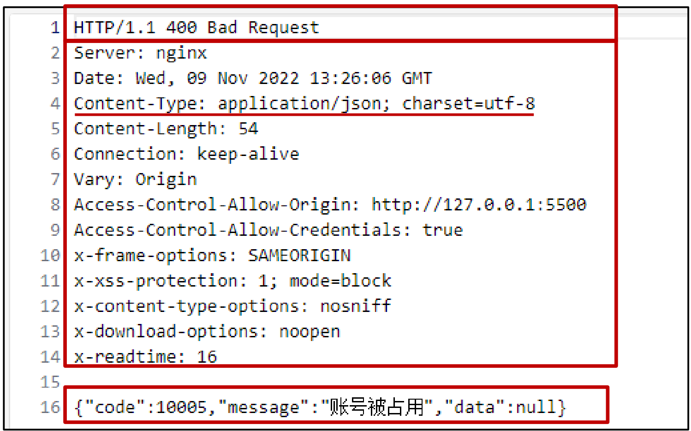
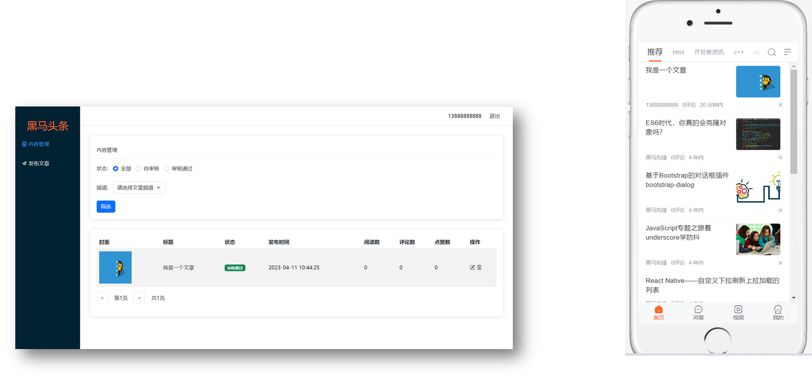
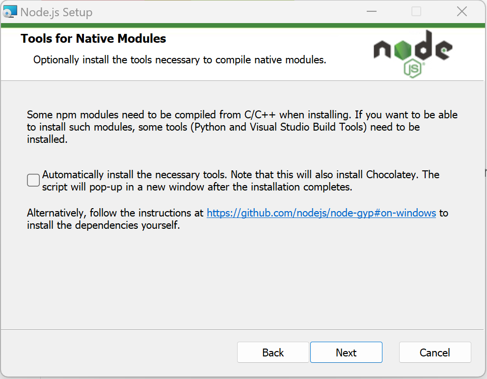
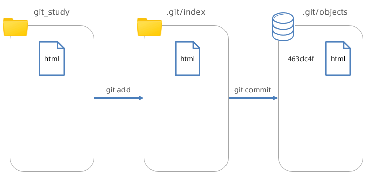

# 框架前置课

# 框架前置课

# 框架前置课

# 第一章 AJAX 入门

## 1. AJAX 概念和 axios 使用

- 什么是 AJAX ？

  简单来说，就是使用 <span data-type="text" style="color: var(--b3-font-color8);">XMLHttpRequest</span> 对象与服务器通信。

  作用：<span data-type="text" style="color: var(--b3-font-color8);">浏览器和服务器之间通信，动态数据交互</span>。
- 怎么用 AJAX ？

  1. 先使用 axios 库，与服务器进行数据通信。

     基于 XMLHttpRequest 封装、代码简单、月下载量在 14 亿次。

     <span data-type="text" style="color: var(--b3-font-color8);">Vue、React 项目中都会用到 axios</span>。
  2. 再学习 XMLHttpRequest 对象的使用，了解 AJAX 底层原理。
- axios 使用

  - 语法

    1. 引入 axios.js：[https://cdn.jsdelivr.net/npm/axios/dist/axios.min.js](https://cdn.jsdelivr.net/npm/axios/dist/axios.min.js)
    2. 使用 axios 函数

       传入<span data-type="text" style="color: var(--b3-font-color8);">配置对象</span>。

       再用 .then 回调函数接收结果，并做后续处理。

       ```js
       axios({
       	url: '目标资源地址'	// 服务器的地址，进行数据交互
       }).then((result) => {
       	// 对服务器返回的数据做后续处理
       })
       ```

  <span data-type="text" style="color: var(--b3-font-color8);">result 是返回的是一个对象，里面的 data 存放着数据</span>。

## 2. 认识 URL

知道作用和组成，方便与后端人员沟通。

- 定义

  <span data-type="text" style="color: var(--b3-font-color8);">统一资源定位符</span>（Uniform Resource Locator，缩写URL），或称定位地址、URL地址，俗称网页地址，简称<span data-type="text" style="color: var(--b3-font-color8);">网址</span>，<span data-type="text" style="color: var(--b3-font-color8);">用于访问网络上的资源</span>。
- 例如

  网络资源：[https://www.baidu.com/index.html](https://www.baidu.com/index.html)

  图片资源：[https://www.itheima.com/images/logo.png](https://www.itheima.com/images/logo.png)

  数据资源：[http://hmajax.itheima.net/api/province](http://hmajax.itheima.net/api/province)
- 组成

  

  1. 协议

     http 协议：超文本传输协议，<span data-type="text" style="color: var(--b3-font-color8);">规定浏览器和服务器之间传输数据的格式</span>。

     
  2. 域名：<span data-type="text" style="color: var(--b3-font-color8);">标记服务器在互联网中方位</span>。

     
  3. 资源路径：<span data-type="text" style="color: var(--b3-font-color8);">标记资源在服务器下的具体位置</span>。

     
  4. ‍

## 3. URL 查询参数

定义：浏览器提供给服务器的<span data-type="text" style="color: var(--b3-font-color8);">额外信息</span>（条件），让浏览器从服务器获取对应的数据。

<div>
<span id="20241203165418-spjrosa" style="display: none;"></span>语法：<span data-type="text" style="color: var(--b3-font-color8);">http://xxxx.com/xxx/xxx?参数名1=值1&amp;参数名2=值2</span>
</div>

- 写在 axios 里

  <span data-type="text" style="color: var(--b3-font-color8);">因为条件写在 url 里容易出错，所以经常把条件写在 </span>​`params`​<span data-type="text" style="color: var(--b3-font-color8);"> 里</span>。

  ​`axios`​<span data-type="text" style="color: var(--b3-font-color8);"> 在运行时把参数名和值，会拼接到 url?参数名=值</span>。

  ```js
  axios({
  	url: '目标资源地址',
  	params:{
  		参数名: 值
  	}
  }).then((result) => {
  	// 对服务器返回的数据做后续处理
  })
  ```

  ```js
  axios({
  	url: 'http://hmajax.itheima.net/api/city',
  	params:{
  		pname: '河南省'
  	}
  }).then((result) => {
  	console.log(result)
  })
  ```

  <span data-type="text" style="color: var(--b3-font-color8);">当 参数名 和 值 同名的时候，可以简写</span>。
- [地区查询案例](C:\Users\12625\OneDrive\桌面\前端\ajax练习\地区查询.html)

## 4. 常用请求方法和数据提交

- 常用请求方法：对服务器资源，要执行的操作。

  |请求方法|操作|
  | -----------------------------------------| -----------------------------------------|
  |<span data-type="text" style="color: var(--b3-font-color8);">get</span>|<span data-type="text" style="color: var(--b3-font-color8);">获取数据</span>|
  |<span data-type="text" style="color: var(--b3-font-color8);">post</span>|<span data-type="text" style="color: var(--b3-font-color8);">数据提交</span>|
  |put|修改数据（全部）|
  |delete|删除数据|
  |patch|修改数据（部分）|

  
- 数据提交

  ```js
  axios({
  	url：'请求的 URL 网址'
  	method：'请求的方法'		//默认 GET 可以省略（不区分大小写）
  	data：{提交的数据}​​
  }).then(result => { })
  ```

> axios 错误处理
>
> - 场景：再次注册相同的账号，会遇到报错信息
>
>   
> - 处理：<span data-type="text" style="color: var(--b3-font-color8);">用更直观的方式，给普通用户展示错误信息</span>
>
>   
> - 语法：<span data-type="text" style="color: var(--b3-font-color8);">在 then() 方法的后面，通过点语法调用 catch 方法</span>，<span data-type="text" style="color: var(--b3-font-color8);">传入回调函数并定义形参</span>
>
>   ```js
>   axios({
>   	// 请求选项
>   }).then(result => {
>   	// 处理数据
>   }).catch(error => {
>   	// 处理数据
>   	alert(error.response.data.massage)
>   })
>   ```
>
>   <span data-type="text" style="color: var(--b3-font-color8);">error 是返回的是一个对象，里面的存放着错误信息</span>，要想得到具体的文字，可在控制台查看文字在 error 的什么属性里。

## 5. HTTP协议-报文

- 请求报文：浏览器按照 HTTP 协议<span data-type="text" style="color: var(--b3-font-color8);">要求的格式</span>，<span data-type="text" style="color: var(--b3-font-color8);">发送给服务器的内容</span>。

  - 请求报文组成部分

    1. <div>
       <span data-type="text" style="color: var(--b3-font-color8);">请求行：请求方法，URL，协议。</span>
       </div>
    2. <span data-type="text" style="color: var(--b3-font-color8);">请求头：以键值对的格式携带的附加信息，比如：Content-Type</span>。
    3. 空行：分隔请求头，空行之后的是发送给服务器的资源。
    4. <span data-type="text" style="color: var(--b3-font-color8);">请求体：发送的资源</span>。

  

  

  - 查看请求报文

    - 请求行 和 请求头

      浏览器 - 检查 - 网络 - Fetch/XHR - 左边的某次请求 - 标头 - 请求标头 - 查看解析结果
    - 请求体

      浏览器 - 检查 - 网络 - Fetch/XHR - 左边的某次请求 - 载荷 - 查看源代码
  - 场景

    <span data-type="text" style="color: var(--b3-font-color8);">通过请求报文排查错误</span>。

    登录时明明账号密码都输对了，死活就是登录不了，这时候就可以<span data-type="text" style="color: var(--b3-font-color8);">在浏览器上查看报文的请求体来确认是不是数据提交的不对</span>。
- 响应报文：服务器按照 HTTP 协议<span data-type="text" style="color: var(--b3-font-color8);">要求的格式</span>，<span data-type="text" style="color: var(--b3-font-color8);">返回给浏览器的内容</span>。

  - 响应报文组成部分

    1. <span data-type="text" style="color: var(--b3-font-color8);">响应行（状态行）</span>：协议、<span data-type="text" style="color: var(--b3-font-color8);">HTTP 响应状态码</span>、<span data-type="text" style="color: var(--b3-font-color8);">状态信息</span>。
    2. <span data-type="text" style="color: var(--b3-font-color8);">响应头</span>：以键值对的格式携带的附加信息，比如：<span data-type="text" style="color: var(--b3-font-color8);">Content-Type</span>。
    3. 空行：分隔请求头，空行之后的是发送给服务器的资源。
    4. <span data-type="text" style="color: var(--b3-font-color8);">响应体</span>：<span data-type="text" style="color: var(--b3-font-color8);">发送的资源</span>。

  

  - HTTP 响应状态码

    用来表明请求是否成功完成

    |状态码|说明|
    | ------| ----------|
    |1xx|信息|
    |2xx|成功|
    |3xx|重定向消息|
    |4xx|客户端错误|
    |5xx|服务端错误|
  - 查看请求报文

    - 请求行 和 请求头

      浏览器 - 检查 - 网络 - Fetch/XHR - 左边的某次请求 - 标头 - 响应标头 - 查看解析结果
    - 请求体

      浏览器 - 检查 - 网络 - Fetch/XHR - 左边的某次请求 - 响应 - 查看源代码

## 6. 接口文档

接口文档：描述<span data-type="text" style="color: var(--b3-font-color8);">接口</span>的文章（后端工程师做的）

接口：使用 AJAX 和服务器通讯时，使用的 <span data-type="text" style="color: var(--b3-font-color8);">URL</span>，<span data-type="text" style="color: var(--b3-font-color8);">请求方法</span>，<span data-type="text" style="color: var(--b3-font-color8);">以及参数</span>。

传送门：[AJAX 阶段接口文档 接口文档](https://apifox.com/apidoc/shared-1b0dd84f-faa8-435d-b355-5a8a329e34a8)。


> ​`axios()` 里的属性 data 如果是一个对象，那么就会把这个对象自动转换成 <span data-type="text" style="color: var(--b3-font-color8);">JSON字符串</span> 提交给服务器了。

## 7.[ form-serialize 插件](C:\Users\12625\OneDrive\桌面\前端\ajax练习\form-serialize.js)

使用 form-serialize 插件提供的 serialize 函数就可以做到一次性获取整个表单的值。

- 语法

  1. 引入 form-serialize 插件 `<script src="form-serialize.js"></script>`​
  2. ​`const data = serialize(form, { hash: true, empty: true })`​
- 参数说明

  - hash 设置获取数据结构

    true：<span data-type="text" style="color: var(--b3-font-color8);">JS对象（推荐）</span>，一般请求体里提交给服务器。

    false:<span data-type="text" style="color: var(--b3-font-color8);"> 查询字符串</span>。

    > <span id="20241203221417-7542nw8" style="display: none;"></span>查询字符串就是 [网址问号后面的东西](#20241203165418-spjrosa)。
    >
    > 如：uname=itheima007&pasword=7654321
    >
  - empty 设置是否获取空值

    true: <span data-type="text" style="color: var(--b3-font-color8);">获取空值（推荐）</span>，数据结构和标签结构一致。

    false：<span data-type="text" style="color: var(--b3-font-color8);">不获取空值</span>。
- <div>
  <span data-type="text" style="color: var(--b3-font-color8);">注意</span>
  </div>

  使用这个的方法的时候，表单里必须有 `name`​ 属性，因为一次性获取的是 `name值: value值`​ 的合集。数据类型是对象。

‍

## 8. [案例 - 用户登录](C:\Users\12625\OneDrive\桌面\前端\ajax练习\登录.html)

‍

# 第二章 AJAX 综合案例

## 1. Bootstrap 弹框

作用：不离开当前页面，显示单独内容，供用户操作。

1. 引入 [bootstrap.css](C:\Users\12625\OneDrive\桌面\前端\ajax练习\bootstrap.min.css) 和 [bootstrap.js](C:\Users\12625\OneDrive\桌面\前端\ajax练习\bootstrap.min.js)。
2. 复制粘贴框架

   ```js
     <div class="modal my-box" tabindex="-1">
       <div class="modal-dialog">
         <!-- 弹框-内容 -->
         <div class="modal-content">
           <!-- 弹框-头部 -->
           <div class="modal-header">
             <h5 class="modal-title">Modal title</h5>
             <button type="button" class="btn-close" data-bs-dismiss="modal" aria-label="Close"></button>
           </div>
           <!-- 弹框-身体 -->
           <div class="modal-body">
             <p>Modal body text goes here.</p>
           </div>
           <!-- 弹框-底部 -->
           <div class="modal-footer">
             <button type="button" class="btn btn-secondary" data-bs-dismiss="modal">Close</button>
             <button type="button" class="btn btn-primary">Save changes</button>
           </div>
         </div>
       </div>
     </div>
   ```
3. 通过自定义属性，控制弹框的显示和隐藏。

   - 在显示弹框按钮上添加自定义属性

     ​`data-bs-toggle="modal" data-bs-target="css选择器"`​​

     css选择器是选择的<span data-type="text" style="color: var(--b3-font-color8);">模态框的选择器</span>，一般要另起类名。
   - 在模态框的关闭按钮上添加自定义属性

     ​`data-bs-dismiss="modal"`​​

     一般就写这，<span data-type="text" style="color: var(--b3-font-color8);">不需要更改属性值</span>。
   - 示例

     

     ```js
       <button type="button" class="btn btn-primary" data-bs-toggle="modal" data-bs-target=".my-box">
         显示弹框
       </button>
       <div class="modal my-box" tabindex="-1">
         <div class="modal-dialog">
           <!-- 弹框-内容 -->
           <div class="modal-content">
             <!-- 弹框-头部 -->
             <div class="modal-header">
               <h5 class="modal-title">Modal title</h5>
               <button type="button" class="btn-close" data-bs-dismiss="modal" aria-label="Close"></button>
             </div>
             <!-- 弹框-身体 -->
             <div class="modal-body">
               <p>Modal body text goes here.</p>
             </div>
             <!-- 弹框-底部 -->
             <div class="modal-footer">
               <button type="button" class="btn btn-secondary" data-bs-dismiss="modal">Close</button>
               <button type="button" class="btn btn-primary">Save changes</button>
             </div>
           </div>
         </div>
       </div>
     ```
4. 通过 JS 控制，弹框显示或隐藏

   - 创建弹框对象

     ​`const modal = new bootstrap.Modal(document.querySelector('CSS选择器'))`​

     css选择器是选择的<span data-type="text" style="color: var(--b3-font-color8);">模态框的选择器</span>，一般要另起类名。
   - 显示隐藏弹框

     ​`modal.show()`​、`modal.hide()`​

     利用这些方法给显示和关闭按钮绑定点击事件。

## 2. 案例 - 图书管理


- 步骤

  1. Bootstrap 弹框
  2. 渲染列表（查）
  3. 新增图书（增）
  4. 删除图书（删）
  5. 编辑图书（改）

## 3. 图片上传

1. 获取<span data-type="text" style="color: var(--b3-font-color8);">图片文件对象</span>

   文件类型表单的 <span data-type="text" style="color: var(--b3-font-color8);">files属性对象</span> 的 <span data-type="text" style="color: var(--b3-font-color8);">0属性</span>，<span data-type="text" style="color: var(--b3-font-color8);">数字属性要用[ ]</span>

   语法：`文件类型表单.files[0]`​
2. 使用 <span data-type="text" style="color: var(--b3-font-color8);">FormData() </span>携带图片文件

   <span data-type="text" style="color: var(--b3-font-color8);">FormData()</span> 是浏览器内置的从构造函数。

   ```js
   const fd = new FormData()
   fd.append('img', 文件类型表单.files[0])
   ```
3. 提交表单数据到服务器，使用<span data-type="text" style="color: var(--b3-font-color8);">图片 url 网址</span>

   ```js
   axios({
     url: 'http://hmajax.itheima.net/api/uploadimg',
     method: 'POST',
     data: fd	// 不用中括号
   })
   ```

   

[案例](C:\Users\12625\OneDrive\桌面\前端\ajax练习\图片上传\index.html)

## 4. [案例 - 网站换肤](C:\Users\12625\OneDrive\桌面\前端\ajax练习\案例_更换背景\index.html)

1. 选择图片上传，设置body背景
2. 上传成功时，本地保存url网址
3. 网页运行后，获取本地url网址使用

## 5. [案例 - 个人信息设置](C:\Users\12625\OneDrive\桌面\前端\ajax练习\案例-个人信息设置\index.html)

1. 信息渲染
2. 头像修改
3. 提交表单
4. 结果提示

# 第三章 AJAX 原理

## 1. XMLHttpRequest（XHR）

- 定义

  <span data-type="text" style="color: var(--b3-font-color8);">XMLHttpRequest（XHR）对象用于与服务器交互</span>。可以在不刷新页面的情况下请求特定 URL，获取数据，这允许<span data-type="text" style="color: var(--b3-font-color8);">网页在不影响用户操作的情况下，更新页面内容</span>。

  ​`XMLHttpRequest`​ 在 AJAX 编程中被大量使用。

  AJAX 是浏览器与服务器通信的技术，采用 XMLHttpRequest对象 相关代码。<span data-type="text" style="color: var(--b3-font-color8);">原理就是XMLHttpRequest 对象</span>。

  个人理解，XHR 是浏览器自带的，原生的与服务器交互的方法。不需要引入 axios.js。
- 关系

  axios 是对 XHR 相关代码进行了封装，让我们只关心传递的接口参数。

  
- 好处

  学习 XHR 也是了解 axios 内部与服务器交互过程的真正原理。

### 1.1 XMLHttpRequest - 基础使用

1. 创建 XMLHttpRequest 对象。
2. 配置请求方法和请求 url 地址。
3. 监听 loadend 事件，接收响应结果。
4. 发起请求

```js
const xhr = new XMLHttpRequest()
xhr.open('请求方法', '请求url网址')
xhr.addEventListener('loadend', () => {
  // 响应结果
  console.log(xhr.response)
})
xhr.send()
```

注意：<span data-type="text" style="color: var(--b3-font-color8);">响应的结果是事件对象的 </span>​<span data-type="text" style="color: var(--b3-font-color8); background-color: var(--b3-font-background4);">response属性</span>​<span data-type="text" style="color: var(--b3-font-color8);">，是字符串，使用时要先用 </span>​<span data-type="text" style="color: var(--b3-font-color8); background-color: var(--b3-font-background4);">JOSN.parse()</span>​<span data-type="text" style="color: var(--b3-font-color8);"> 方法转换成对象</span>。

### 1.2 XMLHttpRequest - 查询参数

<span data-type="text" style="color: var(--b3-font-color8);">在 XHR 中查询参数要使用</span>​[查询字符串](#20241203221417-7542nw8)。

语法：`http://xxxx.com/xxx/xxx?参数名1=值1&参数名2=值2`​

[地区查询-XHR 案例](C:\Users\12625\OneDrive\桌面\前端\ajax练习\地区查询-XHR.html)

### 1.3 XMLHttpRequest - 数据提交

之前用用 axios 提交数据时，数据写在 data 对象里，用 XHR 时，数据写在 send( ) 的括号里，数据要先转换成 JSON字符串。

- 核心

  1. <div>
     <span data-type="text" style="color: var(--b3-font-color8);">请求头设置 Content-Type：application/json</span>
     </div>

     告诉浏览器内容类型为 JSON字符串。

     `xhr.setRequestHeader('Content-Type','application/json')`​
  2. <div>
     <span data-type="text" style="color: var(--b3-font-color8);">请求体携带 JSON字符串</span>
     </div>

     ​`send(转换成JSON字符串的数据)`​

## 2. Promise

promise 对象用于表示（管理）一个[异步](JavaScript.md#20241205172841-bdh7erb)操作的最终完成（或失败）及其<span data-type="text" style="color: var(--b3-font-color8);">结果值</span>的对象。

AJAX 发起请求到返回响应的过程也需要时间，所以 AJAX 也是异步代码。

- 示例

  <span id="20241205175240-2q3ta6p" style="display: none;"></span>```js
  // 1. 创建Promise对象
  const p = new Promise((resolve, reject) => {
  // 2. 执行异步代码
  setTimeout(() => {
  // resolve('模拟AJAX请求-成功结果')
  // reject(new Error('模拟AJAX请求-失败结果'))
  }, 2000)
  })
  // 3. 获取结果
  p.then(result => {
  console.log(result)
  }).catch(error => {
  console.log(error)
  })

  ```

  * 个人理解

    Promise() 是浏览器内置的构造函数，里面有两个参数 resolve 和 reject。

    函数体里是异步代码。

    如果异步代码执行成功，就返回 resolve  的结果；否则返回 reject 的结果。

    最后再用 `Promise对象.then().catch()`​​ 来接收结果。

    ​`.then`​​ 接收的结果 <span data-type="text" style="color: var(--b3-font-color8);">result</span> 是 <span data-type="text" style="color: var(--b3-font-color8);">resolve()</span> 括号里的东西。

    ​`.catch`​ 接收的结果 <span data-type="text" style="color: var(--b3-font-color8);">error</span> 是 <span data-type="text" style="color: var(--b3-font-color8);">reject(new Error())</span> 内层括号里的东西。

  ```
- Promise 的好处是什么？

  - 逻辑更清晰（成功或失败会关联后续的处理函数）
  - 了解 axios 函数内部运作的机制

    
  - 能解决回调函数地狱问题（后面会讲到），今天先来看下它的基础使用
- Promise - 三种状态

  作用：了解Promise对象如何关联的处理函数，以及代码执行顺序。

  - 一个Promise对象，必然处于以下几种状态之一

    待定（pending） ：初始状态，既没有被兑现，也没有被拒绝。

    已兑现（fulfilled） ：意味着，操作成功完成。

    已拒绝（rejected） ：意味着，操作失败。

  

  可以在控制台打印 <span data-type="text" style="color: var(--b3-font-color8);">Promise对象</span>，有一个属性可以表示当前的状态。

  - <span data-type="text" style="color: var(--b3-font-color8);">注意：Promise对象一旦被兑现/拒绝 ，状态无法再被改变</span>。

    就比如[这里的代码](#20241205175240-2q3ta6p)，如果 resolve 和 reject 同时不被注释，返回的是 resolve，因为执行到 resolve 时，promise就从 <span data-type="text" style="color: var(--b3-font-color8);">pending待定状态</span> 变成了 <span data-type="text" style="color: var(--b3-font-color8);">fulfilled已兑现状态</span>，就无法改变了。

## 3. Promise + XHR 案例

使用Promise + XHR 获取省份列表，并展示到页面上

1. 创建 Promise 对象
2. 执行 XHR 异步代码，获取省份列表
3. 关联成功或失败函数，做后续处理

```js
// 1. 创建Promise对象
const p = new Promise((resolve, reject) => {
  // 2. 执行XHR异步代码，获取省份列表
  const xhr = new XMLHttpRequest()
  xhr.open('GET', 'http://hmajax.itheima.net/api/province')
  xhr.addEventListener('loadend', () => {
    // xhr如何判断响应成功还是失败的？
    // 2xx开头的都是成功响应状态码
    if (xhr.status >= 200 && xhr.status < 300) {
      resolve(JSON.parse(xhr.response))
    } else {
      reject(new Error(xhr.response))
    }
  })
  xhr.send()
})

// 3. 关联成功或失败函数，做后续处理
p.then(result => {
  console.log(result)
  document.querySelector('.my-p').innerHTML = result.list.join('<br>')
}).catch(error => {
  // 错误对象要用console.dir详细打印
  console.dir(error)
  // 服务器返回错误提示消息，插入到p标签显示
  document.querySelector('.my-p').innerHTML = error.message
})
```

> 1. **如何判断响应是否成功**
>
>    如果状态码是 2 开头的（2xx），那就响应成功，否则失败。
> 2. **错误对象要用**​<span data-type="text" style="color: var(--b3-font-color8);"> </span>​**​**​**​**​**​`console.dir()`​**​**​**​**​** <span data-type="text" style="color: var(--b3-font-color8);"> </span>​**详细打印**

## 4. 封装简易版 axios

```js
function myAxios(config) {
  return new Promise((resolve, reject) => {
	// 如果有 params 对象
    if (config.params) {
	  // 使用URLSearchParams转换，并携带到url上
      const paramsObj = new URLSearchParams(config.params)
      const queryString = paramsObj.toString()
      config.url += `?${queryString}`
    }

	// 创建 XMLHttpRequest 对象
	const xhr = new XMLHttpRequest()
	// 利用逻辑中断设置默认请求方法：GET
    xhr.open(config.method || 'GET', config.url)
    xhr.addEventListener('loadend', () => {
	  // xhr如何判断响应成功还是失败，2xx开头的都是成功响应状态码
      if (xhr.status >= 200 && xhr.status < 300) {
        resolve(JSON.parse(xhr.response))
      } else {
        reject(new Error(xhr.response))
      }
    })
    // 如果有 data 对象
    if (config.data) {
	  // 请求头设置 Content-Type：application/json
	  xhr.setRequestHeader('Content-Type', 'application/json')
      // 把 data 转换成 JSON字符串，在send中发送
      const jsonStr = JSON.stringify(config.data)
	  // 携带数据发起请求
      xhr.send(jsonStr)
    } else {
      // 如果没有请求体数据，正常的发起请求
      xhr.send()
    }
  })
}
```

## 5. [案例 - 天气预报](C:\Users\12625\OneDrive\桌面\前端\ajax练习\案例_天气预报\index.html)

> **在JS里被渲染过的标签，在渲染函数外面添加绑定事件无效**。

‍

# 第四章 AJAX 进阶

## 1. [同步代码和异步代码](JavaScript.md#20241206152926-tbarbpy)

同步代码：<span data-type="text" style="color: var(--b3-font-color8);">逐行执行，需原地等待结果后，才继续向下执行</span>。

异步代码：<span data-type="text" style="color: var(--b3-font-color8);">调用后耗时，不阻塞代码继续执行（不必原地等待），在将来完成后触发一个回调函数</span>。

## 2. 回调函数地狱和 Promise 链式调用

### 2.1 回调函数地狱

概念：<span data-type="text" style="color: var(--b3-font-color8);">在回调函数中嵌套回调函数，一直嵌套下去就形成了回调函数地狱</span>。

- 最外面的 then 是第一个回调函数的，最里面的 then 是第三个回调函数的。

  ```js
  axios({}).then(result => {
  	anxios({}).then(result => {
  		anxios({}).then(result => {
  		})
  	})
  })
  ```
- 示例

  需求：

  展示默认第一个省，第一个城市，第一个地区在下拉菜单中。

  

  <span id="20241206154540-vdys5bw" style="display: none;"></span>```js
  axios({ url: 'http://hmajax.itheima.net/api/province' }).then(result => {
  const pname = result.data.list[0]
  document.querySelector('.province').innerHTML = pname
  // 获取第一个省份默认下属的第一个城市名字
  axios({ url: 'http://hmajax.itheima.net/api/city', params: { pname } }).then(result => {
  const cname = result.data.list[0]
  document.querySelector('.city').innerHTML = cname
  // 获取第一个城市默认下属第一个地区名字
  axios({ url: 'http://hmajax.itheima.net/api/area', params: { pname, cname } }).then(result => {
  document.querySelector('.area').innerHTML = result.data.list[0]
  })
  })
  })

  ```
  ```
- 缺点：<span data-type="text" style="color: var(--b3-font-color8);">可读性差，异常无法捕获，耦合性严重，牵一发动全身</span>。

  比如：只给最外层的 axios() 加 then()，如果最内层出现错误，则无法捕获。除非每一层都添加 then()，就非常麻烦。

### 2.2 Promise 链式调用

- 概念：<span data-type="text" style="color: var(--b3-font-color8);">依靠 then() 方法会返回一个新生成的 Promise 对象特性</span>，继续串联下一环任务，直到结束。
- 第一个 then 是第一个回调函数的

  ```js
  axios({}).then(result => {
  	return anxios({})
  }).then(result => {
  	return anxios({})
  }).then(result => {})
  ```
- 细节：then() 回调函数中的<span data-type="text" style="color: var(--b3-font-color8);">返回值</span>，会影响新生成的 Promise 对象最终状态和结果。
- 好处：通过链式调用，解决回调函数嵌套问题。


- 对 [上面回调函数地狱](#20241206154540-vdys5bw) 的改进

  <span id="20241206161717-rizl58v" style="display: none;"></span>```js
  // 声明这些名字，方便夸作用域使用
  let pname, cname, aname
  // 得到 获取省份的 Promise对象
  axios({ url: 'http://hmajax.itheima.net/api/province' }).then(result => {
  // console.log(result);
  pname = result.data.list[0]
  document.querySelector('.province').innerHTML = pname
  // 返回一个城市 Promise对象
  return axios({ url: 'http://hmajax.itheima.net/api/city', params: { pname } })
  }).then(result => {
  cname = result.data.list[0]
  document.querySelector('.city').innerHTML = cname
  // 返回一个地区 Promise对象
  return axios({ url: 'http://hmajax.itheima.net/api/area', params: { pname, cname } })
  }).then(result => {
  aname = result.data.list[0]
  document.querySelector('.area').innerHTML = aname
  })

  ```

  ```

## 3. async 和 await 使用

解决回调函数地狱的终极解决方案

- 概念：<span data-type="text" style="color: var(--b3-font-color8);">在 async 函数内，使用 await 关键字取代 then 函数，等待获取 Promise 对象成功状态的结果值</span>。
- 对上面 [回调函数地狱](#20241206154540-vdys5bw) 和 [Promise链式调用](#20241206161717-rizl58v) 的终极改进

  ```js
      async function getPlace() {
  	  try {
  	    const pObj = await axios({ url: 'http://hmajax.itheima.net/api/province' })
          const pname = pObj.data.list[0]
          const cObj = await axios({ url: 'http://hmajax.itheima.net/api/city', params: { pname } })
          const cname = cObj.data.list[0]
          const aObj = await axios({ url: 'http://hmajax.itheima.net/api/area', params: { pname, cname } })
          const aname = aObj.data.list[0]
          document.querySelector('.province').innerHTML = pname
          document.querySelector('.city').innerHTML = cname
          document.querySelector('.area').innerHTML = aname
  	  } catch(error) {
  	  	console.dir(error)
  	  }
      }
      getPlace()
  ```
- async 可以修饰函数，好像是浏览器自带的，不是 axios 插件里的。
- await  等这一行代码执行完才会执行下一行，可以取代 then()。
- 使用 [try / catch](JavaScript.md#20241206174442-p4s4013) 捕获错误

  <span data-type="text" style="color: var(--b3-font-color8);">把可能出错的代码放在 try 里，在 catch 里捕获</span>。

  <span data-type="text" style="color: var(--b3-font-color8);">try 里面的代码一旦发生错误，那发生错误的代码下面的代码就不执行了，中断了</span>。

## 4. 事件循环-EventLoop

在 js 基础里讲过：[传送门](JavaScript.md#20241206180400-7qh58x5)

- 总结

  1. 什么是事件循环？

     执行代码和收集异步任务，在调用栈空闲时，反复调用任务队列里 回调函数执行机制。
  2. 为什么有事件循环？

     <span data-type="text" style="color: var(--b3-font-color8);">JavaScript 是单线程的，为了不让耗时的异步任务阻塞 JS 引擎</span>，设计执行代码的模型。
  3. JavaScript 内代码如何执行？

     执行同步代码，遇到异步代码交给宿主浏览器环境执行。

     异步有了结果后，把回调函数放入任务队列排队。

     当调用栈空闲后，反复调用任务队列里的回调函数。
- 练习

  请说出下面代码打印的结果

  ```js
  console.log(1)
  setTimeout(() => {
    console.log(2)
  }, 0)
  function myFn() {
    console.log(3)
  }
  function ajaxFn() {
    const xhr = new XMLHttpRequest()
    xhr.open('GET', 'http://hmajax.itheima.net/api/province')
    xhr.addEventListener('loadend', () => {
      console.log(4)
    })
    xhr.send()
  }
  for (let i = 0; i < 1; i++) {
    console.log(5)
  }
  ajaxFn()
  document.addEventListener('click', () => {
    console.log(6)
  })
  myFn()
  ```

  - 答案：

    1 5 3 2 4
  - 解释：

    先打印 1 5 没问题，然后 myFn() 是同步任务，所以接着打印 3，现在执行异步代码，第一个异步代码是定时器，等待0秒，所以接着打印 2，第二个异步代码是加载完毕 'loadend' 事件，事件加载完就执行，所以接着打印 4，第三个异步任务是点击 'click' 事件，只有点击才会打印 6。

## 5. 宏任务与微任务

ES6 之后引入了 Promise 对象， 让 JS 引擎也可以发起异步任务。

- 异步任务分为

  宏任务：由浏览器环境执行的异步代码。

  微任务：由 JS 引擎环境执行的异步代码。

|任务（代码）|执行所在环境|
| -------------------------| ------------|
|JS 脚本执行事件（script）|浏览器|
|setTimeout / setInterval|浏览器|
|AJAX 请求完成事件|浏览器|
|用户交互事件等|浏览器|
|Promise对象.then()|JS 引擎|

<span data-type="text" style="color: var(--b3-font-color8);">Promise 本身是同步的，而 then 和 catch 回调函数是异步的</span>。

<div>
<span data-type="text" style="color: var(--b3-font-color8);">异步任务执行顺序：微任务 &gt; 宏任务</span>
</div>

- JavaScript 内代码如何执行？

  1. 执行第一个 script 脚本事件宏任务，里面同步代码。
  2. 遇到 宏任务/微任务 交给宿主环境，有结果回调函数进入对应队列。
  3. 当执行栈空闲时，清空微任务队列，再执行下一个宏任务，从1再来。
- 经典面试题

  请说出下面代码打印的结果

  ```js
  // 第一块
  console.log(1)
  // 第二块
  setTimeout(() => {
    console.log(2)
    const p = new Promise(resolve => resolve(3))
    p.then(result => console.log(result))
  }, 0)
  // 第三块
  const p = new Promise(resolve => {
    setTimeout(() => {
      console.log(4)
    }, 0)
    resolve(5)
  })
  // 第四块
  p.then(result => console.log(result))
  // 第五块
  const p2 = new Promise(resolve => resolve(6))
  // 第六块
  p2.then(result => console.log(result))
  // 第七快
  console.log(7)
  ```

  - 答案：

    1 7 5 6 2 3 4
  - 解释[传送门](https://www.bilibili.com/video/BV1MN411y7pw/?buvid=XU438614F5BE12B4A3085523DEA8CD0D12058&from_spmid=main.my-history.0.0&is_story_h5=false&mid=wouveTrjg5FpaMQQTq6DLA==&p=56&plat_id=122&share_from=ugc&share_medium=android&share_plat=android&share_session_id=90f2e160-3532-4dc2-b797-a8f485719b41&share_source=WEIXIN&share_tag=s_i&spmid=united.player-video-detail.0.0&timestamp=1733483899&unique_k=HNduTD3&up_id=37974444)（建议画图演示）

    1. 先执行同步任务

       - 先看第一块：

         打印，直接被宿主环境分配到调用栈执行，输出 **1**。
       - 接着看第二块：

         是定时器，<span data-type="text" style="background-color: var(--b3-card-error-background); color: var(--b3-card-error-color);">整个被宿主环境被分配到 宏任务队列</span>。
       - 接着看第三块：

         Promise本身是同步任务，<span data-type="text" style="background-color: var(--b3-card-error-background); color: var(--b3-card-error-color);">里面的定时器被宿主环境分配到 宏任务队列</span>，然后resolve(5)，被分配到调用栈被执行了，但没有输出。
       - 接着看第四块：

         <span data-type="text" style="background-color: var(--b3-card-success-background); color: var(--b3-card-success-color);">调用 p 的 then() 函数，被宿主环境分配到 微任务队列</span>。
       - 接着看第五块：

         Promise本身是同步任务，直接被宿主环境分配到调用栈执行，但并没有输出什么。
       - 接着看第六块：

         <span data-type="text" style="background-color: var(--b3-card-success-background); color: var(--b3-card-success-color);">调用 p2 的 then() 函数，被宿主环境分配到 微任务队列</span>。
       - 接着看第七块：

         打印，直接被宿主环境分配到调用栈执行，输出 **7**。
    2. 再执行微任务

       现在微任务队列有 第四块 和 第六块。

       - 先看第四块：

         调用 p 的 then() 函数，输出 **5**。
       - 再看第六块：

         调用 p2 的 then() 函数，输出 **6**。
    3. 最后执行宏任务

       现在宏任务队列有 第二块 和 第三块的定时器

       - 先看第二块：

         延时定时器，0秒，里面有三个任务

         第一个打印，直接执行输出 **2**；

         第二个 Promise 本身是同步任务，直接执行，但并没有输出什么；

         第三个 调用上一个 Promise 对象的 then() 函数，输出 **3**。
       - 再看第三块的定时器：

         延时定时器，0秒，输出 **4**。

       ‍

    

## 6. Promise.all 静态方法

- 概念

  合并多个 Promise 对象，等待所有同时成功完成（或某一个失败），做后续逻辑。


- 语法

  ```js
  const pAll = Promise.all([Promise对象, Promise对象, ···])
  pAll.then(result => {	// 只有所有 Promise对象 都成功，才执行
  	// result 结果：[Promise对象成功结果, Promise对象成功结果, ···]
  }).catch(error => {		// 其中一个 Promise对象 成功后，就执行
  	// error 结果：第一个失败的 Promise对象 抛出的异常
  })
  ```
- 小案例 - 同时获取4个城市的天气

  ```js
  	const codes = ['110100', '310100', '440100', '440300']
      const promiseAll = Promise.all(codes.map((item) => { return axios({ url: 'http://hmajax.itheima.net/api/weather', params: { city: item } }) }))
      promiseAll.then(result => {
        document.documentElement.innerHTML = result.map(item => { return `${item.data.data.area}:${item.data.data.weather}` }).join('<br>')
      }).catch(error => {
        console.dir(error)
      })
  ```

## 6. [案例 - 商品分类](C:\Users\12625\OneDrive\桌面\前端\ajax练习\商品分类\index.html)

<span data-type="text" style="color: var(--b3-font-color8);">这个值得深思</span>。

- 需求

  尽可能同时展示所有商品分类到页面上。
- 步骤

  1. 获取所有的一级分类数据。
  2. 遍历id，创建获取二级分类请求。
  3. 合并所有二级分类Promise对象。
  4. 等待同时成功，开始渲染页面

> ​`${}`​ 里面还可以嵌套 `${}`​

## 7. [案例 - 学习反馈](C:\Users\12625\OneDrive\桌面\前端\ajax练习\案例_学习反馈\index.html)

- 省市区切换

  1. 设置省份数据到下拉菜单。
  2. 切换省份，设置城市数据到下拉菜单，并清空地区下拉菜单。
  3. 切换城市，设置地区数据到下拉菜单。
- 数据提交

  1. 监听提交按钮的点击事件。
  2. 依靠插件收集表单数据。
  3. 基于 axios 提交保存，显示结果。

‍

# 第五章 黑马头条-数据管理平台

黑马头条-数据管理平台：对IT资讯移动网站的数据，进行数据管理

数据管理平台-演示：配套代码在本地运行

移动网站-演示： [http://geek.itheima.net/](http://geek.itheima.net/)



- 功能：

  1.登录和权限判断

  2.查看文章内容列表（筛选，分页）

  3.编辑文章（数据回显）

  4.删除文章

  5.发布文章（图片上传，富文本编辑器）
- 技术：

  基于 Bootstrap 搭建网站标签和样式

  集成 wangEditor 插件实现富文本编辑器

  使用原生 JS 完成增删改查等业务

  基于 axios 与黑马头条线上接口交互

  使用 axios 拦截器进行权限判断
- <div>
  <span data-type="text" style="color: var(--b3-font-color8);">项目准备：准备配套的素材代码</span>
  </div>

  包含：html，css，js，静态图片，第三方插件等等

  目录管理：建议这样管理，方便查找

  assets：资源文件夹（图片，字体等）

  lib：资料文件夹（第三方插件，例如：form-serialize）

  page：页面文件夹

  utils：实用程序文件夹（工具插件）

  

  - <div>
    <span data-type="text" style="color: var(--b3-font-color8);">在 utils/request.js 配置 axios 请求基地址</span>
    </div>

    作用：提取公共前缀地址，配置后 axios 请求时自动 baseURL + url

    ```js
    axios.defaults.baseURL = 'http://geek.itheima.net'
    ```

## 1. 验证码登录

因为短信接口不是免费的，防止攻击者恶意盗刷，所以完成验证码登录，后端设置验证码默认为 246810。

1. 收集手机号和验证码数据
2. 基于 axios 调用验证码登录接口
3. 使用 Bootstrap 的 Alert 警告框反馈结果给用户


- 验证码登录流程

  

## 2. 内容页

### 2.1 token令牌字符串 判断是否有登录状态等，控制访问权限

1. <span data-type="text" style="color: var(--b3-font-color8);">在 utils/auth.js </span>设置如果本地没有 token 令牌字符串，则强制跳转到登陆页面。
2. 在登录页面的 JS 里添加登录成功后，把 <span data-type="text" style="color: var(--b3-font-color8);">result.data.datatoken</span>（token 令牌字符串）保存在本地。

- token 的作用

  <span data-type="text" style="color: var(--b3-font-color8);">判断是否有登录状态等</span>。
- <div>
  <span data-type="text" style="color: var(--b3-font-color8);">注意</span>
  </div>

  前端只能判断 token 的有无。

  后端通过解密可以提取 token 字符串的原始信息，判断有效性。

### 2.2 个人信息设置

#### 2.2.1 <span data-type="text" style="color: var(--b3-font-color8);">axios请求拦截器</span>

> 出现了一个新参数：<span data-type="text" style="color: var(--b3-font-color8);">header</span>
>
> ```js
> axios({
> 	url: '服务器地址'
> 	header: {
> 		Authorization: `Brarer ${localStorage.getItem('token')}`
> 	}
> })
> ```
>
> 

- 问题：但是一个项目有很多接口，都需要携带 token令牌字符串，每次都要写一遍 `` Authorization: `Brarer ${localStorage.getItem('token')} ``​​ 这个代码吗？

  axios 提供了一种技术叫 <span data-type="text" style="color: var(--b3-font-color8);">请求拦截器</span>，<span data-type="text" style="color: var(--b3-font-color8);">可以在响应之前，统一设置公共的配置选项，比如 header 的参数</span>。

  ```js
  axios.interceptors.request.use(function (config) {
    // 在发送请求之前做些什么
    // 如果本地有 token，就让请求头的 Authorization参数 等于 token值
    const token = localStorage.getItem('token')
    token && (config.headers.Authorization = `Brarer ${'token'}`)
    return config
  }, function (error) {
    // 对请求错误做些什么
    return Promise.reject(error)
  })

  // 接着就可以直接请求，不用写 请求头 部分了。
  axios({
    url: '/v1_0/user/profile'
  })
  ```

  一般不用第二个函数体，因为开发时用的很少。

#### 2.2.2 <span data-type="text" style="color: var(--b3-font-color8);">axios响应拦截器</span> 和 身份验证失败

响应<span data-type="text" style="color: var(--b3-font-color8);">拦截器</span>，<span data-type="text" style="color: var(--b3-font-color8);">响应回到 then/catch 之前，触发的拦截函数，对响应结果统一处理</span>。

```js
axios.interceptors.response.use(function (response) {
  // 2xx 范围内的状态码都会触发该函数。
  // 一般在响应结果成功的函数体里优化一下 result
  result = response.data	// 这样在 then() 里的数据就可以少写一个 data 了 
  return result;
}, function (error) {
  // 超出 2xx 范围的状态码都会触发该函数。
  // 对响应错误做点什么，例如：判断响应状态为 401 代表身份验证失败
  // 相当于 error && error.response && error.response.status === 401
  if (error?.response?.status === 401) {
    alert('登录状态过期，请重新登录')
    window.location.href = '../login/index.html'
  }
  return Promise.reject(error);
});
```

### 2.3 内容管理-文章列表展示

1. 准备查询参数对象
2. 获取文章列表数据
3. 展示到指定的标签结构中

## 3. 发布文章页

### 3.1 富文本编辑器

富文本：带样式，多格式的文本，在前端一般使用标签配合内联样式实现。

富文本编辑器：用于编写富文本内容的容器。


使用：wangEditor 插件

[步骤](https://www.wangeditor.com/v5/getting-started.html)：参考文档

1. 引入 [CSS 定义样式](https://unpkg.com/@wangeditor/editor@latest/dist/css/style.css)

   可自定义编辑器、工具栏的尺寸、边框、`z-index` 等样式。

   ```html
   <link href="https://unpkg.com/@wangeditor/editor@latest/dist/css/style.css" rel="stylesheet"/>
   <style>
     #editor—wrapper {
       border: 1px solid #ccc;
       z-index: 100; /* 按需定义 */
     }
     #toolbar-container {
       border-bottom: 1px solid #ccc;
     }
     #editor-container {
       height: 500px;
     }
   </style>
   ```
2. 定义 HTML 结构

   ```html
   <div id="editor—wrapper">
     <div id="toolbar-container"><!-- 工具栏 --></div>
     <div id="editor-container"><!-- 编辑器 --></div>
   </div>
   ```

   如果想要“全屏”功能，则要求工具栏、编辑器 DOM 节点必须是同一层级

   当然，工具栏、编辑器 DOM 节点也可自由组合，例如 [仿腾讯文档 demo](https://www.wangeditor.com/demo/like-qq-doc.html)

   一般在 富文本框HTML 结构下面会有一个隐藏的 <textarea> 标签，记录富文本内容-用于表单收集。因为 富文本框 里的内容可以同步到 <textarea> 里。
3. 引入 JS 创建编辑器

   ```js
   // 创建编辑器函数，创建工具栏函数
   const { createEditor, createToolbar } = window.wangEditor
   // 编辑器的配置对象
   const editorConfig = {
     // 占位符，提示文字
     placeholder: '发布文章的内容',
     // 编辑器内容变化时的回调函数
     onChange(editor) {
       // 获取编辑器内容、标签、样式，因为富文本框里文字的形式都是通过标签和css控制的
       const html = editor.getHtml()
       // console.log('editor content', html)
       // 也可以同步到 <textarea>，为后续手机整个表单内容做铺垫
       // document.querySelector('文本框的选择器').value = html
     },
   }
   // 创建编辑器
   const editor = createEditor({
     // 编辑器创建的位置
     selector: '#editor-container',
     // 编辑器的默认内容
     html: '<p><br></p>',
     // 编辑器配置对象
     config: editorConfig,
     // 编辑器模式：default全部、simple简洁
     mode: 'default', // or 'simple'
   })
   // 工具栏配置
   const toolbarConfig = {}
   // 创建工具栏
   const toolbar = createToolbar({
     // 为指定编辑器创建工具栏
     editor,
     // 工具栏创建的位置
     selector: '#toolbar-container',
     // 工具栏配置对象
     config: toolbarConfig,
     // 工具栏模式：default全部、simple简洁
     mode: 'default', // or 'simple'
   })
   ```
4. 监听内容改变，保存在隐藏文本域（便于后期收集）

### 3.2 频道列表

有两处要用到，所以封装成一个函数。

1. 获取频道列表数据
2. 展示到下拉菜单中​


### 3.3 封面设置

1. 准备标签结构和样式
2. 选择文件并保存在 FormData()
3. 单独上传图片并得到图片 URL 地址
4. 回显并切换 img 标签展示（隐藏 + 号上传标签）

注意：图片地址临时存储在 img 标签上，并未和文章关联保存


### 3.4 收集并保存

1. 基于 form-serialize 插件收集表单数据对象
2. 基于 axios 提交到服务器保存
3. 调用 Alert 警告框反馈结果给用户
4. 重置表单并跳转到列表页

‍

## 4. <span data-type="text" style="color: var(--b3-font-color8);">由于服务器 请求头参数 原因，用户的身份信息缺失，很遗憾，该项目停止。</span>

完整代码可以参考[老师写的代码](C:\Users\12625\OneDrive\桌面\前端\框架前置课\02.黑马头条数据管理平台)。

## 总结

> 文件管理结构
>
> 基地址
>
> token令牌字符串
>
> axios请求拦截器
>
> axios响应拦截器
>
> 富文本编辑器
>
> window.location.search 是此页面网址问号后面的查询字符串。（window 一般省略不写）
>
> Object.key() 方法可以把对象的属性取出来，返回一个数组。

# 第六章 Node.js 入门

- 为什么 JavaScript 可以在浏览器中被执行？

  因为浏览器内置有 JS 的解析引擎，其中 Chrom 浏览器的 V8 解析引擎性能最好。
- 为什么 JavaScript 可以操作 DOM 和 BOM？

  每个浏览器都<span data-type="text" style="color: var(--b3-font-color8);">内置了 DOM、BOM 这样的 API 函数</span>，因此，浏览器中的 JavaScript 才可以调 用它们。
- 浏览器中的 JavaScript 运行环境

  运行环境是指代码正常运行所需的必要环境。

  ① V8 引擎负责解析和执行 JavaScript 代码。

  ② 内置 API 是由运行环境提供的特殊接口， 只能在所属的运行环境中被调用。
- JavaScript 能否做后端开发

  JavaScript 可以借助 Node.js 做后端开发。

## 1. Node.js 简介

Node.js 是一个跨平台 JavaScript <span data-type="text" style="color: var(--b3-font-color8);">运行环境</span>，使开发者可以搭建服务器端的 JavaScript <span data-type="text" style="color: var(--b3-font-color8);">应用程序</span>。

- 什么是 Node.js

  Node.js 是一个基于 Chrome V8 引擎的 JavaScript 运行环境。

  Node.js 的官网地址： [https://nodejs.org/zh-cn/](https://nodejs.org/zh-cn/)
- Node.js 中的 JavaScript 运行环境

  ① <span data-type="text" style="color: var(--b3-font-color8);">浏览器</span>是 JavaScript 的<span data-type="text" style="color: var(--b3-font-color8);">前端运行环境</span>。

  ② <span data-type="text" style="color: var(--b3-font-color8);">Node.js </span>是 JavaScript 的<span data-type="text" style="color: var(--b3-font-color8);">后端运行环境</span>。

  ③ Node.js 中<span data-type="text" style="color: var(--b3-font-color8);">无法调用</span> DOM 和 BOM 等 <span data-type="text" style="color: var(--b3-font-color8);">浏览器内置 API</span>。
- Node.js 可以做什么

  Node.js 作为一个 JavaScript 的运行环境，仅仅提供了基础的功能和 API。然而，基于 Node.js 提供的这些基础能，很多强大 的工具和框架如雨后春笋，层出不穷，所以学会了 Node.js ，可以让前端程序员胜任更多的工作和岗位：

  ① 基于 Express 框架（http://www.expressjs.com.cn/），可以快速构建 Web 应用

  ② 基于 Electron 框架（https://electronjs.org/），可以构建跨平台的桌面应用

  ③ 基于 restify 框架（http://restify.com/），可以快速构建 API 接口项目

  ④ 读写和操作数据库、创建实用的命令行工具辅助前端开发、etc…
- Node.js 的学习路径

  Node.js 内置 API 模块（fs、path、http等）+ 第三方 API 模块（express、mysql 等）

### 1.1 作用：使用 Node.js 编写服务器端程序

1. 编写数据接口，提供网页资源浏览功能等等。
2. 前端工程化：为后续学习 Vue 和 React 等框架做铺垫

   开发项目直到上线，过程中集成的所有<span data-type="text" style="color: var(--b3-font-color8);">工具和技术</span>。

   Node.js 是前端工程化的基础（因为 Node.js 可以主动读取前端代码内容）

   

### 1.2 Node.js 为何能执行 JS

首先：浏览器能执行 JS 代码，依靠的是内核中的<span data-type="text" style="color: var(--b3-font-color8);"> V8 引擎</span>（C++ 程序）。

其次：Node.js 是基于 Chrome V8 引擎进行封装（运行环境）。

区别：都支持 ECMAScript 标准语法，Node.js 有独立的 API。


注意：<span data-type="text" style="color: var(--b3-font-color8);">Node.js 环境没有 DOM 和 BOM 等</span>。

### 1.3 Node.js 安装

Node.js 的官网地址： [https://nodejs.org/zh-cn/](https://nodejs.org/zh-cn/)

安装过程：默认下一步即可。

- 注释事项

  1. 安装在非中文路径下。
  2. 无需勾选自动安装其他配套软件 。

     
- 成功验证

  - 打开 cmd 终端，输入 node -v 命令查看版本号。

    
  - 在VS Code 中按 <span data-type="text" style="background-color: var(--b3-card-success-background); color: var(--b3-card-success-color);">   ctrl + `   </span> 也可以打开终端。要切换到 cmd 终端。

    

### 1.4 使用 Node.js

需求：新建 JS 文件，并编写代码后，在 node 环境下执行。

命令：在 VSCode 集成终端中，<span data-type="text" style="color: var(--b3-font-color8);">输入 node xxx.js，回车即可执行</span>。


<span data-type="text" style="color: var(--b3-font-color8);">到这里才明白 Node.js</span> <span data-type="text" style="color: var(--b3-font-color8);">和 C语言、C++、java、python 是一类的</span>。

### 1.5 终端中的快捷键

① 使用 ↑ 键，可以快速定位到上一次执行的命令

② 使用 tab 键，能够快速补全路径

③ 使用 esc 键，能够快速清空当前已输入的命令

④ 输入 cls 命令，可以清空终端

### 1.6 总结

1. Node.js 是什么？

   基于 Chrome 的 V8 引擎封装，独立执行 JavaScript 代码的环境，也是一个软件。
2. Node.js 与浏览器环境的 JS 最大区别？

   Node.js 环境中没有 BOM 和 DOM。
3. Node.js 有什么用？

   编写后端程序：提供数据和网页资源等。

   前端工程化：集成各种开发中使用的工具和技术。
4. Node.js 如何执行代码？

   在 VSCode 终端中输入：node xxx.js 回车即可执行。（注意路径）

## 2. Node.js 模块

模块：<span data-type="text" style="color: var(--b3-font-color8);">类似插件，封装了方法/属性</span>。

### 2.1 fs 模块 - 读写文件

<span data-type="text" style="color: var(--b3-font-color8);">封装了与本机文件系统进行交互的，方法/属性</span>。

- 语法

  1. <div>
     <span data-type="text" style="color: var(--b3-font-color8);">加载 fs 模块对象</span>
     </div>

     ​`const fs = require('fs')`​  fs 是模块标识符，模块的名字
  2. <div>
     <span data-type="text" style="color: var(--b3-font-color8);">写入文件内容</span>
     </div>

     ​`fs.writeFile('文件路径', '写入内容', err => { })`​

     ```js
     fs.writeFile('./test.txt', 'Hello, Node.js', err => {
       if (err) console.log(err)		// 如果失败，就打印失败的结果，如果成功，error的值为null
       else console.log('写入成功')	// 否则输出：写入成功
     })
     ```
  3. <div>
     <span data-type="text" style="color: var(--b3-font-color8);">读取文件内容</span>
     </div>

     ​`fs.readFile('文件路径', (err, data) => { })`​

     ```js
     fs.readFile('./test.txt', (err, data) => {
       if (err) console.log(err)		// 如果失败，就打印失败的结果
       // data 是 buffer 16进制数据流对象，toString() 可以把 data 转换成字符串
       else console.log(data.toString()) // 否则就输出该文件的内容
       // 如果成功，error的值为null，如果失败，data的值为 undefined
     })
     ```

### 2.2 path 模块 - 路径处理

Node.js 代码中，<span data-type="text" style="color: var(--b3-font-color8);">相对路径是根据终端所在起点路径来查找的</span>，<span data-type="text" style="color: var(--b3-font-color8);">不是以 JS 文件为起点来查找的</span>。

- 建议：在 Node.js 代码中，使用<span data-type="text" style="color: var(--b3-font-color8);">绝对路径</span>。​
- 补充：__dirname 内置变量（获取当前文件所在目录-绝对路径）是字符串

  ```js
  console.log(__dirname)
  // windows：D:\备课代码\3-B站课程\03_Node.js与Webpack\03-code\03
  // mac：/Users/xxx/Desktop/备课代码/3-B站课程/03\_Node.js与Webpack/03-code/03
  ```

  <span data-type="text" style="color: var(--b3-font-color8);">这俩系统的分隔符不一样，一个是正斜杠，一个是反斜杠</span>。
- 语法

  1. 加载 path 模块  `const path = require('path')`​
  2. 使用 path.join() 方法，拼接路径  `path.join('路径1', '路径2', ···)`​​​

     <span data-type="text" style="color: var(--b3-font-color8);">path.join() 会使用特定于平台的分隔符，作为定界符，将所有给定的路径片段连接在一起</span>。<span data-type="text" style="color: var(--b3-font-color8);">就算括号里有 斜杠，也会被转换成本系统使用的 斜杠</span>。

     ```js
     const p = path.join('a', 'b/c', 'index.js')
     // windows: a\b\c\index.js
     // mac: a/b/c/index.js
     ```
  3. path.basename() 的语法格式 `path.basename('路径', '文件扩展名')`​

     使用 path.basename() 方法，可以获取路径中的最后一部分，经常通过这个方法获取路径中的文件名。

     第二个参数可以不写，有的话就会从获取路径中的最后一部分删除掉第二个参数部分。

     ```js
     衔接上面的代码
     const a = path.basename(p)
     const b = path.basename(p, '.js')
     // a 输出为 index.js；b 输出为 index
     ```
  4. path.extname() 的语法格式 `path.extname(path)`​

     使用 path.extname() 方法，可以获取路径中的扩展名部分。

     ```js
     衔接上面的代码
     const c = path.extname(path)
     // c 输出为 .js
     ```
- 以这个路径为例，读取 test.txt 里的内容。

  ```js
  const fs = require('fs')
  const path = require('path')
  fs.readFile(path.join(__dirname, '../test.txt'), (err, data) => {
    if (err) console.log(err)
    else console.log(data.toString());
  })
  ```

## 3. [案例 - 压缩前端 html](C:\Users\12625\OneDrive\桌面\前端\Node.js%20练习\压缩HTML)

需求：<span data-type="text" style="color: var(--b3-font-color8);">把 html 的回车符（\r）和换行符（\n）去掉</span>后，写入到新 html 文件中

- 步骤

  1. 读取源 html 文件内容
  2. 正则替换字符串
  3. 写入到新的 html 文件中

## 4. URL 中的端口号

URL：统一资源定位符，简称网址，用于访问服务器里的资源。

端口号：<span data-type="text" style="color: var(--b3-font-color8);">标记服务器里不同功能的服务程序</span>。

端口号范围：0-65535 之间的任意整数


注意：<span data-type="text" style="color: var(--b3-font-color8);">http 协议，默认访问 80 端口</span>。

- 常见的服务程序

  <span data-type="text" style="color: var(--b3-font-color8);">Web 服务程序</span>：提供网上信息浏览的程序代码。

  注意：0-1023 和一些特定端口号被占用，我们自己编写服务程序请避开使用。

## 5. http 模块-创建 Web 服务

需求：创建 Web 服务并响应内容给浏览器

- 步骤

  1. 加载 <span data-type="text" style="color: var(--b3-font-color8);">http 模块</span>，创建 Web 服务对象。
  2. 监听 <span data-type="text" style="color: var(--b3-font-color8);">request 请求事件</span>，设置响应头和响应体。
  3. <span data-type="text" style="color: var(--b3-font-color8);">配置端口号并启动 Web 服务</span>。
  4. 浏览器请求 http://localhost:3000 测试 （<span data-type="text" style="color: var(--b3-font-color8);">localhost：固定代表本机的域名</span>）

     

```js
// 1. 加载 http 模块，创建 Web 服务对象
const http = require('http')
const server = http.createServer()
// 2. 监听 request 请求事件，设置响应头和响应体
server.on('request', (req, res) => {
  // 设置响应头-内容类型-普通文本以及中文编码格式
  res.setHeader('Content-Type', 'text/plain;charset=utf-8')
  // 设置响应体内容，结束本次请求与响应
  res.end('欢迎使用 Node.js 和 http 模块创建的 Web 服务')
})
// 3. 配置端口号并启动 Web服务
server.listen(3000, () => {
  console.log('Web 服务启动成功了');
})
```

在终端按 <span data-type="text" style="background-color: var(--b3-card-success-background); color: var(--b3-card-success-color);">ctrl + c</span> 可以终止程序。

## 6. 浏览时钟

需求：基于 Web 服务，开发提供网页资源的功能。


- 步骤

  1. 基于 http 模块，创建 Web 服务。
  2. 使用 req.url 获取请求资源路径，判断并读取 index.html 里字符串内容返回给请求方。
  3. 其他路径，暂时返回不存在的提示。
  4. 运行 Web 服务，用浏览器发起请求测试。

```js
const fs = require('fs')
const path = require('path')
// 1. 基于 http 模块，创建 Web 服务
const http = require('http')
const server = http.createServer()
server.on('request', (req, res) => {
  // 2. 使用 req.url 获取请求资源路径，并读取 index.html 里字符串内容返回给请求方
  if (req.url === '/index.html') {
    fs.readFile(path.join(__dirname, 'dist/index.html'), (err, data) => {
	  // 设置响应头-内容类型-html超文本字符串，让浏览器解析成标签网页以及中文编码格式。
      res.setHeader('Content-Type', 'text/html;charset=utf-8')
	  // 设置响应体内容，结束本次请求与响应
      res.end(data.toString())
    })
  } else {
    // 3. 其他路径，暂时返回不存在提示
    res.setHeader('Content-Type', 'text/html;charset=utf-8')
    res.end('你要访问的资源路径不存在')
  }
})
server.listen(8080, () => {
  console.log('Web 服务启动了')
})
```

# 第七章 Node.js 模块化

在 Node.js 中，每个文件都被视为一个单独的模块。

项目是由很多个模块组成的，每个模块之间都是独立的，而且<span data-type="text" style="color: var(--b3-font-color8);">提高模块代码复用性，按需加载，独立作用域</span>。


需要标准语法（CommonJS标准）导出和导入进行使用。

## 1. CommonJS标准：<span data-type="text" style="color: var(--b3-font-color8);">一般应用在 Node.js 项目环境中</span>

导出：`module.exports = { 对外属性名: 模块内私有变量 }`​​

导入：`const 模块名 = require('模块名或路径')`​

<span data-type="text" style="color: var(--b3-font-color8);">之前的 fs，path，http 是内置的模块，所以导入语法时可以直接写模块名，自己创建的自定义模块要写路径</span>。

- 举例体验一下导出和导入 CommonJS语法的使用

  定义 utils.js 模块，封装基地址和求数组总和的函数。

  在第一个 JS文件封装地址、求和数组，并导出，在第二个 JS文件导入，就可以跨作用域调用了。

  

## 2. ECMAScript 标准：<span data-type="text" style="color: var(--b3-font-color8);">一般应用在前端工程化项目中</span>

### 2.1 默认导出和导入

导出：`exports default = { 对外属性名: 模块内私有变量 }`​

导入：`import 模块名 from = '模块名或路径'`​

Node.js 默认只支持 CommonJS 标准语法，如果想要在当前项目环境下使用 ECMAScript 标准语法，请<span data-type="text" style="color: var(--b3-font-color8);">在运行模块所在文件夹新建 package.json 文件里写入 </span>​`{type: 'module'}`​ 就可以了。


### 2.2 命名导出和导入

导出：`export 修饰定义语句 `​

导入：`import { 同名变量 } from '模块名或路径'`​


### 2.3 默认 和 命名 的使用场景

<span data-type="text" style="color: var(--b3-font-color8);">按需加载</span>，使用命名导出和导入；<span data-type="text" style="color: var(--b3-font-color8);">全部加载</span>，使用默认导出和导入。

# 第八章 Node.js 包

## 1. 包的概念

包：将模块，代码，其他资料聚合成一个文件夹。

- 包分类

  项目包：主要用于编写项目和业务逻辑。

  软件包：封装工具和方法进行使用。


- <span data-type="text" style="color: var(--b3-font-color8);">要求</span>：<span data-type="text" style="color: var(--b3-font-color8);">根目录中，必须有 package.json 文件</span>（记录包的清单信息）

  ```json
  // package.json文件 记录包的清单信息
  {
  	"name": "cz_utils",		// 软件包名称
  	"version": "1.0.0",		// 软件包当前版本
  	"description": "一个数组和字符串常用工具方法的包",	// 软件包简短描述
  	"main": "index.js",		// 软件包入口点
  	"author": "itheima",	// 软件包作者
  	"license": "MIT"		// 软件包许可证（商用后可以用作者名字宣传）
  }
  ```

在引入一个包文件夹到代码中，<span data-type="text" style="color: var(--b3-font-color8);">默认引入的是包文件节下的 index.js 模块文件里导出的对象，如果没有 index.js 文件，则会引入 package.json 里 main 属性指定的文件模块导出的对象</span>。

- 默认引入的文件是 utils工具包 的<span data-type="text" style="color: var(--b3-font-color8);">唯一出口</span>，作用是<span data-type="text" style="color: var(--b3-font-color8);">把所有工具模块方法集中起来，统一向外暴露</span>。

  比如说 index.js 里面引入了 lib 文件夹里的 arr.js 和 str.js 里封装的东西，然后再从index.js 统一向外导出，最后可以在其他 JS文件 里引入。

  这应该叫传递性吧🤣。

## 2. npm - 软件包管理器

npm 是 Node.js 标准的<span data-type="text" style="color: var(--b3-font-color8);">软件包管理器</span>，<span data-type="text" style="color: var(--b3-font-color8);">下载软件包以及管理版本</span>。

起初是作为<span data-type="text" style="color: var(--b3-font-color8);">下载和管理 Node.js 包</span>依赖的方式，但现在也已成为前端 JavaScript 中使用的工具。

- 使用

  1. 初始化清单文件：<span data-type="text" style="background-color: var(--b3-font-background5);">npm init -y</span>（得到 package.json 文件，有则忽略过此命令）
  2. 下载软件包：<span data-type="text" style="background-color: var(--b3-font-background5);">npm i 软件包名称</span>
  3. 使用软件包：`const 模块名 = require('软件包名')`​

     内置的模块 和 用npm下载的软件包 都可以直接写名字，不用写路径。


<span data-type="text" style="color: var(--b3-font-color8);">下载的包会存放在当前项目下的 node_modules 中，并记录在 package.json 中</span>。

下载后会自动在项目文件夹里生成一个 <span data-type="text" style="color: var(--b3-font-color8);">package-lock.json 文件</span>，<span data-type="text" style="color: var(--b3-font-color8);">用来固化软件包版本</span>。

## 3. npm - 安装所有依赖

当我们拿到了一个别人编写的项目，但是没有 node_modules 文件夹，因为每个人在自己的本机使用 npm 下载，要比磁盘间传递要快（npm 有缓存在本机）


那么可以直接在项目目录下，运行终端命令：<span data-type="text" style="background-color: var(--b3-font-background5); color: var(--b3-font-color8);">npm i</span>​<span data-type="text" style="color: var(--b3-font-color8);"> 即可安装 package.json 里记录的所有包和对应版本到本项目中的 node_modules</span>。

## 4. npm - 全局软件包 nodemon

- 软件包区别

  本地软件包：<span data-type="text" style="color: var(--b3-font-color8);">当前项目</span>内使用，封装<span data-type="text" style="color: var(--b3-font-color8);">属性和方法</span>，存在于 node\_modules。

  全局软件包：<span data-type="text" style="color: var(--b3-font-color8);">本机所有项目</span>使用，封装<span data-type="text" style="color: var(--b3-font-color8);">命令和工具</span>，存在于系统设置的位置。

nodemon 作用：替代 node 命令，检测代码更改，自动重启程序。

- 使用

  1. 安装：<span data-type="text" style="background-color: var(--b3-font-background5);">npm i nodemon -g</span>（-g 代表安装到全局环境中）
  2. 运行：<span data-type="text" style="background-color: var(--b3-font-background5);">nodemon 待执行的目标 js 文件</span>

意思就是把这个 nodemon 下载到全局使用命令 <span data-type="text" style="background-color: var(--b3-font-background5);">npm i nodemon -g</span>，然后启动程序命令 <span data-type="text" style="background-color: var(--b3-font-background5);">nodemon 待执行的目标 js 文件</span>，这个程序的作用就是<span data-type="text" style="color: var(--b3-font-color8);">在 JS文件 修改代码并保存后，会自动运行代码</span>，就不用像之前那样修改代码后，还要再输入一次命令才能运行。

## 5. Node.js 常用命令

|**功能**|**命令**|
| ------------------| ---------------------------------------------------------------------------------------|
|执行js文件|<span data-type="text" style="color: var(--b3-font-color8); background-color: var(--b3-font-background5);">node xxx</span>|
|初始化package.json|<span data-type="text" style="color: var(--b3-font-color8); background-color: var(--b3-font-background5);">npm init -y</span>|
|下载本地软件包|<span data-type="text" style="color: var(--b3-font-color8); background-color: var(--b3-font-background5);">npm i 软件包名</span>|
|下载全局软件包|<span data-type="text" style="color: var(--b3-font-color8); background-color: var(--b3-font-background5);">npm i 软件包名 -g</span>|
|删除软件包|<span data-type="text" style="color: var(--b3-font-color8); background-color: var(--b3-font-background5);">npm uni 软件包名</span>|

# 第九章 Webpack

Webpack 是一个<span data-type="text" style="color: var(--b3-font-color8);">静态模块打包工具</span>，从入口构建依赖图，打包有关的模块，最后用于展示你的内容。

静态模块：编写代码过程中的，html，css， js，图片等固定内容的文件。

- Webpack 的作用打包：把静态模块内容压缩、整合、转译等（前端工程化）

  压缩：把代码文件的体积压缩小。

  整合：多个 JS 或 CSS文件整合成一个，减少浏览器http请求次数，更快访问网页。

  转译：把 less / sass 转成 css 代码；把 ES6+ 降级成 ES5；支持多种模块标准语法。

  注意：只有和入口有直接/间接引入关系的模块，才会被打包。

# 第十章 Git 版本控制系统

## 1. Git 初识

概念：一个免费开源，分布式的<span data-type="text" style="color: var(--b3-font-color8);">代码版本控制系统</span>，帮助开发团队维护代码。

作用：<span data-type="text" style="color: var(--b3-font-color8);">记录</span>代码内容，<span data-type="text" style="color: var(--b3-font-color8);">切换</span>代码版本，多人开发时高效<span data-type="text" style="color: var(--b3-font-color8);">合并</span>代码内容。

- 如何学

  个人本机使用：Git 基础命令和概念。

  多人共享使用：团队开发同一个项目的代码版本管理。
- Git 安装Windows系统：[https://git-scm.com/](https://git-scm.com/)

  默认下一步即可。

  检验成功：打开 bash 终端（git 专用）输入命令：git -v（查看版本号）

  
- Git 配置用户信息配置

  用户名和邮箱，应用在每次提交代码版本时<span data-type="text" style="color: var(--b3-font-color8);">表明自己身份</span>命令

  <div>
  <span data-type="text" style="background-color: var(--b3-font-background5);">git config --global user.name &quot;用户名&quot;</span>
  </div>

  <div>
  <span data-type="text" style="background-color: var(--b3-font-background5);">git config --global user.email &quot;邮箱&quot;</span>
  </div>

  补充：查看清单（检验用户名和邮箱设置成功没） <span data-type="text" style="background-color: var(--b3-font-background5);">git config --list</span>

## 2. 掌握 Git 仓库

Git 仓库（repository）：记录文件<span data-type="text" style="color: var(--b3-font-color8);">状态</span>内容的地方，存储着修改的<span data-type="text" style="color: var(--b3-font-color8);">历史记录</span>。

- 创建

  1. 把本地文件夹转换成 Git 仓库：命令 git init
  2. 从其他服务器上克隆 Git 仓库

## 3. Git 的三个区域

工作区：实际开发时操作的文件夹

暂存区：保存之前的准备区域（暂存改动过的文件）

版本库：提交并保存暂存区中的内容，产生一个版本快照

|**命令**|**作用**|
| -| ----------------------------------|
|**git add 文件名**|暂存指定文件|
|**git add .**|暂存所有改动的文件（推荐使用）|
|**git commit -m **​ **"**​**注释说明**​ **"**|提交并保存，产生版本快照|
|**git ls-files**|查看看当前项目下暂存区里记录的文件|



## 4. Git 文件状态

未跟踪：新文件，从未被 Git 管理过。

已跟踪：Git 已经知道和管理的文件。

|**文件状态**|**概念**|**场景**|
| ------------| -----------------| --------------------|
|未跟踪（U）|从未被 Git 管理过|新文件|
|新添加（A）|第一次被 Git 暂存|之前版本记录无此文件|
|未修改（''）|三个区域统一|提交保存后|
|已修改（M）|工作区内容变化|修改了内容产生|

- 使用 <span data-type="text" style="background-color: var(--b3-font-background5);">git status -s</span> 查看文件状态。

  第一列（第一个M）是暂存区状态。

  第二列（第二个M）是工作区状态。

  

使用：修改文件，暂存，提交保存记录，如此反复。

## 5. Git 暂存区作用

暂存区：暂时存储，可以临时恢复代码内容，与版本库解耦。

- 从暂存区 恢复 工作区的内容（相当于撤销）

  命令：<span data-type="text" style="background-color: var(--b3-font-background5);">git restore</span> 目标文件（注意：完全确认覆盖时使用）
- 从暂存区移除文件，就取消跟踪了。

  命令：<span data-type="text" style="background-color: var(--b3-font-background5);">git rm --cached</span> 目标文件


## 6. Git-回退版本

概念：把版本库某个版本对应的内容快照，恢复到工作区/暂存区

查看提交历史：<span data-type="text" style="background-color: var(--b3-font-background5);">git log --oneline</span>

按 q 退出


回退命令：

<span data-type="text" style="background-color: var(--b3-font-background5);">git reset --soft</span> 版本号（其他文件未跟踪）

<div>
<span data-type="text" style="color: var(--b3-font-color8); background-color: var(--b3-font-background5);">git reset --hard</span><span data-type="text" style="color: var(--b3-font-color8);"> 版本号</span>
</div>

<span data-type="text" style="background-color: var(--b3-font-background5);">git reset --mixed</span> 版本号 （与 git reset 等价）1·

注意1：只有记录在版本库的提交记录才能恢复

注意2：回退后，继续修改->暂存->提交操作即可（产生新的提交记录过程）


## 7. 删除文件

工作区只要改变，都可以暂存提交产生新记录。

- 两种方案

  1. 手动删除后，使用命令 <span data-type="text" style="background-color: var(--b3-font-background5);">git add .</span> 重新保存
  2. 直接使用命令 <span data-type="text" style="background-color: var(--b3-font-background5);">git rm --cached 目标文件</span>

## 8. 忽略文件

概念：.gitignore 文件可以让 git 彻底忽略跟踪指定文件

目的：让 git 仓库更小更快，避免重复无意义的文件管理

例如：

1.系统或软件自动生成的文件

2.编译产生的结果文件

3.运行时生成的日志文件，缓存文件，临时文件等

4.涉密文件，密码，秘钥等文件

创建：

1.项目根目录新建 .gitignore 文件

2.填入相应配置来忽略指定文件

注意：如果文件已经被暂存区跟踪过，可以从暂存区移除即可


## 9. 分支的概念

概念：本质上是指向提交节点的可变指针，默认名字是 master。

注意：HEAD 指针影响工作区/暂存区的代码状态

- **个人理解**

  不同的分支就是不同的版本，默认的原分支叫 master，你创建并切换到另一个分支后的操作，只在这个分支里有用。比如你在分支里写了一些代码，只能在这个分支里看见，当切回到了原分支 master，你写的那些代码就没了，再切换回去就有了。

场景：开发新需求 / 修复 Bug，保证主线代码随时可用，多人协同开发提高效率。

- 步骤

  1. 创建分支命令：<span data-type="text" style="background-color: var(--b3-font-background5);">git branch 分支名</span>
  2. 切换分支命令：<span data-type="text" style="background-color: var(--b3-font-background5);">git checkout 分支名</span>
  3. 工作区准备代码并暂存提交，重复 3 次

查看分支命令：<span data-type="text" style="background-color: var(--b3-font-background5);">git branch</span>

## 10. 分支-合并与删除、提交

- 步骤：

  把 login-bug 合并回到 master 分支并删除 login-bug 分支

  1. 切回到要合入的分支上：<span data-type="text" style="background-color: var(--b3-font-background5);">git checkout master</span>
  2. 合并其他分支过来：<span data-type="text" style="background-color: var(--b3-font-background5);">git merge login-bug</span>
  3. 删除合并后的分支指针：<span data-type="text" style="background-color: var(--b3-font-background5);">git branch -d login-bug</span>

合并提交：发生于原分支产生了新的提交记录后，再合并回去时发生，自动使用多个快照记录合并后产生一次新的提交。（应该是合并完自动提交）

<span data-type="text" style="color: var(--b3-font-color8);">注意：提交记录的顺序按照产生的先后顺序排列，而非合并的先后顺序</span>。

## 11. 分支-合并冲突

概念：<span data-type="text" style="color: var(--b3-font-color8);">不同分支中，对同一个文件的同一部分修改</span>，Git 无法干净的合并，产生合并冲突。

- 解决：

  1. 打开 VSCode 找到冲突文件并手动解决
  2. 解决后需要提交一次记录
- 避免：（多交流）

  1. 按页面划分不同分支开发
  2. 公共代码在统一文件夹维护
  3. Node等软件版本统一，npm 包统一下载。

## 12. Git 常用命令

|**命令**|**作用**|**注意**|
| ------------------------| ------------------------------------| ----------------------------------------------------------------------------------------------------------------------------------------------------------------------|
|git -v|查看 git 版本||
|git init|初始化 git 仓库||
|git add 文件标识|暂存某个文件|文件标识以终端为起始的相对路径|
|git add .|暂存所有文件||
|git commit -m '说明注释'|提交产生版本记录|每次提交，把暂存区内容快照一份|
|git status|查看文件状态 - 详细信息||
|git status -s|查看文件状态 - 简略信息|第一列是暂存区状态，第二列是工作区状态|
|git ls-files|查看暂存区文件列表||
|git restore 文件标识|从暂存区恢复到工作区|如果文件标识为 . 则恢复所有文件|
|git rm --cached 文件标识|从暂存区移除文件|不让 git 跟踪文件变化|
|git log|查看提交记录 - 详细信息||
|git log --oneline|查看提交记录 - 简略信息|版本号 分支指针 提交时说明注释|
|git reflog --oneline|查看完整历史 - 简略消息|包括提交，切换，回退等所有记录|
|git reset 版本号|切换版本代码到暂存区和工作区|--soft 模式保留暂存区和工作区原本内容  --hard 模式不保留暂存区和工作区原本内容  --mixed 模式不保留暂存区，工作区保留（默认）  先覆盖到暂存区，再用暂存区对比覆盖工作区|
|git branch 分支名|创建分支||
|git branch|查看本地分支||
|git branch -d 分支名|删除分支|请确保记录已经合并到别的分支下，再删除分支|
|git checkout 分支名|切换分支||
|git checkout -b 分支名|创建并立刻切换分支||
|git merge 分支名|把分支提交历史记录合并到当前所在分支||

## 13. Git 远程仓库

概念：托管在因特网或其他网络中的你的项目的<span data-type="text" style="color: var(--b3-font-color8);">版本库</span>

作用：保存版本库的历史记录，多人协作

创建：公司自己服务器 / 第三方托管平台（[Gitee](https://gitee.com/)，GitLab，GitHub...）


需求：创建远程版本库，并把本地 Git 仓库推送上去保存

- 步骤：

  1. 注册第三方托管平台网站账号
  2. 新建仓库得到<span data-type="text" style="color: var(--b3-font-color8);">远程仓库 Git 地址</span>
  3. 本地 Git 仓库添加远程仓库原点地址

     命令：<span data-type="text" style="background-color: var(--b3-font-background5);">git remote add </span>​<span data-type="text" style="background-color: var(--b3-font-background5); color: var(--b3-font-color8);">远程仓库别名</span>​<span data-type="text" style="background-color: var(--b3-font-background5);"> 远程仓库地址</span>

     例如：<span data-type="text" style="background-color: var(--b3-font-background5);">git remote add </span>​<span data-type="text" style="background-color: var(--b3-font-background5); color: var(--b3-font-color8);">origin</span>​<span data-type="text" style="background-color: var(--b3-font-background5);"> https://gitee.com/lidongxu/work.git</span>
  4. 本地 Git 仓库推送版本记录到远程仓库

     命令：<span data-type="text" style="background-color: var(--b3-font-background5);">git push </span>​<span data-type="text" style="background-color: var(--b3-font-background5); color: var(--b3-font-color8);">-u</span>​<span data-type="text" style="background-color: var(--b3-font-background5);"> 远程仓库别名 本地和远程分支名</span>

     例如：<span data-type="text" style="background-color: var(--b3-font-background5);">git push </span>​<span data-type="text" style="background-color: var(--b3-font-background5); color: var(--b3-font-color8);">-u</span>​<span data-type="text" style="background-color: var(--b3-font-background5);"> origin master</span>

     完整写法：<span data-type="text" style="background-color: var(--b3-font-background5);">git push</span>​<span data-type="text" style="background-color: var(--b3-font-background5); color: var(--b3-font-color8);"> --set-upstream</span>​<span data-type="text" style="background-color: var(--b3-font-background5);"> origin master:master</span>

     <span data-type="text" style="color: var(--b3-font-color8);">-u</span> 是 <span data-type="text" style="color: var(--b3-font-color8);">--set-upstream </span>的简写

查看已有仓库命令：<span data-type="text" style="background-color: var(--b3-font-background5);">git remote -v</span>

删除仓库命令：<span data-type="text" style="background-color: var(--b3-font-background5);">git remote remove 仓库别名</span>

因为在电脑上VSCode里输过一次用户名和密码的话，以后用就不会在输入了，所以更换 gitee 用户的话，可以再控制面板里搜索 凭据管理器，找到这个网站的凭据，删除掉，就可以重新登陆了。


‍


## 14.Git 远程仓库 - 克隆（从无到有）

克隆：拷贝一个 Git 仓库到本地，进行使用。

命令：<span data-type="text" style="background-color: var(--b3-font-background5);">git clone 远程仓库地址</span>，例如：<span data-type="text" style="background-color: var(--b3-font-background5);">git clone https://gitee.com/lidongxu/work.git</span>

效果：在运行命令所在文件夹，生成 work 项目文件夹（包含版本库，并映射到暂存区和工作区）

注意1：Git 本地仓库已经建立好和远程仓库的链接

注意2：仓库公开随意克隆，推送需要身为仓库团队成员


## 15.多人协同开发

需求：小传新代码共享给小智

- 步骤：

  1. 小传开发代码 -> 工作区 -> 暂存区 -> 提交 -> 拉取（可选）-> 推送
  2. 小智 -> 拉取（后续也可以开发代码 -> ... -> 推送）
  3. 想要看到别人同步上去的最新内容：<span data-type="text" style="background-color: var(--b3-font-background5);">git pull origin master</span> 等价于

     <span data-type="text" style="background-color: var(--b3-font-background5);">git fetch origin master:master</span>（获取远程分支记录到本地，未合并）

     <span data-type="text" style="background-color: var(--b3-font-background5);">git merge origin/master</span> (把远程分支记录合并到所在分支下）

<span data-type="text" style="color: var(--b3-font-color8);">拉取前提是确认本地要包含远程仓库的内容时，然后与远程仓库合并</span>。


## 16.VSCode 中使用 Git（可视化操作）

使用：源代码管理，进行暂存，撤销，对比差异，提交等操作

注意：VSCode 打开的项目文件夹下需要有 .git 仓库


## 17.Git 常用命令

|**命令**|**作用**|**注意**|
| ----------------------------------------| ----------------| ------------------------------------------------------------------------------------------|
|git remote add 远程仓库别名 远程仓库地址|添加远程仓库地址|别名唯一，地址是 .git 结尾的网址|
|git remote -v|查看远程仓库地址||
|git remote remove 远程仓库别名|删除远程仓库地址||
|git pull 远程仓库别名 分支名|拉取|完整写法：git pull 远程仓库别名 远程分支名:本地分支名  等价于：git fetch 和 git merge|
|git push 远程仓库别名 分支名|推送|完整写法：git push 远程仓库别名 本地分支名:远程分支名  -u：建立通道后以后可以简写 git push|
|git pull --rebase 远程仓库别名 分支名|拉取合并|合并没有关系的记录|
|git clone 远程仓库地址|克隆|从0得到一个远程的Git仓库到本地使用|
