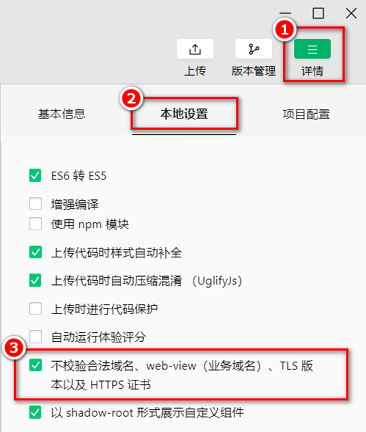
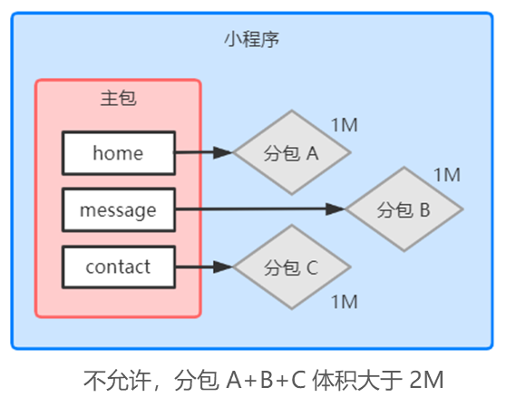

# 微信小程序基础

# 微信小程序基础

# day01-小程序起步

## 一. 小程序简介

- 小程序与普通网页开发的区别

  1. 运行环境不同

     <div>
     <span data-type="text" style="color: var(--b3-font-color8);">网页运行在浏览器环境中，小程序运行在微信环境中。</span>
     </div>
  2. API 不同

     由于运行环境的不同，所以小程序中，<span data-type="text" style="color: var(--b3-font-color8);"> 无法调用 DOM 和 BOM 的 API</span>。

     但是，小程序中可以调用微信环境提供 的各种 API，例如：地理定位、扫码、支付
  3. 开发模式不同

     网页的开发模式：<span data-type="text" style="color: var(--b3-font-color8);">浏览器 </span>+ <span data-type="text" style="color: var(--b3-font-color8);">代码编辑器</span>

     小程序有自己的一套标准开发模式：<span data-type="text" style="color: var(--b3-font-color8);">申请小程序开发账号</span>、<span data-type="text" style="color: var(--b3-font-color8);">安装小程序开发者工具</span>、<span data-type="text" style="color: var(--b3-font-color8);">创建和配置小程序项目</span>
- 体验小程序

  

## 二、第一个小程序

### 1. 注册小程序开发账户

浏览器打开 [https://mp.weixin.qq.com/](https://mp.weixin.qq.com/) 网址注册小程序开发账户，选择个人主体类型，<span data-type="text" style="color: var(--b3-font-color8);">创建小程序项目时，需要用到AppID。</span>


### 2. 安装开发者工具

- 微信开发者工具是官方推荐使用的小程序开发工具，它提供的主要功能如下：

  ① 快速创建小程序项目

  ② 代码的查看和编辑

  ③ 对小程序功能进行调试

  ④ 小程序的预览和发布
- 推荐下载和安装最新的稳定版（Stable Build）的微信开发者工具，下载链接 [https://developers.weixin.qq.com/miniprogram/dev/devtools/stable.htm](https://developers.weixin.qq.com/miniprogram/dev/devtools/stable.htm)

  安装完后设置里<span data-type="text" style="color: var(--b3-font-color8);">不使用任何代理</span>

### 3. 创建小程序项目

后端服务 选 <span data-type="text" style="color: var(--b3-font-color8);">不使用云服务</span>

## 三、小程序代码的构成

### 1. 项目结构

- 项目的基本组成结构

  

  - <div>
    <span data-type="text" style="color: var(--b3-font-color8);">pages 用来存放所有小程序的页面</span>
    </div>
  - utils 用来存放工具性质的模块
  - <div>
    <span data-type="text" style="color: var(--b3-font-color8);">app.js 小程序项目的入口文件</span>
    </div>
  - <div>
    <span data-type="text" style="color: var(--b3-font-color8);">app.json 小程序项目的全局配置文件</span>
    </div>
  - app.wxss 小程序项目的全局样式文件
  - project.config.json 项目的配置文件
  - sitemap.json 用来配置小程序及其页面是否允许被微信索引
- 小程序页面的组成部分

  小程序官方建议把所有小程序的页面，都存放在 pages 目录中，以单独的文件夹存在。

  

  - 其中，每个页面由 4 个基本文件组成，它们分别是：

    1. .js 文件（页面的脚本文件，存放页面的数据、事件处理函数等）
    2. .json 文件（当前页面的配置文件，配置窗口的外观、表现等）
    3. .wxml 文件（页面的模板结构文件）
    4. .wxss 文件（当前页面的样式表文件）

### 2. JSON 配置文件

- JSON 配置文件的作用

  <span data-type="text" style="color: var(--b3-font-color8);">JSON 是一种数据格式</span>，在实际开发中，JSON 总是以<span data-type="text" style="color: var(--b3-font-color8);">配置文件</span>的形式出现。小程序项目中也不例外：通过不同 的 .json 配置文件，可以对小程序项目进行不同级别的配置。

  - 小程序项目中有 4 种 json 配置文件，分别是：

    ① 项目根目录中的 <span data-type="text" style="color: var(--b3-font-color8);">app.json</span> 配置文件

    ② 项目根目录中的 <span data-type="text" style="color: var(--b3-font-color8);">project.config.json </span>配置文件

    ③ 项目根目录中的 <span data-type="text" style="color: var(--b3-font-color8);">sitemap.json</span> 配置文件

    ④ <span data-type="text" style="color: var(--b3-font-color8);">每个页面文件夹中的 .json 配置文件</span>
- app.json 文件

  app.json 是当前小程序的<span data-type="text" style="color: var(--b3-font-color8);">全局配置</span>，包括了小程序的<span data-type="text" style="color: var(--b3-font-color8);">所有页面路径</span>、<span data-type="text" style="color: var(--b3-font-color8);">窗口外观</span>、<span data-type="text" style="color: var(--b3-font-color8);">界面表现</span>、<span data-type="text" style="color: var(--b3-font-color8);">底部 tab</span> 等。

  Demo 项目里边的 app.json 配置内容如下：

  ```json
  {
    "pages": [
      "pages/index/index"
    ],
    "window": {
      "navigationBarTextStyle": "black",
      "navigationStyle": "custom"
    },
    "style": "v2",
    "sitemapLocation": "sitemap.json",
  }
  ```

  - 简单了解下这 4 个配置项的作用：

    ① pages：用来记录当前小程序所有页面的路径

    ② window：全局定义小程序所有页面的背景色、文字颜色等

    ③ style：全局定义小程序组件所使用的样式版本

    ④ sitemapLocation：用来指明 sitemap.json 的位置
- project.config.json 文件

  project.config.json 是项目配置文件，用来记录我们对小程序开发工具所做的个性化配置，例如：

  ```json
  	"setting": {
          "coverView": true,
          "es6": true,
          "postcss": true,
          "minified": true,
          "enhance": true,
          "showShadowRootInWxmlPanel": true,
          "packNpmRelationList": [],
          "babelSetting": {
              "ignore": [],
              "disablePlugins": [],
              "outputPath": ""
          }
      },
  	"appid": "wx5dc23731561774c1",
  ```

  - setting 中保存了编译相关的配置
  - appid 中保存的是小程序的账号 ID
- sitemap.json 文件

  微信现已开放<span data-type="text" style="color: var(--b3-font-color8);">小程序内搜索</span>，效果类似于 PC 网页的 SEO。sitemap.json 文件用来<span data-type="text" style="color: var(--b3-font-color8);">配置小程序页面是否允许 微信索引</span>。

  当开发者允许微信索引时，微信会通过爬虫的形式，为小程序的页面内容建立索引。当用户的搜索关键字和页 面的索引匹配成功的时候，小程序的页面将可能展示在搜索结果中。（就是小程序可以被微信搜索到）

  ```json
  {
      "desc": "关于本文件的更多信息，请参考文档 https://developers.weixin.qq.com/miniprogram/dev/framework/sitemap.html",
      "rules": [{
      "action": "allow",		// 允许allow，不允许disaloow
      "page": "*"				// 所有页面
      }]
  }
  ```

  注意：sitemap 的索引提示是默认开启的，如需要关闭 sitemap 的索引提示，可在小程序项目配置文件 <span data-type="text" style="color: var(--b3-font-color8);">project.config.json</span> 的 <span data-type="text" style="color: var(--b3-font-color8);">setting 中配置字段 checkSiteMap 为 false</span>
- 页面的 .json 配置文件

  小程序中的每一个页面，可以使用 .json 文件来对本页面的窗口外观进行配置，<span data-type="text" style="color: var(--b3-font-color8);">页面中的配置项会覆盖 app.json 的 window 中相同的配置项</span>。
- 新建小程序页面

  <div>
  <span data-type="text" style="color: var(--b3-font-color8);">只需要在 app.json -&gt; pages 中新增页面的存放路径，小程序开发者工具即可帮我们自动创建对应的页面文件。</span>
  </div>
- 修改项目首页

  只需要调整 app.json -\> pages 数组中页面路径的前后顺序，即可修改项目的首页。<span data-type="text" style="color: var(--b3-font-color8);">小程序会把排在第一位的页面，当作项目首页进行渲染。</span>

### 3. WXML 模板

WXML（WeiXin Markup Language）是小程序框架设计的一套标签语言，用来构建小程序页面的结构。类似于网页开发中 HTML。

- WXML 和 HTML 的区别

  1. 标签名称不同

     - HTML （div, span, img, a）
     - WXML（view, text, image, navigator）
  2. 属性节点不同

     - ​`<a href="#">超链接</a>`​
     - ​`<navigator url="/pages/home/home"></navigator>`​
  3. 提供了类似于 Vue 中的模板语法

     - 数据绑定
     - 列表渲染
     - 条件渲染

### 4. WXSS 样式

WXSS (WeiXin Style Sheets)是一套样式语言，用于描述 WXML 的组件样式.类似于网页开发中的 CSS。

- WXSS 和 CSS 的区别

  1. 新增了 rpx 尺寸单位

     - CSS 中需要手动进行像素单位换算，例如 rem
     - WXSS 在底层支持新的尺寸单位 rpx，在不同大小的屏幕上小程序会自动进行换算
  2. 提供了全局的样式和局部样式

     - 项目根目录中的 app.wxss 会作用于所有小程序页面
     - 局部页面的 .wxss 样式仅对当前页面生效
  3. WXSS 仅支持部分 CSS 选择器

     - .class 和 #id#
     - element
     - 并集选择器、后代选择器
     - ::after 和 ::before 等伪类选择器

### 5. JS 逻辑交互

- 小程序中的 .js 文件

  一个项目仅仅提供界面展示是不够的，在小程序中，我们通过 .js 文件来处理用户的操作。
- 小程序中 .js 文件的分类 分为三大类

  1. app.js

     是整个小程序项目的入口文件，通过调用 App() 函数来启动整个小程序
  2. 页面的 .js 文件

     是页面的入口文件，通过调用 Page() 函数来创建并运行页面
  3. 普通的 .js 文件

     是普通的功能模块文件，用来封装公共的函数或属性供页面使用

## 四、小程序的宿主环境

### 1. 宿主环境简介

宿主环境（host environment）指的是<span data-type="text" style="color: var(--b3-font-color8);">程序运行所必须的依赖环境</span>。

例如：<span data-type="text" style="color: var(--b3-font-color8);"> Android 系统和 iOS 系统是两个不同的宿主环境</span>。安卓版的微信 App 是不能在 iOS 环境下运行的，所以， Android 是安卓软件的宿主环境，<span data-type="text" style="color: var(--b3-font-color8);">脱离了宿主环境的软件是没有任何意义的</span>！

- 小程序的宿主环境 - 手机微信

  小程序借助宿主环境提供的能力，可以完成许多普通网页无法完成的功能。

  例如： 微信扫码、微信支付、微信登录、地理定位、etc…
- 小程序宿主环境包含的内容

  通信模型、运行机制、组件、API

### 2. 通信模型

- 小程序中通信的主体是<span data-type="text" style="color: var(--b3-font-color8);">渲染层</span>和<span data-type="text" style="color: var(--b3-font-color8);">逻辑层</span>

  1. WXML 模板和 WXSS 样式工作在渲染层
  2. JS 脚本工作在逻辑层
- 小程序中的通信模型分为两部分

  

  1. 渲染层和逻辑层之间的通信

     由微信客户端进行转发
  2. 逻辑层和第三方服务器之间的通信

     由微信客户端进行转发

### 3. 运行机制

- 小程序启动的过程

  1. 把小程序的代码包下载到本地
  2. 解析 app.json 全局配置文件
  3. 执行 app.js 小程序入口文件，调用 App() 创建小程序实例
  4. 渲染小程序首页
  5. 小程序启动完成
- 页面渲染的过程

  1. 加载解析页面的 .json 配置文件
  2. 加载页面的 .wxml 模板和 .wxss 样式
  3. 执行页面的 .js 文件，调用 Page() 创建页面实例
  4. 页面渲染完成

### 4. 组件

- 小程序中组件的分类

  <span data-type="text" style="color: var(--b3-font-color8);">小程序中的组件也是由宿主环境提供的</span>，开发者可以基于组件快速搭建出漂亮的页面结构。官方把小程序的组件分为了 9 大类：

  1. <div>
     <span data-type="text" style="color: var(--b3-font-color8);">视图容器</span>
     </div>
  2. 基础内容
  3. 表单组件
  4. 导航组件
  5. 媒体组件
  6. map 地图组件
  7. canvas 画布组件
  8. 开放能力
  9. 无障碍访问
- 常用的视图容器类组件

  1. <div>
     <span data-type="text" style="color: var(--b3-font-color8);">view</span>
     </div>

     普通视图区域，类似于 HTML 中的 div，是一个块级元素，常用来实现页面的布局效果

     实现如图的 flex 横向布局效果：

     

     当作 html 里面的 div 就行了，css 里面语法也都一样
  2. <div>
     <span data-type="text" style="color: var(--b3-font-color8);">scroll-view</span>
     </div>

     可滚动的视图区域，常用来实现滚动列表效果

     实现如图的纵向滚动效果：

     

     把 <view> 替换成 <scroll-view>，另外 scroll-y 是纵向滚动，scroll-x 是横向滚动
  3. <div>
     <span data-type="text" style="color: var(--b3-font-color8);">swiper </span>和 <span data-type="text" style="color: var(--b3-font-color8);">swiper-item</span>
     </div>

     轮播图容器组件 和 轮播图 item 组件

     实现如图的轮播图效果：

     

     - swiper 组件的常用属性

       |属性|类型|默认值|说明|
       | :--------------------: | :--------------------------------------------------: | :---------------: | :------------------: |
       |indicator-dots|只要加上这个属性，就能显示面板指示点（默认不显示）|||
       |indicator-color|color|rgba(0, 0, 0, .3)|指示点颜色|
       |indicator-active-color|color|#000000#|当前选中的指示点颜色|
       |autoplay|只要加上这个属性，就能自动切换（默认不自动切换）|||
       |interval|number|5000|自动切换时间间隔|
       |circular|只要加上这个属性，就能采用首尾衔接滑动（默认不采用）|||
- 常用的基础内容组件

  1. text

     文本组件，类似于 HTML 中的 span 标签，是一个行内元素

     通过 text 组件的 <span data-type="text" style="color: var(--b3-font-color8);">user-select 属性</span>，实现<span data-type="text" style="color: var(--b3-font-color8);">长按选中文本内容的效果</span>：

     `<text user-select> 哈哈哈 </text>`​
  2. rich-text

     富文本组件，支持把 HTML 字符串渲染为 WXML 结构

     通过 rich-text 组件的 <span data-type="text" style="color: var(--b3-font-color8);">nodes 属性节点</span>，<span data-type="text" style="color: var(--b3-font-color8);">把 HTML 字符串渲染为对应的 UI 结构</span>：

     `<rich-text nodes="<h1 style='color: red'>"标题</h1>"></rich-text>`​

  
- 其它常用组件

  1. button

     按钮组件，功能比 HTML 中的 button 按钮丰富

     通过 open-type 属性可以调用微信提供的各种功能（客服、转发、获取用户授权、获取用户信息等）

     - type、size、plain 属性使用

       
  2. image

     图片组件，默认宽度约 300px、高度约 240px。

     src 属性是图片的路径，mode 属性是图片显示的方式。

     |mode属性值|说明|
     | -----------| --------------------------------------------------------------------------------------------------------------------|
     |scaleToFill|（默认值）<span data-type="text" style="color: var(--b3-font-color8);">不保持纵横比缩放图片</span>，使图片的宽高完全拉伸至<span data-type="text" style="color: var(--b3-font-color8);">填满 image 元素。</span>|
     |aspectFit|<span data-type="text" style="color: var(--b3-font-color8);">保持纵横比缩放图片，使图片的长边能完全显示出来</span>。也就是说，可以完整地将图片显示出来且居中。|
     |aspectFill|<span data-type="text" style="color: var(--b3-font-color8);">保持纵横比缩放图片，只保证图片的短边能完全显示出来</span>。也就是说，长的方向会显示不全。|
     |widthFix|<span data-type="text" style="color: var(--b3-font-color8);">保持纵横比缩放图片，组件宽度不变，高度自动变化。</span>|
     |heightFix|<span data-type="text" style="color: var(--b3-font-color8);">保持纵横比缩放图片，组件高度不变，宽度自动变化。</span>|
  3. navigator（后面课程会专门讲解）

     页面导航组件，类似于 HTML 中的 `<a>`​

### 5. API

小程序中的 API 是由宿主环境提供的，通过这些丰富的小程序 API，开发者可以方便的调用微信提供的能力。

例如：获取用户信息、本地存储、支付功能等。

- 小程序官方把 API 分为了如下 3 大类

  1. <div>
     <span data-type="text" style="color: var(--b3-font-color8);">事件监听 API </span>
     </div>

     - 特点：<span data-type="text" style="color: var(--b3-font-color8);">以 on 开头</span>，用来<span data-type="text" style="color: var(--b3-font-color8);">监听某些事件的触发</span>
     - 举例：`wx.onWindowResize(function callback)`​ 监听窗口尺寸变化的事件
  2. <div>
     <span data-type="text" style="color: var(--b3-font-color8);">同步 API</span>
     </div>

     - 特点1：以 Sync 结尾的 API 都是同步 API
     - 特点2：同步 API 的执行结果，可以通过函数返回值直接获取，如果执行出错会抛出异常
     - 举例：`wx.setStorageSync('key', 'value')`​ 向本地存储中写入内容
  3. <div>
     <span data-type="text" style="color: var(--b3-font-color8);">异步 API</span>
     </div>

     - 特点：类似于 jQuery 中的 `$.ajax(options)`​ 函数，需要通过 success、fail、complete 接收调用的结果
     - 举例：`wx.request()`​ 发起网络数据请求，通过 success 回调函数接收数据

## 五、协同工作和发布

### 1. 协同工作

- 权限管理需求

  在中大型的公司里，人员的分工非常仔细：同一个小程序项目，一般会有不同岗位、不同角色的员工同时参与 设计与开发。

  此时出于管理需要，我们<span data-type="text" style="color: var(--b3-font-color8);">迫切需要对</span>不同岗位、不同角色的<span data-type="text" style="color: var(--b3-font-color8);">员工的权限进行边界的划分</span>，使他们能够高效的进 行协同工作。
- 项目成员的组织结构

  
- 小程序的开发流程

  

### 2. 小程序成员管理

- 项目成员和体验成员

  管理员均可以添加、删除项目成员和体验人员，并设置项目成员的角色。

  

  1. 项目成员

     参与小程序开发、运营的成员，可登录小程序管理后台。
  2. 体验成员

     参与小程序内测体验的成员，可使用体验版小程序，但不属于项目成员。
- 不同项目成员对应的权限

  |权限|运营者|开发者|数据分析者|
  | :--------: | :----: | :----: | :--------: |
  |开发者权限||√||
  |体验者权限|√|√|√|
  |登录|√|√|√|
  |数据分析|||√|
  |微信支付|√|||
  |推广|√|||
  |开发管理|√|||

  |权限|运营者|开发者|数据分析者|
  | :------------: | :----: | :----: | :--------: |
  |开发设置||√||
  |暂停服务|√|||
  |解除关联公众号|√|||
  |腾讯云管理||√||
  |小程序插件|√|||
  |游戏运营管理|√|||
- 开发者的权限说明

  1. <span data-type="text" style="color: var(--b3-font-color8);">开发者权限</span>：可使用小程序开发者工具及对小程序的功能进行代码开发
  2. <span data-type="text" style="color: var(--b3-font-color8);">体验者权限</span>：可使用体验版小程序
  3. <span data-type="text" style="color: var(--b3-font-color8);">登录权限</span>：可登录小程序管理后台，无需管理员确认
  4. <span data-type="text" style="color: var(--b3-font-color8);">开发设置</span>：设置小程序服务器域名、消息推送及扫描普通链接二维码打开小程序
  5. 腾讯云管理：云开发相关设置
- 添加项目成员和体验成员

  

### 3. 小程序的版本

软件开发过程中的不同版本 在软件开发过程中，根据时间节点的不同，会产出不同的软件版本，例如：

1. 开发者编写代码的同时，对项目代码进行自测（开发版本）
2. 直到程序达到一个稳定可体验的状态时，开发者把体验版本给到产品经理和测试人员进行体验测试
3. 最后修复完程序的 Bug 后，发布正式版供外部用户使用

|版本阶段|说明|
| ------------| ---------------------------------------------------------------------------------------------------------------------------------------------------------------------|
|开发版本|使用开发者工具，可将代码上传到开发版本中。 开发版本只保留每人最新的一份上传的代码。<br />点击提交审核，可将代码提交审核。开发版本可删除，不影响线上版本和审核中版本的代码。|
|体验版本|可以选择某个开发版本作为体验版，并且选取一份体验版。|
|审核中的版本|只能有一份代码处于审核中。有审核结果后可以发布到线上，也可直接重新提交审核，覆盖原审核版本。|
|线上版本|线上所有用户使用的代码版本，该版本代码在新版本代码发布后被覆盖更新。|

### 4. 发布上线

一个小程序的发布上线，一般要经过<span data-type="text" style="color: var(--b3-font-color8);">上传代码 -&gt; 提交审核 -&gt; 发布</span>这三个步骤。

- 上传代码

  1. 点击开发者工具顶部工具栏中的“上传” 按钮
  2. 填写版本号以及项目备注

     
- 在后台查看上传之后的版本

  <span data-type="text" style="color: var(--b3-font-color8);">登录小程序管理后台 -&gt; 管理 -&gt; 版本管理 -&gt; 开发版本</span>，即可查看刚才提交上传的版本了

  
- 提交审核

  为了保证小程序的质量，以及符合相关的规范，小程序的发布是需要经过腾讯官方审核的。

  提交审核的方式：在开发版本的列表中，点击“提交审核”按钮之后，按照页面提示填写相关的信息，就能把小程序提交到腾讯官方进行审核。

  
- 发布

  审核通过之后，管理员的微信中会收到小程序通过审核的通知，此时在审核版本的列表中，点击“发布”按钮之后，即可把“审核通过”的版本发布为“线上版本”，供所有小程序用户访问和使用。

  
- 基于小程序码进行推广

  - 相对于普通二维码来说，小程序码的优势

    ①在样式上更具辨识度和视觉冲击力

    ②能够更加清晰地树立小程序的品牌形象

    ③可以帮助开发者更好地推广小程序
  - 获取小程序码的5个步骤

    <div>
    <span data-type="text" style="color: var(--b3-font-color8);">登录小程序管理后台 -&gt; 设置 -&gt; 基本设置 -&gt; 基本信息 -&gt; 小程序码及线下物料下载</span>
    </div>

### 5. 查看运营数据

- 在“小程序后台”查看

  1. 登录小程序管理后台
  2. 点击侧边栏的“统计”
  3. 点击相应的tab 可以看到相关的数据
- 使用“小程序数据助手”查看

  1. 打开微信
  2. 搜索“小程序数据助手”
  3. 查看已发布的小程序相关的数据

# day02-小程序模板与配置

## 一、WXML 模板语法

### 1. 数据绑定

- 在 data 中定义数据

  在页面对应的 .js 文件中，把数据定义到 data 对象中即可

  ```js
  page({
  	data: {
  		info: 'hello world',
  		imgUrl: '图片路径'
  		...
  	}
  })
  ```
- 在 WXML 中使用数据

  - 把 data 中的数据绑定到页面中渲染，使用 <span data-type="text" style="color: var(--b3-font-color8);">Mustache 语法</span>

    ​`<view>{{ info }}<view>`​

    ​`<image src="{{ imgUrl }}"></image>`​

    ​`<input type="text" value="{{ info }}"/>`​

    都是响应式数据
  - Mustache 语法的应用场景

    绑定内容、绑定属性、运算（三元运算、算术运算等）

### 2. 事件绑定

事件是<span data-type="text" style="color: var(--b3-font-color8);">渲染层到逻辑层的通讯方式</span>。通过事件可以将用户在渲染层产生的行为，反馈到逻辑层进行业务的处理。


- 小程序中常用的事件

  |类型|绑定方式|事件描述|
  | ------| -----------------------| -------------------------------------------|
  |tap|bindtap或bind:tap|手指触摸后马上离开，类似于HTML中的click事件|
  |input|bindinput或bind:input|文本框的输入事件|
  |change|bindchange或bind:change|状态改变时触发|
- 事件对象的属性列表

  当事件回调触发的时候，会收到一个事件对象 event

  |属性|类型|说明|
  | -----------------------------------------| -----------------------------------------| --------------------------------------------|
  |type|String|事件类型|
  |timeStamp|Integer|页面打开到触发事件所经过的毫秒数|
  |<span data-type="text" style="color: var(--b3-font-color8);">target</span>|<span data-type="text" style="color: var(--b3-font-color8);">Object</span>|<span data-type="text" style="color: var(--b3-font-color8);">触发事件的组件的一些属性值集合</span>|
  |currentTarget|Object|当前组件的一些属性值集合|
  |<span data-type="text" style="color: var(--b3-font-color8);">detail</span>|<span data-type="text" style="color: var(--b3-font-color8);">Object</span>|<span data-type="text" style="color: var(--b3-font-color8);">额外的信息</span>|
  |touches|Array|触摸事件，当前停留在屏幕中的触摸点信息的数组|
  |changedTouches|Array|触摸事件，当前变化的触摸点信息的数组|
- target 和 currentTarget 的区别

  target 是触发该事件的源头组件，而 currentTarget 则是当前事件所绑定的组件。

  

  点击内部的按钮时，点击事件以冒泡的方式向外扩散，也会触发外层 view 的 tap 事件处理函数。

  e.target 指向的是触发事件的源头组件，因此，<span data-type="text" style="color: var(--b3-font-color8);">e.target 是内部的按钮组件。</span>

  e.currentTarget 指向的是当前正在触发事件的那个组件，因此，<span data-type="text" style="color: var(--b3-font-color8);">e.currentTarget 是当前的 view 组件。</span>
- 在事件处理函数中访问并修改 data 中的数据

  通过调用 `this.setData({})`​ 方法，可以给页面 data 中的数据重新赋值

  ```js
  page({
  	 /* 页面的初始数据 */
      data: {
          count: 0
      },
      // 定义按钮事件
      btnTapHandler(e) {
          this.setData({
              count: this.data.count + 1
          })
          console.log(this.data.count);
      },
  })
  ```
- 事件传参

  - 小程序中的事件传参比较特殊，<span data-type="text" style="color: var(--b3-font-color8);">不能在绑定事件的同时为事件处理函数传递参数</span>。

    <span data-type="text" style="color: var(--b3-font-color8);">错误的示范：</span>`<button type="primary" bind:tap="btnTapHandler(123)"> 按钮 </button>`​

    因为小程序会把 bindtap 的属性值，统一当作事件名称来处理，相当于要调用一个名称为 `btnHandler(123)`​ 的事件处理数。
  - 可以为组件提供<span data-type="text" style="color: var(--b3-font-color8);"> data-* 自定义属性传参</span>，<span data-type="text" style="color: var(--b3-font-color8);">其中 * 代表的是参数的名字</span>

    ​`<button type="primary" bind:tap="btnTapHandler(123)" data-info="{{123}}"> 按钮 </button>`​

    如果省略 `{{}}`​，则会被解析为<span data-type="text" style="color: var(--b3-font-color8);">字符串</span>。
  - 通过 `event.target.dataset.参数名`​，可获取到具体参数的值

    
- bindinput 的语法格式

  - 在小程序中，通过 input 事件来响应文本框的输入事件 `<input type="text" bind:input="inputHandler"/>`​
  - 通过 `e.detail.value`​，可获获得文本框最新的值

    

### 3. 条件渲染

- 类似于 vue 中的 `v-if`​

  在小程序中，使用 `wx:if="{{条件}}"`​ `wx:elif="{{条件}}"`​ `wx:elseif="{{条件}}"`​ 来判断是否需要渲染代码块
- 类似于 vue 中的 `v-show`​

  在小程序中，直接使用 `hidden="{{条件}}"`​ 也能控制元素的显示与隐藏
- 区别也和 vue 中的一样

  1. 运行方式不同

     wx:if 以动态创建和移除元素的方式，控制元素的存在与否。

     hidden 以切换样式的方式 `display: none/block;`​，控制元素的显示与隐藏。
  2. 使用建议

     频繁切换时，建议使用 hidden

     控制条件复杂时，建议使用 wx:if 搭配 wx:elif、wx:else 进行展示与隐藏的切换

> 如果要<span data-type="text" style="color: var(--b3-font-color8);">一次性控制多个组件的展示与隐藏</span>，可以使用一个 `<block>`​ 标签将多个组件包装起来，并在标签上使用 `wx:if`​ 控制属性。
>
> ​`<block>`​ 并不是一个组件，它只是一个包裹性质的容器，不会在页面中做任何渲染

### 4. 列表渲染

通过 `wx:for`​ 可以根据指定的数组，循环渲染重复的组件结构，和 Vue 中的 `v-for`​ 用法有点区别

- 默认情况下，当前循环项的索引用 `index`​ 表示；当前循环项用 `item`​ 表示

  ```html
  <view wx:for="{{ arr }}">
  	索引是：{{index}}，当前项是：{{item}}
  <view>
  ```
- 手动指定索引和当前项的变量名（了解）

  使用 wx:for-index 可以指定当前循环项的索引的变量名

  使用 wx:for-item 可以指定当前项的变量名

  ```html
  <view wx:for="{{ arr }}" wx:for-index="idx" wx:for-item="itemName">
  	索引是：{{idx}}，当前项是：{{itemName}}
  <view>
  ```
- 建议为渲染出来的列表项指定唯一的 key 值

  在小程序中使用的是 `wx:key`​，不用加 `{{}}`​，类似于 Vue 列表渲染中的 `:key`​

## 二、WXSS 模板样式

WXSS (WeiXin Style Sheets)是一套样式语言，用于美化 WXML 的组件样式，类似于网页开发中的 CSS。

WXSS 具有 CSS 大部分特性，同时，WXSS 还对 CSS 进行了扩充以及修改，以适应微信小程序的开发。

- 与 CSS 相比，WXSS 扩展的特性有：

  1. <div>
     <span data-type="text" style="color: var(--b3-font-color8);">rpx 尺寸单位</span>
     </div>
  2. <span data-type="text" style="color: var(--b3-font-color8);">@import 样式导入</span>。


### 1. rpx

rpx（responsive pixel）是微信小程序独有的，用来<span data-type="text" style="color: var(--b3-font-color8);">解决屏适配的尺寸单位</span>。

- rpx 的实现原理

  鉴于不同设备屏幕的大小不同，为了实现屏幕的自动适配，<span data-type="text" style="color: var(--b3-font-color8);">rpx 把所有设备的屏幕在宽度上等分为 750 份（即：当前屏幕的总宽度为 750rpx）</span>。

  小程序在不同设备上运行的时候，会自动把 rpx 的样式单位换算成对应的像素单位来渲染，从而实现屏幕适配。

### 2. 样式导入

使用 WXSS 提供的 `@import `​ 语法，可以导入外联的样式表。`@import "外联的样式表路径";`​

### 3. 全局样式和局部样式

- 全局样式

  定义在 app.wxss 中的样式为全局样式，作用于每一个页面。
- 局部样式

  在页面的 .wxss 文件中定义的样式为局部样式，只作用于当前页面。

  注意：当局部样式的<span data-type="text" style="color: var(--b3-font-color8);">权重大于或等于</span>全局样式的权重时，<span data-type="text" style="color: var(--b3-font-color8);">局部样式会覆盖全局样式</span>。

## 三、全局配置

小程序根目录下的 app.json 文件是小程序的全局配置文件。

- 常用的配置项节点：

  1. pages ：记录当前小程序所有页面的存放路径
  2. <div>
     <span data-type="text" style="color: var(--b3-font-color8);">window：全局设置小程序窗口的外观</span>
     </div>
  3. <div>
     <span data-type="text" style="color: var(--b3-font-color8);">tabBar：设置小程序底部的 tabBar 效果</span>
     </div>
  4. style：是否启用新版的组件样式

### 1. window 节点


- window 节点常用的配置项

  |属性名|类型|默认值|说明|
  | ----------------------------| --------| --------| ----------------------------------------------|
  |navigationBarTitleText|String|字符串|导航栏标题文字内容|
  |navigationBarBackgroundColor|HexColor|#000000#|导航栏背景颜色，禁支持 #000000# 这种格式|
  |navigationBarTextStyle|String|white|导航栏标题颜色，仅支持black/white|
  |backgroundColor|HexColor|#ffffff#|下拉刷新的窗口的背景色|
  |backgroundTextStyle|String|dark|下拉loading的样式，仅支持dark/light|
  |enablePullDownRefresh|Boolean|false|是否全局开启下拉刷新|
  |onReachBottomDistance|Number|50|页面上拉触底事件触发时距页面底部距离，单位为px|

### 2. tabBar 节点

tabBar 是移动端应用常见的页面效果，<span data-type="text" style="color: var(--b3-font-color8);">用于实现多页面 的快速切换</span>。

小程序中通常将其分为： <span data-type="text" style="color: var(--b3-font-color8);">底部 tabBar</span>、<span data-type="text" style="color: var(--b3-font-color8);">顶部 tabBar</span>

- 注意

  tabBar 中只能配置<span data-type="text" style="color: var(--b3-font-color8);">最少 2 个</span>、<span data-type="text" style="color: var(--b3-font-color8);">最多 5 个</span> tab 页签

  当<span data-type="text" style="color: var(--b3-font-color8);">渲染顶部 tabBar 时</span>，<span data-type="text" style="color: var(--b3-font-color8);">不显示 icon</span>，只显示文本


- tabBar 的 6 个组成部分

  

  1. backgroundColor：tabBar 的背景色
  2. selectedIconPath：选中时的图片路径
  3. borderStyle：tabBar 上边框的颜色
  4. iconPath：未选中时的图片路径
  5. selectedColor：tab 上的文字选中时的颜色
  6. color：tab 上文字的默认（未选中）颜色
- tabBar 节点的配置项

  |属性|类型|必填|默认值|描述|
  | -----------------------------------------| -----------------------------------------| -----------------------------------------| ------| -----------------------------------------|
  |position|String|否|bottom|tabBar的位置，仅支持 bottom / top|
  |borderStyle|String|否|black|tabBar 上边框的颜色，仅支持 black / white|
  |color|HexColor|否||tab 上文字的默认（未选中）颜色|
  |selectedColor|HexColor|否||tab 上的文字选中时的颜色|
  |backgroundColor|HexColor|否||tabBar 的背景色|
  |<span data-type="text" style="color: var(--b3-font-color8);">list</span>|<span data-type="text" style="color: var(--b3-font-color8);">Array</span>|<span data-type="text" style="color: var(--b3-font-color8);">是</span>||<span data-type="text" style="color: var(--b3-font-color8);">tab页签的列表， 最少2个、最多5个tab</span>|
- tabBar 节点的 list 配置项里的配置选项

  |属性|类型|必填|描述|
  | -----------------------------------------| ------| ----| ------------------------------------------------|
  |<span data-type="text" style="color: var(--b3-font-color8);">pagePath</span>|String|是|<span data-type="text" style="color: var(--b3-font-color8);">页面路径，页面必须在pages中预先定义</span>|
  |<span data-type="text" style="color: var(--b3-font-color8);">text</span>|String|是|<span data-type="text" style="color: var(--b3-font-color8);">tab上显示的文字</span>|
  |iconPath|String|否|未选中时的图标路径；当postion为top时，不显示icon|
  |selectedIconPath|String|否|选中时的图标路径；当postion为top时，不显示icon|

## 四、页面配置

小程序中，每个页面都有自己的 .json 配置文件，用来对当前页面的窗口外观、页面效果等进行配置。

- . 页面配置和全局配置的关系

  小程序中，<span data-type="text" style="color: var(--b3-font-color8);">app.json</span> 中的 window 节点，可以<span data-type="text" style="color: var(--b3-font-color8);">全局配置</span>小程序中每个页面的窗口表现。

  如果<span data-type="text" style="color: var(--b3-font-color8);">某些小程序页面想要拥有特殊的窗口表现</span>，此时，“<span data-type="text" style="color: var(--b3-font-color8);">页面级别的 .json 配置文件”就可以实现这种需求</span>。

  注意：当页面配置与全局配置<span data-type="text" style="color: var(--b3-font-color8);">冲突</span>时，根据<span data-type="text" style="color: var(--b3-font-color8);">就近原则</span>，最终的效果以页面配置为准。
- 页面配置中常用的配置项（和全局配置 window节点的配置项一样）

  |属性|类型|默认值|描述|
  | ----------------------------| --------| --------| ----------------------------------------------|
  |navigationBarBackgroundColor|HexColor|#000000#|当前页面导航栏背景颜色，如#000000|
  |navigationBarTextStyle|String|white|当前页面导航栏标题颜色，仅支持black /white|
  |navigationBarTitleText|String||当前页面导航栏标题文字内容|
  |backgroundColor|HexColor|#ffffff#|当前页面窗口的背景色|
  |backgroundTextStyle|String|dark|当前页面下拉loading的样式，仅支持dark / light|
  |enablePullDownRefresh|Boolean|false|是否为当前页面开启下拉刷新的效果|
  |onReachBottomDistance|Number|50|页面上拉触底事件触发时距页面底部距离，单位为px|

## 五、网络数据请求

### 1. 小程序中网络数据请求的限制

出于安全性方面的考虑，小程序官方对数据接口的请求做出了如下两个限制：

1. 只能请求 <span data-type="text" style="color: var(--b3-font-color8);">HTTPS</span> 类型的接口
2. 必须<span data-type="text" style="color: var(--b3-font-color8);">将接口的域名添加到信任列表中</span>


### 2. 配置 request 合法域名

- 配置步骤

  <div>
  <span data-type="text" style="color: var(--b3-font-color8);">登录微信小程序管理后台</span> -\> <span data-type="text" style="color: var(--b3-font-color8);">开发</span> -\> <span data-type="text" style="color: var(--b3-font-color8);">开发设置</span> -\> <span data-type="text" style="color: var(--b3-font-color8);">服务器域名</span> -\> <span data-type="text" style="color: var(--b3-font-color8);">修改 request 合法域名</span>
  </div>

  
- 注意事项

  1. 域名只支持 https 协议
  2. 域名不能使用 IP 地址或 localhost
  3. 域名必须经过 ICP 备案
  4. 服务器域名一个月内最多可申请 5 次修改

### 3. 发起 GET 请求

```js
page({
	getInfo() {
       wx.request({
          url: 'https://www.escook.cn/api/get',
          method: 'GET',
          data: {
            name: 'zs',
            age: 20
          },
          success: (res) => {
            console.log(res);
          }
       })
    }
})
```

### 4. 发起 POST 请求

```js
page({
	postInfo() {
       wx.request({
          url: 'https://www.escook.cn/api/post',
          method: 'POST',
          data: {
            name: 'ls',
            age: 33
          },
          success: (res) => {
            console.log(res);
          }
       })
    }
})
```

### 5. 在页面刚加载时请求数据

在很多情况下，我们需要<span data-type="text" style="color: var(--b3-font-color8);">在页面刚加载的时候，自动请求一些初始化的数据</span>。

此时需要在页面的 `onLoad(options) { }`​  时间中调用获取数据的函数。

```js
page({
	onLoad(options) {
 		this.getInfo()
		this.postInfo()
	}
})
```

### 6. 跳过 request 合法域名校验

如果后端程序员<span data-type="text" style="color: var(--b3-font-color8);">仅仅提供了 http 协议的接口、暂时没有提供 https 协议的接口</span>。

此时为了不耽误开发的进度，我们可以在微信开发者工具中，临时 开启<span data-type="text" style="color: var(--b3-font-color8);">「开发环境不校验请求域名、TLS 版本及 HTTPS 证书」选项</span>， 跳过 request 合法域名的校验。

注意： 跳过 request 合法域名校验的选项，<span data-type="text" style="color: var(--b3-font-color8);">仅限在开发与调试阶段使用！</span>



### 7. 关于跨域和 Ajax 的说明

跨域问题<span data-type="text" style="color: var(--b3-font-color8);">只存在于基于浏览器的 Web 开发中</span>。由于<span data-type="text" style="color: var(--b3-font-color8);">小程序的宿主环境</span>不是浏览器，而是<span data-type="text" style="color: var(--b3-font-color8);">微信客户端</span>，所以<span data-type="text" style="color: var(--b3-font-color8);">小程序中不存在跨域的问题</span>。

Ajax 技术的核心是依赖于浏览器中的 XMLHttpRequest 这个对象，<span data-type="text" style="color: var(--b3-font-color8);">由于小程序的宿主环境是微信客户端，所 以小程序中不能叫做“发起 Ajax 请求”，而是叫做“发起网络数据请求”</span>。

## 六、案例 - 本地生活（首页）

‍

# day03-小程序视图与逻辑

## 一、页面导航

页面导航指的是页面之间的相互跳转。

例如，浏览器中实现页面导航的方式有如下两种：链接、location.href

- 小程序中实现页面导航的两种方式

  1. 声明式导航 - `<navigation>`​ 导航组件

     <div>
     <span data-type="text" style="color: var(--b3-font-color8);">url属性</span> 表示要跳转的页面的地址，<span data-type="text" style="color: var(--b3-font-color8);">必须以 </span>`/`​​<span data-type="text" style="color: var(--b3-font-color8);"> 开头</span>
     </div>

     <span data-type="text" style="color: var(--b3-font-color8);">open-type属性</span> 表示跳转的方式

     <span data-type="text" style="color: var(--b3-font-color8);">delta属性</span> 的值必须是数字，表示要后退的层级
  2. 编程式导航

     调用小程序的导航 API，实现页面的跳转

### 1. 声明式导航

- 使用 `<navigation>`​ 组件跳转到指定的 tabBar 页面

  tabBar 页面指的是<span data-type="text" style="color: var(--b3-font-color8);">被配置为 tabBar 的页面</span>。

  需要指定 <span data-type="text" style="color: var(--b3-font-color8);">url属性</span> 和 <span data-type="text" style="color: var(--b3-font-color8);">open-type属性</span>

  <div>
  <span data-type="text" style="color: var(--b3-font-color8);">open-type 属性值等于 switchTab</span>
  </div>

  ​`<navigator url="/pages/message/message" open-type="switchTab">导航到消息页面</navigator>`​
- 使用 `<navigation>`​ 组件跳转到普通的非 tabBar 页面

  非 tabBar 页面指的是<span data-type="text" style="color: var(--b3-font-color8);">没有被配置为 tabBar 的页面</span>。

  需要指定 <span data-type="text" style="color: var(--b3-font-color8);">url属性</span> 和 <span data-type="text" style="color: var(--b3-font-color8);">open-type属性</span>

  <div>
  <span data-type="text" style="color: var(--b3-font-color8);">open-type属性值 等于 navigate，也可以省略不写这个属性</span>
  </div>

  ​`<navigator url="/pages/info/info">导航到消息页面</navigator>`​
- 使用 `<navigation>`​​ 组件后退

  后退到上一页面或多级页面

  需要指定 <span data-type="text" style="color: var(--b3-font-color8);">open-type属性 </span>和 <span data-type="text" style="color: var(--b3-font-color8);">delta属性</span>

  <div>
  <span data-type="text" style="color: var(--b3-font-color8);">open-type属性值 等于 navigateBack</span>
  </div>

  <div>
  <span data-type="text" style="color: var(--b3-font-color8);">delta属性 等于 1时，可以省略</span>
  </div>

  `<navigator open-type="navigateBack" delta="1">返回上一页</navigator>`​

### 2. 编程式导航

- 调用 `wx.switchTab({})`​ 方法，跳转到 tabBar 页面

  其中参数对象的属性列表如下

  |属性|类型|是否必选|说明|
  | -----------------------------------------| -----------------------------------------| -----------------------------------------| ------------------------------------------------|
  |<span data-type="text" style="color: var(--b3-font-color8);">url</span>|<span data-type="text" style="color: var(--b3-font-color8);">string</span>|<span data-type="text" style="color: var(--b3-font-color8);">是</span>|<span data-type="text" style="color: var(--b3-font-color8);">需要跳转的tabBar页面的路径，路径后不能带参数</span>|
  |success|function|否|接口调用成功的回调函数|
  |fail|function|否|接口调用失败的回调函数|
  |complete|function|否|接口调用结束的回调函数（调用成功、失败都会执行）|

  ```js
  // 定义一个函数，上面按钮绑定这个事件函数即可
  gotoMessage() {
  	wx.switchTab({
  		url: 'pages/message/message'
  	})
  }
  ```
- 调用 `wx.navigateTo({})`​ 方法，跳转到非 tabBar 页面

  ​`wx.navigateTo({})`​ 和 `wx.switchTab({})`​ 的参数对象的属性一样
- 调用 `wx.navigateBack(Object object)`​ 方法，返回上一页面或多级页面

  其中参数对象的属性列表如下

  |属性|类型|默认值|是否必选|说明|
  | --------| --------| ------| --------| ----------------------------------------------------------------------|
  |delta|number|1|否|返回的页面数，如果delta大于现有页面数，则返回到首页，为 1 时，可以省略|
  |success|function||否|接口调用成功的回调函数|
  |fail|function||否|接口调用失败的回调函数|
  |complete|function||否|接口调用结束的回调函数（调用成功、失败都会执行）|

```js
// 定义一个函数，上面按钮绑定这个事件函数即可
gotoBack() {
	wx.switchTab()		// delta 的值为1，可以省略
}
```

### 3. 导航传参

- 声明式导航传参

  navigator 组件的 url 属性用来指定将要跳转到的页面的路径。路径的后面还可以携带参数

  1. 参数与路径之间使用 `?`​ 分隔
  2. 参数键与参数值用 `=`​ 相连
  3. 不同参数用 `&`​ 分隔

  ​`<navigator url="/pages/info/info?name=zs&age=20">导航到消息页面</navigator>`​

  <div>
  <span data-type="text" style="color: var(--b3-font-color8);">可以通过 左下角 -&gt; 选择页面参数 查看是否成功传参</span>
  </div>
- 编程式导航传参

  调用 wx.navigateTo(Object object) 方法跳转页面时，<span data-type="text" style="color: var(--b3-font-color8);">也可以在 url里 携带参数</span>
- 生命周期函数--监听页面加载 onLoad 函数接收导航参数

  ```js
  // 生命周期函数--监听页面加载
  onLoad(options) {
  	console.log(options);
  }
  ```

## 二、页面事件

### 1. 下拉刷新事件

下拉刷新是移动端的专有名词，指的是通过手指在屏幕上的<span data-type="text" style="color: var(--b3-font-color8);">下拉滑动操作</span>，从而<span data-type="text" style="color: var(--b3-font-color8);">重新加载页面数据</span>的行为。

- 启用下拉刷新有两种方式

  1. 全局开启下拉刷新（不推荐）

     在 app.json 的 window 节点中，设置 `"enablePullDownRefresh" = true`​
  2. 局部开启下拉刷新

     在页面的 .json 文件中，直接设置 `"enablePullDownRefresh" = true`​，不要再写 window 节点
- 配置下拉刷新窗口的样式

  在全局或页面的 .json 配置文件中，通过 <span data-type="text" style="color: var(--b3-font-color8);">backgroundColor</span> 和 <span data-type="text" style="color: var(--b3-font-color8);">backgroundTextStyle</span> 来配置下拉刷新窗口 的样式

  1. backgroundColor 用来配置下拉刷新窗口的背景颜色，<span data-type="text" style="color: var(--b3-font-color8);">仅支持16 进制的颜色值</span>
  2. backgroundTextStyle 用来配置下拉刷新 loading 的样式，<span data-type="text" style="color: var(--b3-font-color8);">仅支持 dark 和 light</span>
- 监听页面的下拉刷新事件

  在页面的 .js 文件中，通过 `onPullDownRefresh()`​ 函数即可监听当前页面的下拉刷新事件
- 停止下拉刷新的效果

  当处理完下拉刷新后，下拉刷新的 loading 效果会一直显示，不会主动消失，所以需要手动隐藏下拉刷新的 loading 效果。

  此时，调用 `wx.stopPullDownRefresh()`​ 可以停止当前页面的下拉刷新。

  ```js
  onPullDownRefresh() {
  	......		// 下拉刷新需要处理的代码
  	wx.stopPullDownRefresh()	// 处理完调用 wx.stopPullDownRefresh() 隐藏 loading 效果
  }
  ```

### 2. 上拉触底事件

上拉触底是移动端的专有名词，通过手指在屏幕上的上拉滑动操作，距离底部一定距离时，触发的事件

- 监听页面的上拉触底事件

  在页面的 .js 文件中，通过 `onReachBottom()`​ 函数即可监听当前页面的上拉触底事件。
- 配置上拉触底距离

  上拉触底距离指的是<span data-type="text" style="color: var(--b3-font-color8);">触发上拉触底事件时</span>，<span data-type="text" style="color: var(--b3-font-color8);">滚动条距离页面底部的距离</span>。

  可以在全局或页面的 .json 配置文件中，通过 <span data-type="text" style="color: var(--b3-font-color8);">onReachBottomDistance</span> 属性来配置上拉触底的距离。

  小程序默认的触底距离是 50px，在实际开发中，可以根据自己的需求修改这个默认值。

### 3. 上拉触底事件案例


API接口：https://applet-base-api-t.itheima.net/api/color

1. 定义获取随机颜色的方法
2. 在页面加载时获取初始数据
3. 渲染 UI 结构并美化页面效果
4. 在上拉触底时调用获取随机颜色的方法
5. 添加 loading 提示效果（参考微信开发者文档）
6. 对上拉触底进行节流处理

### 4. 扩展 - 自定义编译模式


## 三、生命周期

生命周期（Life Cycle）是指一个对象从 <span data-type="text" style="color: var(--b3-font-color8);">创建</span> -\> <span data-type="text" style="color: var(--b3-font-color8);">运行</span> -\> <span data-type="text" style="color: var(--b3-font-color8);">销毁</span> 的整个阶段，强调的是一个时间段。

### 1. 在小程序中，生命周期分为两类

1. 应用生命周期

   特指<span data-type="text" style="color: var(--b3-font-color8);">小程序从 启动 -&gt; 运行 -&gt; 销毁的过程</span>
2. 页面生命周期

   特指小程序中，每个<span data-type="text" style="color: var(--b3-font-color8);">页面的 加载 -&gt; 渲染 -&gt; 销毁的过程</span>

其中，页面的生命周期范围较小，应用程序的生命周期范围较大。


### 2. 生命周期函数

<span data-type="text" style="color: var(--b3-font-color8);">生命周期函数</span>：是由小程序框架提供的<span data-type="text" style="color: var(--b3-font-color8);">内置函数</span>，会伴随着生命周期，<span data-type="text" style="color: var(--b3-font-color8);">自动按次序执行</span>。

<span data-type="text" style="color: var(--b3-font-color8);">生命周期函数的作用</span>：允许程序员<span data-type="text" style="color: var(--b3-font-color8);">在特定的时间点，执行某些特定的操作</span>。例如，页面刚加载的时候，可以在 onLoad 生命周期函数中初始化页面的数据。

注意：<span data-type="text" style="color: var(--b3-font-color8);">生命周期</span>强调的是<span data-type="text" style="color: var(--b3-font-color8);">时间段</span>，<span data-type="text" style="color: var(--b3-font-color8);">生命周期函数</span>强调的是<span data-type="text" style="color: var(--b3-font-color8);">时间点</span>

- 小程序中的生命周期函数分为两类

  1. 应用的生命周期函数

     特指小程序从 启动 -\> 运行 -\> 销毁期间 依次调用的那些函数

     <div>
     <span data-type="text" style="color: var(--b3-font-color8);">应用生命周期函数需要在 app.js 中进行声明</span>
     </div>

     ```js
     App({
         // 小程序初始化完成时触发，全局只触发一次
         onLaunch(optinos) {},
         // 小程序启动，或从后台进入前台时触发
         onShow(options) {},
         // 小程序从前台进入后台时触发
         onHide() {},
     })
     ```
  2. 页面的生命周期函数

     特指小程序中，每个页面从 加载 -\> 渲染 -\> 销毁期间 依次调用的那些函数

     <div>
     <span data-type="text" style="color: var(--b3-font-color8);">页面生命周期函数需要在页面的 .js 文件中进行声明</span>
     </div>

     ```js
     Page({
     	// 生命周期函数--监听页面加载
         onLoad(options) {},
         // 生命周期函数--监听页面初次渲染完成
         onReady() {},
         // 生命周期函数--监听页面显示
         onShow() {},
     	// 生命周期函数--监听页面隐藏
         onHide() {},
         // 生命周期函数--监听页面卸载
     	onUnload() {},
     })
     ```

‍

## 四、WXS 脚本

WXS（WeiXin Script）是小程序独有的一套脚本语言，结合 WXML，可以构建出页面的结构。

- 使用场景

  <span data-type="text" style="color: var(--b3-font-color8);">wxml 中无法调用在页面的 .js 中定义的函数</span>，但是，wxml 中可以调用 wxs 中定义的函数。

  因此，小程序中 wxs 的<span data-type="text" style="color: var(--b3-font-color8);">典型应用场景就是“过滤器”</span>。

### 1. wxs 和 JavaScript 的关系（了解）

虽然 wxs 的语法类似于 JavaScript，但是 wxs 和 JavaScript 是完全不同的两种语言

- wxs 有自己的数据类型

  umber 数值类型、string 字符串类型、boolean 布尔类型、object 对象类型、function 函数类型、array 数组类型、 date 日期类型、 regexp 正则
- wxs 不支持类似于 ES6 及以上的语法形式

  不支持：let、const、解构赋值、展开运算符、箭头函数、对象属性简写、etc...

  支持：var 定义变量、普通 function 函数等类似于 ES5 的语法
- wxs 遵循 CommonJS 规范

  module 对象、require() 函数、module.exports 对象

### 2. 基础语法

- 内嵌 wxs 脚本

  wxs 代码可以编写在 wxml 文件中的 `<wxs>`​ 标签内，就像 Javascript 代码可以编写在 html 文件中的 `<script>`​ 标签内一样

  wxml 文件中的每个 `<wxs>`​ 标签，<span data-type="text" style="color: var(--b3-font-color8);">必须提供 module 属性</span>，用来<span data-type="text" style="color: var(--b3-font-color8);">指定当前 wxs 的模块名称</span>，方<span data-type="text" style="color: var(--b3-font-color8);">便在 wxml 中访问模块中的成员</span>

  ```html
  <view>{{ m1.toUpper('zs') }}</view>

  <wxs module="m1">
      module.exports.toUpper = function(str) {
          return str.toUpperCase() // 转大写
      }
  </wxs>
  ```
- 外联 wxs 脚本

  wxs 代码还可以编写在以 .wxs 为后缀名的文件内，就像 javascript 代码可以编写在以 .js 为后缀名的文件中 一样。

  ```js
  function toUpper(str) {
  	return str.toUpperCase() // 转大写
  }
  module.exports = {
  	toUpper: toUpper
  }
  ```

  在 wxml 中引入外联的 wxs 脚本时，必须为  标签添加 module 和 src 属性

  ```html
  <view>{{ m1.toUpper('zs') }}</view>
  <wxs src="文件路径" module=""m1></wxs>
  ```

### 3. WXS 的特点

为了降低 wxs（WeiXin Script）的学习成本， wxs 语言在设计时借大量鉴了 JavaScript 的语法。但是本质上， wxs 和 JavaScript 是完全不同的两种语言！

- 不能作为组件的事件回调

  wxs 典型的应用场景就是<span data-type="text" style="color: var(--b3-font-color8);">“过滤器”，经常配合 Mustache 语法（“{{ }}”）进行使用</span>

  但是，在 wxs 中定义的函数<span data-type="text" style="color: var(--b3-font-color8);">不能作为组件的事件回调函数</span>。
- 隔离性

  隔离性指的是 wxs 的运行环境和其他 JavaScript 代码是隔离的。

  体现在如下两方面： ① wxs 不能调用 js 中定义的函数 ② wxs 不能调用小程序提供的 API
- 性能好

  在 iOS 设备上，小程序内的 WXS 会比 JavaScript 代码快 2 \~ 20 倍

  在 android 设备上，二者的运行效率无差异

## 五、案例 - 本地生活（列表页面）


1. 主要功能

   - 页面导航并传参
   - 上拉触底时加载下一页数据
   - 下拉刷新列表数据
2. 列表页面的 API 接口

   - 接口地址

     [https://applet-base-api-t.itheima.net/categories/:id/shops](https://applet-base-api-t.itheima.net/categories/:id/shops)

     URL 地址中的 :cate\_id 是动态参数，表示分类的 Id
   - 请求方式：GET
   - 请求参数

     \_page 表示请求第几页的数据

     \_limit 表示每页请求几条数据
3. 判断是否还有下一页数据

   如果下面的公式成立，则证明没有下一页数据了

   页码值 \* 每页显示多少条数据 \>\= 总数据条数

   page \* pageSize \>\= tota

‍

# day04~5-小程序基础加强

## 一、自定义组件

### 1. 组件的创建与引用

- 创建组件

  1. 在项目的根目录中，鼠标右键，<span data-type="text" style="color: var(--b3-font-color8);">创建 components -&gt; test 文件夹</span>
  2. 在新建的 components -\> test 文件夹上，鼠标右键，<span data-type="text" style="color: var(--b3-font-color8);">点击“新建 Component”</span>
  3. 键入组件的名称之后回车，会自动生成组件对应的 4 个后缀名分别为 .js，.json， .wxml 和 .wxss 的文件

  注意：为了保证目录结构的清晰，建议把不同的组件，存放到单独目录中。

  
- 局部引用：组件只能在当前被引用的页面内使用

  在页面的 .json 配置文件中引用组件的方式，叫做“局部引用”。

  ```json
  {
    "usingComponents": {
        "test": "/components/test/test"
    }
  }
  ```
- 全局引用：组件可以在每个小程序页面中使用

  在 app.json 全局配置文件中引用组件的方式，叫做“全局引用”。

  配置代码和局部引用一样。
- 使用组件

  直接在 .wxml 文件中使用组件 `<test></test>`​
- 组件和页面的区别

  组件的 .json 文件中需要<span data-type="text" style="color: var(--b3-font-color8);">声明 &quot;component&quot;: true 属性</span>

  组件的 .js 文件中调用的是<span data-type="text" style="color: var(--b3-font-color8);"> Component() 函数</span>

  组件的事件处理函数需要定义到 <span data-type="text" style="color: var(--b3-font-color8);">methods 节点中</span>

### 2. 样式

- 组件样式隔离

  默认情况下，自定义组件的样式只对当前组件生效，不会影响到组件之外的 UI 结构

  组件 A 的样式不会影响组件 C 的样式

  组件 A 的样式不会影响小程序页面的样式

  小程序页面的样式不会影响组件 A 和 C 的样式

  - 好处

    1. 防止外界的样式影响组件内部的样式
    2. 防止组件的样式破坏外界的样式

  

  - 注意

    <div>
    <span data-type="text" style="color: var(--b3-font-color8);">app.wxss 中的全局样式对组件无效</span>
    </div>

    <span data-type="text" style="color: var(--b3-font-color8);">只有 class 选择器会有样式隔离效果</span>，id 选择器、属性选择器、标签选择器不受样式隔离的响
- 修改组件的样式隔离选项 - styleIsolation

  默认情况下，自定义组件的样式隔离特性能够防止组件内外样式互相干扰的问题。

  但有时，我们希望在外界能 够控制组件内部的样式，此时，可以通过修改组件的样式隔离选项 - styleIsolation

  ```js
  // 两种方式都可以

  // 组件的 js 文件
  Component({
      //  样式隔离选项
      options: {
          styleIsolation: 'isolated'	// 默认值，启用样式隔离
      }
  }

  // 组件的 json 文件
  {
  	//  样式隔离选项
      "styleIsolation": "isolated"	// 默认值，启用样式隔离
  }
  ```

  |可选值|默认值|描述|
  | ------------| ------| -----------------------------------------------------------------------|
  |isolated|是|表示<span data-type="text" style="color: var(--b3-font-color8);">启用样式隔离</span>，组件和页面的样式互不影响|
  |apply-shared|否|页面样式影响组件样式，但组件样式不影响页面样式（单向影响）|
  |shared|否|页面样式和组件样式互相影响|

### 3. 数据、方法和属性

- <div>
  <span data-type="text" style="color: var(--b3-font-color8);">data 数据</span>
  </div>

  在小程序组件中，<span data-type="text" style="color: var(--b3-font-color8);">用于组件模板渲染的私有数据</span>，需要定义到 data 节点中
- <div>
  <span data-type="text" style="color: var(--b3-font-color8);">methods 方法</span>
  </div>

  在小程序组件中，<span data-type="text" style="color: var(--b3-font-color8);">事件处理函数</span>和<span data-type="text" style="color: var(--b3-font-color8);">自定义方法</span>需要定义到 <span data-type="text" style="color: var(--b3-font-color8);">methods 节点</span>中

  为了区分事件处理函数 和 自定义方法，<span data-type="text" style="color: var(--b3-font-color8);">建议自定义方法名都用下划线开头。</span>
- <div>
  <span data-type="text" style="color: var(--b3-font-color8);">properties 属性(与 vue 中的 props 相似)</span>
  </div>

  在小程序组件中，properties 是组件的对外属性，<span data-type="text" style="color: var(--b3-font-color8);">用来接收外界传递到组件中的数据</span>

  ```js
  component({
  	properties: {
  		// 完整写法
  		max: {
  			type: Number,	// 数据类型
  			value: 0		// 默认值
  		},
  		// 简化写法
  		min: Number
  	}
  })

  // 在组件 wxml 文件中传值
  // <test max="10"></test>
  ```

  - data 和 properties 的区别

    在小程序的组件中，properties 属性和 data 数据的用法相同，它们都是<span data-type="text" style="color: var(--b3-font-color8);">可读可写的</span>

    data 更倾向于<span data-type="text" style="color: var(--b3-font-color8);">存储组件的私有数据</span>

    properties 更倾向于<span data-type="text" style="color: var(--b3-font-color8);">存储外界传递到组件中的数据</span>
  - 使用 setData 修改 properties 的值

    ​`this.setData({ max: this.properties.max + 1 })`​

### 4. 数据监听器 - observers

数据监听器用于<span data-type="text" style="color: var(--b3-font-color8);">监听和响应任何属性和数据字段的变化，从而执行特定的操作</span>。它的作用类似于 vue 中的 watch 侦听器。

<span data-type="text" style="color: var(--b3-font-color8);">！数据前面不用写 </span>`this.data.`​

- 数据监听器的基本用法

  ```js
  component({
  	observers: {
  		'数据1, 数据2': function(数据1的新值, 数据2的新值) {
  			// 处理逻辑
  		}
  	}
  })
  ```
- 监听对象的变化

  - 监听对象中<span data-type="text" style="color: var(--b3-font-color8);">单个或多个属性的变化</span>

    ```js
    component({
    	observers: {
    		'obj.a, obj.b': function(属性a的新值, 属性b的新值) {
    			// 1. 修改 A 或 B 会触发
    			// 2. 为对象赋值会触发
    			// 处理逻辑
    		}
    	}
    })
    ```
  - 监听整个对象

    ```js
    component({
    	observers: {
    		'obj.**': function(obj的新值) {
    			// 1. 修改 A 或 B 会触发
    			// 2. 为对象赋值会触发
    			// 处理逻辑
    		}
    	}
    })
    ```

### 5. 纯数据字段

概念：<span data-type="text" style="color: var(--b3-font-color8);">纯数据字段</span>指的是那些<span data-type="text" style="color: var(--b3-font-color8);">不用于界面渲染的 data 字段</span>。

应用场景：例如有些情况下，某些 data 中的字段<span data-type="text" style="color: var(--b3-font-color8);">既不会展示在界面上</span>，<span data-type="text" style="color: var(--b3-font-color8);">也不会传递给其他组件</span>，仅仅在当前 组件内部使用。带有这种特性的 data 字段适合被设置为纯数据字段。

好处：纯数据字段<span data-type="text" style="color: var(--b3-font-color8);">有助于提升页面更新的性能</span>。

- 定义纯数据字段

  在 Component 构造器的 options 节点中，<span data-type="text" style="color: var(--b3-font-color8);">指定 pureDataPattern 为一个正则表达式</span>，字段名符合这个正则表达式的字段将成为纯数据字段

  ```js
  Component({
      //  组件的样式隔离选项
      options: {
          pureDataPattern: /^_/	// 将以“_”开头的字段设置为纯数据字段
      }，

      data: {
          a: true
          _b: true
      }
  })
  ```
- 使用纯数据字段改造数据监听器案例

### 7. 组件的生命周期

- 组件 <span data-type="text" style="color: var(--b3-font-color8);">全部的 </span>生命周期函数

  |生命周期函数|参数|描述说明|
  | -----------------------------------------| -----------------------------------------| -----------------------------------------|
  |<span data-type="text" style="color: var(--b3-font-color8);">created</span>|<span data-type="text" style="color: var(--b3-font-color8);">无</span>|<span data-type="text" style="color: var(--b3-font-color8);">在组件实例刚刚被创建时执行</span>|
  |<span data-type="text" style="color: var(--b3-font-color8);">attached</span>|<span data-type="text" style="color: var(--b3-font-color8);">无</span>|<span data-type="text" style="color: var(--b3-font-color8);">在组件实例进入页面节点树时执行</span>|
  |ready|无|在组件在视图层布局完成后执行|
  |moved|无|在组件实例被移动到节点树另一个位置时执行|
  |<span data-type="text" style="color: var(--b3-font-color8);">detached</span>|<span data-type="text" style="color: var(--b3-font-color8);">无</span>|<span data-type="text" style="color: var(--b3-font-color8);">在组件实例被从页面节点树移除时执行</span>|
  |error|Object Error|每当组件方法抛出错误时执行|
- 组件 <span data-type="text" style="color: var(--b3-font-color8);">主要的</span> 生命周期函数

  1. created - 组件实例刚被创建好的时候

     <div>
     <span data-type="text" style="color: var(--b3-font-color8);">此时还不能调用 setData</span>
     </div>

     通常在这个生命周期函数中，只应该用于给组件的 this 添加一些自定义的属性字段
  2. dattached - 在组件完全初始化完毕、进入页面节点树后

     此时， this.data 已被初始化完毕

     这个生命周期很有用，绝大多数初始化的工作可以在这个时机进行（例如发请求获取初始数据）
  3. detached - 在组件离开页面节点树后

     退出一个页面时，会触发页面内每个自定义组件的 detached 生命周期函数

     此时适合做一些清理性质的工作
- lifetimes 节点

  在小程序组件中，生命周期函数可以直接定义在 Component 构造器的第一级参数中

  也可以<span data-type="text" style="color: var(--b3-font-color8);">在 lifetimes 字段 内进行声明（这是推荐的方式，其优先级最高）</span>。

  ```js
  Component({
  	lifetimes:{
  		created() {},
  		dattached() {},
  		detached() {}
  	}
  })
  ```

### 8. 组件所在页面的生命周期

只有第一次打开小程序的页面才会创建页面内的组件，页面切换并不会创建组件，所以有了<span data-type="text" style="color: var(--b3-font-color8);">组件所在页面的生命周期</span>

|生命周期函数|参数|描述|
| ------------| -----------| ----------------------------|
|show|无|组件所在的页面被展示时执行|
|hide|无|组件所在的页面被隐藏时执行|
|resize|Object Size|组件所在的页面尺寸变化时执行|

- pageLifetimes 节点

  组件所在页面的生命周期函数，需要定义在 pageLifetimes 节点中

  ```js
  Component({
  	pageLifetimes:{
  		show() {},
  		hide() {},
  		resize(size) {}
  	}
  })
  ```

### 9. 插槽

在自定义组件的 wxml 结构中，可以提供一个 `<solt>`​ 节点（插槽），<span data-type="text" style="color: var(--b3-font-color8);">用于承载组件使用者提供的 wxml 结构。</span>


- 单个插槽

  在小程序中，默认每个自定义组件中只允许使用一个 `<solt>`​ 进行占位，这种个数上的限制叫做单个插槽

  ```html
  <!-- 组件的封装者 test -->
  <view>
  	<view>我是组件</view>
  	<!-- 对不确定的内容，可以使用 <solt> 占位，其内容由组建的使用者决定 -->
  	<solt></solt>
  </view>

  <!-- 组件的使用者 -->
  <test>
  	<view>这里是插入到组件 <solt> 的内容 </view>
  </test>
  ```
- 多个插槽

  在小程序的自定义组件中，需要使用多个插槽时，可以在组件的 .js 文件中的 <span data-type="text" style="color: var(--b3-font-color8);">option</span> 节点里配置 `multipleSlots: true`​

  ```html
  <!-- 组件的封装者 test -->
  <view>
  	<view>我是组件</view>
  	<!-- 对不确定的内容，可以使用 <solt> 占位，其内容由组建的使用者决定 -->
  	<solt name="before"></solt>
  	<solt name="after"></solt>
  </view>

  <!-- 组件的使用者 -->
  <test>
  	<view solot="before">这里是插入到组件 "名为before的插槽" 的内容 </view>
  	<view solot="after">这里是插入到组件 "名为after的插槽" 的内容 </view>
  </test>
  ```

### 10. 父子组件之间的通信

- 父子组件之间通信的 3 种方式

  1. 属性绑定

     用于<span data-type="text" style="color: var(--b3-font-color8);">父组件向子组件</span>的指定属性设置数据，<span data-type="text" style="color: var(--b3-font-color8);">只能设置普通数据类型，不能传递方法</span>

     - 第一步传：父组件 wxml 文件 `<test count="{{count}}"><test>`​
     - 第二步接：子组件 js 文件 Component 里 `properties: { count: Number }`​
     - 第三步用：子组件 wxml 文件 `<view>{{count}}</view>`​
  2. 事件绑定(与上面属性绑定搭配使用，使得子组件可以修改父组件的数据)

     用于<span data-type="text" style="color: var(--b3-font-color8);">子组件向父组件</span>传递数据，<span data-type="text" style="color: var(--b3-font-color8);">可以传递任意数据</span>

     - 第一步在父组件的 js 中，定义一个函数

       ```js
       syncCount(e) {}
       ```
     - 第二步在父组件的 wxml 中，通过<span data-type="text" style="color: var(--b3-font-color8);">自定义事件的形式(bind:自定义事件)</span>，将步骤 1 中定义的函数引用，传递给子组件

       ```html
       <test bind:sync="syncCount"></test>
       ```
     - 第三步在子组件的 js 中，调用 `this.triggerEvent('自定义事件名称', { 参数对象 })`​ ，将数据发送到父组件

       ```js
       methods: {
       	// 定义一个方法，使父组件 count 的值加一 
       	addCount() {
       		this.setData({
       			count: this.properties.count + 1
       		})
       		this.triggerEvent('sync', {value: this.properties.count})
       	}
       }
       ```
     - 第四步在子组件的 wxml 中，绑定事件函数触发定义的方法，将数据发送到父组件

       ```html
       <test count="{{count}}"><test>
       <button bindtap="addCount">+1</button>
       ```
     - 第五步在父组件的 js 中，通过 `e.detail.value`​ 获取到子组件传递过来的数据

       ```js
       syncCount(e) {
       	// 接收数据，并修改父组件的数据
       	this.setData({
       		count: e.detail.value
       	})
       }
       ```
  3. 获取组件实例

     父组件还可以通过 `this.selectComponent("id 或 class选择器")`​ 获取子组件实例对象

     这样就可以直接访问子组件的任意数据和方法

     - 第一步在父组件的 wxml 中，给子组件标签上加个 类名 或 id
     - 第二部在父组件的 js 中，定义一个获取组件实例的方法

     ```js
     const child = this.selectComponent("id 或 class选择器")
     child.setData({})	// 调用子组件内的 setData 方法，修改子组件的数据
     child.addCount()	// 也可以调用子组件内定义的方法 
     ```

### 11. 组件间代码共享 - behaviors

‍

behaviors 是小程序中，<span data-type="text" style="color: var(--b3-font-color8);">用于实现组件间代码共享</span>的特性，类似于 Vue.js 中的 “mixins”

每个 behavior 可以包含一组<span data-type="text" style="color: var(--b3-font-color8);">属性</span>、<span data-type="text" style="color: var(--b3-font-color8);">数据</span>、<span data-type="text" style="color: var(--b3-font-color8);">生命周期函数</span>和<span data-type="text" style="color: var(--b3-font-color8);">方法</span>。组件引用它时，它的属性、数据和方法<span data-type="text" style="color: var(--b3-font-color8);">会被合并到组件中</span>。

每个组件可以引用多个 behavior，behavior 也可以引用其它 behavior。


- 创建 behaviors

  根目录创建一个 behaviors 文件夹，里面建一个 js 文件

  调用 `Behavior({})`​ 方法即可创建一个共享的 behavior 实例对象，供所有的组件使用

  ```js
  module.export = Behavior({
  	// 属性节点
  	properties: {},
  	// 私有数据节点
  	data: {},
  	// 事件处理函数 和 自定义方法节点
  	methods: {},
  	// 其他节点
  })
  ```
- 导入并使用 behavior

  在组件中，使用 `require()`​ 方法导入需要的 behavior，<span data-type="text" style="color: var(--b3-font-color8);">挂载到 behavior 数组节点，即可访问 behavior 中的数据或方法</span>

  ```js
  // 1. 使用 require() 方法导入需要的 behavior
  const myBehavior = require('路径')
  Component({
  	// 2. 挂载到 behavior 数组节点
  	behavior: [myBehavior]
  })
  ```
- behavior 中所有可用的节点

  |可用的节点|类型|是否必填|描述|
  | -----------------------------------------| ------------| --------| ------------------|
  |<span data-type="text" style="color: var(--b3-font-color8);">properties</span>|Object Map|否|同组件的属性|
  |<span data-type="text" style="color: var(--b3-font-color8);">data</span>|Object|否|同组件的数据|
  |<span data-type="text" style="color: var(--b3-font-color8);">methods</span>|Object|否|同自定义组件的方法|
  |<span data-type="text" style="color: var(--b3-font-color8);">behaviors</span>|String Array|否|引入其它的behavior|
  |created|Function|否|生命周期函数|
  |attached|Function|否|生命周期函数|
  |ready|Function|否|生命周期函数|
  |moved|Function|否|生命周期函数|
  |detached|Function|否|生命周期函数|
- 同名字段的覆盖和组合规则（了解）

  组件和它引用的 behavior 中可以包含同名的字段，3 种同名时的处理规则

  ① 同名的数据字段 (data)

  ② 同名的属性 (properties) 或方法 (methods)

  ③ 同名的生命周期函数

  关于详细的覆盖和组合规则，大家可以参考微信小程序官方文档给出的说明： [https://developers.weixin.qq.com/miniprogram/dev/framework/custom-component/behaviors.html](https://developers.weixin.qq.com/miniprogram/dev/framework/custom-component/behaviors.html)

## 二、使用 npm 包

小程序中已经支持使用 npm 安装第三方包，从而来提高小程序的开发效率。

- 但是，在小程序中使用 npm 包有如下 3 个限制

  ① 不支持<span data-type="text" style="color: var(--b3-font-color8);">依赖于 Node.js 内置库的包</span>

  ② 不支持<span data-type="text" style="color: var(--b3-font-color8);">依赖于浏览器内置对象的包</span>

  ③ 不支持<span data-type="text" style="color: var(--b3-font-color8);">依赖于 C++ 插件的包</span>

  总结：虽然 npm 上的包有千千万，但是能供小程序使用的包却“为数不多”。

### 1. Vant Weapp

Vant Weapp 是有赞前端团队开源的一套<span data-type="text" style="color: var(--b3-font-color8);">小程序 UI 组件库</span>，助力开发者快速搭建小程序应用。

它所使用的是 <span data-type="text" style="color: var(--b3-font-color8);">MIT 开源许可协议</span>，对商业使用比较友好。

官方文档地址 [https://youzan.github.io/vant-weapp](https://youzan.github.io/vant-weapp)

- 安装 Vant 组件库

  1. 初始化一个包管理配置文件

     如果根目录没有 package.json 文件，就需要执行 npm init -y 命令
  2. 通过 npm 安装（建议指定版本为@1.3.3）

     通过 npm 安装：**npm i @vant/weapp -S --production**

     通过 yarn 安装：**yarn add @vant/weapp --production**

     安装 0.x 版本：**npm i vant-weapp -S --production**
  3. 构建 npm 包

     打开微信开发者工具，点击 <span data-type="text" style="color: var(--b3-font-color8);">工具 </span>-> <span data-type="text" style="color: var(--b3-font-color8);">构建 npm</span>
  4. 修改 app.json

     将 app.json 中的 `"style": "v2"`​ 去除。

     小程序的新版基础组件强行加上了许多样式，难以覆盖，不关闭将造成部分组件样式混乱。
- 使用 Vant 组件

  安装完 Vant 组件库之后，可以在 <span data-type="text" style="color: var(--b3-font-color8);">json文件中</span> 的 <span data-type="text" style="color: var(--b3-font-color8);">usingComponents</span> 节点中引入需要的组件(查看官方文档)，即可在 wxml 中 直接使用组件。

  在 app.json 文件中就是全局引入，在页面 json 文件中就是局部引入

  ```js
  "usingComponents": {
    "van-button": "@vant/weapp/button/index"
  }
  ```
- 定制全局主题样式

  同样一个颜色值可能在成千上百个地方被使用到，如果这个值发生了变化，需要全局搜索并且一个一个替换（很麻烦哎～）

  Vant Weapp 使用 CSS 变量来实现定制主题。 关于 CSS 变量的基本用法，请参考 MDN 文档：

  [https://developer.mozilla.org/zh-CN/docs/Web/CSS/Using_CSS_custom_properties](https://developer.mozilla.org/zh-CN/docs/Web/CSS/Using_CSS_custom_properties)

  ```css
  /* 在哪声明的css变量，只能在哪用。是由作用域的 */
  html {	
  	/* 以“--”开头 */
  	--main-bg-color: brown;	
  }

  .box1, .box2 {
  	background-color: var(--main-bg-color, pink)	/* 第二个变量是默认值 */
  }
  ```

  在 app.wxss 中，写入 CSS 变量，即可对全局生效

  ```css
  /* 小程序中 page 就是根节点 */
  page {
  	/* 这些变量名字在官方文档里可以查 */
  	--button-danger-background-color: #C00000;
  	--button-danger-border-color: #C00000;
  }
  ```

  所有可用的颜色变量，请参考 Vant 官方提供的配置文件：

  [https://github.com/youzan/vant-weapp/blob/dev/packages/common/style/var.less](https://github.com/youzan/vant-weapp/blob/dev/packages/common/style/var.less)

### 2. API Promise化

默认情况下，小程序官方提供的<span data-type="text" style="color: var(--b3-font-color8);">异步 API</span> 都是基于<span data-type="text" style="color: var(--b3-font-color8);">回调函数实现</span>的

例如，网络请求的 API 需要按照如下的方式调用:

```js
wx.request({
	method: '',
	url: '',
	data: {},
	success: () => {},	// 请求成功的回调函数
	fail: () => {},		// 请求失败的回调函数
	complete: () => {}	// 请求完成的回调函数
})
```

缺点：容易造成回调地狱的问题，代码的可读性、维护性差！

<span data-type="text" style="color: var(--b3-font-color8);">API Promise化</span>，指的是<span data-type="text" style="color: var(--b3-font-color8);">通过额外的配置</span>，将官方提供的、基于回调函数的异步 API，<span data-type="text" style="color: var(--b3-font-color8);">升级改造为基于 Promise 的异步 API</span>，从而提高代码的可读性、维护性，避免回调地狱的问题。

- 实现 API Promise 化

  在小程序中，实现 API Promise 化主要依赖于 miniprogram-api-promise 这个第三方的 npm 包

  1. 安装

     **npm install --save miniprogram-api-promise@1.0.4**

     安装完再点击 <span data-type="text" style="color: var(--b3-font-color8);">工具 </span>-> <span data-type="text" style="color: var(--b3-font-color8);">构建 npm</span>
  2. 在 app.js 中导入并调用一次 promisifyAll() 方法

     ```js
     import { promisifyAll } from 'miniprogram-api-promise'

     const wxp = wx.p = {}
     promisifyAll(wx, wxp)
     ```
- 调用 Promise 化之后的异步 API

  ```js
    async getInfo() {
        const {data: {data}} = await wx.p.request({
            method: 'GET',
            url: 'https://applet-base-api-t.itheima.net/api/get',
            data: { name: 'zs', age: 20 }
        })
        console.log(data);
    }
  ```

## 三、全局数据共享 - MobX(类似vue中的仓库)

<span data-type="text" style="color: var(--b3-font-color8);">全局数据共享</span>（又叫做：状态管理）是为了<span data-type="text" style="color: var(--b3-font-color8);">解决组件之间数据共享的问题</span>。

开发中常用的全局数据共享方案有：Vuex、Redux、MobX 等。

在小程序中，可使用 <span data-type="text" style="color: var(--b3-font-color8);">mobx-miniprogram包</span> 配合 <span data-type="text" style="color: var(--b3-font-color8);">mobx-miniprogram-bindings包</span> 实现全局数据共享。

- mobx-miniprogram包 <span data-type="text" style="color: var(--b3-font-color8);">用来创建 Store 实例对象</span>
- mobx-miniprogram-bindings包 <span data-type="text" style="color: var(--b3-font-color8);">用来把 Store 中的共享数据或方法，绑定到组件或页面中使用</span>

### 1. 安装 MobX 相关的包

在项目中运行如下的命令，安装 MobX 相关的包

**npm install --save mobx-miniprogram@4.13.2** **mobx-miniprogram-bindings@1.2.1**

安装完再点击 <span data-type="text" style="color: var(--b3-font-color8);">工具 </span>-> <span data-type="text" style="color: var(--b3-font-color8);">构建 npm</span>

### 2. 创建 MobX 的 Store 实例

在根目录新建一个store文件夹，新建一个 js 文件

```js
// 导入 observable、action
import {observable, action} from 'mobx-miniprogram'
// 创建 Store 的实例对象
export const store = observable({
    // 数据字段
    numA: 1,
    numB: 2,
    // 计算属性 - 使用 get 修饰符
    get sum() {
        return this.numA + this.numB
    },
    // action 的参数是一个函数，函数里的参数是接收外面传过来的数据，用来修改 store 中的数据
    updateNumA: action(function(step) {
        this.numA += step
    }),
    updateNumB: action(function(step) {
        this.numB += step
    })
})
```

### 3. 将 Store 中的成员绑定到页面并使用

- 页面 js 文件

  ```js
  import {createStoreBindings} from 'mobx-miniprogram-bindings'
  import {store} from '../../store/store'

  Page({
    // 生命周期函数--监听页面加载
    onLoad: function (options) {
      this.storeBindings = createStoreBindings(this. {
          store,    // 数据源
          fields: ['numA', 'numB', 'sum'],
          actions: ['updateNumA', 'updateNumB']
      })
    },

   // 生命周期函数--监听页面卸载
    onUnload: function () {
      this.storeBindings.destroyStoreBindings()
    },

    // 修改 numA 的事件函数
    btnHandler1(e) {
      this.updateNumA(e.target.dataset.step)
    }
  })
  ```
- 页面 wxml 文件

  ```html
  <view>{{numA}} + {{numB}} = {{sum}}</view>
  <van-button type="primary" bind:tap="btnHandler1" data-step="{{1}}">numA + 1</van-button>
  <van-button type="danger" bind:tap="btnHandler1" data-step="{{-1}}">numA - 1</van-button>
  ```

### 4. 将 Store 中的成员绑定到组件并使用

- 组件 js 文件

  ```js
  import {storeBindingsBehavior} from 'mobx-miniprogram-bindings'
  import {store} from '../../store/store'

  Component({
    // 通过 storeBindingsBehavior 来实现自动绑定
    behaviors: [storeBindingsBehavior],	
    storeBindings:{
      store,    		// 要绑定的数据源
      fields: {		// 要绑定的字段数据
  	numA: () => store.numA, 		// 绑定字段的第一种方式
  	numB: (store) => store.numB,	// 绑定字段的第二种方式
  	sum: 'sum'						// 绑定字段的第三种方式
    	},
      actions: {
      updateNumB: 'updateNumB'
    	}
    },
    methods: {
      // 修改 numA 的事件函数
      btnHandler1(e) {
        this.updateNumA(e.target.dataset.step)
      }
    }
  })
  ```
- 页面 wxml 文件 配置和 绑定到页面就一样了

## 四、分包

分包指的是把一个<span data-type="text" style="color: var(--b3-font-color8);">完整的小程序项目</span>，按照需求<span data-type="text" style="color: var(--b3-font-color8);">划分为不同的子包</span>，在构建时打包成不同的分包，用户在使用 时<span data-type="text" style="color: var(--b3-font-color8);">按需进行加载</span>。

- 分包的好处

  可以<span data-type="text" style="color: var(--b3-font-color8);">优化小程序首次启动的下载时间</span>

  在<span data-type="text" style="color: var(--b3-font-color8);">多团队共同开发</span>时可以更好的<span data-type="text" style="color: var(--b3-font-color8);">解耦协作</span>
- 分包前项目的构成

  分包前，小程序项目中<span data-type="text" style="color: var(--b3-font-color8);">所有的页面</span>和<span data-type="text" style="color: var(--b3-font-color8);">资源</span>都被<span data-type="text" style="color: var(--b3-font-color8);">打包到了一起</span>，导致整个<span data-type="text" style="color: var(--b3-font-color8);">项目体积过大</span>，影响小程序<span data-type="text" style="color: var(--b3-font-color8);">首次启动的下载时间</span>

  
- 分包后项目的构成

  分包后，小程序项目由 <span data-type="text" style="color: var(--b3-font-color8);">1 个主包</span> + <span data-type="text" style="color: var(--b3-font-color8);">多个分包</span>组成

  主包：一般只包含项目的<span data-type="text" style="color: var(--b3-font-color8);">启动页面</span>或 <span data-type="text" style="color: var(--b3-font-color8);">TabBar 页面</span>、以及所有分包都需要用到的一些<span data-type="text" style="color: var(--b3-font-color8);">公共资源</span>

  分包：只包含和当前分包有关的页面和私有资源

  
- 分包的加载规则

  - 在小程序启动时，默认会<span data-type="text" style="color: var(--b3-font-color8);">下载主包并启动主包内页面 </span>

    tabBar 页面需要放到主包中
  - 当用户进入分包内某个页面时，<span data-type="text" style="color: var(--b3-font-color8);">客户端会把对应分包下载下来</span>，下载完成后再进行展示

    非 tabBar 页面可以按照功能的不同，划分为不同的分包之后，进行按需下载
- 分包的体积限制

  1. 整个小程序所有分包大小不超过 <span data-type="text" style="color: var(--b3-font-color8);">20M</span>（主包 + 所有分包）
  2. 单个分包/主包大小不能超过 <span data-type="text" style="color: var(--b3-font-color8);">2M</span>

### 1. 使用分包

- 配置方法

  <span id="20250331170339-swcja9w" style="display: none;"></span>```json
  {
  "subpackages": [
  {
  "root": "pkgA",   // 在根目录里，分包的名字
  "name": "p1"	  // 别名，可取可不取
  "pages": [		  // 分包里页面的相对存放路径
  "pages/cat/cat",
  ......
  ]
  },
  ......
  ]
  }

  ```

  ​

  配置完就会自动在根目录里生成右图这个文件夹

  在 <span data-type="text" style="color: var(--b3-font-color8);">详情 -&gt; 基本信息</span> 里可查看包的大小

  ```
- 打包原则

  1. 小程序会按 <span data-type="text" style="color: var(--b3-font-color8);">subpackages</span> 的配置进行分包，<span data-type="text" style="color: var(--b3-font-color8);">subpackages 之外的目录将被打包到主包中</span>
  2. 主包也可以有自己的 pages（即最外层的 pages 字段）
  3. tabBar 页面必须在主包内
  4. 分包之间不能互相嵌套
- 引用原则

  1. 主包<span data-type="text" style="color: var(--b3-font-color8);">无法引用</span>分包内的私有资源
  2. 分包之间<span data-type="text" style="color: var(--b3-font-color8);">不能相互引用</span>私有资源
  3. 分包<span data-type="text" style="color: var(--b3-font-color8);">可以引用</span>主包内的公共资源

  

### 2. 独立分包

独立分包<span data-type="text" style="color: var(--b3-font-color8);">本质上也是分包</span>，只不过它比较特殊，可以<span data-type="text" style="color: var(--b3-font-color8);">独立于主包和其他分包而单独运行</span>。


- 独立分包和普通分包的区别

  最主要的区别：<span data-type="text" style="color: var(--b3-font-color8);">是否依赖于主包才能运行</span>

  普通分包必须依赖于主包才能运行，独立分包可以在不下载主包的情况下，独立运行
- 独立分包的应用场景

  开发者可以按需，将某些<span data-type="text" style="color: var(--b3-font-color8);">具有一定功能独立性的页面</span>配置到<span data-type="text" style="color: var(--b3-font-color8);">独立分包</span>中。

  - 原因

    当小程序从普通的分包页面启动时，需要首先下载主包

    而独立分包<span data-type="text" style="color: var(--b3-font-color8);">不依赖主包即可运行</span>，<span data-type="text" style="color: var(--b3-font-color8);">可以很大程度上提升分包页面的启动速度。</span>

  注意：一个小程序中可以有多个独立分包
- 独立分包的配置方法

  在 app.json 里独立分包的配置 比 [普通分包的配置](#20250331170339-swcja9w)多一行代码：`"independent": true`​

  ```json
  {
  	"subpackages": [
        	{
          	"root": "pkgB",   		// 在根目录里，分包的名字
  			"name": "p2",	  		// 别名，可取可不取
              "pages": [		  		// 分包里页面的相对存放路径
                  "pages/apple/apple",
  			    ......
              ],
  			"independent": true		// 开启独立分包
          },
  		......
      ]
  }
  ```
- 引用原则

  <div>
  <span data-type="text" style="color: var(--b3-font-color8);">独立分包</span>和<span data-type="text" style="color: var(--b3-font-color8);">普通分包</span>以及<span data-type="text" style="color: var(--b3-font-color8);">主包</span>之间，是<span data-type="text" style="color: var(--b3-font-color8);">相互隔绝</span>的，<span data-type="text" style="color: var(--b3-font-color8);">不能相互引用彼此的资源！</span>
  </div>

  1. 主包<span data-type="text" style="color: var(--b3-font-color8);">无法引用</span>独立分包内的私有资源
  2. 独立分包之间，<span data-type="text" style="color: var(--b3-font-color8);">不能相互引用</span>私有资源
  3. 独立分包和普通分包之间，<span data-type="text" style="color: var(--b3-font-color8);">不能相互引用</span>私有资源
  4. **特别注意**：<span data-type="text" style="color: var(--b3-font-color8);">独立分包中不能引用主包内的公共资源</span>

### 3. 分包预下载

分包预下载指的是：在进入小程序的某个页面时，<span data-type="text" style="color: var(--b3-font-color8);">由框架自动预下载可能需要的分包</span>，从而<span data-type="text" style="color: var(--b3-font-color8);">提升</span>进入后续分包页面时的<span data-type="text" style="color: var(--b3-font-color8);">启动速度</span>。

- 配置分包的预下载

  <span data-type="text" style="color: var(--b3-font-color8);">预下载分包的行为，会在进入指定的页面时触发</span>。

  在 app.json 中，使用 <span data-type="text" style="color: var(--b3-font-color8);">preloadRule 节点</span>定义分包的预下载规则

  ```json
  {
  	"preloadRule": {		// 分包预下载规则
          "pages/contact/contact": {		// 进入这个路径触发分包预下载
  			// network 指的是在哪个网络模式，才能进行预下载
  			// 两个值：all(不限网络)、wifi(默认值，可省略)
              "network": "all",
  			// 预下载哪些分包，通过 root 或 name 的值指定预下载哪些分包
              "packages": ["pkgA"]	// 可以写“pkgA”或“p1”
          }
      },
  }
  ```
- 分包预下载的限制

  同一个分包中的页面享有<span data-type="text" style="color: var(--b3-font-color8);">共同的预下载大小限额 2M</span>

  

  

## 五、案例 - 自定义 tabBar


- 在此案例中，用到的主要知识点如下

  1. 自定义组件
  2. Vant 组件库
  3. MobX 数据共享
  4. 组件样式隔离
  5. 组件数据监听器
  6. 组件的 behaviors
  7. Vant 样式覆盖
- 自定义 tabBar

  自定义 tabBar 可以让开发者更加灵活地设置 tabBar 样式，以满足更多个性化的场景。

  1. 配置信息

     - 在 app.json 中的<span data-type="text" style="color: var(--b3-font-color8);"> tabBar 项指配置</span> `"custom": true`​，同时其余 tabBar 相关配置也补充完整。
     - 所有 tab 页的 json 里<span data-type="text" style="color: var(--b3-font-color8);">需声明 usingComponents 项</span>，也可以<span data-type="text" style="color: var(--b3-font-color8);">在 app.json 全局开启</span>。

     ```json
     {
       "tabBar": {
         "custom": true,
         "color": "#000000",
         "selectedColor": "#000000",
         "backgroundColor": "#000000",
         "list": [{
           "pagePath": "page/component/index",
           "text": "组件"
         }, {
           "pagePath": "page/API/index",
           "text": "接口"
         }]
       },
       "usingComponents": {}
     }
     ```
  2. 添加 tabBar 代码文件

     在根目录下添加入口文件夹custon-tab-bar，然后选择新建 Component，<span data-type="text" style="color: var(--b3-font-color8);">文件名不能改</span>

     

     页面下方就会出现以 custon-tab-bar/index.wxml 渲染的UI结构

     
  3. 编写 tabBar 代码

     用自定义组件的方式编写即可，该<span data-type="text" style="color: var(--b3-font-color8);">自定义组件完全接管 tabBar 的渲染</span>。

     另外，自定义组件新增 <span data-type="text" style="color: var(--b3-font-color8);">getTabBar 接口</span>，可<span data-type="text" style="color: var(--b3-font-color8);">获取当前页面下的自定义 tabBar 组件实例</span>。

  官方文档：[https://developers.weixin.qq.com/miniprogram/dev/framework/ability/custom-tabbar.html](https://developers.weixin.qq.com/miniprogram/dev/framework/ability/custom-tabbar.html)

> 需要覆盖 Vant 组件库组件的样式，可以在在 js 文件中开启 `styleIsolation: 'shared'`​ 选项

‍
